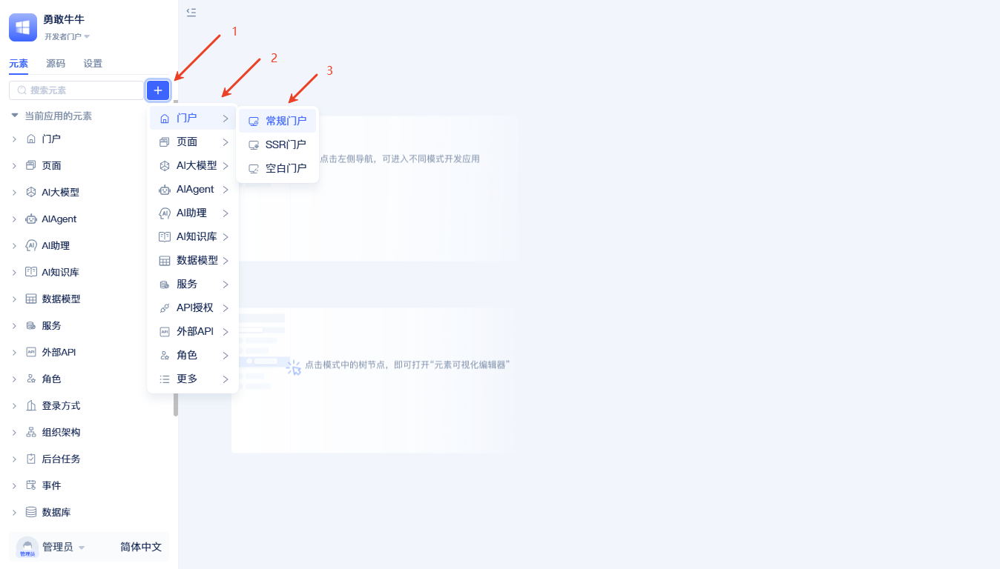
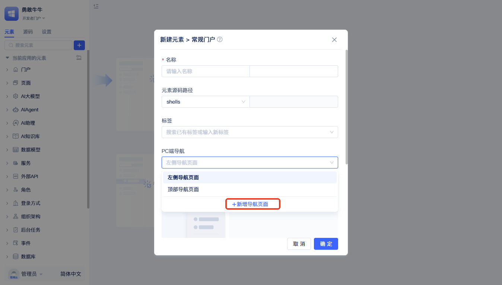
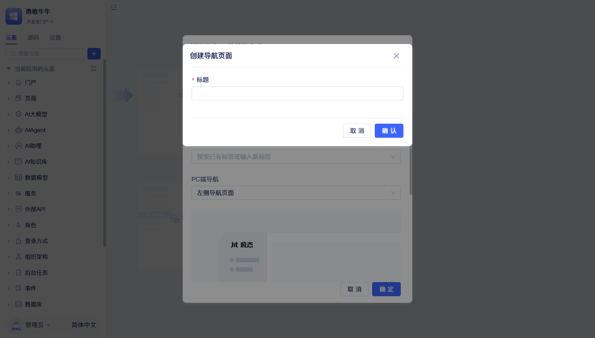
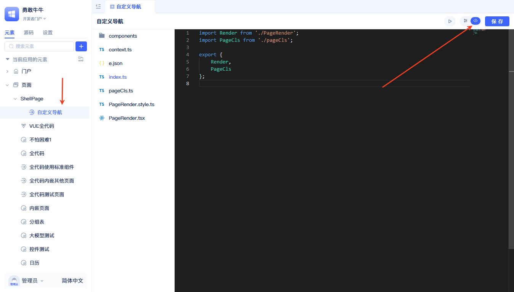

# Portal Customization

When JitAI's built-in regular portals, blank portals, and SSR portals cannot meet specific interface requirements, full-code custom portals provide flexible solutions. Custom portals are mainly suitable for the following scenarios:

- **Navigation Layout Adjustment**: Need to change navigation menu position, arrangement, or hierarchical structure
- **Interface Style Customization**: Interface style adjustments under enterprise branding requirements or special design specifications
- **Interaction Method Optimization**: Optimize operation flow and interaction experience for specific user groups
- **Responsive Adaptation**: Interface adaptation for special screen sizes or device types
- **Functional Area Reorganization**: Reorganize layout and display methods of page functional areas

Custom portals maintain JitAI platform's core functions such as data models and permission management while allowing developers to flexibly adjust portal appearance and user interaction methods.

## Creating Custom Portal



In the element directory tree, click the + button to the right of the search box, select `Portal` - `Generic Portal`. Then a popup for creating a regular portal element will appear.



Fill in the `Name` in the creation popup, click `Add Navigation Page` in the PC navigation dropdown menu. Then a popup for creating navigation page will appear.



After filling in the custom portal name, click `OK`. Return to the regular portal element creation popup, complete other configuration items, and click `OK` to complete creation.



After completion, select `Pages` - `ShellPage` - `Custom Portal Name` in the element directory tree to open the custom portal page editor. Select the `<>` button in the upper right corner to view the generated code implementation.

## Core File Structure

**Root Directory**
- `index.ts` - Module entry, exports Render component and PageCls class
- `PageRender.tsx` - Main page renderer, contains permission checking and layout logic
- `pageCls.ts` - Portal core class, inherits from Jit.BaseShell
- `context.ts` - React Context, used for sharing shell instance between components
- `e.json` - Element configuration file

**components Directory**
- `Nav.tsx` - Left navigation container component
- `NavHeader.tsx` - Navigation header component
- `MenuTree.tsx` - Menu tree component, renders accessible menus
- `MultiTabsPage.tsx` - Multi-tab page container
- `PageTabs.tsx` - Tab page controls
- `*.style.ts` - Corresponding component style files

## Important APIs and Methods

### Portal Basic APIs

**Getting Current Portal Information**
```typescript
import { getRuntimeApp } from 'jit';

// Get portal definition and permission status
const [shellDefine] = getRuntimeApp().getElementDefine(shell?.fullName);
```

**Menu Management APIs (ShellPage Class)**
```typescript
// Get list of menus with access permissions
get menus(): ShellMenu[]

// Find menu configuration by menu name
findMenu(menuName: string): ShellMenu | null

// Open specified menu page
openMenu(menuName: string): void
```

### Page Rendering and Navigation

**ElementRender Component**
```typescript
import { ElementRender } from 'jit-widgets';

// ElementRender is the most important page rendering component in JitAI
// Used to render specific page content in portals
<ElementRender
    elementPath={item.page}  // Page element path
    {...params}              // Parameters passed to the page
/>
```

**Page Open Events**
```typescript
// Publish page open event
this.publishEvent('OPEN_PAGE', {
    pageName: menuConfig.page,     // Page name
    pageUrl: `/${menuConfig.name}`, // Page URL
    title: menuConfig.title,        // Page title
    icon: menuConfig.icon,          // Page icon
    queryString: searchParams       // Query parameters
});
```

**Listening to Page Events**
```typescript
// Listen to page open events in components
useEffect(() => {
    const id = shell.subscribeEvent('OPEN_PAGE', (data) => {
        // Handle page open logic
        console.log('Open page:', data);
    });

    return () => {
        shell?.unSubscribeEvent(id);
    };
}, []);
```

**Getting Current Route Information**
```typescript
import { useLocation, useNavigate } from 'react-router-dom';

// Get current route location
const location = useLocation();

// Programmatic navigation
const navigate = useNavigate();
navigate('/menu-path');
```

### Permission Verification

**Checking Portal Access Permissions**
```typescript
// Permission checking logic in PageRender.tsx
{
    shellDefine.status ? (
        <div className="no-rights-wrapper">
            <div className="no-rights-text">
                Sorry; you don't have permission to use this portal
            </div>
        </div>
    ) : (
        // Render normal portal content
        <>
            <Nav />
            <MultiTabsPage />
        </>
    )
}
```

### Inter-component Communication

**Using ShellContext**
```typescript
import { useShellContext } from '../context';

// Get shell instance in any component
const { shell } = useShellContext();

// Call shell methods
shell.openMenu('menuName');
```

**Event System Communication**
```typescript
// Publish events
shell.publishEvent('CUSTOM_EVENT', eventData);

// Listen to events
const eventId = shell.subscribeEvent('CUSTOM_EVENT', (data) => {
    // Handle events
});

// Cancel listening
shell.unSubscribeEvent(eventId);
```