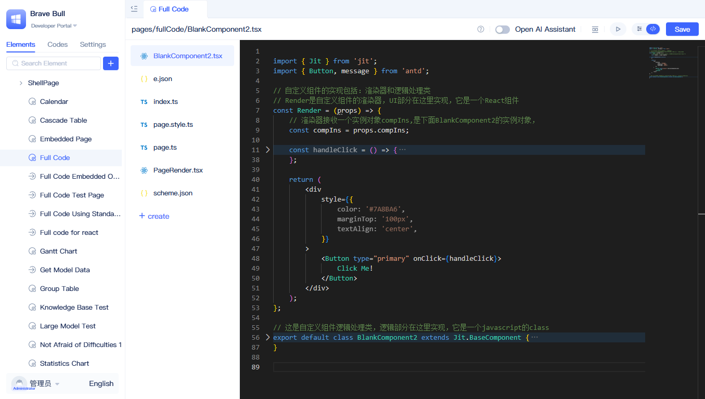
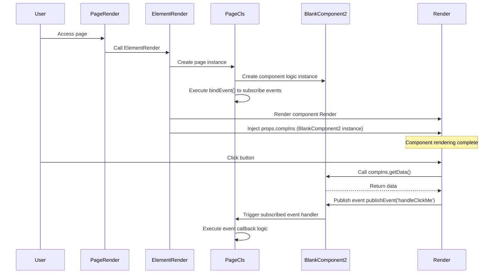

import Tabs from '@theme/Tabs';
import TabItem from '@theme/TabItem';

# Full-Code Component Interface Specifications

Full-code components are built with React and must adhere to specific interface contracts and code structures. This guide explains the core interfaces, file layout, and development conventions for full-code components.

::::
Full-code components are scoped to the current page, whereas custom component types can be reused across multiple pages. They are ideal for rapid prototyping and evolving requirements.

To create full-code components, see: [Creating full-code components](../using-functional-components-in-pages/full-code-components)
::::

## Component interface architecture {#component-interface-architecture}



Full-code components follow a standard three-layer architecture: **Page renderer**, **Page logic class**, and **Component interface**. The platform treats page composition as a black box; you only need to work with three core interfaces:

### Core interface definitions {#core-interface-definitions}

- **Page renderer (`PageRender.tsx`)**: Renders the entire page by invoking the platform `ElementRender` interface.
- **Page class (`page.ts`)**: Implements `Jit.GridPage`; manages component instances and event subscriptions.
- **Component class (`BlankComponent2.tsx`)**: Extends `Jit.BaseComponent`; defines the `Render` function and logic methods.

### Interface interaction mechanism {#interface-interaction-mechanism}

The platform injects the component logic instance into the renderer via `props.compIns`, separating UI from logic. `ElementRender` manages component lifecycles and data flow.

### Interface implementation specifications {#interface-implementation-specifications}

Full-code components must comply with these implementation rules:

<Tabs>
  <TabItem value="index" label="index.ts" default>

```ts
import PageCls from "./page";
import Render from "./PageRender";

export { PageCls, Render };
```

  </TabItem>
  <TabItem value="pageRender" label="PageRender.tsx">

```tsx
import { ElementRender } from 'jit-widgets';
import { pageStyle, pageGlobalStyle } from './page.style';

export default (props) => (
  <ElementRender
    pageStyle={pageStyle}
    pageGlobalStyle={pageGlobalStyle}
    {...props}
    elementPath="pages.GridPageType"
  />
);
```

  </TabItem>
  <TabItem value="page" label="page.ts">

```ts
import type { ComponentPageScheme } from "jit";
import { Jit } from "jit";
import schemeJson from "./scheme.json";
import BlankComponent2 from "./BlankComponent2";
type BaseComponent = InstanceType<typeof Jit.BaseComponent>;

class PageCls extends Jit.GridPage {
  // Name must match the component name in scheme.json: "BlankComponent2"
  BlankComponent2!: BaseComponent = new BlankComponent2();
  scheme: ComponentPageScheme = schemeJson;

  // Page-level event subscription
  bindEvent() {
    // Subscribe to events published through compIns.publishEvent in component renderer
    this.BlankComponent2.subscribeEvent('handleClickMe', async () => {
      // Here you can call services, update page variables, show messages, etc.
      // console.log('Received event handleClickMe');
    });
  }
}

export default PageCls;
```

  </TabItem>
  <TabItem value="component" label="BlankComponent2.tsx">

```tsx
import { Jit } from 'jit';
import { Button, message } from 'antd';

// Component renderer: receives compIns (logic instance), handles UI and interactions
const Render = (props) => {
  const compIns = props.compIns;
  const handleClick = () => {
    // 1) Call logic method
    message.success(compIns.getData());
    // 2) Publish event for page or other components to subscribe
    compIns.publishEvent('handleClickMe');
  };
  return (
    <div style={{ color:'#7A8BA6', marginTop:'100px', textAlign:'center' }}>
      <Button type="primary" onClick={handleClick}>Click Me!</Button>
    </div>
  );
};

// Logic processing class: exposes methods, events, etc.
export default class BlankComponent2 extends Jit.BaseComponent {
  // Attach renderer to logic object
  Render = Render;

  // Public method that can be called by page/other components
  getData() {
    return 'so cool !!!';
  }
}
```

  </TabItem>
  <TabItem value="scheme" label="scheme.json">

```json
{
  "layout": [
    {
      "i": "BlankComponent2",
      "x": 0,
      "y": 0,
      "w": 48,
      "h": 30
    }
  ],
  "componentList": [
    {
      "fullName": "components.BlankComponent",
      "type": "components.BlankComponent",
      "name": "BlankComponent2",
      "title": "Full-Code Component 2",
      "config": {
        "requireElements": []
      },
      "showTitle": true,
      "eventList": [],
      "functionList": [],
      "variableList": []
    }
  ],
  "autoIncrementId": 4,
  "variableList": [],
  "functionList": [],
  "matchUarParamsVariableNameList": []
}
```

  </TabItem>
</Tabs>

### Interface runtime sequence {#interface-runtime-sequence}



### Interface invocation explanation {#interface-invocation-explanation}

The core invocation mechanism for full-code component interfaces:

- **Page interface**: `PageRender` calls `ElementRender`; the platform generates the component tree based on the `scheme.json` configuration.
- **Component interface**: The platform creates the component logic instance and passes it to the renderer via the `props.compIns` interface.
- **Event interface**: `Render` invokes logic methods and publishes events via the `compIns` interface; `page.ts` subscribes via the `bindEvent()` interface.

## Related documentation {#related-documentation}

- [Calling Page and Component Functions in Full-Code Components](./calling-page-and-component-functions-in-fullcode-components) - Learn how to call other components and page methods in full-code components
- [Publishing and Subscribing Events](./emitting-events) - Understand the event mechanism of full-code components
- [Calling Full-Code Component Functions in Page Code](./calling-fullcode-component-functions-in-page-code) - Learn how to call full-code component methods from page code
