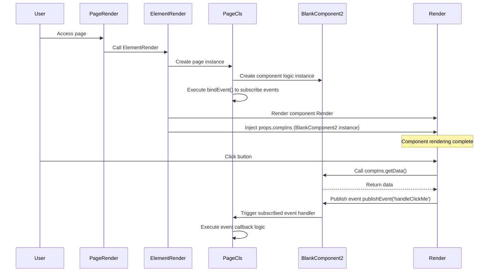

import Tabs from '@theme/Tabs';
import TabItem from '@theme/TabItem';

# Full-Code UI Component Interface Specifications

Full-code UI components are developed based on React and must follow specific interface specifications and code structures. This document details the core interfaces, file structures, and development standards for full-code components.

:::tip
Unlike custom component types, full-code components are scoped to the current page, while custom component types can be reused across multiple pages. Full-code components are suitable for rapid prototyping and scenarios with flexible, changing requirements.

To learn how to create full-code components, please refer to: [Full-Code Component Creation Guide](../using-functional-components-in-pages/full-code-components)
:::

## Component Interface Architecture {#component-interface-architecture}


Full-code components follow a standard three-layer architecture: **Page Renderer**, **Page Logic Class**, and **Component Interface**. The platform encapsulates the page assembly process as a black box, and developers only need to understand three core interfaces:

### Core Interface Definitions {#core-interface-definitions}

- **Page Renderer (`PageRender.tsx`)**: Calls the platform's `ElementRender` interface to render the entire page
- **Page Class (`page.ts`)**: Implements the `Jit.GridPage` interface, managing component instances and event subscriptions
- **Component Class (`BlankComponent2.tsx`)**: Inherits from the `Jit.BaseComponent` interface, containing `Render` and logic methods

### Interface Interaction Mechanism {#interface-interaction-mechanism}

The platform injects component logic instances into the renderer through `props.compIns`, achieving separation between UI and logic. `ElementRender` is responsible for component lifecycle management and data flow control.

### Interface Implementation Specifications {#interface-implementation-specifications}

Full-code components must follow the following interface implementation specifications:

<Tabs>
  <TabItem value="index" label="index.ts" default>

```ts
import PageCls from "./page";
import Render from "./PageRender";

export { PageCls, Render };
```

  </TabItem>
  <TabItem value="pageRender" label="PageRender.tsx">

```tsx
import { ElementRender } from 'jit-widgets';
import { pageStyle, pageGlobalStyle } from './page.style';

export default (props) => (
  <ElementRender
    pageStyle={pageStyle}
    pageGlobalStyle={pageGlobalStyle}
    {...props}
    elementPath="pages.GridPageType"
  />
);
```

  </TabItem>
  <TabItem value="page" label="page.ts">

```ts
import type { ComponentPageScheme } from "jit";
import { Jit } from "jit";
import schemeJson from "./scheme.json";
import BlankComponent2 from "./BlankComponent2";
type BaseComponent = InstanceType<typeof Jit.BaseComponent>;

class PageCls extends Jit.GridPage {
  // Name must match the component name in scheme.json: "BlankComponent2"
  BlankComponent2!: BaseComponent = new BlankComponent2();
  scheme: ComponentPageScheme = schemeJson;

  // Page-level event subscription
  bindEvent() {
    // Subscribe to events published through compIns.publishEvent in component renderer
    this.BlankComponent2.subscribeEvent('handleClickMe', async () => {
      // Here you can call services, update page variables, show messages, etc.
      // console.log('Received event handleClickMe');
    });
  }
}

export default PageCls;
```

  </TabItem>
  <TabItem value="component" label="BlankComponent2.tsx">

```tsx
import { Jit } from 'jit';
import { Button, message } from 'antd';

// Component renderer: receives compIns (logic instance), handles UI and interactions
const Render = (props) => {
  const compIns = props.compIns;
  const handleClick = () => {
    // 1) Call logic method
    message.success(compIns.getData());
    // 2) Publish event for page or other components to subscribe
    compIns.publishEvent('handleClickMe');
  };
  return (
    <div style={{ color:'#7A8BA6', marginTop:'100px', textAlign:'center' }}>
      <Button type="primary" onClick={handleClick}>Click Me!</Button>
    </div>
  );
};

// Logic processing class: exposes methods, events, etc.
export default class BlankComponent2 extends Jit.BaseComponent {
  // Attach renderer to logic object
  Render = Render;

  // Public method that can be called by page/other components
  getData() {
    return 'so cool !!!';
  }
}
```

  </TabItem>
  <TabItem value="scheme" label="scheme.json">

```json
{
  "layout": [
    {
      "i": "BlankComponent2",
      "x": 0,
      "y": 0,
      "w": 48,
      "h": 30
    }
  ],
  "componentList": [
    {
      "fullName": "components.BlankComponent",
      "type": "components.BlankComponent",
      "name": "BlankComponent2",
      "title": "Full-Code Component 2",
      "config": {
        "requireElements": []
      },
      "showTitle": true,
      "eventList": [],
      "functionList": [],
      "variableList": []
    }
  ],
  "autoIncrementId": 4,
  "variableList": [],
  "functionList": [],
  "matchUarParamsVariableNameList": []
}
```

  </TabItem>
</Tabs>

### Interface Runtime Sequence {#interface-runtime-sequence}



### Interface Invocation Explanation {#interface-invocation-explanation}

Core invocation mechanism of full-code component interfaces:

- **Page Interface**: `PageRender` calls the `ElementRender` interface, platform generates component tree based on `scheme.json` configuration
- **Component Interface**: Platform creates component logic instance, passes it to renderer through `props.compIns` interface
- **Event Interface**: `Render` calls logic methods and publishes events through `compIns` interface; `page.ts` subscribes to events through `bindEvent()` interface

## Related Documentation

- [Calling Page and Component Functions in Full-Code Components](./calling-page-and-component-functions-in-fullcode-components) - Learn how to call other components and page methods in full-code components
- [Publishing and Subscribing Events](./emitting-events) - Understand the event mechanism of full-code components
- [Calling Full-Code Component Functions in Page Code](./calling-fullcode-component-functions-in-page-code) - Learn how to call full-code component methods from page code
