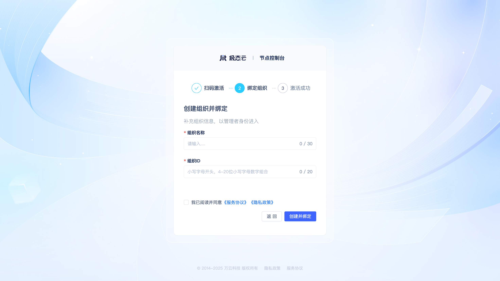
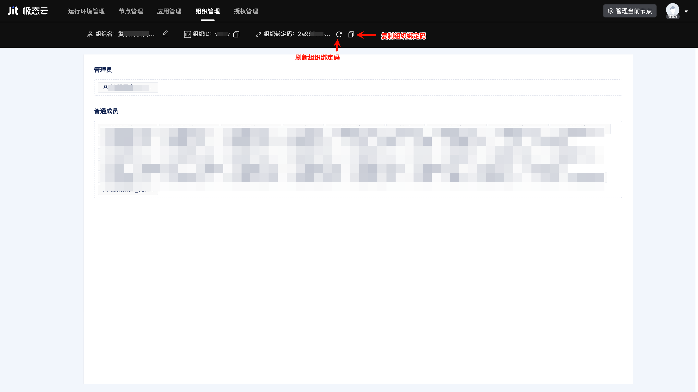

# Node Activation and Developer Organizations

## What is a Node {#what-is-jitnode}
A JitNode is an application that runs on an operating system, available as both a desktop installation and a Docker image. It serves as the runtime engine for JitAi applications, providing a virtualized environment and interpreting JitAi apps. JitNode form the foundational infrastructure layer of the JitAi technology stack.

## What is a Developer Organization {#what-is-developer-organization}
A developer organization is the basic unit for managing development teams and projects. Team members within the same organization can collaborate on application development and share resources. Different organizations are isolated in terms of hardware and software resources, data, applications, etc. Each developer organization can bind multiple JitNodes, each node can only be bound to one organization, and each developer can join multiple developer organizations.

## Creating a New Development Organization When Activating a Node {#create-new-development-organization-when-activating-node}
After completing node installation, users will enter the node activation page on their first visit.

After scanning the QR code with WeChat, users will enter the organization binding interface.

Users click the "Create New Organization and Bind" button to enter the organization creation page.

Enter the organization name and organization ID, check "I have read and agree", then click the "Create and Bind" button to create a new organization. The current node will automatically activate and bind to this organization, and the current user will automatically join the organization as an administrator.

## Binding a Node to an Already Joined Organization When Activating {#bind-node-to-joined-organization-when-activating}
If the user has already joined an organization, the organization binding interface will display the list of joined organizations.

Users can directly click to select, and the current node will complete activation and bind to the selected organization.

## Using Organization Binding Code to Join and Bind Organization When Activating Node {#use-organization-bind-code-to-join-and-bind-when-activating-node}

After clicking the "Join an Organization and Bind" button on the organization binding interface, users enter the organization binding code input interface.

After entering the organization binding code and clicking the "Join Now" button, users can complete node activation and binding, automatically becoming a regular member of the organization.

## Joining an Organization via Binding Code When Logging into an Existing Node {#join-organization-via-bind-code-when-logging-into-existing-node}
When a user logs into an already activated and bound node for the first time, they need to enter the organization binding code to join the organization.

After entering the organization binding code and clicking the "Join Now" button, the user automatically becomes a regular member of the organization.

## Viewing and Refreshing Organization Binding Code {#view-and-refresh-organization-bind-code}
Any organization member can view and refresh the organization binding code on the organization management page.

After clicking the "Refresh Binding Code" button, a new organization binding code will be generated and displayed on the page, and the original binding code will immediately become invalid.

:::warning Note

To prevent organization binding code leakage, the organization binding code should be refreshed immediately after each invitation of members to join the organization.

:::

## Removing Organization Members {#remove-organization-member}
Only administrators can remove other members on the organization management page.