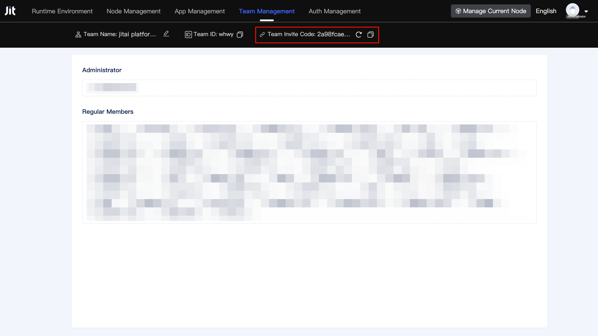

# Node Activation and Developer Team Management

## What is a node {#what-is-jitnode}
A JitNode is an application that runs on an operating system, available as both a desktop installation and a Docker image. It serves as the runtime engine for JitAi applications, providing a virtualized environment for interpreting and executing JitAi apps. JitNodes form the foundational infrastructure layer of the JitAi technology stack.

## What is a developer team {#what-is-developer-team}
A developer team is the fundamental organizational unit for managing development groups and projects. Team members within the same team can collaborate on application development and share resources. Different teams maintain isolation across hardware and software resources, data, applications, and other assets. Each developer team can bind multiple JitNodes, while each node can only be bound to one team, and each developer can participate in multiple developer teams.

## Creating a new developer team when activating a node {#create-new-dev-team-when-activating-node}
Upon completing node installation, users will be directed to the node activation page during their initial visit. The system supports multiple authentication methods: Google, GitHub, and WeChat.

After selecting the authentication method, users will be directed to the team binding interface.

Users click the `Create new dev team` button to access the team creation page.

Enter the team name and team ID, check `I have read and agreed to` Service Agreement Privacy Policy", then click the `Create new dev team` button to establish a new team. The current node will automatically activate and bind to this team, with the current user automatically joining as an administrator.

## Binding a node to an already joined team when activating {#bind-node-to-joined-team-when-activating}
If the user has already joined a team, the team binding interface will display the list of joined teams.

Users can directly click to select a team, and the current node will complete activation and bind to the selected team.

## Using team binding code to join and bind team when activating node {#use-team-bind-code-to-join-and-bind-when-activating-node}

After clicking the `Join other dev team` button on the team binding interface, users are directed to the team binding code input interface.

After entering the team binding code and clicking the `Join Now` button, users can complete node activation and binding, automatically becoming a regular team member.

## Joining a team via binding code when logging into an existing node {#join-team-via-bind-code-when-logging-into-existing-node}
When a user logs into an already activated and bound node for the first time, they must enter the team binding code to join the team.

After entering the team binding code and clicking the `Join Now` button, the user automatically becomes a regular team member.

## Viewing and refreshing team binding code {#view-and-refresh-team-bind-code}
Any team member can view and refresh the team binding code on the team management page.

After clicking the `Regenerate` button, a new team binding code will be generated and displayed on the page, while the original binding code will immediately become invalid.

:::warning Note

To prevent team binding code leakage, refresh the team binding code immediately after inviting new members to join the team.

:::

## Removing team members {#remove-team-member}
Only administrators can remove other members from the team management page.