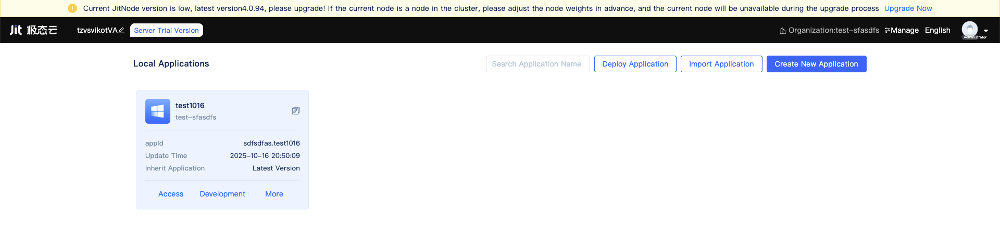
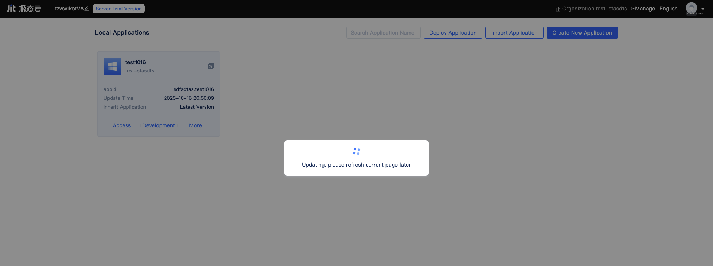

# Platform Node Updates and Upgrades

When a new version of the platform node is available, an update banner appears at the top of the [Node Console](../creating-and-publishing-applications/runtime-environment-management) home page. It alerts that the current JitNode version is low and shows the latest version, for example: “Current JitNode version is low, latest version 4.0.94, please upgrade! If the current node is a node in the cluster, please adjust the node weights in advance, and the current node will be unavailable during the upgrade process Upgrade Now”.

## Update banner and entry {#upgrade-entry}

When an update is detected, the banner looks like this. Click `Upgrade Now` to start the one‑click upgrade process:

## One‑click upgrade flow {#one-click-upgrade}

1. Click `Upgrade Now` in the banner.
2. A progress dialog appears showing “Updating, please refresh current page later”:

   

3. During the upgrade the platform service restarts, and the node will be temporarily unavailable. Please wait for the process to complete.
4. After the upgrade finishes, the banner automatically disappears.

## Recommendations for clusters {#cluster-recommendations}

To ensure business continuity in a [cluster environment](../advanced-guide/application-layer-stability-guarantee), perform a rolling upgrade with the following steps:

- Temporarily set the weight of the node to be upgraded to 0, or remove it from the traffic entry.
- After confirming other nodes are healthy and can handle the traffic, start the one‑click upgrade on this node.
- Once the upgrade completes and the node is verified healthy, restore its weight and return it to traffic distribution.
- Repeat the steps node by node until all nodes are upgraded.