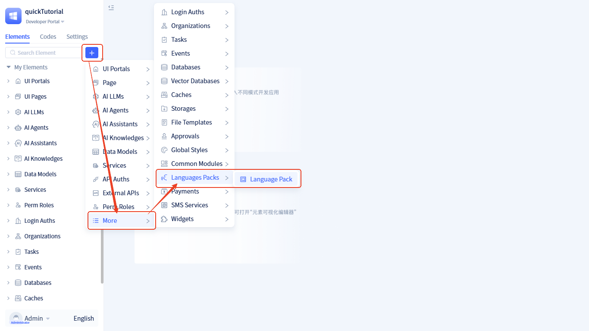
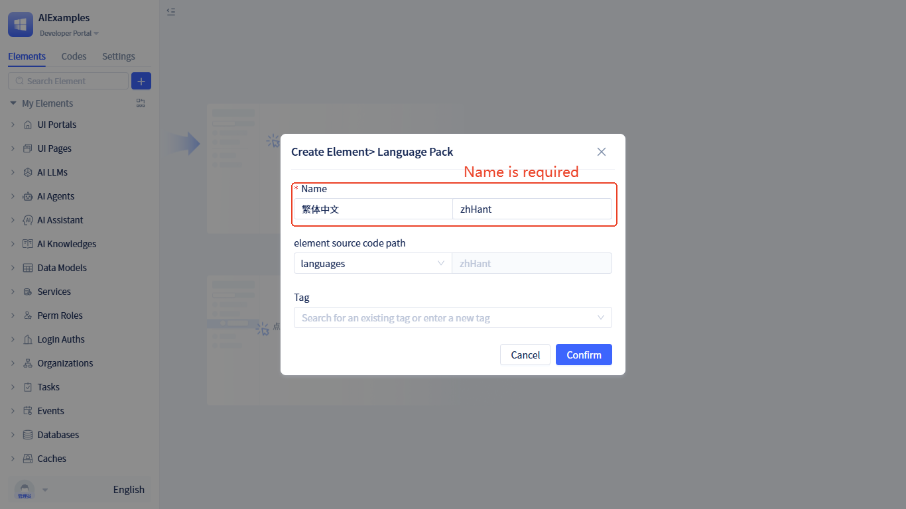
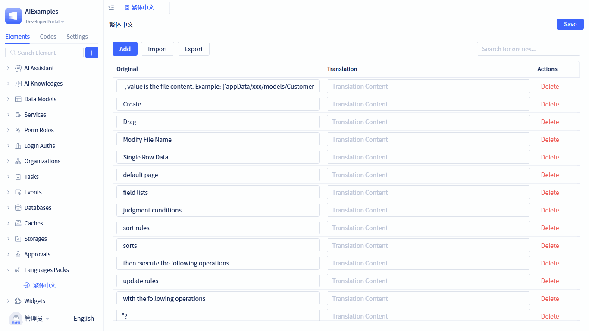

## What is language package {#what-is-language-package}

Language packs are a multilingual support feature provided by the JitAi platform, enabling applications to display interface text according to users' language preferences.

A language pack is essentially a translation mapping table that associates original text in applications with translated text in different languages. For example, when an application needs to display an "Add" button, the system will show "添加" for Chinese users, "Add" for English users, and "추가" for Korean users, based on the user's language settings.

Through language packs, a single application can support multiple languages simultaneously. When users access the application, the system automatically detects their browser's language settings and selects the corresponding language pack to display interface content. If the user's language is not within the supported range, the system defaults to the English version.

The JitAi platform comes with built-in language packs for Simplified Chinese and English, ready to use out of the box. Developers can also create custom language packs as needed to support additional languages such as Traditional Chinese, Japanese, Korean, and more.

## Creating language packages {#creating-language-packages}

To create a language package, follow these steps:



Click <span style={{ background:"#3d65fd", display: "inline-block", borderRadius: "8px", textAlign: "center", lineHeight: "100%", color: "#ffffff", fontSize: "24px", padding: "0px 10px 5px" }}>+</span>  → **More** → **Languages Packs** → **Language Pack** to open the creation form, enter the package name, and click the `Confirm` button to complete the creation.



Once the language package is created, the visual editor will automatically open, allowing you to translate existing terms or add new terms.

## Translating built-in terms {#translating-built-in-terms}

The visual editor displays all terms from the current development framework and visual development tools. Simply enter the corresponding language content for each term. Changes take effect immediately upon saving.



## Adding new terms {#adding-new-terms}

You can add any text content from your application as translatable terms and translate them into the target language. Changes take effect immediately without requiring an application restart.


**Example:** The default portal contains a menu item named `Order Management` that lacks Traditional Chinese translation. When we add a term mapping `Order Management` → `訂單管理` in the Traditional Chinese language package, the menu item will automatically display as `訂單管理` after refreshing the portal page.

## Importing terms {#importing-terms}

You can perform batch translation by importing JSON files. In the JSON structure, each key corresponds to the original content displayed in the application code, and the value represents the content translated into the target language. Example below:

```json
{
    "Add": "創建",
    "Order Management": "​訂單管理",
    ...
}
```

You can obtain all terms that require translation through the export function. The exported file is also a JSON file where the key represents the original content displayed in the application code, and you only need to provide the corresponding language content for each term.

