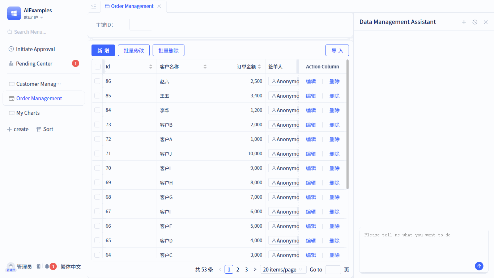

The JitAi platform includes built-in Simplified Chinese and English language packages. When the application runs, the system automatically selects the appropriate language package based on the browser's language settings. If the browser language is not supported, English is used as the default fallback. You can create custom language packages as needed to support additional languages.

## Creating Language Packages {#creating-language-packages}

To create a language package, follow these steps:


Click <span style={{ background:"#3d65fd", display: "inline-block", borderRadius: "8px", textAlign: "center", lineHeight: "100%", color: "#ffffff", fontSize: "24px", padding: "0px 10px 5px" }}>+</span>  → **More** → **Languages Packs** → **Language Pack** to open the creation form, enter the package name, and click the `Confirm` button to complete the creation.


Once the language package is created, the visual editor will automatically open, allowing you to translate existing terms or add new terms.

## Translating Built-in Terms {#translating-built-in-terms}

The visual editor displays all terms from the current development framework and visual development tools. Simply enter the corresponding language content for each term. Changes take effect immediately upon saving.


## Adding New Terms {#adding-new-terms}

You can add any text content from your application as translatable terms and translate them into the target language. Changes take effect immediately without requiring an application restart.



**Example:** The default portal contains a menu item named `Order Management` that lacks Traditional Chinese translation. When we add a term mapping `Order Management` → `訂單管理` in the Traditional Chinese language package, the menu item will automatically display as `訂單管理` after refreshing the portal page.

## Importing Terms {#importing-terms}

You can perform batch translation by importing JSON files. In the JSON structure, each key corresponds to the original content displayed in the application code, and the value represents the content translated into the target language. Example below:

```json
{
    "Add": "創建",
    "Order Management": "​訂單管理",
    ...
}
```

You can obtain all terms that require translation through the export function. The exported file is also a JSON file where the key represents the original content displayed in the application code, and you only need to provide the corresponding language content for each term.

