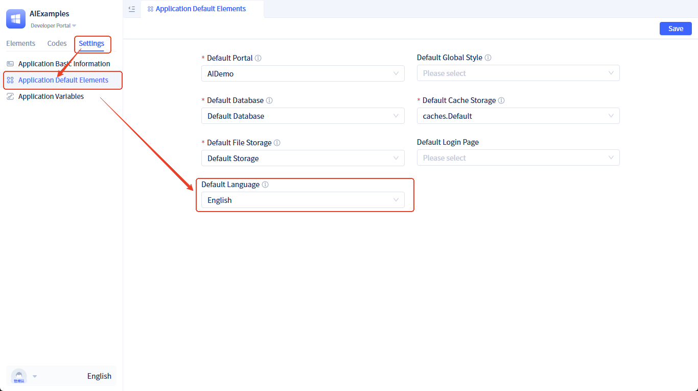

# Default Language {#default-language}

The default language determines the display language of the application when users have not explicitly selected a language. Properly configuring the default language can improve user experience and ensure the application displays in a language familiar to users upon first access.

## Default language configuration {#default-language-configuration}

**Configuration steps:**

1. Enter the **Developer Portal**
2. Switch to **Settings** in the left sidebar
3. Open **Application Default Elements**
4. Select **Default Language Package**

## Language selection strategy {#language-selection-strategy}

The system selects the display language according to the following priority:

1. **User manually selected language**: If the user has explicitly selected a language, prioritize the user's choice
2. **Application default language**: If a default language is configured, use the configured default language
3. **Browser language**: Automatically selected based on the browser's own language settings. For example, if the browser is set to English, the application will use the English language pack.
4. **System default**: If none of the above can be matched, default to English

## Configuration recommendations {#configuration-recommendations}

- **Target user group**: Set the default language based on the language habits of the main user group
- **Market coverage**: If the application targets multiple regions, recommend choosing the most widely used language
- **Content completeness**: Ensure the selected default language has complete translation content
- **Testing and validation**: Test the application display effect in different language environments after configuration

**Notes:**
- Default language configuration affects all non-logged-in users and first-time visitors
- Logged-in users' language preferences will override the default language setting
- Ensure the corresponding language package content is complete before configuration

