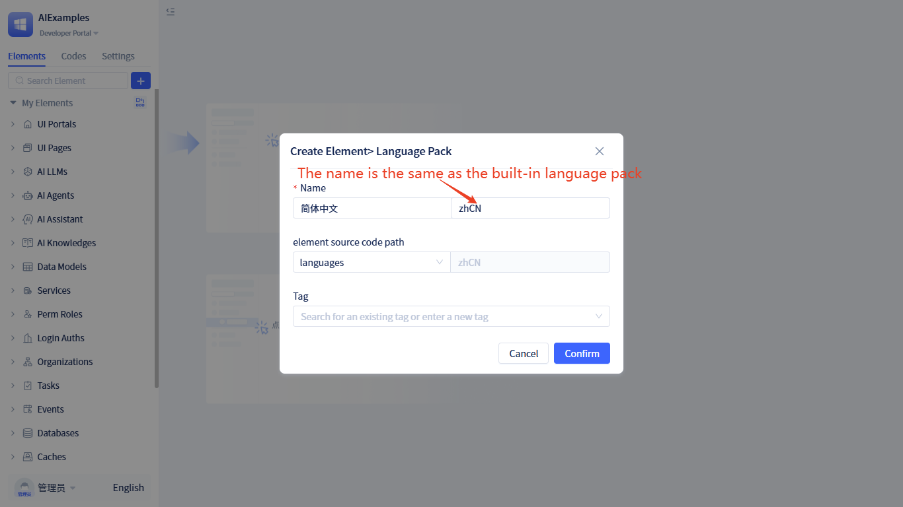
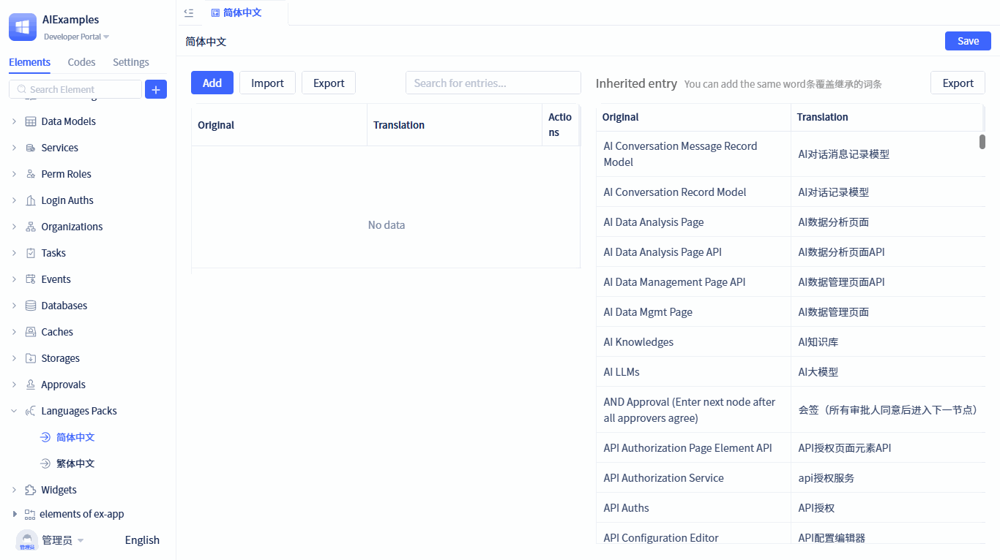

# Extending system built-in language packages

The platform comes with built-in **简体中文 (zhCN)** and **English (EN)** language packages.

Developers can create language packages with the same names within their applications to extend or override the built-in language packages.

Within the custom language package, you can replace existing translation content or add new terms to achieve more granular localization control.

