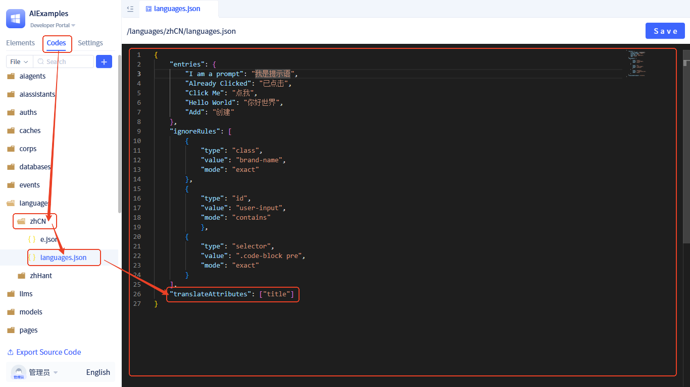

# How to Translate Page Terms

## Automatic Text Translation

By default, text content within DOM nodes is automatically processed for translation. Here is a simple example:

```typescript
const TestI18N = () => {
    return <span>Hello World</span>
}
```

When a translation mapping of `Hello World` → `你好世界` is added to the Simplified Chinese terms, the page will automatically display `你好世界` when switched to Simplified Chinese at runtime, without requiring additional processing.


If you need to keep certain content untranslated in specific language environments, you can add the `translate-ignore` class name to DOM nodes:

```typescript
const TestI18N = () => {
    return (
        <>
            <div>Hello World</div>
            <div
                style={{color: "red"}}
                className="translate-ignore"
            >
                Hello World
            </div>
        </>
    )
}
```


Additionally, more granular control can be achieved through custom [Translation Ignore Rules](./translate-ignore-rules).

## Dynamic Text Translation

JitAi's internationalization solution supports DOM change monitoring mechanisms that can automatically detect dynamically added or modified DOM nodes on the page and perform real-time translation of their text content. This ensures that even content generated dynamically through JavaScript can automatically apply internationalization processing.

**How It Works**
- **Automatic Monitoring**: The system automatically monitors DOM tree changes, including node addition, deletion, and modification operations
- **Intelligent Recognition**: Only processes nodes containing text content for translation, avoiding unnecessary performance overhead
- **Real-time Response**: Immediately performs translation upon detecting changes, without requiring manual triggering
- **Performance Optimization**: Uses efficient monitoring algorithms to ensure no impact on page performance

The following example demonstrates translation of dynamic content:

```typescript
import { Button, message } from 'antd';

const TestI18N = () => {
    const handleClick = () => {
        message.success("Already Clicked");
    };

    return (
        <Button type="primary" onClick={handleClick}>Click Me</Button>
    );
}
```

After adding translation mappings of `Click Me` → `点我` and `Already Clicked` → `已点击` to the Simplified Chinese terms, view the demonstration effect:


## DOM Node Attribute Translation

In addition to text content within DOM nodes, attribute values in HTML tags often require translation.
JitAi's internationalization solution automatically translates the following HTML attributes by default:

- **placeholder**: Input field placeholder text
- **title**: Element title tooltip text
- **alt**: Image alternative text
- **value**: Read-only input field values (limited to `readonly` state input elements)

**Usage Example**

```typescript
const TestI18N = () => {
    return (
        <span title="Hello World">Hello World</span>
    )
}
```


**Custom Translation Attributes**

If you need to translate other HTML attributes, you can add them through code configuration:



**Configuration Steps:**

1. Enter the **Developer Portal**
2. Switch to **Codes** navigation in the left sidebar
3. Find the corresponding language package's `languages.json` file
4. Add the `translateAttributes` field to the configuration object

**Configuration Example:**
```json
{
  "translateAttributes": [
    "placeholder",
    "title", 
    "alt",
    "value",
    "aria-label",
    "data-tooltip"
  ]
}
```
**Notes:**
- Attribute names are case-sensitive
- Only add attributes that actually need translation
- Avoid configuring functional attributes (such as `id`, `class`, etc.)


## Using API Translation

In addition to DOM elements on the page, there are also non-DOM content (such as alert prompts, etc.) that cannot be processed through the DOM node automatic translation mechanism and require manual calls to the translation API. JitAi's internationalization solution provides a programmatic translation interface: `runtimeApp.i18n.translate('xxxx')`.

Usage is as follows:

```typescript
import { Button } from antd;
import { getRuntimeApp } from jit;

const TestI18N = () => {
    const handleClick = () => {
        const app = getRuntimeApp();
        alert(app.i18n.translate('I am a prompt'));
    }

    return (
        <Button type="primary" onClick={handleClick}>Click Me</Button>
    )
}
```


