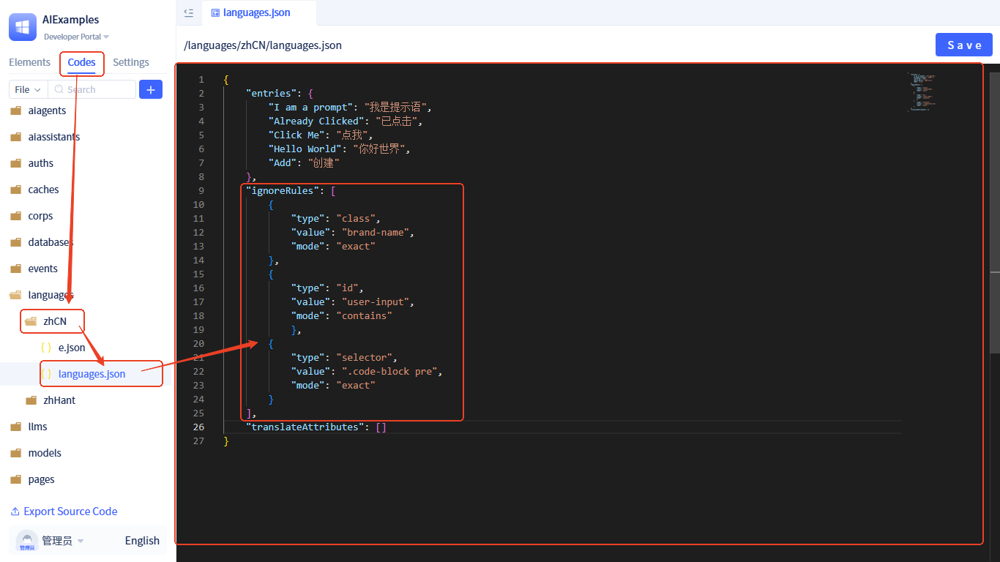

# Translation Ignore Rules

In the JitAi platform, by default all text content within DOM nodes is automatically processed for translation. However, in certain scenarios, you may need to prevent specific text from being translated, such as:

- Brand names, product names, and other proper nouns
- Technical terms and code snippets
- User-defined fixed text content
- Interface elements that do not require localization

## Basic Usage

### Using translate-ignore Class Name

The simplest way is to add the `translate-ignore` class name to DOM nodes that need to be excluded from translation:

```html
<span className="translate-ignore">Hello World</span>
<div className="translate-ignore">
  <p>This text will not be translated</p>
  <p>Including child elements will also not be translated</p>
</div>
```

**Notes:**
- The `translate-ignore` class name applies to the entire element and all its child elements
- Ensure the class name is spelled correctly and is case-sensitive
- Recommend using it on elements that semantically do not require translation

## Advanced Configuration

In addition to using the default `translate-ignore` class name, you can also configure custom rules to more precisely control which content should be excluded from translation.

#### Rule Interface Definition

```typescript
export interface IgnoreRule {
    type: 'class' | 'id' | 'attribute' | 'selector'; // Rule type
    value: string; // Match value
    mode?: 'exact' | 'contains' | 'startsWith' | 'endsWith' | 'regex'; // Match mode, defaults to exact
}
```

#### Rule Type Description

- **class**: Match based on CSS class names
- **id**: Match based on element IDs  
- **attribute**: Match based on HTML attributes
- **selector**: Match based on CSS selectors

#### Match Mode Description

- **exact**: Exact match (default)
- **contains**: Contains match
- **startsWith**: Prefix match
- **endsWith**: Suffix match
- **regex**: Regular expression match

#### Configuration Example

```json
{
  "ignoreRules": [
    {
      "type": "class",
      "value": "brand-name",
      "mode": "exact"
    },
    {
      "type": "id", 
      "value": "user-input",
      "mode": "contains"
    },
    {
      "type": "selector",
      "value": ".code-block pre",
      "mode": "exact"
    }
  ]
}
```

## Configuration Method

Currently, there is no support for configuring ignore rules through a visual interface, and configuration needs to be done through code-only approach:

**Configuration Steps:**



1. Enter the **Developer Portal**
2. Switch to **Codes** navigation in the left sidebar
3. Find the corresponding language package's `languages.json` file
4. Add the `ignoreRules` field to the configuration object
5. Configure specific ignore rules according to the interface definition above

