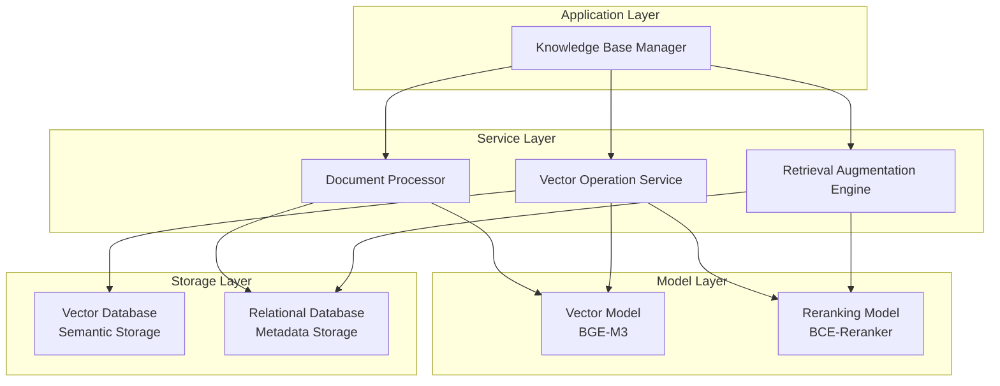
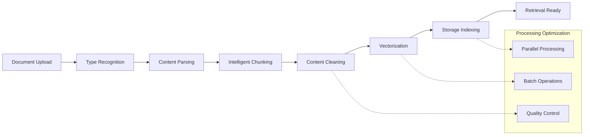
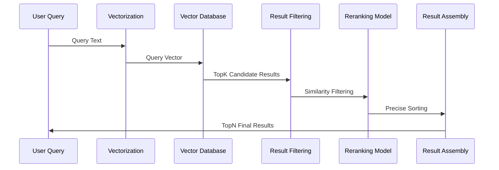

# Creating Knowledge Base Elements

AI Knowledge Base is an intelligent knowledge retrieval system that transforms unstructured documents into semantically understandable structured knowledge. As a core component for implementing RAG (Retrieval-Augmented Generation), the knowledge base provides accurate and timely domain knowledge retrieval capabilities for [AI Agents](../ai-agent/agent-knowledge-base) and [AI Assistants](../ai-assistant/create-ai-assistant).

The knowledge base operates through five core components working in concert: embedding models, reranking models, vector databases, document processors, and relational databases. It supports multiple document formats including PDF, DOCX, TXT, and MD, offering both semantic search and keyword search capabilities. Through a two-stage retrieval mechanism (vector retrieval + reranking), the system comprehends the semantic intent of queries and returns the most relevant knowledge fragments.

## Creating AI knowledge base elements {#create-ai-knowledge-base-element}
:::tip
We recommend creating the [LLM vendor](../ai-llm/create-ai-llm#creating-llm-vendor-elements) and [vector database](./vector-database-standalone-deployment) first, so you can select them directly during the knowledge base creation process. For LLM vendors, we recommend `Alibaba Cloud Bailian` and `SiliconFlow`, as they offer a rich selection of embedding and reranking models.
:::

Click the `+` button next to the search box in the element directory tree, then select `AI Knowledge Base` → `Standard Knowledge Base`. This will open the knowledge base creation dialog.

In the creation dialog, complete the following fields in order: `Name`, `Vector Database`, `Embedding Model`, and `Reranking Model`. Click `OK` to finish the creation.

:::tip
The embedding model significantly impacts search quality. Choose carefully based on your requirements, as it cannot be modified after creation.
:::

Once created, the knowledge base will appear in the element tree on the left.

## How it works {#principle-description}

### Core components {#core-components}

AI knowledge bases are built on an advanced RAG (Retrieval-Augmented Generation) architecture, powered by five core components working in concert:

- **Embedding Model**: Transforms documents and queries into high-dimensional vector representations, enabling semantic understanding
- **Reranking Model**: Refines initial retrieval results through precise scoring, improving match accuracy
- **Vector Database**: Provides efficient storage and retrieval of vector data, supporting large-scale similarity computations
- **Document Processor**: Intelligently parses, chunks, and cleans document content to optimize vectorization quality
- **Relational Database**: Maintains document metadata and text chunks, ensuring data consistency and traceability

### System architecture {#system-architecture}

### Technical principles {#technical-principles}

**Semantic understanding**: Advanced embedding models (also called vector models) convert natural language into points in a high-dimensional vector space, allowing the system to comprehend semantic relationships rather than relying solely on keyword matching.

**Two-stage retrieval**:
1. **Vector retrieval**: Rapidly identifies semantically similar candidate documents within the vector space
2. **Reranking**: Refines candidate results using deep contextual analysis of the query

**Hybrid storage**: Vector databases handle high-dimensional similarity computations, while relational databases manage structured metadata. This dual-storage approach ensures both retrieval speed and accuracy.

### Data processing flow {#data-processing-flow}

### Retrieval mechanism {#retrieval-mechanism}

When a user submits a query, the system first converts it into a vector representation. It then retrieves the top-K semantically similar candidate documents from the vector space, filters out low-quality results using similarity thresholds, and finally applies the reranking model to perform context-aware sorting, returning the top-N most relevant knowledge fragments.

> For details on retrieval parameter configuration and usage in backend visual programming, see [Keyword and Semantic Search Using Knowledge Base](./keyword-and-semantic-search).
