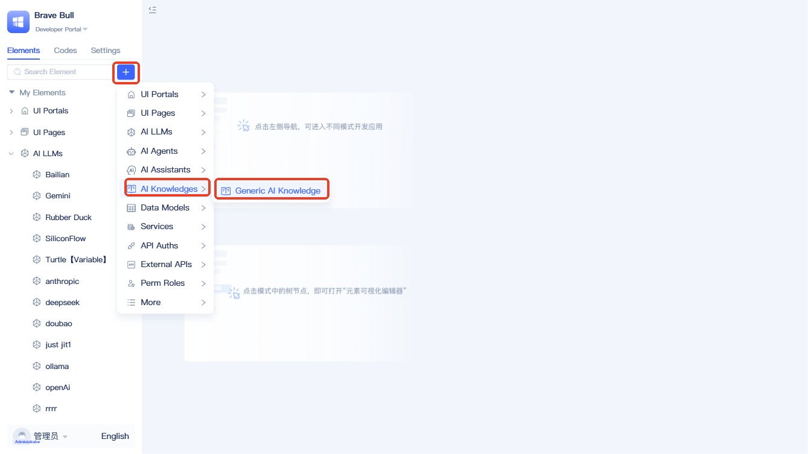
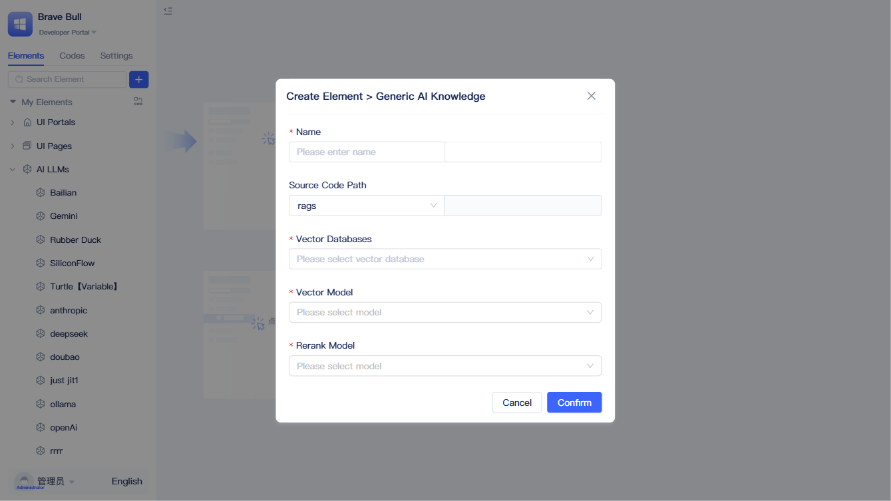
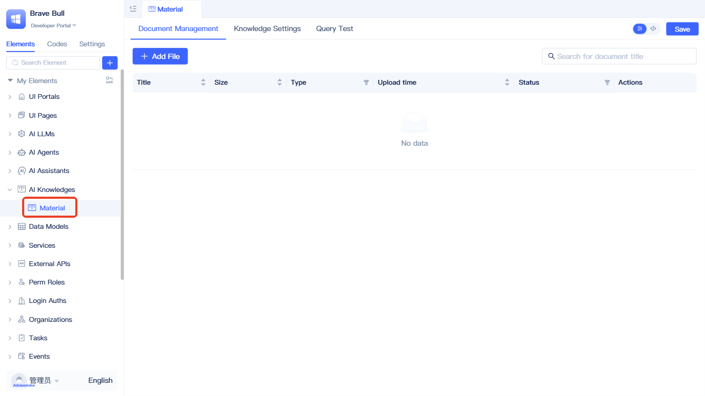
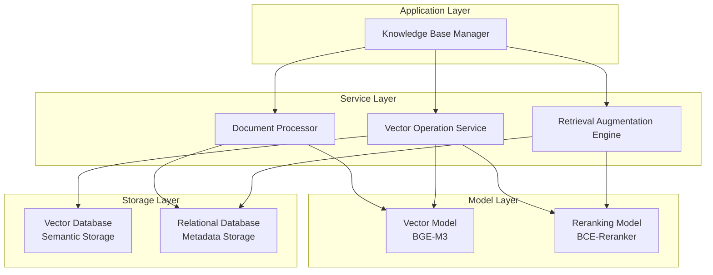
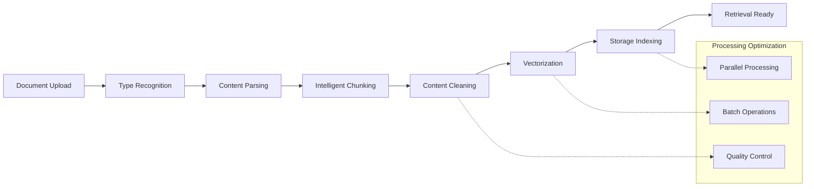
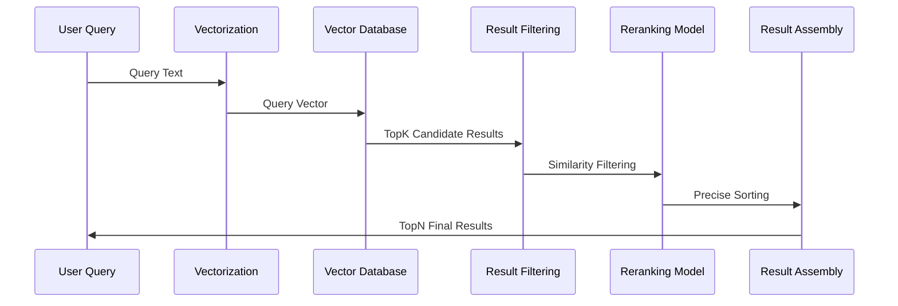

# Creating Knowledge Base Elements
In traditional application systems, user manuals are often scattered across various documents, and answers to frequently asked questions need to be repeatedly searched for.

AI knowledge base elements are designed to solve these pain points. They are not just document storage containers, but also have semantic understanding retrieval capabilities. They transform various documents into structured knowledge that can be "understood", and when users ask questions, the knowledge base understands semantic intent and returns matching answers from the knowledge base.

## Creating AI Knowledge Base Elements {#create-ai-knowledge-base-element}
:::tip
It is recommended to first complete the creation of [LLM vendors](../ai-llm/create-ai-llm#creating-llm-vendor-elements) and [vector databases](./vector-database-standalone-deployment), then create the AI knowledge base, so that you can directly select the corresponding elements during the creation process. For LLM vendors, we recommend `Alibaba Cloud Bailian` and `SiliconFlow`, as they have rich vector and reranking models for developers to choose from.
:::

Click the `+` button to the right of the search box in the element directory tree, select `AI Knowledge Base` - `Standard Knowledge Base`. A dialog for creating an AI knowledge base element will then appear.

In the creation dialog, you need to complete the selection of `Name`, `Vector Database`, `Vector Model`, and `Reranking Model` in sequence. Click `OK` to complete creation.

:::tip
The vector model has a significant impact on search results. Please choose according to actual circumstances. Modification is not allowed after creation is completed.
:::

After creation, it will be displayed in the left element tree.

## Principle Description {#principle-description}

### Core Components {#core-components}

AI knowledge bases are based on advanced RAG (Retrieval-Augmented Generation) architecture, with five core components working together:

- **Vector Model**: Converts documents and queries into high-dimensional vector representations for semantic understanding
- **Reranking Model**: Performs precise sorting of preliminary retrieval results to improve matching accuracy
- **Vector Database**: Efficiently stores and retrieves vector data, supporting large-scale similarity computation
- **Document Processor**: Intelligently parses, chunks, and cleans document content to optimize vectorization effects
- **Relational Database**: Stores document metadata and text chunks to ensure data consistency

### System Architecture {#system-architecture}

### Technical Principles {#technical-principles}

**Semantic Understanding Technology**: Uses advanced text vectorization models to convert natural language into points in mathematical vector space, enabling computers to understand semantic relationships in text rather than just keyword matching.

**Two-Stage Retrieval Mechanism**:
1. **Vector Retrieval Stage**: Quickly locate semantically similar candidate documents in vector space
2. **Reranking Stage**: Perform precise sorting of candidate results based on query context

**Hybrid Storage Strategy**: Vector databases specialize in similarity computation of high-dimensional vectors, while relational databases manage structured metadata. Both work together to ensure retrieval efficiency and accuracy.

### Data Processing Flow {#data-processing-flow}

### Retrieval Mechanism {#retrieval-mechanism}

After user queries are vectorized, the system retrieves TopK semantically similar candidate documents in vector space, filters low-quality results through similarity thresholds, and finally uses reranking models to perform precise sorting based on query context, returning TopN most relevant knowledge fragments.

> For retrieval parameter configuration and specific usage methods in backend visual programming, please refer to [Full-Text and Semantic Search Using Knowledge Base](./full-text-and-semantic-search).
