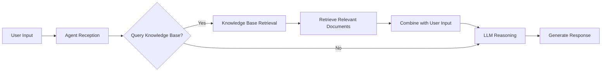

# Integrating Knowledge Base Into Agent {#integrating-knowledge-base-into-agent}

Knowledge bases serve as the core knowledge backbone for AI Agents, delivering accurate and timely domain expertise through Retrieval-Augmented Generation (RAG) technology. This integration significantly enhances an Agent's professional capabilities and response quality.

## Relationship between knowledge base and agent {#relationship-between-knowledge-base-and-agent}

Within the JitAi platform, knowledge base elements establish a tightly integrated collaborative relationship with AI Agents:

- **Knowledge provisioning**: Knowledge bases transform diverse documents into structured, machine-understandable knowledge, providing Agents with rich knowledge repositories
- **Intelligent retrieval**: Through vector similarity matching and reranking models, knowledge bases comprehend the semantic intent behind Agent queries and return the most relevant knowledge fragments
- **Dynamic enhancement**: Agents can query knowledge bases in real-time to obtain the latest business information without requiring model retraining

## Technical integration principles {#technical-integration-principles}

When knowledge bases are integrated, Agents can dynamically acquire relevant knowledge during the reasoning process, enabling:
- **Context augmentation**: Leverages retrieved knowledge as contextual supplements to improve response accuracy
- **Knowledge currency**: Obtains the latest document content, circumventing the temporal limitations of model training data
- **Domain expertise**: Through domain-specific knowledge bases, equips Agents with deep expertise in specialized fields

## Integration modes {#integration-modes}

Knowledge bases support two integration modes:
- **Mandatory mode**: Agents must query the knowledge base before processing user requests, ensuring every response is grounded in the latest knowledge
- **Decision mode**: The LLM intelligently determines whether to query the knowledge base, balancing response speed against knowledge accuracy

## Using knowledge base in agent {#using-knowledge-base-in-agent}

For detailed integration configuration and usage instructions, refer to [Integrating Knowledge Base for Retrieval-Augmented Generation (RAG)](../ai-agent/agent-knowledge-base#integrate-knowledge-base-rag).

