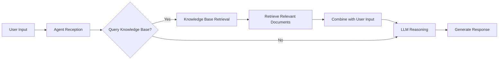

# Integrating Knowledge Base into Agent {#use-ai-knowledge-base-in-ai-agent}

Knowledge bases serve as the core knowledge support for AI Agents, providing accurate and timely domain knowledge through Retrieval-Augmented Generation (RAG) technology, significantly enhancing Agent's professional capabilities and response quality.

## Relationship Between Knowledge Base and Agent {#relationship-between-knowledge-base-and-agent}

In the JitAi platform, knowledge base elements form a close collaborative relationship with AI Agents:

- **Knowledge Provider**: Knowledge bases transform various documents into structured knowledge that can be "understood", providing Agents with rich knowledge sources
- **Intelligent Retrieval**: Through vector similarity and reranking models, knowledge bases can understand the semantic intent of Agent queries and return the most relevant knowledge fragments
- **Dynamic Enhancement**: Agents can query knowledge bases in real-time to obtain the latest business information without retraining models

## Technical Integration Principle {#technical-integration-principle}

After integrating knowledge bases, Agents can dynamically acquire relevant knowledge during reasoning, achieving:
- **Context Enhancement**: Use retrieved knowledge as contextual supplements to improve response accuracy
- **Knowledge Timeliness**: Obtain the latest document content, avoiding limitations of model training data timeliness
- **Professional Domain Support**: Through domain-specific knowledge bases, enable Agents to possess deep knowledge in professional fields

## Integration Modes {#integration-modes}

Knowledge bases support two integration modes:
- **Mandatory Mode**: Agents must first query the knowledge base before processing user requests, ensuring every response is based on the latest knowledge
- **Decision Mode**: LLM intelligently determines whether to query the knowledge base, balancing response speed with knowledge accuracy

## Using Knowledge Base in Agent {#use-knowledge-base-in-agent}

For detailed integration configuration and usage methods, please refer to [Integrate Knowledge Base to Implement Retrieval-Augmented Generation (RAG)](../ai-agent/agent-knowledge-base#integrate-knowledge-base-rag).

