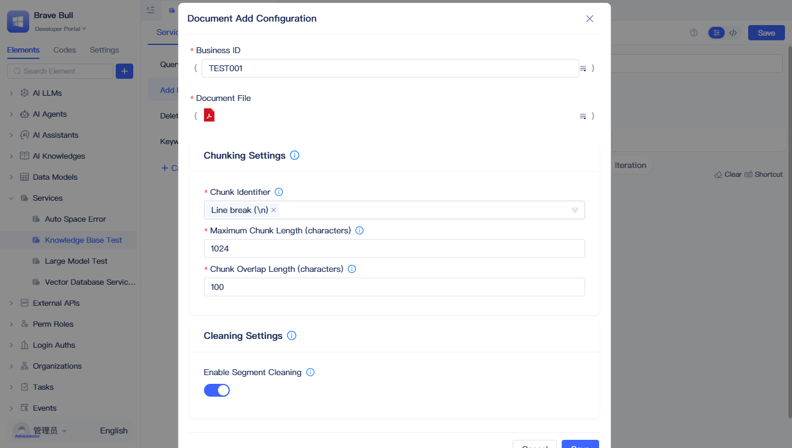
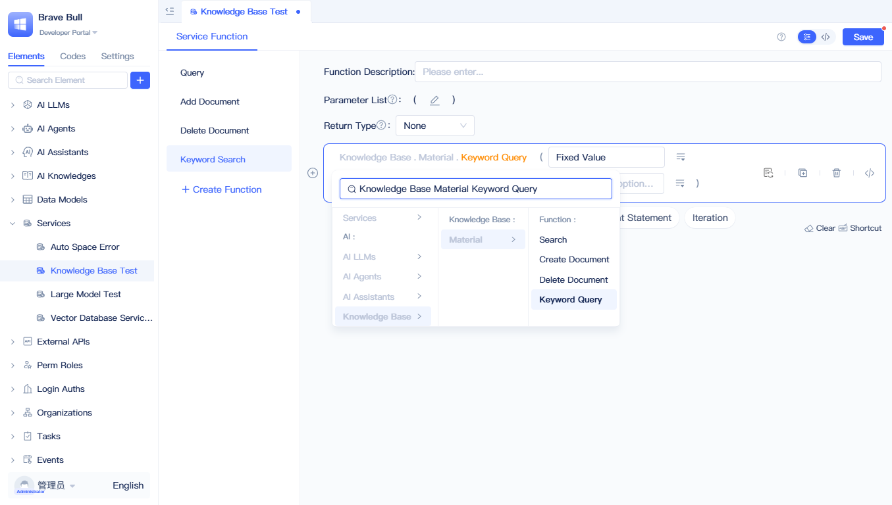

# Full-Text and Semantic Search Using Knowledge Base Elements

Knowledge bases support two types of retrieval: **keyword search** based on precise keyword matching, and **semantic search** based on vector similarity to understand semantic meaning. JitAi knowledge bases integrate the advantages of both technologies, supporting both precise keyword queries and intelligent semantic understanding retrieval.

## Callling AI Knowledge Base in Backend Visual Programming {#call-ai-knowledge-base-in-backend-visual-programming}
In backend visual programming functions (service functions/model functions/task functions/event functions), knowledge base elements provide 4 methods: "Query", "Add Document", "Delete Document", and "Keyword Query".

### Semantic Search {#semantic-search}

Click "Please Select" at the blank statement in the function panel, select "Knowledge Base - [Knowledge Base Name] - Query" to generate an AI knowledge base query function; you can set query conditions in the input box of the query function.

### Adding Document {#adding-document}

Select "Knowledge Base - [Knowledge Base Name] - Add Document" in the function panel to generate an add document function; click "Document Addition Configuration" in the function to open detailed configuration for adding documents.

Fill in "Business ID", "Document File", and other vectorization configurations, then click save. The "Business ID" is the identifier for the currently added document (can be used for subsequent deletion); "Document File" supports multiple files in attachment fields.

:::tip
For other configurations, refer to [Vectorization Configuration Description](./knowledge-base-document-management#vectorization-configuration-description).
:::

### Deleting Document {#deleting-document}

Select "Knowledge Base - [Knowledge Base Name] - Delete Document" in the function panel to generate a delete document function; fill in the Business ID, and after running, all documents under that Business ID will be deleted.

### Searching by Keywords {#searching-by-keywords}

Select "Knowledge Base - [Knowledge Base Name] - Keyword Query" in the function panel to generate a keyword query function; after configuring the keyword list and query quantity, corresponding query results will be returned.

:::tip
You can first use LLM to extract keywords from questions, then perform keyword queries.
:::

## How AI Knowledge Base Settings Participate in Query Flow {#how-ai-knowledge-base-settings-participate-in-query-flow}

For detailed explanation of knowledge base query flow, including vector retrieval, reranking mechanisms, and parameter configuration, please refer to [Creating Knowledge Base Elements - Retrieval Mechanism](./create-knowledge-elements#retrieval-mechanism).
