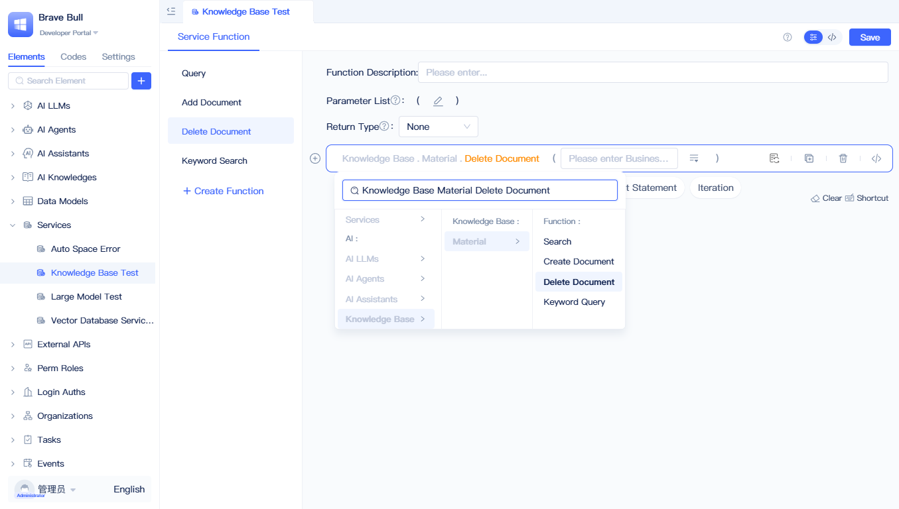

# Keyword and Semantic Search Using Knowledge Base Elements

Knowledge bases support two retrieval methods: **keyword search** for precise keyword matching, and **semantic search** for understanding semantic meaning through vector similarity. JitAI knowledge bases combine the strengths of both approaches, enabling precise keyword queries and intelligent semantic understanding.

## Calling AI knowledge base in backend visual programming {#call-ai-knowledge-base-in-backend-visual-programming}
Knowledge base elements in backend visual programming functions (service functions, model functions, task functions, and event functions) provide four methods: Query, Add Document, Delete Document, and Keyword Query.

### Semantic search {#semantic-search}

In the function panel, click "Please Select" on a blank statement, then choose "Knowledge Base - [Knowledge Base Name] - Query" to create an AI knowledge base query function. You can configure query conditions in the function's input field.

### Adding a document {#adding-document}

In the function panel, select "Knowledge Base - [Knowledge Base Name] - Add Document" to create an add document function. Click "Document Addition Configuration" in the function to access the detailed configuration options.

Fill in the "Business ID", "Document File", and other vectorization settings, then click Save. The "Business ID" serves as the identifier for the added document (used for later deletion). The "Document File" field supports multiple files from attachment fields.

:::tip
For additional configuration options, see [Vectorization Configuration](./knowledge-base-document-management#vectorization-configuration).
:::

### Deleting a document {#deleting-document}

In the function panel, select "Knowledge Base - [Knowledge Base Name] - Delete Document" to create a delete document function. Enter the Business ID, and upon execution, all documents associated with that Business ID will be removed.

### Searching by keywords {#searching-by-keywords}

In the function panel, select "Knowledge Base - [Knowledge Base Name] - Keyword Query" to create a keyword query function. After configuring the keyword list and result quantity, the function will return matching results.

:::tip
You can use an LLM to extract keywords from questions before performing keyword queries.
:::

## How AI knowledge base settings participate in query flow {#how-ai-knowledge-base-settings-participate-in-query-flow}

For a detailed explanation of the knowledge base query flow, including vector retrieval, reranking mechanisms, and parameter configuration, refer to [Creating Knowledge Base Elements - Retrieval Mechanism](./create-knowledge-elements#retrieval-mechanism).
