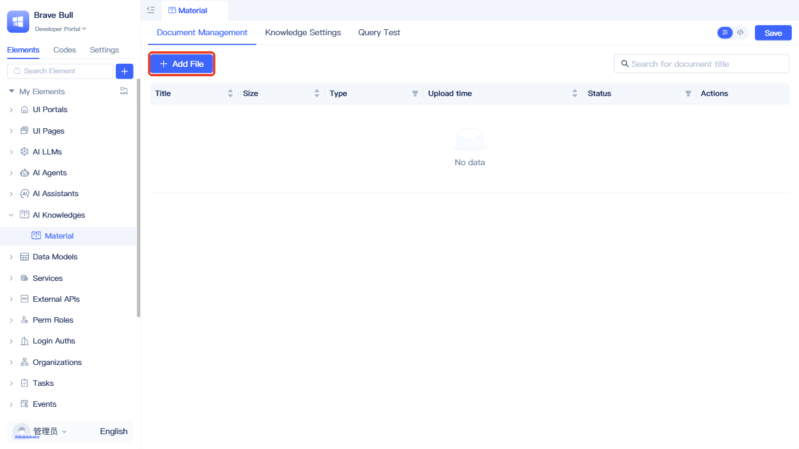

# Knowledge Base Document Management

Add and maintain AI knowledge base documents through the "Document Management" page:

Click "+ Add File" to open the file upload panel.

In the "Select Data Source" step, click the dashed box to select documents or drag files directly into the box. Once the upload completes, click "Next".

:::tip
Supported document formats include PDF, DOCX, TXT, and MD, with a maximum file size of 10MB per document.
:::

In the "Segmentation and Cleaning" step, configure the "Segment Identifier", "Maximum Segment Length", "Segment Overlap Length", and "Cleaning Settings" based on your document characteristics. Once configured, click "Next". For detailed parameter descriptions, see [Vectorization Configuration](#vectorization-configuration).

In the "Process and Complete" step, the system will process each document in the background. You can either wait for all documents to finish vectorization or click "Return to Document List" to close the panel (background processing will continue uninterrupted).

Click the refresh button in the document list to view the current vectorization status of each document.

## Knowledge base settings {#knowledge-base-settings}
Configuration settings in "Knowledge Base Settings" directly impact search result accuracy and the volume of returned content.

The "Vector Database" and "Embedding Model" settings cannot be modified after creation. However, you can dynamically adjust parameters such as "Reranking Model", "TopK", "TopN", "Vector Similarity Threshold", and "Reranking Score Threshold" based on feedback from [Query Testing](#query-testing).

:::tip
To improve accuracy, first familiarize yourself with [How Settings Participate in Query Flow](./keyword-and-semantic-search#how-knowledge-base-settings-participate-in-query-flow). Note that configuration changes must be saved before they take effect in [Query Testing](#query-testing).
:::

## Query testing {#query-testing}
A query testing feature is provided to help you debug and optimize AI knowledge base performance.

After entering a question and clicking "Test Query", the system interprets the query semantics and returns matching results. It also displays the number of qualifying documents along with their vector similarity scores and reranking scores. Use these insights to continuously adjust [Knowledge Base Settings](#knowledge-base-settings) and improve retrieval performance.

## Vectorization configuration {#vectorization-configuration}
- **Segment Identifier**: Delimiters used to split documents. Multiple delimiters can be selected. The system segments based on all selected delimiters, defaulting to paragraph breaks (`\\n\\n`).
- **Maximum Segment Length**: Maximum character count per text chunk, recommended range 500–2000. Smaller chunks provide greater precision but may lose context; larger chunks retain more context but may sacrifice precision.
- **Segment Overlap Length**: Number of overlapping characters between adjacent chunks, recommended to be 10%–20% of the chunk size.
- **Enable Segment Cleaning**: Enables text quality improvements and retrieval precision enhancements, including whitespace cleanup, full-width to half-width conversion, line break repair, etc.

## Knowledge base configuration parameters {#knowledge-base-configuration-parameters}
| Parameter Name | Default Value | Recommended Range | Description |
|---------|--------|----------|------|
| Embedding Model | - | - | Determines semantic understanding capability for documents and queries; cannot be modified after creation |
| Reranking Model | - | - | Performs fine-grained sorting of recalled results; can be changed anytime to optimize performance |
| TopK | 50 | 1-100 | Vector recall count; controls the number of documents retrieved in the initial search |
| TopN | 5 | 1-10 | Post-reranking return count; final number of documents returned to users |
| Vector Similarity Threshold (vectorScore) | 0.6 | 0.1-1.0 | Filters recall results; higher values require stricter semantic matching |
| Reranking Score Threshold (reRankScore) | 0.3 | 0.1-1.0 | Filters reranking results; higher values demand greater precision |

:::tip Parameter Recommendations
Generally, start by increasing TopK (to expand recall coverage), then apply an appropriate reRankScore for fine-grained filtering. If recall contains too much noise, consider raising the vectorScore threshold.
:::

