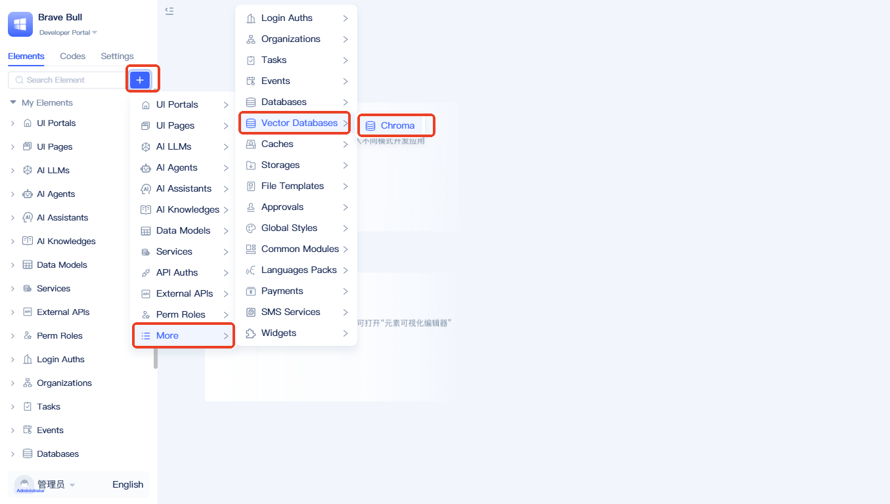
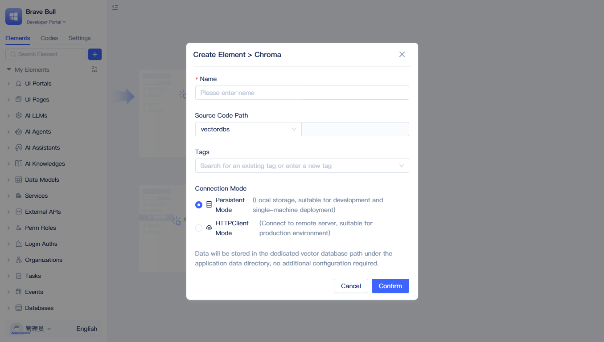
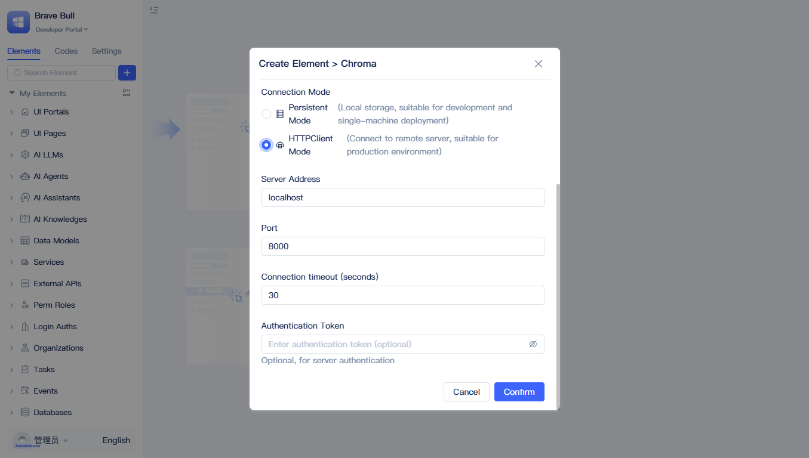

# 向量数据库
向量数据库是 JitAi 平台中用于存储和检索知识库内容的核心组件，是[AI 知识库](./create-knowledge-elements)元素的底层存储引擎。

通过配置向量数据库，[AI 知识库](./create-knowledge-elements)可以将文档内容转换为向量数据存储。这种存储方式使得应用能够基于语义相似度快速检索相关知识，为智能问答、内容推荐等功能提供强大的数据支撑。

:::tip
向量数据库默认使用`余弦相似度`作为距离度量算法，该算法特别适用于文本语义相似性计算。
:::

## Chroma 向量数据库 {#chroma-vector-database}
Chroma 是 JitAi 平台默认集成的向量数据库，具有轻量级、易部署、高性能等特点，支持余弦相似度、欧几里得距离等多种相似性度量算法。既可作为嵌入式数据库在本地运行，也可部署为独立服务支持远程访问，为不同规模的应用提供灵活的向量存储方案。

### 本地向量数据库配置 {#local-vector-database-config}
本地向量数据库采用内置存储方式，数据直接保存在 JitAi 平台的本地环境中。该模式无需额外数据库服务器，开箱即用（只需配置名称即可），适合小规模应用和开发测试场景。

输入“名称”，“连接模式”选择“持久化模式”，点击“保存”即可创建本地向量数据库。

### 远程向量数据库连接 {#remote-vector-database-connection}
远程向量数据库通过连接外部独立部署的 Chroma 数据库服务来存储和检索数据，适合生产环境以及以集群方式部署的应用服务。

除“名称”外，还需配置“数据库地址”“端口”“超时时间”“认证令牌”。

## 向量数据库编程接口 {#vector-database-programming-interface}
### health_check
检查向量数据库的连接状态和运行健康情况，返回数据库基本信息。[API 文档](../../reference/framework/JitAi/vector-database#health_check)

### create_collection
在向量数据库中创建新的集合，用于存储和管理相关的向量数据。[API 文档](../../reference/framework/JitAi/vector-database#create_collection)

### add_vectors
将向量数据及其元数据存储到指定的集合中。[API 文档](../../reference/framework/JitAi/vector-database#add_vectors)

### query_vectors
基于查询向量在集合中搜索最相似的向量数据。[API 文档](../../reference/framework/JitAi/vector-database#query_vectors)
