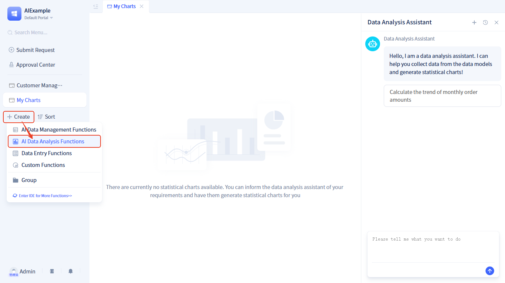

# AI Data Analysis Page
## Overview
In traditional development mode, statistical charts are pre-designed by developers, and users cannot modify chart types and statistical methods. JitAI's AI data analysis page allows users to describe their requirements through natural language, with AI automatically generating corresponding data charts and supporting users to adjust chart styles and statistical dimensions at any time.

## Creating AI Data Analysis Page {#create-ai-data-analysis-page}
Create in the developer portal by following these steps:

Click +  → **UI Pages** → **AI Data Analysis Page**, open the page information form, and click the `Confirm` button after filling out the form to create the page.

After the page is created, it will automatically enter the visual editor.

## Page Configuration {#page-configuration}
We provide visual development tools, and developers only need to make some simple configurations to get an AI data analysis page. The configuration is as follows:

### Allow using AI analyzed data {#data-range-allowed-for-ai-analysis} 
Specify the data tables and data conditions that can be analyzed. This configuration item controls the data allowed for analysis on this page, thereby controlling the data range that users can statistically analyze.

### Configure LLM for AI Data Analysis Assistant
We have built-in a specialized AI Assistant for data analysis on this page. This assistant needs to access the system database and call functions on the page to draw charts during runtime. We need to configure a [Large Language Model](/docs/devguide/ai-llm/create-ai-llm) that supports tool calling. We recommend using qwen-max-latest from Alibaba Cloud Bailian platform.<a href="https://bailian.console.aliyun.com/?tab=model#/api-key" target="_blank">Apply for API Key</a>

### AI Assistant Advanced Configuration
- Support custom [Welcome Message and Opening](/docs/devguide/ai-assistant/welcome-message-and-opening)
- Support custom [Output Process Log](/docs/devguide/ai-assistant/ai-assistant-input-output#message-output)

For more information about AI assistants, please read the [AI Assistant](/docs/devguide/ai-assistant) related documentation.

## Full Code Development {#full-code-development}
Click the  button in the upper right corner of the page editor to switch to source code editing mode.
In source code mode, the left side displays source code files. After clicking on a source code file, the right side shows the source code content. The core source code is `schema.json`.

The content is as follows:
- **aiConfig**: AI-related configuration items
  - **useAi**: Enable AI functionality, fixed value is `1`
  - **aiAssistant**: AI assistant bound to the page, currently fixed as `pages.DataAnalysisType.GeneralAssistant`. Future versions will support developers to customize AI assistants
  - **inputArgs**: Input configuration for assistant runtime
  - **llmElement**: Large language model element ID
  - **llmConfig**: Large language model parameter configuration
  - **welcomeMessage**: Welcome message (optional, default is empty)
  - **prologues**: Opening content
  - **logContent**: Runtime process output level (optional, default is `LLM_CONCISE_LOG`)
    - `NOT_OUTPUT`: No runtime process output
    - `LLM_CONCISE_LOG`: Output brief runtime process
    - `DETAIL_LOG`: Output detailed runtime process
- **dataSources**: Data tables and data conditions allowed for AI analysis

## Runtime Effects {#run-effects}
Enter `Calculate the trend of monthly order amounts` (statistics of monthly transaction volume trends), such a simple sentence specifies the data statistical method: statistics of monthly transaction volume; it also specifies the statistical chart type: smooth curve.
The runtime effect is as follows:

For AI-generated charts, users can also make the following adjustments:

- **Filtering Condition**: Set filtering conditions for statistical data, which will be superimposed on the conditions of [Data Range Allowed for AI Analysis](#data-range-allowed-for-ai-analysis).
- **Chart Type**: Modify chart type
- **Save**: Save the chart, which will be directly visible when opening the page next time.

## Quick Create {#quick-create}
In addition to creating in the developer portal, you can also quickly create in the regular portal. The creation method is as follows:

Click **Create New** → **AI Data Analysis Functions**.This operation will create a new AI data analysis page and simultaneously create a menu in the portal and bind it to the newly added page.

:::tip Tip
You need to be granted [quick create permissions](/docs/devguide/user-and-permission/role-portal-menu-permissions#specify-accessible-portals-and-menus) to see the quick create entry.
:::
