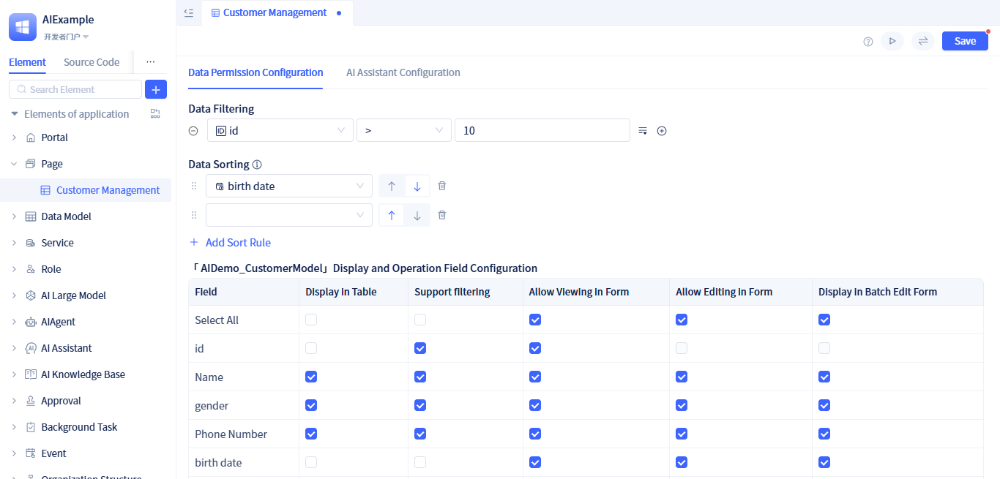
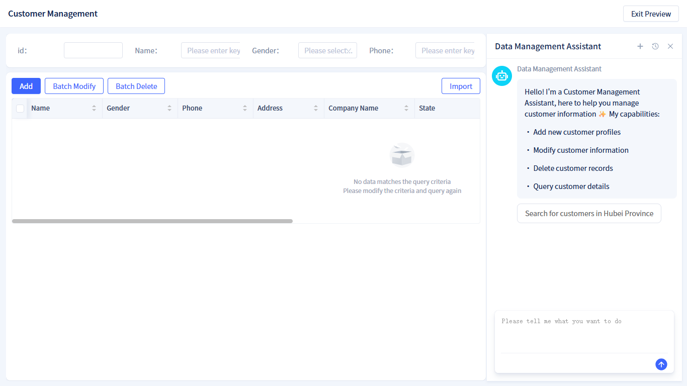

# AI Data Management Page
In common data management function pages, data CRUD (Create, Read, Update, Delete) operations are typically provided, including filter conditions, sorting, pagination, toolbar buttons, action column buttons, and other common interface elements and functions. JitAi directly provides AI data management pages to help developers quickly complete data management function development, and supports users to use AI for data management work.

## Creating AI Data Management Page {#create-ai-data-management-page}
Similar to the data-entry-page creation process, ai-data-management-page also needs to bind to a [data table model](../../data-modeling/data-table-model) for data storage.

Developers can select the page type as `AI Data Management Page` when creating a page, and choose the [data table model](../../data-modeling/data-table-model) for managing data in the `Select Data Table` section. After clicking the `Confirm` button, it will automatically enter the visual editor.

Developers typically don't need to perform any additional configuration, and the page can be used directly. Of course, developers can also modify configurations according to actual needs, as referenced in subsequent chapters.

Click the preview button in the top-right corner of the visual editor to see the effect! When users access the page, they will see a fully functional data management interface, including data tables, filter conditions, pagination, add/batch modify/batch delete/import in the toolbar, edit/delete in the action column, and clicking column headers for sorting.

## Limiting Page Table Query Data Through Default Filter Conditions {#limit-page-table-query-data-through-default-filter-conditions}
In actual business scenarios, it may be necessary to limit the data that can be queried and displayed in the page table. For example, only displaying data from the past year. By setting default filter conditions, data security can be effectively ensured, user efficiency can be improved, and irrelevant data interference with business operations can be avoided. JitAi's [filter](../../using-functional-components-in-pages/filter-components) supports various filter condition settings for text, numeric, date-time, and other field types, meeting almost all filtering requirements.

Developers can configure `Data Filter` in the page editor. Click the plus button on the right side of each filter condition to add multiple conditions.

:::tip Role-Based Data Permission Control
In addition to configuring default filter conditions in the page, developers can also perform fine-grained control over data query and operations for different user roles within the application. This is a more advanced configuration method, and developers can refer to the role permission documentation.

The configuration in role permissions will be combined with the conditions configured in the page and take effect, with an `AND` relationship.
:::

## Configuring Default Data Sort Rules {#configure-default-data-sort-rules}
The display order of data tables often affects user work efficiency. For example, sales personnel want to see the latest orders first, while finance personnel may be more concerned about transactions with larger amounts. Reasonably setting default data sort rules allows users to see the most important or relevant data at first glance when entering the page, improving data search and processing efficiency.

Developers can configure `Data Sorting` in the page editor. Click the plus button on the right side of each sort condition to add multiple sort conditions.

## Hiding Some Fields in Page Table {#hide-some-fields-in-page-table}
In actual business scenarios, it may be necessary to hide some fields. For example, users don't need to see fields like `Creation Time` and `Update Time`. By hiding fields, irrelevant data interference to users can be reduced, improving page cleanliness and usage efficiency.

Developers can configure in the `Display in Table` section of the page editor. Check to display the corresponding field, uncheck to hide the corresponding field.

## Configuring Fields That Support Conditional Filtering {#configure-conditional-filter-fields}
Not all fields need to support conditional filtering. For example, remark fields typically don't need to support conditional filtering.

Developers can configure in the `Support Filtering` section of the page editor. Uncheck fields that don't need to participate in conditional filtering, check to support conditional filtering.

## Configuring Viewable and Editable Fields in Form {#configure-viewable-editable-fields-in-form}
When users add or edit data, primary key ID typically doesn't need to be visible to users in the form, and creation time doesn't need to be editable by users in the form, but is automatically generated by the system. By analogy, JitAI supports configuring view and edit permissions for all fields in the form.

Developers can configure in the `Allow View` and `Allow Edit` sections of the page editor. Uncheck fields that don't need to be visible or editable by users in the form, check to allow viewing and editing.

:::tip
Not allowing viewing and editing in the form does not take effect for [batch edit form](#configure-fields-displayed-in-batch-edit-form).
:::

## Configuring Fields Displayed in Batch Edit Form {#configure-fields-displayed-in-batch-edit-form}
Batch editing is typically used to select multiple data records in the table and then perform batch modifications on these data. However, not all fields are suitable for batch modification. For example: phone numbers, email addresses, and other highly distinctive fields are typically not suitable for batch modification.

Developers can configure in the `Display in Batch Edit Form` section of the page editor. Check to display the corresponding field in the batch edit form, uncheck to not display the corresponding field. Additionally, the batch form requires at least one display field to be configured.

## Enabling AI Data Management Assistant {#enable-ai-data-management-assistant}
JitAi supports directly enabling AI data management assistant in AI data management pages to help users quickly complete data management operations. For example: quickly generating test data.

Developers can turn on the `Use AI Data Management Assistant` switch in the page editor, configure the large model in the configuration panel, and click `Save`.

Welcome message and opening remarks are optional configurations that developers can set as needed. For more information about AI assistants, please read the AI assistant related documentation.

## Converting to Regular Page for Modification {#convert-to-regular-page-for-modification}
AI data management page is a built-in page type provided by JitAi that can be used out of the box, allowing developers to quickly create and use it. When developers want to make more refined custom modifications based on the default implementation, they can convert the page to a regular page for unlimited modifications.

Developers can click the `Convert to Regular Page` button in the top-right corner of the page editor to convert the page to a regular page. For regular page development methods, refer to [Component-Based Page Development](../component-based-page-development).

:::warning
After converting to a regular page, it cannot be restored to the original `AI Data Management Page` type.
:::