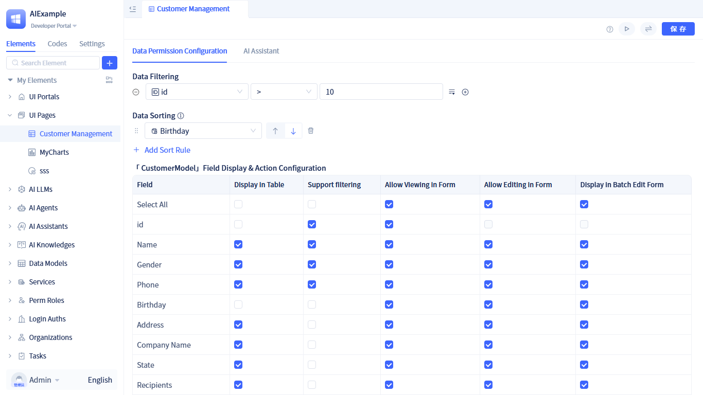

# AI Data Management Page

## What is AI data management page {#what-is-ai-data-management-page}

In enterprise application development, there are numerous data management pages with similar functionality. These pages share core features of performing CRUD operations on specific data tables, with consistent user interfaces and interaction patterns. The only difference lies in the data tables they operate on. The JitAI platform addresses this repetitive development scenario by providing a built-in AI Data Management Page type. Developers only need to simply configure the target data table and data permissions to quickly complete the development of a fully functional data management page without repeatedly writing similar code. This page type significantly improves development efficiency, allowing developers to focus more on business logic innovation rather than repetitive basic functionality development.

### Features {#features}

The AI Data Management Page provides standard data management functionality required for enterprise applications, including basic display features such as data table presentation, conditional filtering, sorting, and pagination, as well as data operation features such as adding, editing, deleting, and batch operations. The page adopts a unified UI design style, ensuring consistent user experience across different business scenarios. The most core feature is the built-in AI Data Management Assistant, which allows users to complete various data operations through natural language dialogue with AI, such as "query all orders with pending approval status" or "batch update the priority of these records to high". This intelligent interaction approach makes data management more intuitive and efficient, particularly suitable for users unfamiliar with traditional table operations, and significantly improves data processing efficiency.

### Technical Implementation {#technical-implementation}

The AI Data Management Page is built on the JitAI platform's page framework, adopting a configuration-driven development model. Developers configure data table fields, permission rules, filter conditions, and other parameters through the visual editor, and the system automatically generates corresponding page code and database operation logic based on these configurations. The page includes built-in standard components such as tables, forms, filters, popups, and import functionality, supporting various common data display and operation requirements. The AI assistant implementation is based on large language model tool calling capabilities, interacting with the page through predefined function interfaces to execute database operations such as querying, adding, modifying, and deleting. The system also integrates comprehensive permission control mechanisms to ensure users can only access and operate authorized data, guaranteeing data security.

## Creating AI data management page {#create-ai-data-management-page}
Enter the developer portal and create it by following these steps:

Click +  → **UI Pages** → **AI Data Management Page**, open the page information form, and click the `Confirm` button after filling out the form to create the page.

After the page is created, it will automatically enter the visual editor.

Developers typically don't need to perform any additional configuration, and the page can be used directly. Of course, developers can also modify the configuration according to actual needs.

## Manageable data scope {#limit-page-table-query-data-through-default-filter-conditions}
In actual business scenarios, it may be necessary to limit the data that can be queried and displayed in the page table. For example, only displaying data from the past year. By setting data filter conditions, data security can be effectively ensured, user efficiency can be improved, and irrelevant data interference with business operations can be avoided.

Limit the data queried by the page table through default filter conditions. JitAI's [Filter](/docs/devguide/using-functional-components-in-pages/filter-components) supports various filter condition settings for different types of fields such as text, numbers, date and time, which can meet almost all filtering requirements.

Developers can configure **Data Filtering** in the page editor, and click the plus button on the right side of each filter condition to add multiple conditions.

:::tip Role-based Data Permission Control
In addition to configuring default filter conditions in the page, developers can also perform fine-grained control over data query and operation permissions for different user roles within the application. This is a more advanced configuration method, and developers can refer to the role permission documentation.

The configuration in role permissions will be combined with the conditions configured in the page and take effect, which is an `AND` relationship.
:::

## Configure default data sort rules {#configure-default-data-sort-rules}
The display order of data models often affects user work efficiency. For example, sales personnel want to see the latest orders first, while financial personnel may pay more attention to transactions with larger amounts. Reasonably setting default data sort rules allows users to see the most important or relevant data at first glance when entering the page, improving data search and processing efficiency.

Developers can configure **Data Sorting** in the page editor, and click the plus button on the right side of each sort condition to add multiple sort conditions.

## Specify field columns displayed in table {#hide-some-fields-in-page-table}
In actual business scenarios, it may be necessary to hide some fields. For example, users don't need to see fields like `id`. By hiding fields, irrelevant data interference to users can be reduced, improving page cleanliness and usage efficiency.

Developers can configure this in `Display in Table` in the page editor. Check to display the corresponding field, uncheck to hide the corresponding field.

## Configure fields supporting conditional filtering {#configure-conditional-filter-fields}
Not all fields need to support conditional filtering. For example, remark fields typically don't need to support conditional filtering.

Developers can configure this in `Support Filtering` in the page editor. Uncheck fields that don't need to participate in conditional filtering, check to support conditional filtering.

## Configure fields allowed for viewing and editing in form {#configure-viewable-editable-fields-in-form}
When users add or edit data, primary key IDs typically don't need to be visible to users in the form, and creation time doesn't need to be edited by users in the form, but is automatically generated by the system. By analogy, JitAI supports configuring viewing and editing permissions for all fields in the form.

Developers can configure this in `Allow Viewing in Form`/`Allow Editing in Form` in the page editor. Uncheck fields that don't need to be visible or editable by users in the form, check to allow viewing and editing.

:::tip
Not allowing viewing and editing in the form does not take effect for [Batch Edit Form](#configure-fields-displayed-in-batch-edit-form).
:::

## Configure fields displayed in batch edit form {#configure-fields-displayed-in-batch-edit-form}
Batch editing is typically used to select multiple data records in the table and then perform batch modifications on these data. However, not all fields are suitable for batch modification. For example, highly distinctive fields such as phone numbers and email addresses are typically not suitable for batch modification.

Developers can configure this in `Display in Batch Edit Form` in the page editor. Check to display the corresponding field in the batch edit form, uncheck to not display the corresponding field. Additionally, the batch form requires at least one display field to be configured.

## AI data management assistant {#enable-ai-data-management-assistant}

### Enable AI data management assistant {#enable-ai-data-management-assistant}
The AI data management page has a built-in universal **AI Data Management Assistant**. Users can use this assistant to complete CRUD operations on data through natural language dialogue. For example, if a user inputs: "Enter 5 random test data records", the AI assistant will automatically enter 5 data records and refresh the table.
This assistant is not enabled by default in the page and needs to be manually enabled. The enabling method is as follows: 
 
Switch to `AI Assistant Configuration` at the top of the visual editor, then turn on the `Use AI Data Management Assistant` switch.

### Configure large language model {#configure-large-language-model}
The AI data management assistant needs to access the system database and call functions on the page to draw charts during runtime. We need to configure a [Large Language Model](/docs/devguide/ai-llm/create-ai-llm) that supports tool calling for it. We recommend using qwen-max-latest from Alibaba Cloud Bailian platform. [Apply for API Key](https://bailian.console.aliyun.com/?tab=model#/api-key)

### Assistant advanced configuration {#assistant-advanced-configuration}
- Supports custom [Welcome Message and Opening](/docs/devguide/ai-assistant/welcome-message-and-opening)
- Supports custom [Output Process Log](/docs/devguide/ai-assistant/ai-assistant-input-output#message-output), which outputs brief process logs by default.

For more information about AI assistants, please read the [AI Assistant](/docs/devguide/ai-assistant) related documentation.

## Runtime effect {#runtime-effect}

Click the  button in the top right corner of the visual editor to see the effect! 
When users access the page, they will see a fully functional data management interface, including data table, filter conditions, pagination, add/batch modify/batch delete/import in the toolbar, edit/delete in the action column, and clicking column headers for sorting. After enabling the AI data management assistant, an AI dialog box will be displayed on the right side of the page, allowing users to interact with the assistant through this dialog to operate data.

## Convert to generic page for modification {#convert-to-generic-page-for-modification}
The AI data management page is a built-in page type provided by JitAI out of the box, which developers can quickly create and use. When developers want to make more refined custom modifications based on the default implementation, they can convert the page to a generic page for unlimited modification. 
Developers can click the  button in the top right corner of the page editor to convert the page to a generic page. For generic page development methods, refer to [Component-based Page Development](/docs/devguide/shell-and-page/generic-page).

:::warning
After converting to a generic page, it cannot be restored to the original `AI Data Management Page` type.
:::

## Quick create {#quick-create}
In addition to creating in the developer portal, you can also quickly create in the regular portal. The creation method is as follows:

Click **Create** → **AI Data Management Functions**.This operation will create a new AI data Management page and simultaneously create a menu in the portal and bind it to the newly added page.

:::tip Tip
You need to be granted [quick create permissions](/docs/devguide/user-and-permission/role-portal-menu-permissions#specify-accessible-portals-and-menus) to see the quick create entry.
:::

