# 组件化页面
页面是用户与应用系统交互的主要场所，由不同的前端功能[组件](../../using-functional-components-in-pages)构成，为用户提供数据展示界面以及交互操作入口。

开发者在[门户导航设计](../portal-navigation-design)中规划每个门户中的导航菜单，而每个菜单项则对应一个页面的PC端和移动端。

## 创建组件化页面 {#create-a-regular-page}
在[门户导航设计](../portal-navigation-design)中，如果开发者选择创建菜单的同时创建页面，则页面会自动生成，可以在元素目录树中找到自动生成的页面并进行编辑。

开发者也可以手动创建页面，JitAi提供了常规页面、AI数据管理页面、AI数据分析页面、数据录入页面、React全代码页面、Vue全代码页面、markdown-page一共7种页面类型。其中AI数据管理页面、AI数据分析页面、数据录入页面都是以常规页面为基础封装的，本文使用常规页面讲解**如何进行组件化的页面开发**。

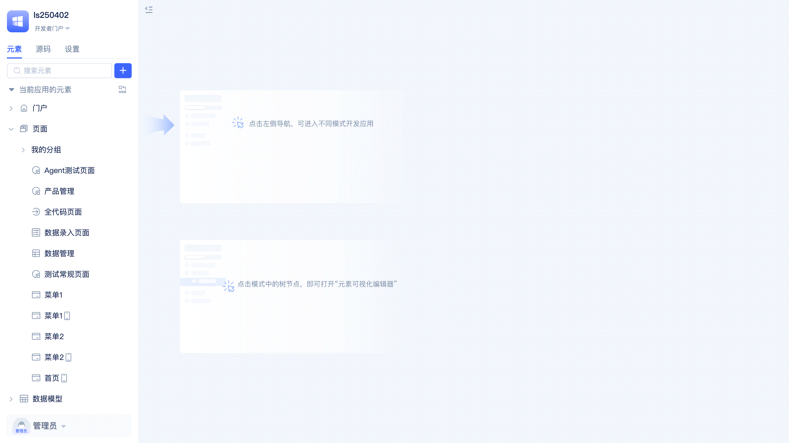

开发者在元素目录树中找到`页面`，点击`+`后选择`常规页面`，在弹出的`新建常规页面`表单弹窗中填写页面名称，点击`确定`后即可完成页面创建并自动进入[可视化页面编辑器](#visual-page-editor)。

### 页面继承
如果想复用某个已存在的页面，开发者可以在填写页面名称的同时，在高级配置中选择要继承的页面。

新页面将拥有被继承页面的所有组件配置（不包含事件逻辑），开发者可以在新页面中进行编辑。

## 可视化页面编辑器 {#visual-page-editor}
JitAi为页面元素提供了可视化拖拽式的页面编辑器，开发者可以在页面编辑器中拖拽功能组件到画布中，并进行组件的配置和事件逻辑的编写。

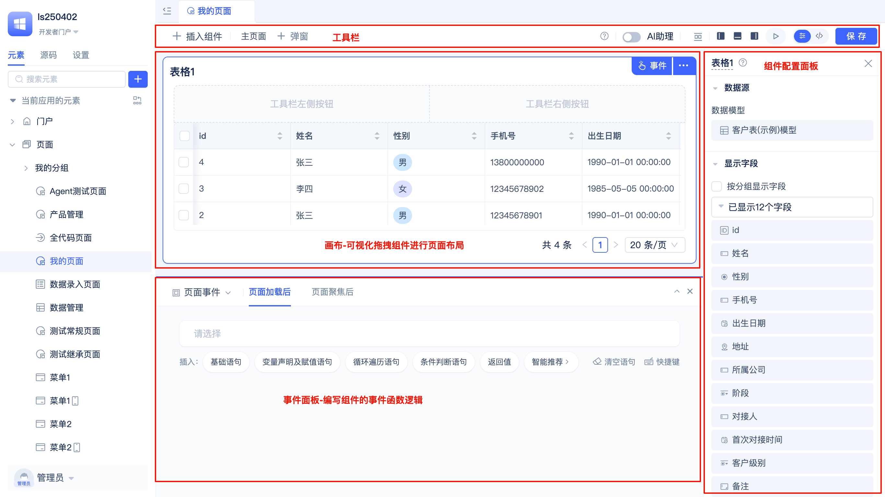

页面编辑器总体布局分为四个区域：工具栏、画布、组件配置面板、事件面板。

JitAi开发框架提供了丰富的组件库，每种组件的配置项和事件各有不同，开发者可以参考[在页面中使用功能组件](../../using-functional-components-in-pages)，了解每种组件详细用法。

## 在页面中集成AI助理 {#integrate-ai-assistant-in-pages}
页面支持集成AI助理，提供智能对话和辅助功能，增强用户体验。

### 工具栏
工具栏是页面编辑器中用于快速操作的区域，开发者可以点击工具栏中的按钮添加组件、切换页面紧凑/宽松模式、开启ai-assistant、打开/折叠收起元素目录树、打开/折叠事件面板、打开/折叠组件配置区、预览页面、在页面可视化模式和源代码模式间切换、保存对页面的修改。

:::tip 实时预览
开发者在开发过程中，可以随时点击工具栏中的预览按钮，实时预览页面效果。
:::

### 画布
开发者通过向画布中拖拽组件进行页面布局。

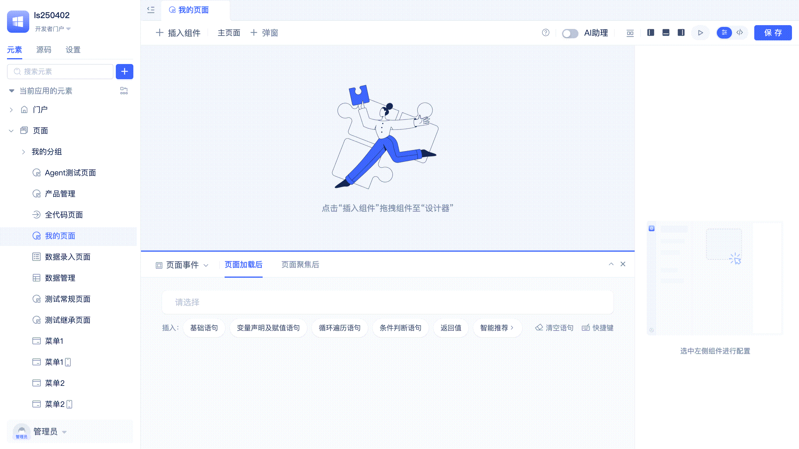

开发者点击工具栏最左侧的`+ 插入组件`按钮，在弹窗中找到所需组件（支持搜索），按住鼠标左键将组件拖拽到画布中。画布中可以放置多个组件，通过拖拽调整组件相对位置、组件尺寸大小。

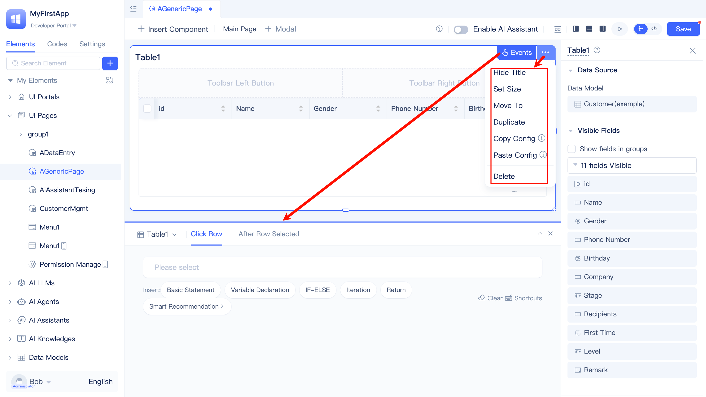

每一个组件的右上角都有一个`事件`按钮和`...`按钮。点击`事件`按钮可以在事件面板中显示当前组件的事件，点击`...`按钮可以打开组件的通用操作菜单，包括隐藏标题、设置尺寸、移动、生成副本、复制配置、粘贴配置、删除。

### 组件配置区
组件配置区用于配置组件的显示标题、属性、样式、规则、按钮等。

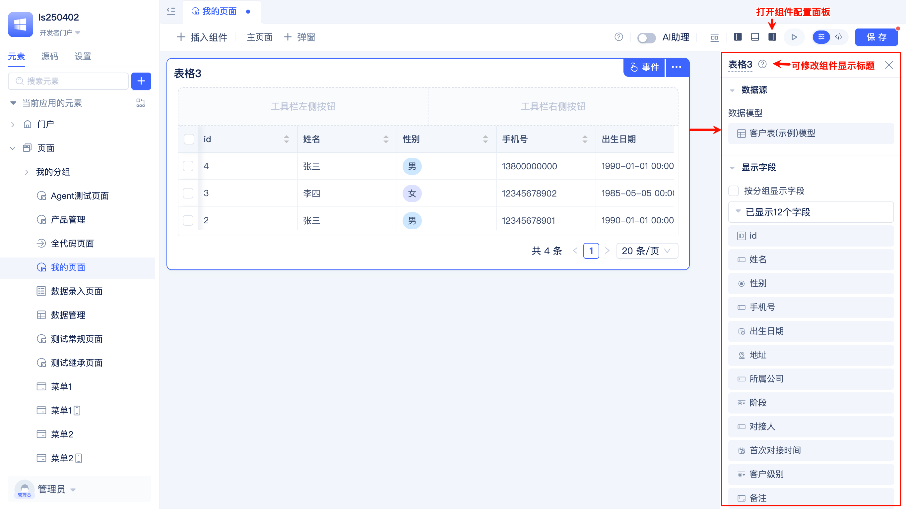

开发者在工具栏中打开组件配置，即可看到当前选中组件的配置项，例如表格的`数据源`、`字段`、`工具栏按钮`、`操作列按钮`、`显示模式`、`无数据时的文案`等。开发者在画布中点击其它组件即可切换到对应组件的配置区。

### 事件面板  {#event-panel}
事件面板是页面编辑器中用于编写组件事件逻辑的区域。

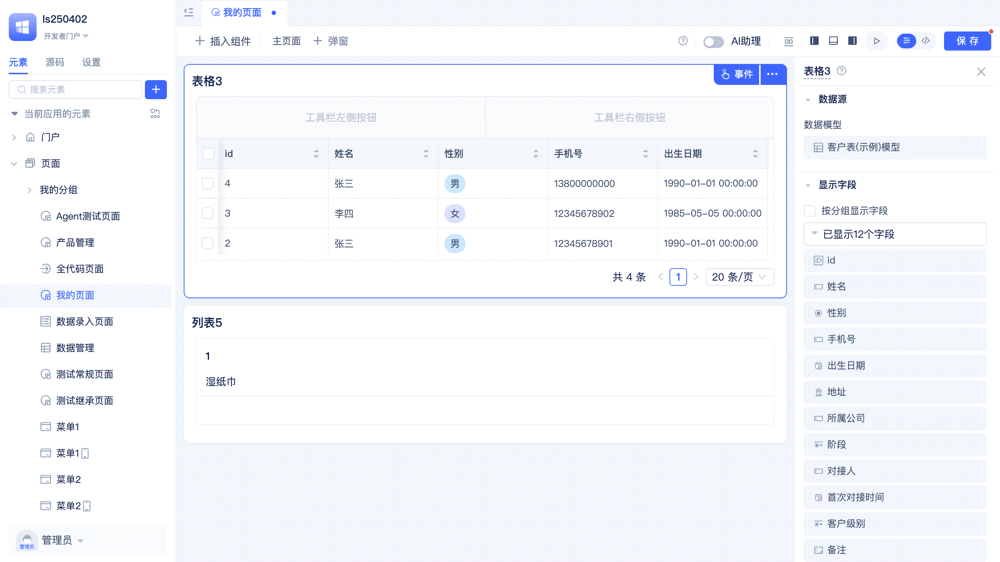

开发者在工具栏中打开事件面板，即可看到当前选中组件的可配置事件，例如表格的`点击行`和`选中行后`事件。在画布中点击其它组件或者在事件面板左侧的列表中切换其它组件，即可配置对应组件的事件逻辑。

开发者可以用可视化的方式编写事件逻辑，事件逻辑中支持使用基础语句、变量声明及赋值语句、循环遍历语句、条件判断语句、返回值、断点等语句。开发者可以对语句进行删除、复制、切换到源码模式编辑，且源码编辑和可视化编辑是双向同步的。

:::tip 插入断点进行调试
事件逻辑中支持插入断点，开发者可以在断点处暂停执行，并查看当前变量值、调用堆栈等信息，帮助开发者进行调试。
:::

## 组件通用操作
### 生成副本
如果页面中需要使用多个同类组件且配置较为雷同，则可以通过生成副本的方式快速添加组件。

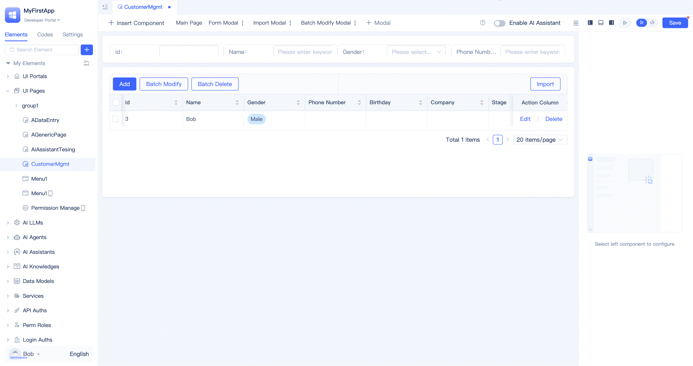

开发者点击组件右上角的`...`按钮，在弹出的菜单中点击`生成副本`按钮即可快速创建一个副本，副本组件的配置与原组件相同，开发者可以在副本上再进行个性化的修改。

:::tip
创建组件副本只会复制组件的配置，不会复制组件的事件逻辑。
:::

### 标题显隐
每个组件的标题可以单独设置为显示或隐藏。

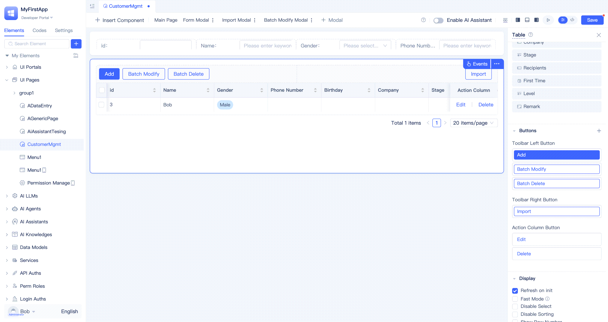

当标题被隐藏后，`隐藏标题`按钮会自动变为`显示标题`按钮，点击`显示标题`按钮即可恢复标题的显示。

### 自定义尺寸或自适应  {#custom-size-or-adaptive}
组件的尺寸大小不仅可以通过拖拽组件边缘的方式进行调整，也可以进行精确设置。

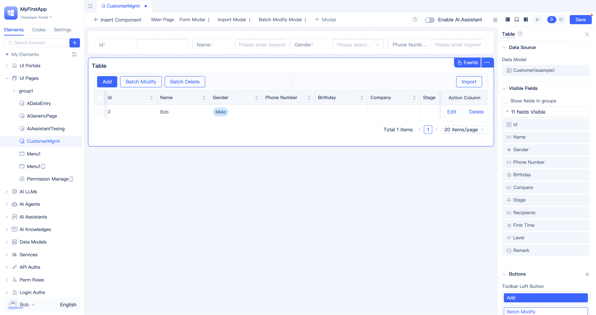

当选择按比例自适应时，组件会根据页面在浏览器中的显示宽度自动调整组件的宽度，保持组件的宽高比不变。当选择自定义尺寸时，开发者可以设置组件宽高的像素值。

### 复制和粘贴配置
当前页面中、当前应用跨不同页面以及不同应用跨页面存在两个或多个同类组件，而且有复用配置的需求，则可以使用复制配置和粘贴配置的方式快速复用。

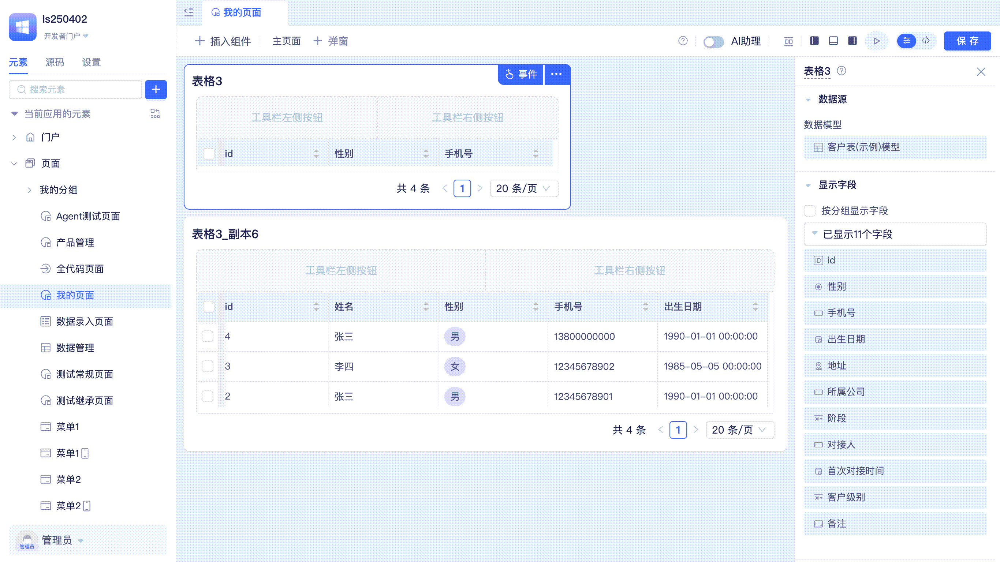

开发者点击组件右上角的`...`按钮，在弹出的菜单中点击`复制配置`按钮，然后点击另一个组件的`粘贴配置`按钮，即可完成复制。

:::tip 
和生成副本类似，复制和粘贴配置只会复制组件的配置，不会复制组件的事件逻辑。和生成副本不同的是，这种复用方式支持跨页面。
:::

### 移动到其它布局组件中
当页面中有弹窗、标签页、折叠面板这些布局组件时，开发者可以快速将其它组件移动到这些布局组件中。

开发者点击组件右上角的`...`按钮，在弹出的菜单中点击`移动`按钮，在弹窗中选择目标布局组件，即可完成移动。

### 从页面中删除
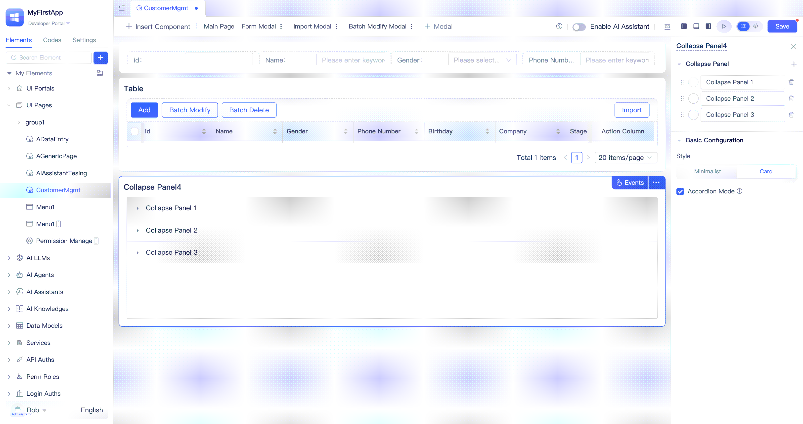

当页面中不再需要某个组件时，开发者点击组件右上角的`...`按钮，在弹出的菜单中点击`删除`按钮，即可从页面中移除组件。

## 页面变量 {#page-variables}
页面变量可以用于存储临时数据，函数逻辑中可以基于页面变量进行逻辑控制，页面自身的函数以及页面中其它组件的函数都可以访问当前页面的变量。

### 变量声明
开发者可以根据需要声明一个或多个页面变量，变量类型支持单行文本、多行文本、日期时间等全部JitAi[数据类型](../../../reference/framework/JitORM/data-types)。

开发者在画布顶部点击`主页面`按钮打开主页面的事件面板，并在事件面板左上角的列表中选择`页面变量`，在弹出的列表中以此点选`主页面`-`页面变量`，即可以可视化的方式声明变量。

在页面变量的配置界面，开发者可以点击`声明页面变量`按钮，在弹出的表单中填写变量名称、选择数据类型，点击`确定`即可完成变量声明。开发者也可以点击每个变量标题右侧的按钮，在弹窗中修改已有变量的名称以及参数配置。

不同数据类型的变量支持的配置参数也有所不同，例如Stext、Ltext等文本类型支持配置限制的字数。

### 从请求链接中获取页面变量值 {#page-variables}
JitAi支持从用户访问页面的请求链接中获取变量值。开发者在声明变量后，在`选择通过Url参数赋值的变量`下拉列表中选择对应的变量即可，支持多选。
## 页面函数 {#page-functions}
页面函数是开发者根据业务需要自行封装的程序逻辑，可以被页面中各类组件的函数、事件调用。

### 函数声明
开发者可以在事件面板中新建页面函数，并实现函数逻辑。

点击事件面板左上角的小箭头按钮，从列表中选择`页面函数`后点击`+ 新建函数`按钮，在弹窗中输入函数名称，点击`确定`即可创建一个页面函数。

:::tip
平台会根据开发者输入的中文函数名称自动生成英文名称，开发者也可以手动修改函数名称。
:::

页面函数创建后，开发者可以填写函数说明、设置参数列表、设置返回值类型，并通过可视化或切换到全代码模式编写函数逻辑。

### 函数重命名/生成副本/删除
对于已经创建的页面函数，可以对其进行重命名、生成副本、删除操作。重命名只能修改函数中文标题，修改函数英文名称则需要切换到全代码模式下进行修改。使用生成副本功能可以快速复用已有函数，并在副本上进行个性化修改。

开发者将鼠标放在每个页面函数标题右侧的按钮上，即可看到`重命名`、`生成副本`、`删除`三个操作按钮。

### 在页面函数中使用页面变量和调用其它函数 {#page-variables}
页面函数可以调用当前页面的其它页面函数，也可以访问页面变量。

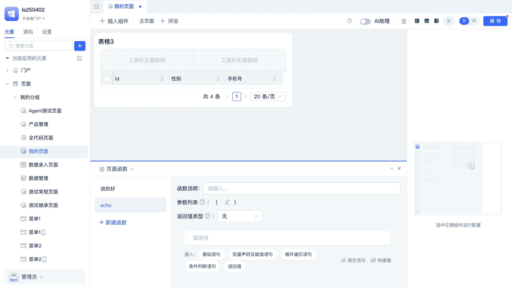

在上图示例中，`echo`函数调用了`说你好`函数，并将`变量1`页面变量的值作为入参传递给了`说你好`函数。

## 页面事件 {#page-events}
### 页面加载后
当一个页面完成加载时，会自动触发`页面加载后`事件，开发者可以利用这个事件在页面加载后执行一些初始化操作，例如获取页面变量值、调用页面函数、弹出一些提示信息等。

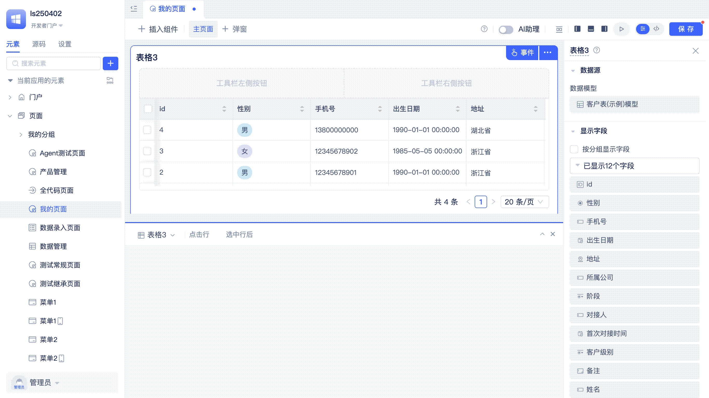

开发者在`主页面`事件面板的左上角切换到`页面事件`，即可在右侧看到当前页面的事件列表。点击`页面加载后`页签，即可在下方编辑`页面加载后`的事件逻辑。

### 页面聚焦后
当浏览器页签切换到当前页面以及平台导航页签切换到当前页面时，都会触发`页面聚焦后`事件。开发者可以利用这个事件在页面聚焦后执行一些操作。

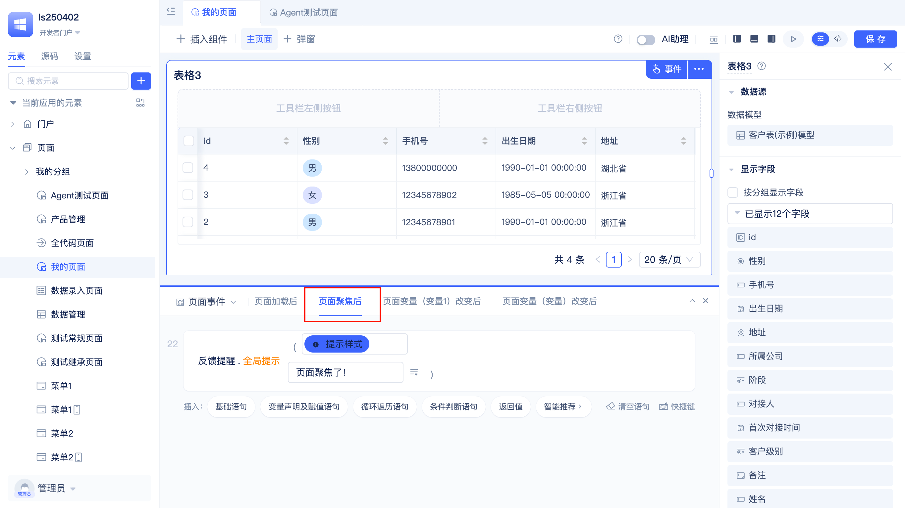

开发者在`主页面`事件面板的左上角切换到`页面事件`，即可在右侧看到当前页面的事件列表。点击`页面聚焦后`页签，即可在下方编辑`页面聚焦后`的事件逻辑。

### 页面变量值改变后 {#page-variables}
每个页面变量都会自动生成一个`变量值改变后`事件，当页面变量值改变时，会自动触发该事件。例如变量`访问类型`，对应生成的事件名称为`页面变量(访问类型)改变后`。

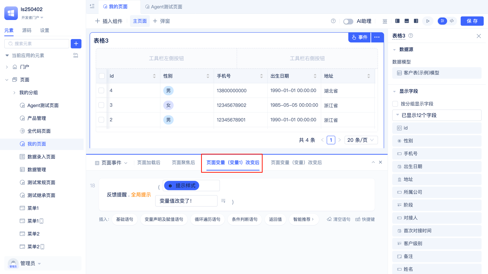

开发者可以在事件面板中编辑`页面变量(访问类型)改变后`的事件逻辑。

### 在事件逻辑中使用页面变量和函数 {#page-variables}
在事件逻辑中，开发者可以访问当前页面的页面变量和页面函数。

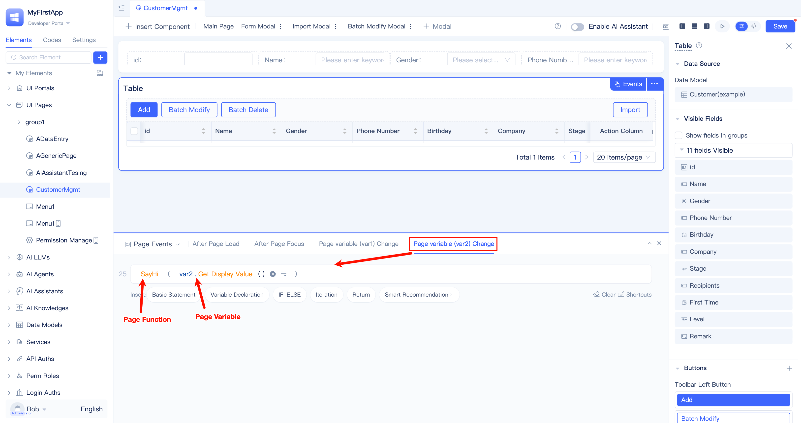

在上图示例中，`页面变量(访问类型)改变后`事件中调用了`sayHello`函数，并将`访问类型`页面变量的值作为入参传递给了`sayHello`函数。

## 函数编辑时的快捷操作
### 清空语句
当某个页面函数逻辑需要全部重写时，JitAi支持一键清空函数语句。

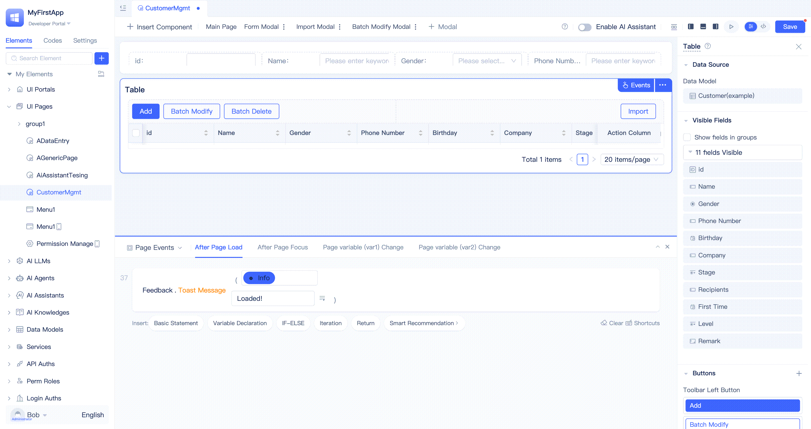

开发者可以点击函数编辑界面下方的`清空语句`按钮，并在弹出的提示框中点击`确定`即可清空当前函数中的所有语句。

使用快捷键`Ctrl/Command+Z`可以撤销清空操作。

### 复制语句
需要复用一条已存在的语句并进行修改时，可以使用复制语句功能。

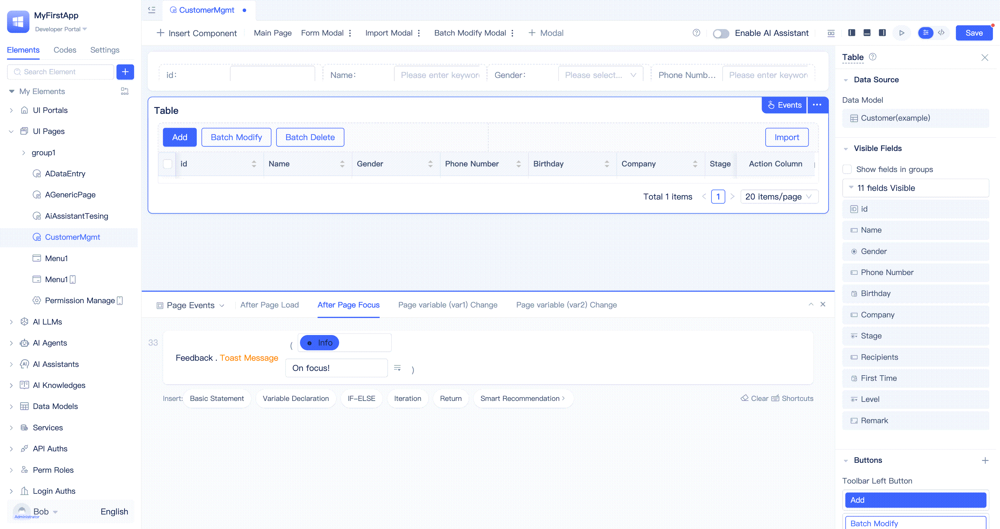

开发者点击语句右侧的复制按钮，就可以在当前语句下方复制出一条相同的语句，然后在新语句上进行修改。

### 拖拽语句调整其所在行
当需要快速调整多条语句的执行顺序时，可以使用拖拽的方式进行调整。

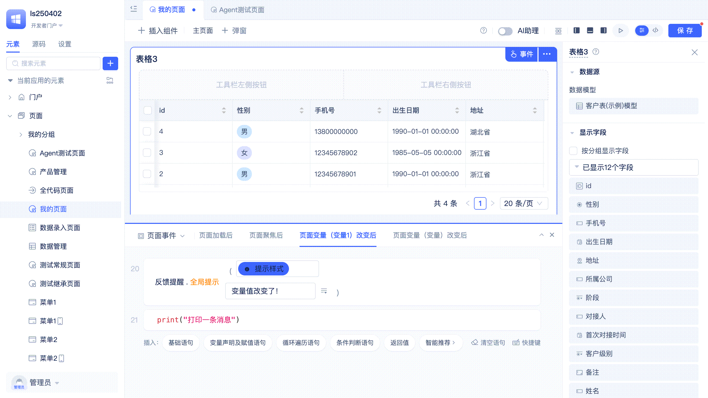

开发者将鼠标放在目标语句行上，当鼠标变成小手图案时，按住鼠标左键上下拖拽语句行，即可调整其所在行。

### 删除语句
当某条语句的逻辑不再被需要时，可以使用删除语句功能。

开发者点击语句右侧的删除按钮，即可删除当前语句。

### 切换到源码并定位到当前语句
通过可视化编辑器编辑函数逻辑的同时，平台会自动生成对应的源代码，开发者可以随时在可视化编辑器和源代码编辑器之间切换。

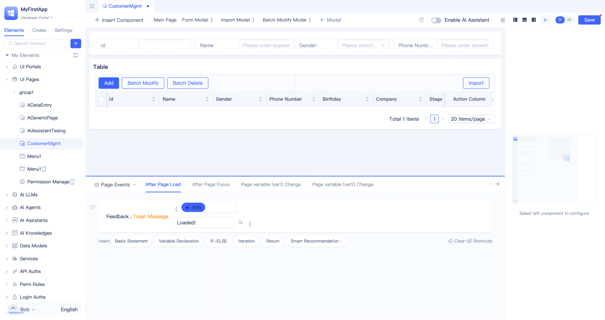

开发者点击语句右侧的`</>`按钮，即可切换到源代码模式，编辑器自动定位到当前语句。在源代码模式下，开发者可以随意修改函数逻辑，也可以随时点击右上角的切换按钮切换回可视化编辑模式。

### 快捷键
JitAi支持使用快捷键快速完成函数编辑，已支持的快捷键包括：全选（Ctrl/Command + A）、选中多条语句（Ctrl/Command + 选中语句）、复制（Ctrl/Command + C）、剪切（Ctrl/Command + X）、粘贴（Ctrl/Command + V）、生成副本（Ctrl/Command + D）、撤销（Ctrl/Command + Z）、重做（Ctrl/Command + Y）、删除（Delete）、快速添加基础语句（选中语句 + Enter）。

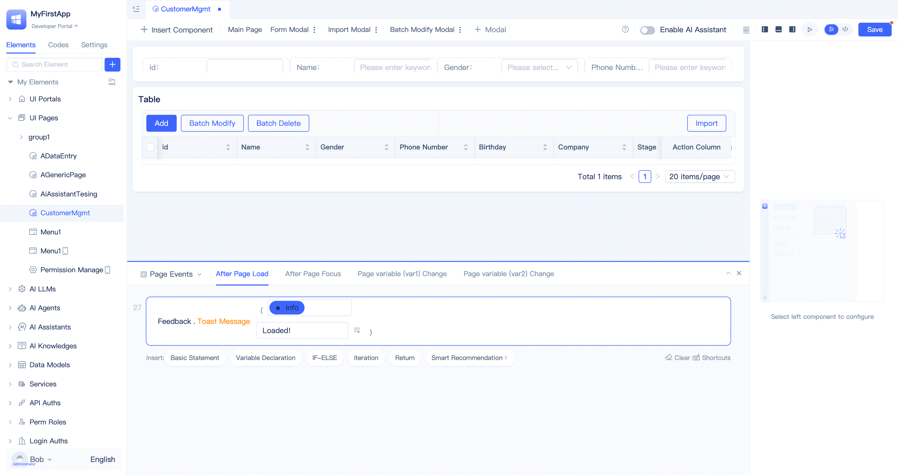

开发者在函数编辑界面中，将鼠标放在底部右侧的`快捷键`按钮上即可看到当前支持的快捷键说明。

## 在函数逻辑中调用前后端工具和服务
在前端页面函数、组件事件函数逻辑中，开发者可以直接调用后端模型的增删改查函数以及服务函数。开发者自定义的模型和服务函数以及从父应用继承而来的模型和服务函数，都可以被调用。

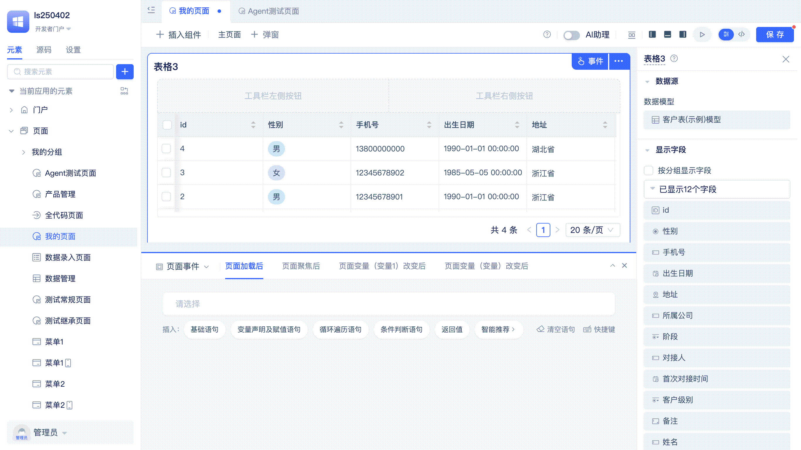

在上图的列表中可以看到变量、后端服务、后端数据模型、ai-assistant、页面函数、前端的反馈提醒/数据处理/工具函数/异常处理等多种可调用目标，开发者按需选择即可。

### 调用后端模型/服务
数据模型封装了对数据库表的增删改查，服务函数封装了自定义的业务逻辑，JitAi支持开发者以点选的方式完成后端接口调用，而不需要编写任何HTTP接口调用代码。

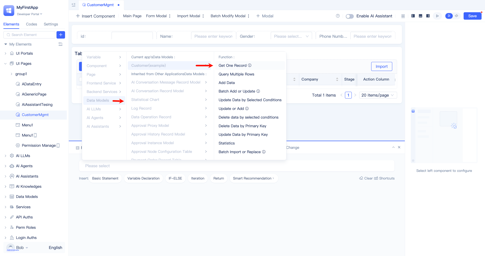

开发者点击`基于语句`按钮，在新插入的空白语句中中点击`请选择`文案，即可弹出可调用目标的列表。

以上图为例，依次选中`数据模型`-`部门模型`-`获取一条数据`即可完成查询一条部门数据的功能。

### 调用前端服务
在前端的业务功能开发中，开发者通常需要实现弹窗确认、反馈提醒、loading、消息提示(错误/警告/普通)、日志打印等常见功能，JitAi将这些功能内置到了前端服务中，开发者可以直接使用。

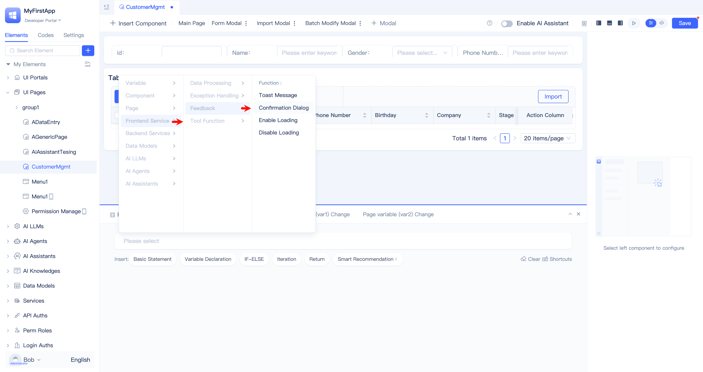

开发者点击`基于语句`按钮，在新插入的空白语句中中点击`请选择`文案，在弹出的列表中依次选中`反馈提醒`-`确认框`，平台会自动插入一条语句，在参数输入框内输入文案即可。

## 移动端页面编辑器
JitAi已经内置了对移动端的适配，可以在移动端页面编辑器中像开发PC端页面一样开发移动端页面。

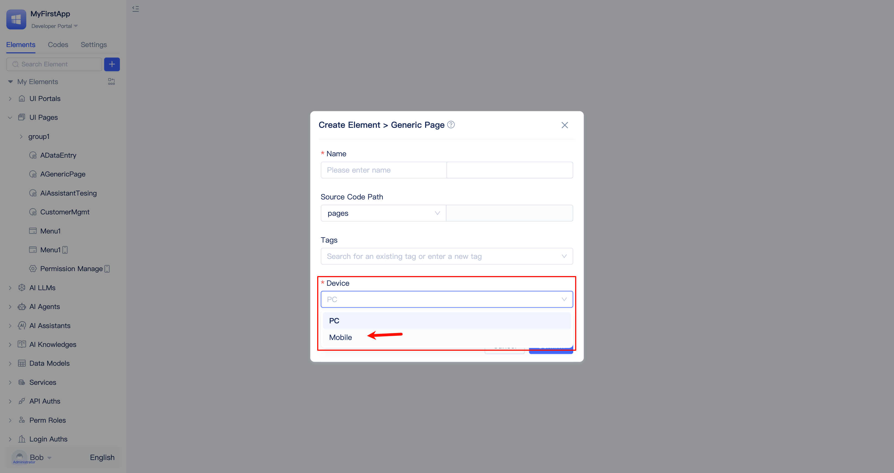

开发者在创建页面时可以选择页面的终端类型为`移动端`（默认是PC端）。

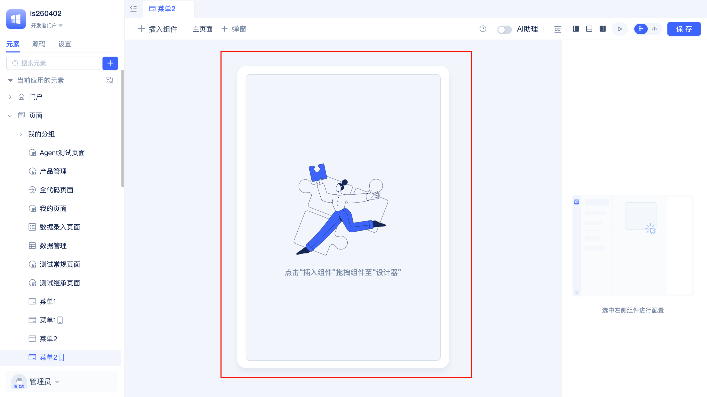

移动端页面编辑器和PC端页面编辑器在功能上没有区别，配置/事件/函数/页面变量等操作和PC端页面编辑器完全一致。

## 在页面中集成ai-assistant 
JitAi支持在页面中直接集成[ai-assistant](../../ai-assitant/create-ai-assistant)，用户在访问页面时可以与ai-assistant进行交互。

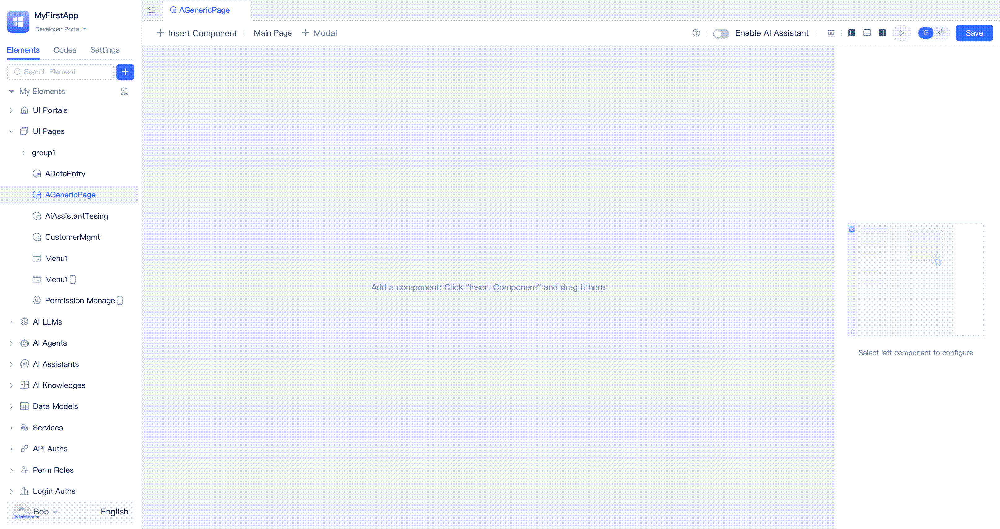

开发者在页面编辑器顶部打开`ai-assistant`开关，在弹出的列表中选择一个[ai-assistant](../../ai-assitant/create-ai-assistant)，即可在页面中集成ai-assistant。
