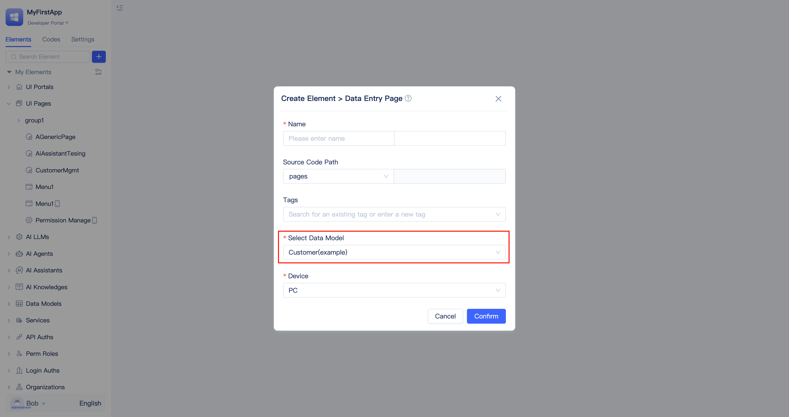

# Data Entry Pages
In business scenarios such as personnel registration, vehicle registration, and equipment registration, users need to fill out forms and submit data to the backend for processing. JitAi provides built-in data entry pages that help developers quickly implement form data collection functionality.

## Creating a data entry page {#creating-data-entry-page}
The process for creating data entry pages is essentially the same as [creating generic pages](/docs/devguide/shell-and-page/component-based-page-development#creating-generic-pages), except that data entry pages must be bound to a [data table model](/docs/devguide/data-modeling/data-table-model) to store user-submitted data.

When creating a page, developers can select `Data Entry Page` as the page type and choose the target [data table model](/docs/devguide/data-modeling/data-table-model) in the `Select Data Table` section. After clicking `Confirm`, the visual editor will open automatically.

## Configuring viewable and editable fields {#configuring-viewable-editable-fields}
When certain fields should not be exposed to users, developers can configure which fields are viewable. When fields should be visible but not editable, developers can configure which fields are editable.

In the page editor's `Visible` column, developers can uncheck fields that should not be exposed to users (e.g., ID fields). These fields will not appear in the user-facing entry form.

In the page editor's `Editable` column, developers can uncheck fields that users should not be able to edit. These fields will appear as read-only in the entry form.

## Showing enter again button after submission {#showing-enter-again-button-after-submission}
When users need to enter multiple records consecutively using the same form, developers can enable the `Show Enter Again Button` option to support this workflow.

Developers can check the `Show Enter Again Button` option during page development. This allows users to click the `Enter Again` button after each submission to return to the entry interface and fill in new data. This option is enabled by default.

## Showing result feedback after submission {#showing-result-feedback-after-submission}
After users complete a data submission, you can display a feedback interface to inform them of the submission result. This is a common interaction pattern that enhances user experience.

When developers check the `Show Result Feedback UI` option in the page editor, users will see a success confirmation interface after completing the form and clicking `Submit`. This option is enabled by default.

## Converting to generic page for modification {#converting-to-generic-page-for-modification}
Data entry pages are out-of-the-box page types provided by JitAi that developers can create and use immediately. When developers need more granular customization beyond the default implementation, they can convert the page to a generic page for unlimited modifications.

Developers can click the `Convert to Generic Page` button in the upper-right corner of the page editor to convert the page to a generic page. For generic page development methods, refer to [Component-based Page Development](/docs/devguide/shell-and-page/component-based-page-development).

:::warning
Once converted to a generic page, it cannot be reverted to the original `Data Entry Page` type.
:::
