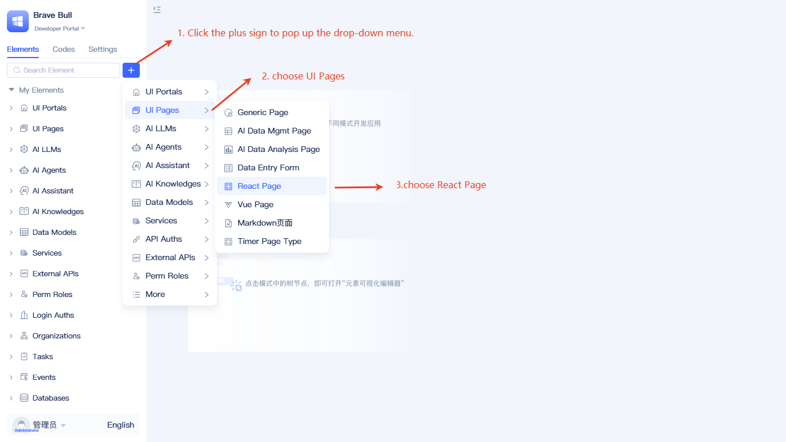
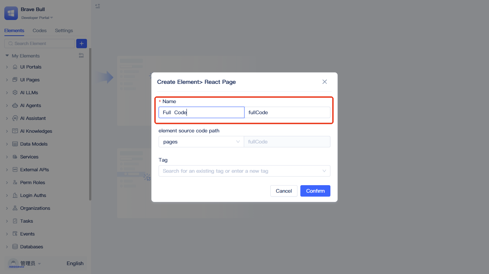
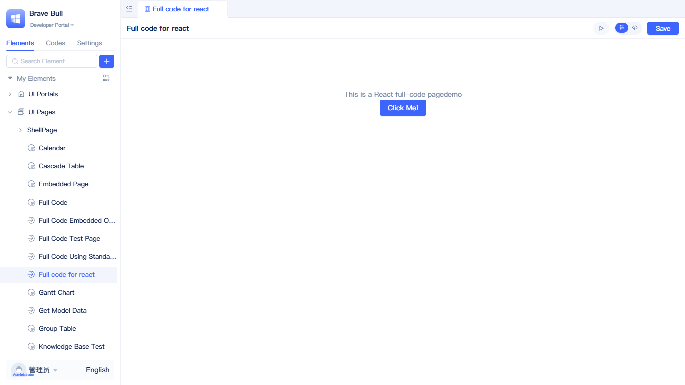
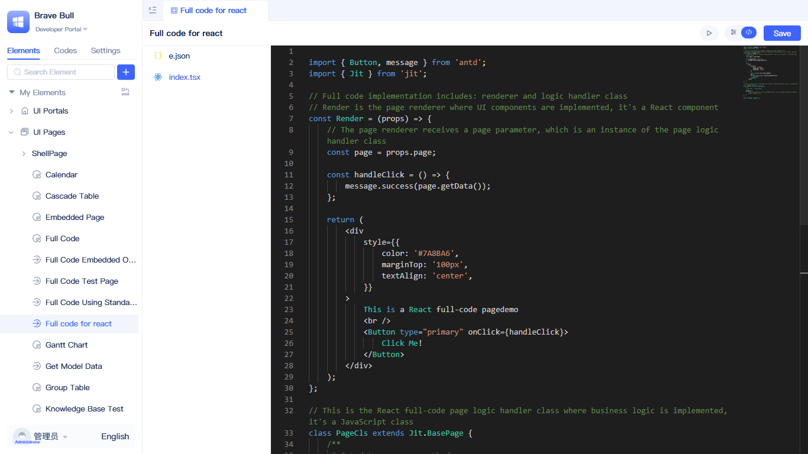
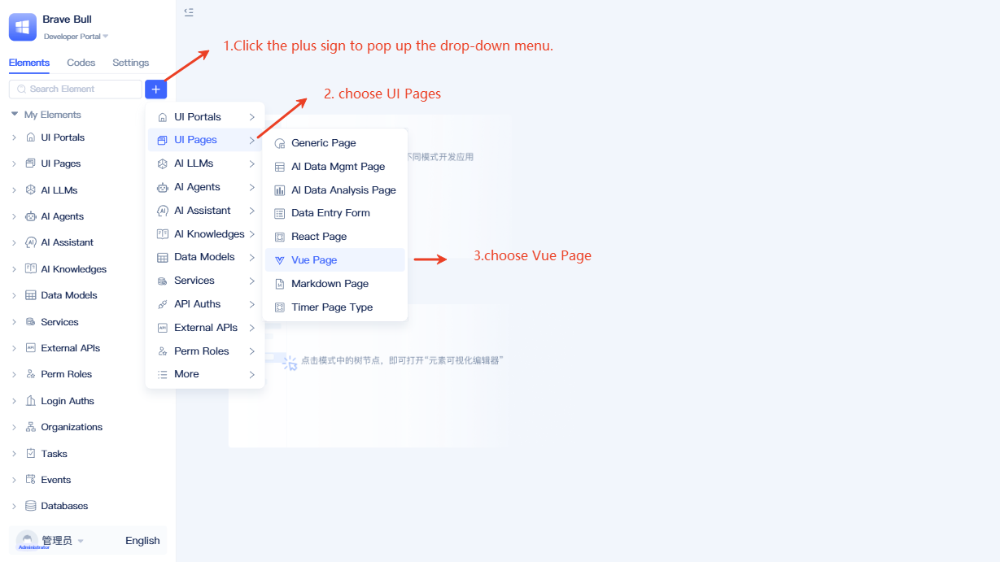
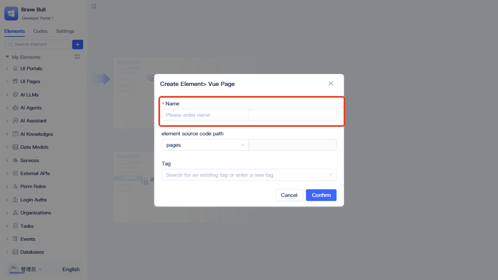
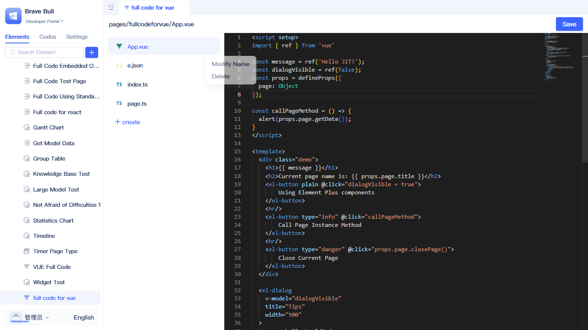

import Tabs from '@theme/Tabs';
import TabItem from '@theme/TabItem';

# Creating Full-Code Pages
In real business delivery scenarios, you often encounter complex interactions and highly personalized requirements where component behaviors are difficult to fully customize, dependencies and versions face constraints, existing frontend assets from teams are hard to reuse, and debugging along with performance optimization are frequently limited by framework boundaries. To address these pain points, we introduce full-code page capabilities that enable you to develop pages using native frontend approaches while seamlessly integrating with platform capabilities, thereby accelerating delivery. You can leverage familiar React or Vue to freely organize your code, control the technology stack through network imports or third-party dependency configuration, and directly utilize platform-provided data model read/write operations and backend service calls.

:::tip Developer Guide
This document introduces the creation process for full-code pages. For specific development techniques and usage methods, please refer to [Page Customization](../../frontend-ui-customization/page-customization.md).
:::

## Creating React full-code pages {#creating-react-full-code-pages}
The platform is built with React, enabling React full-code pages to achieve maximum integration with the platform.

Click the `+` button to the right of the search box in the element directory tree, then select `UI Pages` - `React Page`. A popup for creating a full-code page element will appear.

In the creation popup, you only need to fill in the `Name` field, then click `Confirm` to complete the creation process.

After creation, it will be displayed in the left element tree. The default full-code page includes a clickable button that displays `so cool!!!` when clicked. The initial files are shown below:

Two files are generated by default: an `index.tsx` and an `e.json`. The `e.json` file contains the page element definition; focus on the `index.tsx` file. The `index.tsx` exports two core modules: the Render function (the main rendering function for the current full-code page) and PageCls (a page class that inherits from `BasePage`). PageCls is instantiated by the system before page rendering and passed into the Render props.

## Creating Vue full-code pages {#creating-vue-full-code-pages}
For developers unfamiliar with React, the platform also provides Vue full-code pages.

Click the `+` button to the right of the search box in the element directory tree, then select `UI Page` - `Vue Page`. A popup for creating a Vue page element will appear.

In the creation popup, you only need to fill in the `Name` field, then click `Confirm` to complete the creation process.

After creation, it will be displayed in the left element tree. The default Vue full-code page demonstrates the usage of Element Plus UI components, featuring three functional buttons: open dialog to display Element Plus components, call page instance methods, and close the current page, showcasing the basic interactive capabilities of Vue full-code pages.

:::tip Recommendation
After creating a full-code page, refer to [Page Customization](../../frontend-ui-customization/page-customization.md) to learn detailed development methods, including style usage, component calls, data model operations, and more.
:::
