# Creating Generic Pages {#creating-generic-pages}

Generic pages are the most widely used page type in page development. Developers add components to blank pages as needed to create page layouts, and configure components and write event logic. This article uses generic pages to demonstrate **how to perform componentized page development**.

To create a page, developers locate `UI Pages` in the element directory tree, click `+` and select `Generic Page`, fill in the page name in the popup form, and click `Confirm` to complete page creation and automatically enter the [Visual Page Editor](#visual-page-editor).

## Page inheritance {#page-inheritance}
To reuse an existing page, developers can select the page to inherit in the advanced configuration while filling in the page name.

The new page will inherit all component configurations from the parent page (excluding event logic), and developers can modify these configurations in the new page.

## Visual page editor {#visual-page-editor}
JitAi provides a visual drag-and-drop page editor for page elements. Developers can drag functional components onto the canvas within the page editor and configure components while writing event logic.

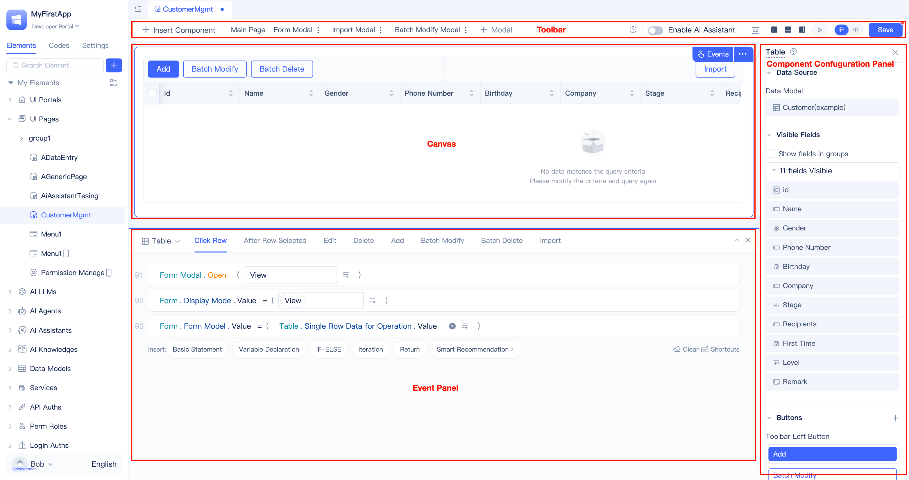

The page editor layout consists of four main areas: toolbar, canvas, component configuration panel, and event panel.

The JitAi development framework provides a comprehensive component library. Each component has distinct configuration options and events. Developers can refer to [Using Functional Components in Pages](/docs/devguide/using-functional-components-in-pages) to understand the detailed usage of each component.

## Integrating AI assistant in pages {#integrating-ai-assistants-in-pages}
Pages support AI assistant integration, providing intelligent dialogue and auxiliary functions to enhance user experience.

### Toolbar {#toolbar}
The toolbar serves as the quick operations area within the page editor. Developers can use toolbar buttons to add components, switch between compact/loose page modes, enable AI assistants, toggle the element directory tree, toggle the event panel, toggle the component configuration area, preview pages, switch between visual and source code modes, and save page modifications.

:::tip Real-time preview
During development, developers can click the preview button in the toolbar at any time to preview page effects in real-time.
:::

### Canvas {#canvas}
Developers create page layouts by dragging components onto the canvas.

To add components, developers click the `+ Insert Component` button on the leftmost side of the toolbar, locate the required component in the popup window (search supported), and drag the component to the canvas while holding the left mouse button. The canvas can accommodate multiple components, and both component positions and sizes can be adjusted through dragging.

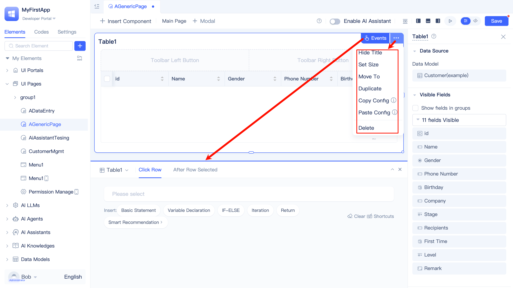

Each component features an `Events` button and a `...` button in the upper right corner. The `Events` button displays the current component's events in the event panel, while the `...` button opens the component's context menu with options including hide title, set size, move, generate copy, copy configuration, paste configuration, and delete.

### Component configuration area {#component-configuration-area}
The component configuration area allows developers to configure component display title, properties, styles, rules, buttons, and other settings.

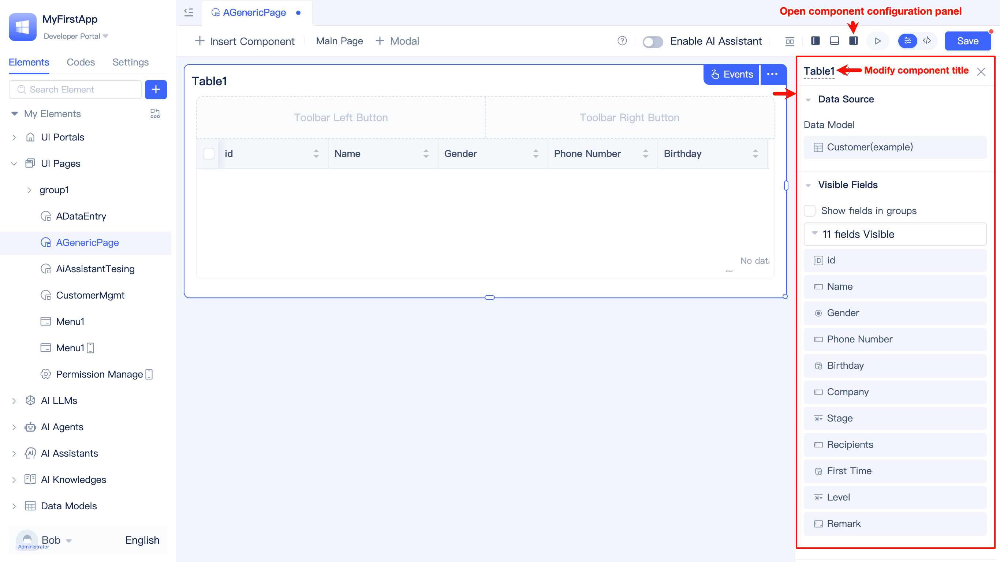

When developers open component configuration in the toolbar, they can view the configuration options for the currently selected component, such as a table's `Data Source`, `Visible Fields`, `Buttons` and more. Clicking other components in the canvas switches to the corresponding component's configuration area.

### Event panel {#event-panel}
The event panel serves as the dedicated area within the page editor for writing component event logic.

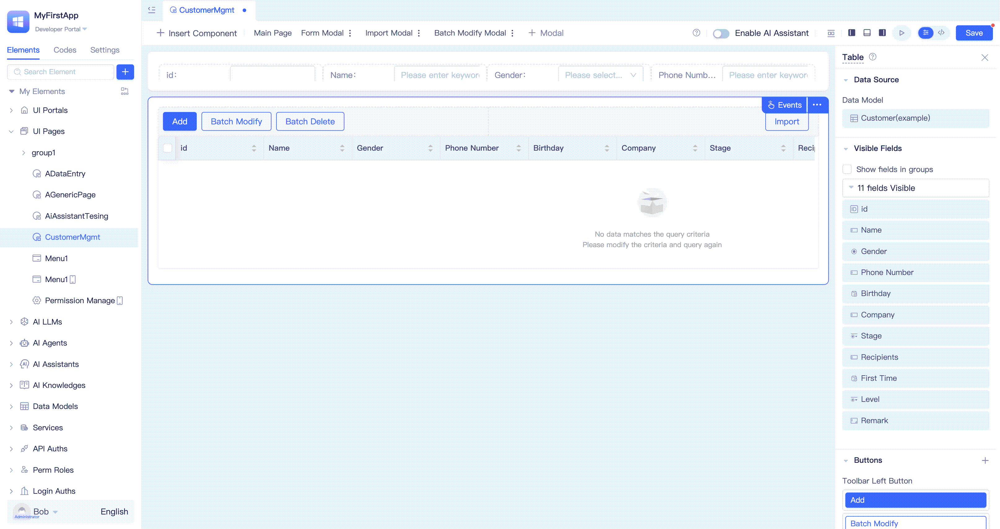

When developers open the event panel through the toolbar, they can view the configurable events for the currently selected component, such as a table's `Click Row` and `After Row Selected` events. Clicking other components in the canvas or selecting components from the list on the left side of the event panel enables configuration of the corresponding component's event logic.

Developers can write event logic visually. Event logic supports basic statements, variable declaration and assignment statements, loop iteration statements, conditional statements, return values, breakpoints, and other statement types. Developers can delete, copy, and switch to source code mode for editing statements, with bidirectional synchronization between source code and visual editing modes.

:::tip Inserting breakpoints for debugging
Event logic supports breakpoint insertion. Developers can pause execution at breakpoints and examine current variable values, call stacks, and other debugging information.
:::

## Component common operations {#component-common-operations}
### Duplicating components {#duplicating-components}
When a page requires multiple components of the same type with similar configurations, components can be quickly added by duplicating existing ones.

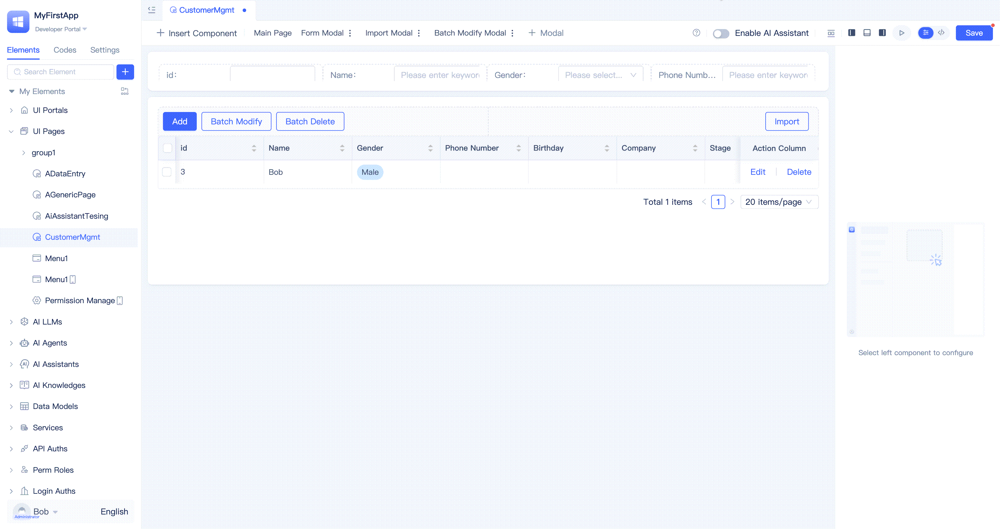

Developers click the `...` button in the upper right corner of the component and select `Duplicate` from the popup menu to quickly duplicate the component. The duplicated component inherits the same configuration as the original component, allowing developers to make personalized modifications.

:::tip
Duplicating components only copies the component's configuration, not its event logic.
:::

### Title visibility {#title-visibility}
Each component's title can be individually configured to show or hide.

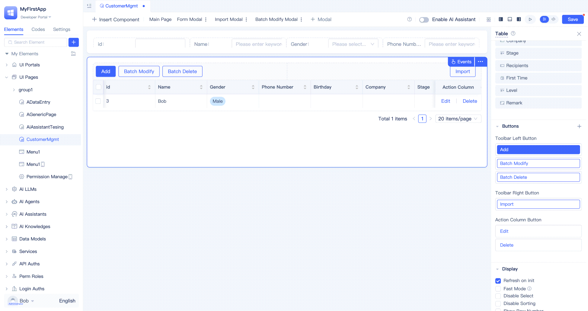

When a title is hidden, the `Hide Title` button automatically changes to `Show Title`. Clicking the `Show Title` button restores the title display.

### Custom sizing and adaptive layout {#custom-sizing-adaptive-layout}
Component sizes can be adjusted through both edge dragging and precise configuration settings.

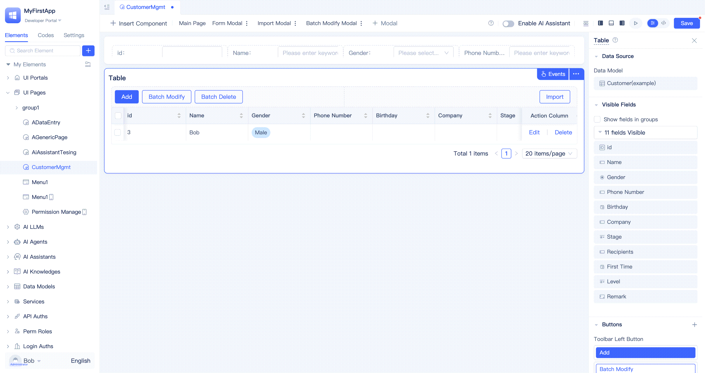

With proportional adaptation selected, components automatically adjust their width based on the browser's page display width while maintaining the original aspect ratio. When custom sizing is selected, developers can specify exact pixel values for component width and height.

### Copying and pasting configurations {#copying-pasting-configurations}
When working with two or more components of the same type—whether within the current page, across different pages in the same application, or across pages in different applications—configuration copying and pasting enables quick reuse.

Developers click the `...` button in the upper right corner of the source component, select `Copy Config` from the popup menu, then click the `Paste Config` button on the target component to complete the transfer.

:::tip 
Like duplicating components, copying and pasting configurations only transfers the component's configuration, not its event logic. Unlike duplicating components, this method supports cross-page operations.
:::

### Moving to layout components {#moving-to-layout-components}
When layout components such as modals, tabs, and collapse panels exist on the page, developers can quickly move other components into these layout containers.

Developers click the `...` button in the upper right corner of the component, select `Move To` from the popup menu, choose the target layout component in the dialog, and complete the move operation.

### Deleting from page {#deleting-from-page}
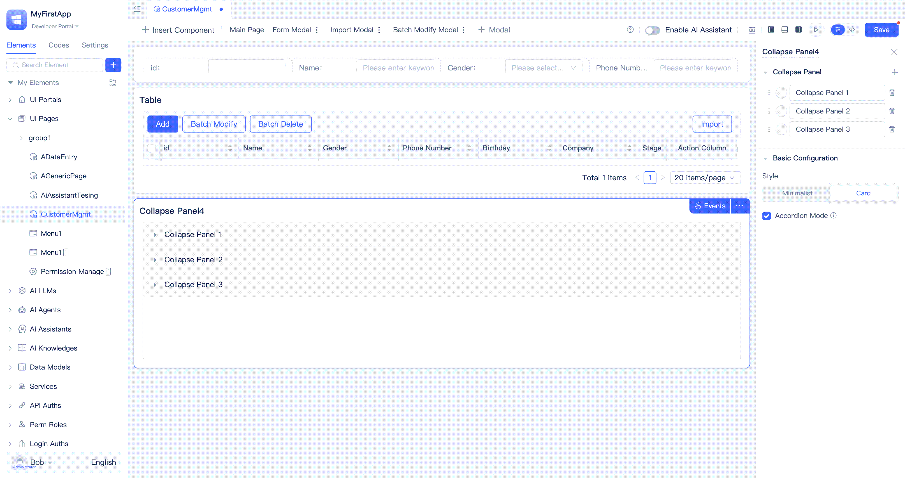

When a component is no longer needed on the page, developers click the `...` button in the upper right corner of the component, select `Delete` from the popup menu, and remove the component from the page.

## Page variables {#page-variables}
Page variables store temporary data and enable logic control within function implementations. Both the page's own functions and functions from other page components can access the current page's variables.

### Variable declaration {#variable-declaration}
Developers can declare one or more page variables as needed. Variable types support all JitAi [data types](/docs/reference/framework/JitORM/data-types), including single-line text, multi-line text, date and time, and more.

To declare variables, developers click the `Main Page` button at the top of the canvas to open the main page's event panel, select `Page Variables` from the list in the upper left corner of the event panel, and click `Main Page` - `Page Variables` in the popup list to access the visual variable declaration interface.

In the page variable configuration interface, developers can click the `Declare Page Variable` button, select the data type to complete the declaration. Developers can also click the button beside each variable title to modify existing variable names and parameter configurations.

Different variable data types support distinct configuration parameters. For example, text types like Stext and Ltext support character limit configuration.

### Getting variable values from request URLs {#getting-variables-from-urls}
JitAi supports extracting variable values from request URLs when users access pages. After declaring variables, developers can select the corresponding variables in the `Select variables assigned via URL parameters` dropdown list, with support for multiple selections.
## Page functions {#page-functions}
Page functions are custom program logic encapsulated by developers according to business requirements. These functions can be invoked by various component functions and events within the page.

### Function declaration {#function-declaration}
Developers can create new page functions within the event panel and implement their logic.

To create a function, click the small arrow button in the upper left corner of the event panel, select `Page Functions` from the list, then click the `+ Create Function` button, enter the function name in the popup dialog, and click `Confirm` to create the page function.

:::tip
The platform automatically generates English names based on Chinese function names entered by developers, though developers can manually modify these names.
:::

After creating a page function, developers can add function descriptions, configure parameter lists, set return value types, and implement function logic through either visual editing or full-code mode.

### Function management operations {#function-management-operations}
Existing page functions support rename, duplicate, and delete operations.The duplicate function enables quick reuse of existing functions with personalized modifications.

Developers can hover over the button on the right side of each page function title to reveal three operation buttons: `Edit`, `Duplicate`, and `Delete`.

### Using page variables and calling functions {#using-page-variables-calling-functions}
Page functions can invoke other page functions within the current page and access page variables.

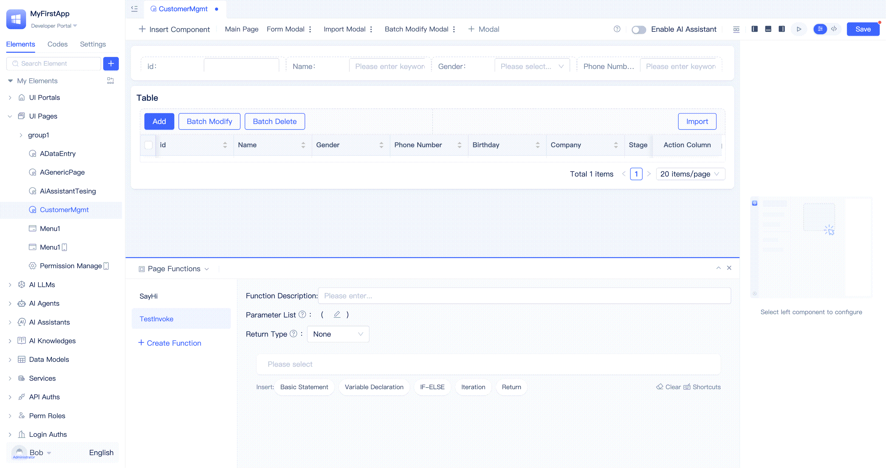

In the example above, the `TestInvoke` function calls the `SayHi` function and passes the value of the `Var1` page variable as an input parameter to the `SayHi` function.

## Page events {#page-events}
### After page load {#after-page-load}
When a page completes loading, the `After Page Load` event triggers automatically. Developers can use this event to perform initialization operations after page loading, such as retrieving page variable values, calling page functions, displaying prompt information, and more.

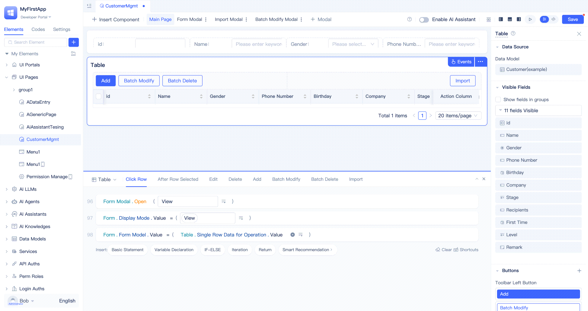

Developers switch to `Page Events` in the upper left corner of the `Main Page` event panel to view the current page's event list on the right side. Click the `After Page Load` tab to edit the `After Page Load` event logic below.

### After page focus {#after-page-focus}
When browser tabs switch to the current page or platform navigation tabs switch to the current page, the `After Page Focus` event triggers. Developers can use this event to perform operations after the page gains focus.

Developers switch to `Page Events` in the upper left corner of the `Main Page` event panel to view the current page's event list on the right side. Click the `After Page Focus` tab to edit the `After Page Focus` event logic below.

### On page variable change {#on-page-variable-change}
Each page variable automatically generates an `On Page Variable Change` event. When a page variable value changes, this event triggers automatically. For example, the variable `var1` generates the corresponding event `On Page Variable (var1) Change`.

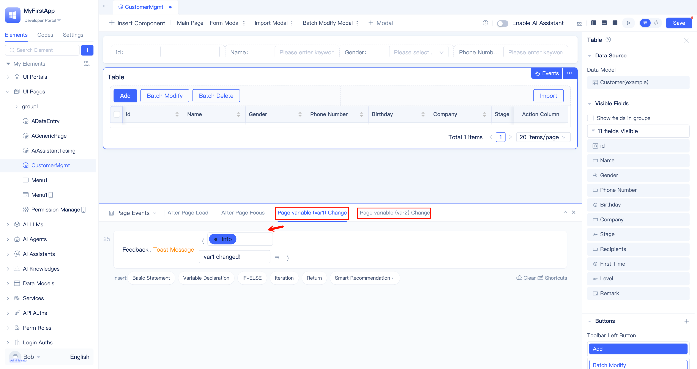

Developers can edit the `On Page Variable (var1) Change` event logic within the event panel.

### Using page variables and functions in event logic {#using-page-variables-functions-in-event-logic}
Within event logic, developers can access the current page's variables and functions.

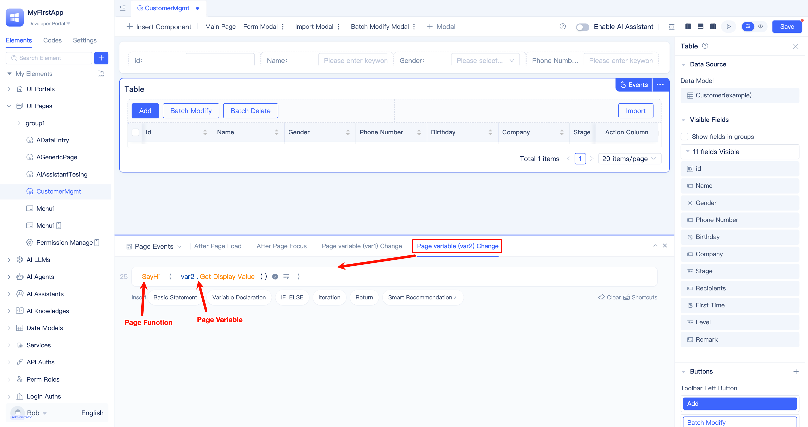

In the example above, the `On Page Variable (var2) Change` event calls the `SayHi` function and passes the `var2` page variable value as an input parameter to the `SayHi` function.

## Shortcuts {#shortcuts}
### Clearing statements {#clearing-statements}
When page function logic requires complete rewriting, JitAi supports one-click clearing of function statements.

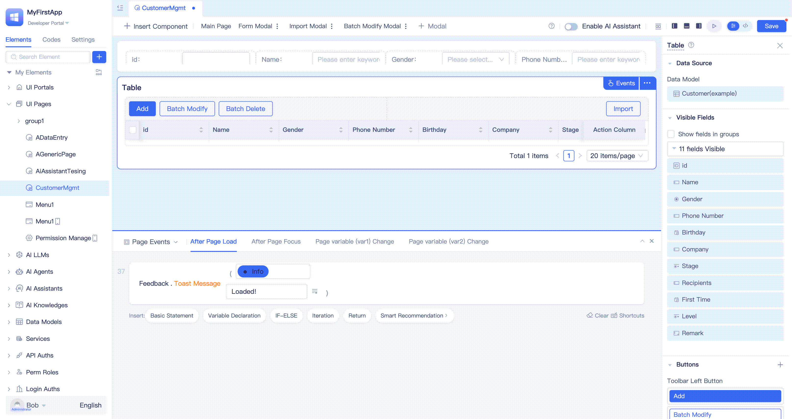

Developers can click the `Clear` button at the bottom of the function editing interface and click `Confirm` in the popup prompt to clear all statements in the current function.

The shortcut key `Ctrl/Command+Z` can undo the clear operation.

### Duplicating statements {#duplicating-statements}
When reusing and modifying an existing statement, developers can use the duplicate statement function.

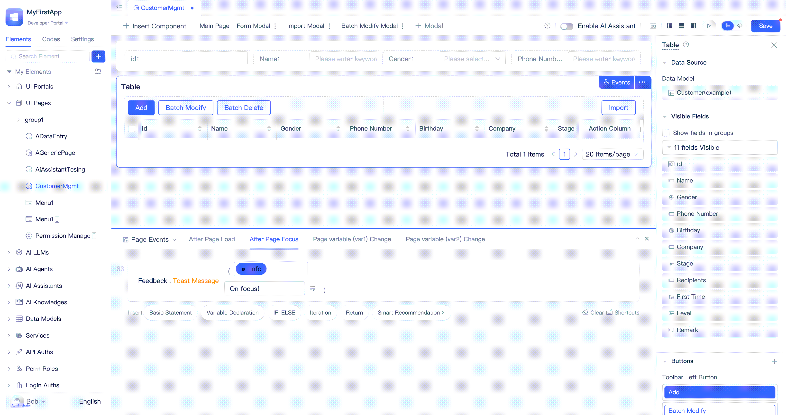

Developers click the duplicate button on the right side of the statement to create an identical statement below the current one, then modify the new statement as needed.

### Dragging statements to adjust position {#dragging-statements-to-adjust-position}
To quickly adjust the execution order of multiple statements, developers can use drag-and-drop repositioning.

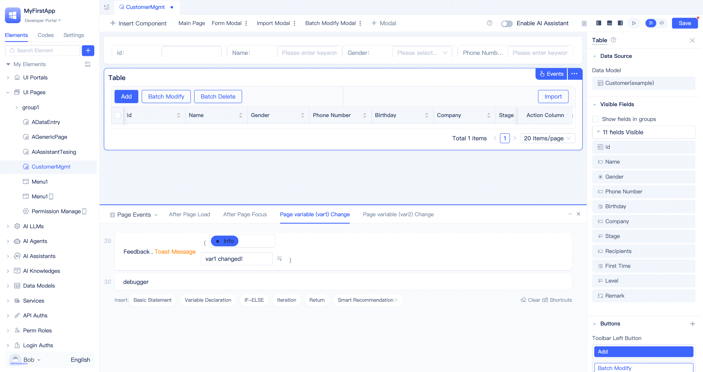

Developers position the mouse on the target statement line, and when the cursor changes to a hand icon, hold down the left mouse button and drag the statement line up or down to adjust its position.

### Deleting statements {#deleting-statements}
When a statement's logic is no longer needed, developers can use the delete statement function.

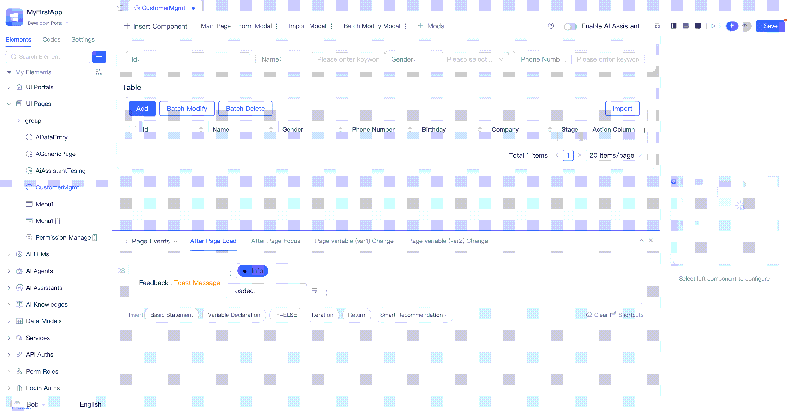

Developers click the delete button on the right side of the statement to remove the current statement.

### Switching to source code and locating statements {#switching-to-source-code-locating-statements}
While editing function logic through the visual editor, the platform automatically generates corresponding source code. Developers can switch between visual and source code editors at any time.

Developers click the `</>` button on the right side of the statement to switch to source code mode, with the editor automatically locating the current statement. In source code mode, developers can freely modify function logic and click the switch button in the upper right corner to return to visual editing mode.

### Keyboard shortcuts {#keyboard-shortcuts}
JitAi supports keyboard shortcuts for efficient function editing. Available shortcuts include: Select All (Ctrl/Command + A), Select Multiple Statements (Ctrl/Command + Select Statement), Copy (Ctrl/Command + C), Cut (Ctrl/Command + X), Paste (Ctrl/Command + V), Duplicate (Ctrl/Command + D), Undo (Ctrl/Command + Z), Redo (Ctrl/Command + Y), Delete (Delete), and Quick Add Basic Statement (Select Statement + Enter).

In the function editing interface, developers can hover over the `Shortcuts` button at the bottom right to view currently supported shortcut key descriptions.

## Calling frontend and backend tools and services {#calling-frontend-backend-tools-services}
Within frontend page functions and component event function logic, developers can directly invoke backend model CRUD functions and service functions. Both developer-defined functions and functions inherited from parent applications are available for invocation.

The list above displays various callable targets including variables, backend services, backend data models, AI assistants, page functions, and frontend utilities for feedback reminders, data processing, utility functions, and exception handling. Developers can select targets according to their needs.

### Calling backend models and services {#calling-backend-models-services}
Data models encapsulate CRUD operations on database tables, while service functions encapsulate custom business logic. JitAi enables developers to complete backend interface calls through point-and-click selection without writing HTTP interface call code.

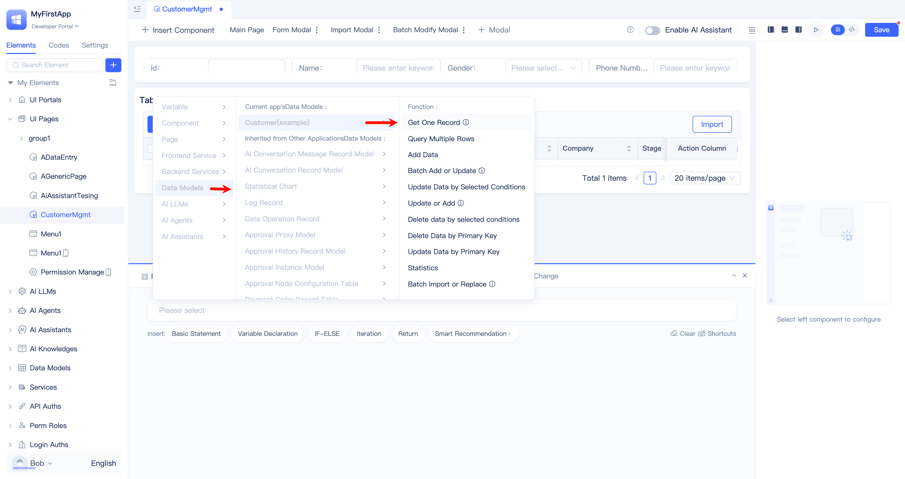

Developers click the `Basic Statement` button, then click the `Please select` text in the newly inserted blank statement to display a list of callable targets.

Using the example above, sequentially selecting `Data Models` - `Customer(example)` - `Get One Record` completes the functionality for querying a single department data record.

### Calling frontend services {#calling-frontend-services}
In frontend business function development, developers typically need common functionality such as popup confirmations, feedback reminders, loading indicators, message prompts (error/warning/normal), and log printing. JitAi provides these functions as built-in frontend services for direct use.

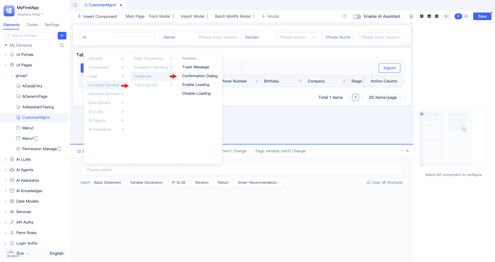

Developers click the `Basic Statement` button, click the `Please select` text in the newly inserted blank statement, sequentially select `Feedback` - `Confirmation Dialog` from the popup list, and the platform automatically inserts a statement. Developers then enter the desired text in the parameter input box.

## Mobile page editor {#mobile-page-editor}
JitAi includes built-in mobile adaptation capabilities, enabling mobile page development in the mobile page editor with the same ease as PC page development.

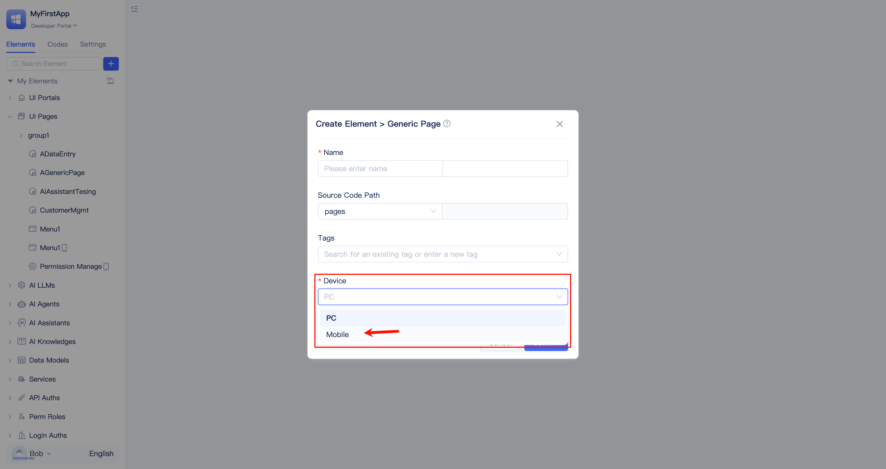

Developers can select `Mobile` as the page terminal type when creating pages (PC is the default).

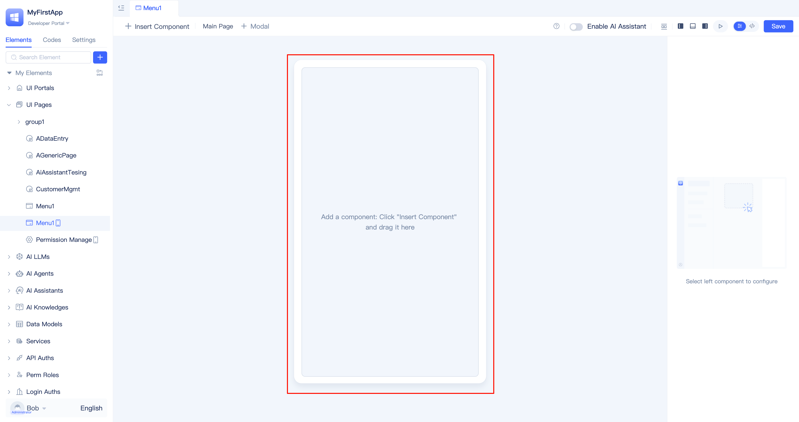

The mobile page editor maintains functional parity with the PC page editor. Configuration, events, functions, page variables, and other operations remain completely consistent between mobile and PC page editors.

## Enabling AI assistant for page {#enabling-ai-assistant}
JitAi supports direct integration of [AI Assistants](/docs/devguide/ai-assistant/create-ai-assistant) within pages, enabling user interaction with AI assistants when accessing pages.

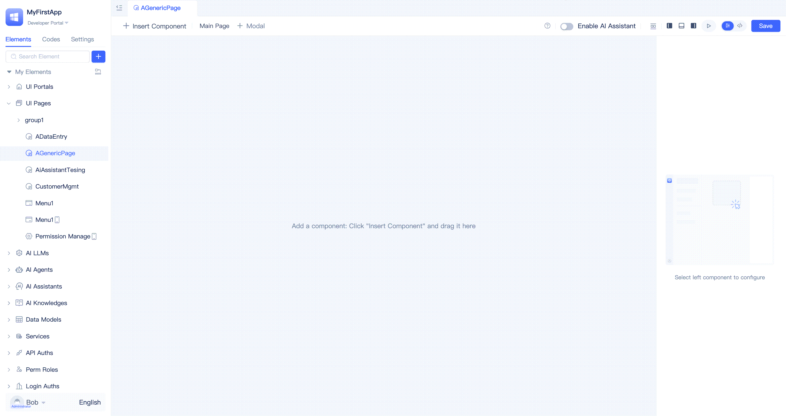

Developers enable the `AI Assistant` at the top of the page editor, select an [AI Assistant](/docs/devguide/ai-assistant/create-ai-assistant) from the popup list, and enable the AI assistant for the page.
