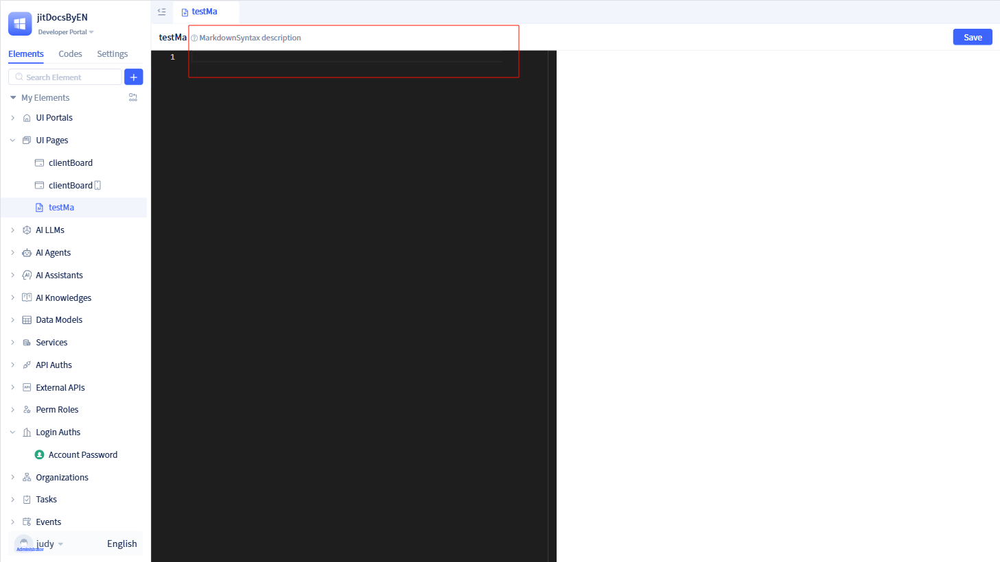

# Markdown Pages
In enterprise application systems, when developers want to create plain text pages such as help documentation, announcements, agreements, etc., they can choose to use Markdown syntax for writing.

JitAi provides Markdown page development functionality, allowing developers to create Markdown pages in the JitAi development tools and write page content using Markdown syntax.

## Creating Markdown Pages {#create-markdown-page}


Developers can select the page type as `markdown-page` when creating a page, which will open the Markdown creation popup.

:::warning Note
After developers fill in the page name in the creation popup and click `OK`, a Markdown page is created.

Developers can choose to import Markdown files from external sources into the system, but the imported file size cannot exceed 2M.
:::

After creating through the creation popup, developers enter the visual editor.



The visual editor is divided into two parts: the left side is the editing area, and the right side is the preview area. After users make edits, they can view the effects in the right preview area.

:::warning Note
If users want to display Markdown pages in the usage area, they need to bind the created Markdown page to a menu under the SSR portal.
:::

## Markdown Syntax {#markdown-syntax}
JitAi integrates common Markdown syntax, allowing developers to write Markdown pages in the visual editor.

Common Markdown syntax includes:

### Headers
```markdown
# First Level Header
## Second Level Header
### Third Level Header
#### Fourth Level Header
##### Fifth Level Header
###### Sixth Level Header
```

### Text Formatting
```markdown
**Bold text**
_Italic text_
~~Strikethrough text~~
`Inline code`
```

Effect:

-   **Bold text**
-   _Italic text_
-   ~~Strikethrough text~~
-   `Inline code`

### Lists
#### Unordered Lists
```markdown
-   Item one
-   Item two
    -   Sub-item one
    -   Sub-item two
-   Item three
```

#### Ordered Lists
```markdown
1. First item
2. Second item
    1. Sub-item one
    2. Sub-item two
3. Third item
```

### Links and Images
```markdown
[Link text](http://example.com)
[Link with title](http://example.com "Link title")


```

### Code Blocks
````markdown
```javascript
function hello() {
    console.log("Hello World!");
}
```
````

### Tables
```markdown
| Column 1 | Column 2 | Column 3 |
| -------- | -------- | -------- |
| Content 1| Content 2| Content 3|
| Content 4| Content 5| Content 6|
```

Effect:
| Column 1 | Column 2 | Column 3 |
|----------|----------|----------|
| Content 1| Content 2| Content 3|
| Content 4| Content 5| Content 6|

### Blockquotes
```markdown
> This is a blockquote
>
> Supports multi-line quotes
>
> > Nested quotes
```

Effect:

> This is a blockquote
>
> Supports multi-line quotes
>
> > Nested quotes

### Horizontal Rules
```markdown
---
or
---

or

---
```

### Task Lists
```markdown
-   [x] Completed task
-   [ ] Incomplete task
-   [ ] Another incomplete task
```

Effect:

-   [x] Completed task
-   [ ] Incomplete task
-   [ ] Another incomplete task

### Escape Characters
If you need to display special characters, you can use backslashes for escaping:

```markdown
\* Display asterisk instead of italic
\# Display hash instead of header
\` Display backtick instead of code
```

:::tip Tip
In JitAi's Markdown editor, you can preview effects in real-time. It's recommended to refer to the preview area on the right while writing to ensure correct formatting.
:::
