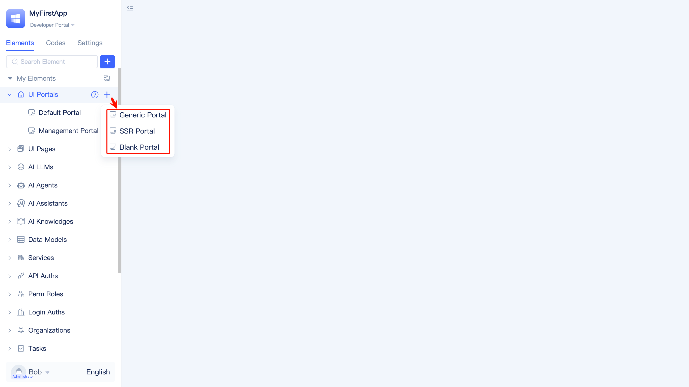
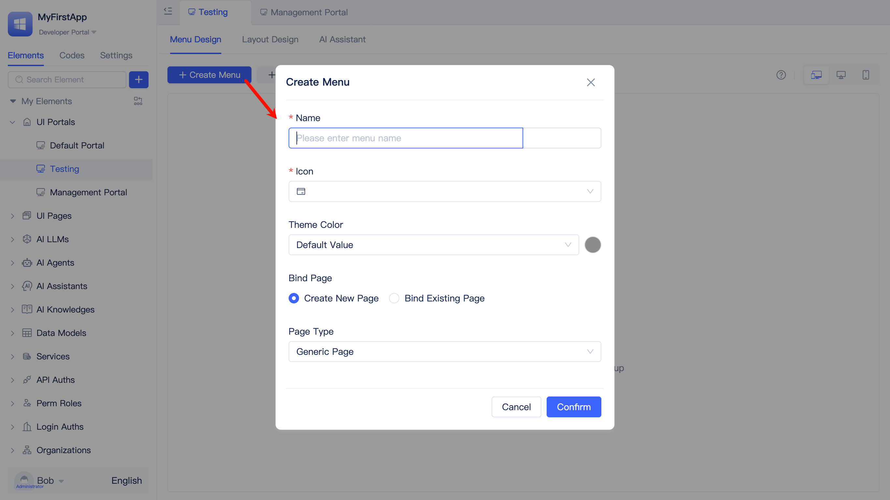

# Creating Portals
In enterprise applications, users with different application roles typically see different system function entries based on their permissions or business scope responsibilities. JitAi uses portals to implement this differentiation, where users with different application roles see different portal lists, and each portal contains different navigation menus.

After logging into the system, users can see the list of portals they can access on the portal selection page. After selecting a portal, they can enter it and access the functions within the portal.

## Application Built-in Three Portals {#application-built-in-three-portals}
JitAi creates three built-in portals for each newly created application: Developer Portal, Administrator Portal, and User Portal.

Taking the Developer Portal as an example, users can switch between portals in the upper left corner of any portal.

### Developer Portal {#developer-portal} 
The Developer Portal is designed for application developers. After entering the Developer Portal, developers can use [JitAi Development Tools](../../development-tool-and-publish-service/jitai-visual-development-tools) for application development work, such as configuring accessible portal lists for different application roles, building system functions, and configuring application information.

Except for the Developer Portal, the navigation menus of all other portals are configured by application developers within the Developer Portal.

### Administrator Portal {#admin-portal} 
Users with application administrator roles can enter the Administrator Portal to manage applications, such as managing organizational structure, organizational roles, and their members. Developers can also modify the Administrator Portal.

Each application automatically creates an administrator account upon creation, with initial username: `admin123` and initial password: `admin123`. It is recommended that developers modify these credentials in the personal [basic information](../../development-tool-and-publish-service/jitai-visual-development-tools#personal-center) after logging in.

:::tip Organizational Roles vs Application Roles
Organizational roles correspond to users' positions within the enterprise organizational structure, while `Application Roles` in JitAi applications represent users' permissions within the application system. Organizational roles and application roles are similar but do not have a strict correspondence relationship. An ordinary employee can also be assigned an application administrator role to manage an application system.
:::

### User Portal {#user-portal}
Both the Developer Portal and Administrator Portal are essential basic portals in application systems, with the former used for application development and the latter for application management.

The User Portal is designed for regular users who are neither administrators nor developers, but simply use the developed application functions to carry out daily work within their permission scope.

## Three Portal Types {#three-portal-types}

When creating a new portal, developers need to select the portal type. JitAi provides three portal types: Regular Portal, SSR Portal, and Blank Portal.

### Regular Portal {#regular-portal}
The Regular Portal is the most commonly used portal type, with built-in complete portal components such as left navigation, top navigation, and user information display, while supporting responsive adaptation for both PC and mobile devices.

### Blank Portal {#blank-portal}
The Blank Portal is a minimalist portal implementation that provides basic page containers and routing framework without built-in navigation systems. The interface structure is completely customized by developers, suitable for highly customized application interfaces and special display requirements.

### SSR Portal {#ssr-portal}
SSR (Server-Side Rendering) portals are used to improve first-screen loading performance and SEO optimization, currently supporting Markdown file rendering.

## Create Portal and Configure Menu {#create-portal-and-configure-menu}

Developers find `Portal` in the element tree, click the `+` button on the right, select `Regular Portal` to open the `Create Regular Portal` popup form. After entering the portal name and clicking `Confirm`, developers can create a new regular portal and enter the visual portal editor.

In the regular portal editor, developers can perform portal menu design, layout design, and configure AI assistants.

### Create/Delete/Hide Menu {#create-delete-hide-menu}

Developers can create multiple menus in the portal as needed. Each menu supports specifying name, icon, and icon color when created. When creating a menu, you can bind existing PC and mobile pages, or automatically create new pages while creating the menu (requires selecting a page type).

To delete a menu, click the `Delete` button on the right side of the menu item, choose whether to delete the page together in the popup, and click `Confirm` to delete the menu.

There is also a `Hide` button on the right side of menu items. When a menu is hidden, users will not see the hidden menu entry when accessing the portal.

### Drag Menu Sorting {#drag-menu-sort}
Developers can drag any menu item to the target position to adjust the order of menu items.

Developers place the mouse on the target menu item, and when the mouse cursor changes to a hand icon, hold down the left mouse button and drag the menu item up and down to adjust its position.

### Menu Grouping {#menu-grouping}
When there are many menu items, developers can create groups and categorically move menu items into groups to make the portal navigation structure clearer. Of course, you can also create groups in advance and directly create new menus under the groups.

How to create a new portal menu group?

Developers click the `+ New Group` button, enter the group title in the `New Group` popup, and click `Confirm` to create a group. Developers can set group expand and collapse icons and icon colors while creating the group, or click the `pencil` button on the right side of the group title after creation to edit again.

How to move menus into groups?

Each menu has a `Move to` button on the right side. Click this button and select the target group in the popup to move the menu item into that group. To move a menu out of a group or to another group, use the `Move to` button again and select the target portal/group.

Portal menu grouping supports nesting. Developers can click the `+` button on the right side of the group title to create sub-groups under the group, implementing a nested structure.

Similar to menus, groups also support move operations.

Developers click the `...` button on the right side of the group title, select the target position in the popup, and click `Confirm` to complete the move.

### PC and Mobile Menu Pages {#pc-mobile-menu-pages}
When creating a menu and selecting to create a new page, the platform will automatically create both PC and mobile pages that appear in the element directory tree. Developers need to perform page development in the visual editor of the pages.

When creating a menu and selecting to bind existing pages, developers can specify the PC and mobile pages to bind, choosing either one or both.

If a menu does not have mobile pages enabled, developers can enable them with one click, and can also synchronize PC and mobile pages or remove pages from the menu.

Developers click the `More` button on the right side of the menu item, and click the `Enable Mobile Page` button in the popup list to quickly enable mobile pages. PC and mobile pages support quick synchronization. Click the `Sync PC Page` or `Sync Mobile Page` button to complete design synchronization. To remove PC or mobile pages from the menu, click the `Remove` button.

### Using Page Variable Assignment to Control Page Logic {#page-variable-assignment}
The same page may be used by different portal menus. When accessed from different portal menus, the page needs to display different content or execute different logic. This can be achieved using page variable assignment.

Developers can expand the `More` button on the right side of the menu item, click the `Page Variable Assignment` button, and assign values to page variables in the popup.

:::warning
Developers need to declare [page variables](../component-based-page-development#page-variables) in the page. If no variables are declared in the page, page variable assignment cannot be set in the portal.
:::

### Rewrite Menu Page {#rewrite-menu-page}
Portals can also be inherited from inherited applications, but not all menu pages in the portal meet the current application requirements. Developers can rewrite menu pages in the portal.

Click the `Rewrite` button on the right side of the menu item to open the `Rewrite Menu` popup. Developers can rename the page, choose to create a new page, or directly bind an existing page.

## Portal Layout Design {#portal-layout-design}
### Set Left/Top Navigation {#set-left-top-navigation}

Developers can modify the display position of the navigation bar, supporting left navigation and top navigation.

The above shows the effect after setting to left navigation, with all navigation menus displayed on the left side of the system interface.

The above shows the effect after setting to top navigation, with all navigation menus displayed at the top of the system interface.

### Multi-tabs {#multi-tabs}
Developers can enable or disable `Multi-tab Browsing` in the portal's `Layout Design`.

When multi-tabs are enabled, each accessed menu page will appear in the tab list, and users can click tabs to switch between pages.

When multi-tabs are disabled, the page will not display the tab list, and users can only switch pages through the navigation menu.

### Show in Portal Switch List {#show-in-portal-switch-list}
When developers turn off the `Show in Portal Switch Menu` switch in `Layout Design`, users will not see this portal in the portal switch menu at the upper left corner of the portal.

### Set Order in Portal List {#set-portal-list-order}
When an application contains multiple portals, developers can set order values in `Layout Design` to adjust the display order of each portal in the portal switch menu.

## Enable or Disable Common Function Entries {#enable-disable-common-function-entries}
Each newly created portal has some common function entries by default: Initiate Application, To-do Center, Message Center, Personal Center, and New Function (supports creating function modules in simple mode, with weaker development capabilities than [Visual Development Tools](../../development-tool-and-publish-service/jitai-visual-development-tools)). These entries can be enabled or disabled in `Layout Design`.

Developers can check or uncheck in the `Layout Design` - `Common Navigation Functions` area to enable or disable the corresponding function entries.

The above image shows the effect after enabling all common function entries.

### Initiate Application/To-do/Message Center Entry {#application-todo-message-entry}
When developers enable the `Initiate Application` + `To-do Center` + `Message Center` entries, users can initiate approval processes, view pending approval items, and view message notifications when accessing the portal.

### Personal Center Entry {#personal-center-entry}
When developers enable the `Personal Center` entry, users can view personal basic information and modify nicknames and passwords when accessing the portal, and can also switch [organizational structure](../../user-and-permission/organizational-structure) and log out.

## Integrating AI Assistant in Portal {#using-ai-assistant-in-portal}
JitAi supports directly integrating [AI Assistant](../../ai-assistant/create-ai-assistant) in portals, allowing users to interact with AI assistants when accessing portals. This is a general introduction; for detailed content, please refer to [Integrating AI Assistant in Portals](../../using-ai-in-portals-and-pages/using-ai-assistants-in-portals).

Developers click the `AI Assistant` tab in the portal configuration interface, turn on the switch in the configuration interface and select an [AI Assistant](../../ai-assistant/create-ai-assistant) to integrate the AI assistant in the portal.

When users access a portal with [AI Assistant](../../ai-assistant/create-ai-assistant) enabled, they can see the "AI Assistant" navigation menu, click to open the AI assistant dialog and interact with it.

