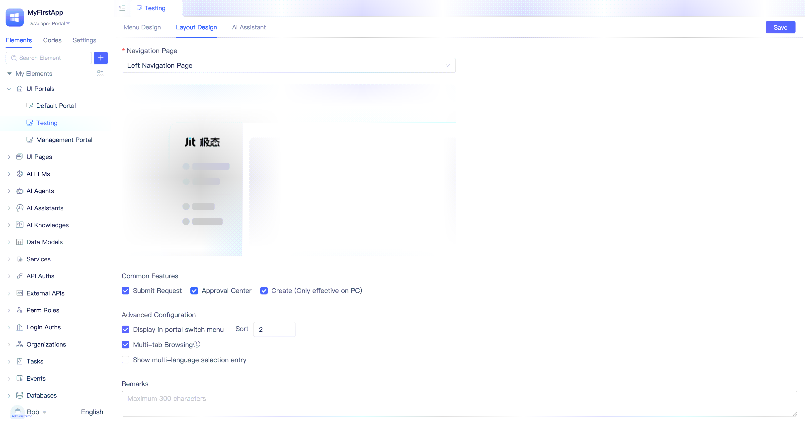
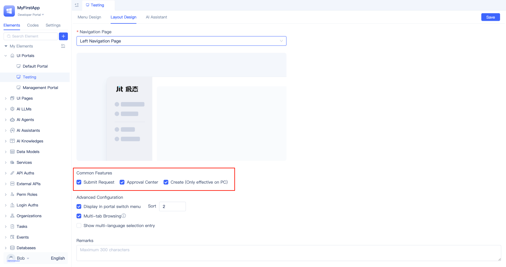

# Creating Portals
In enterprise applications, users with different roles typically access different system features based on their permissions and responsibilities. JitAi implements this role-based access control through portals, where each user role is presented with a tailored portal containing role-specific navigation menus.

After logging in, users are presented with a portal selection page displaying all portals they have access to. Selecting a portal grants access to the features and functions available within that specific portal environment.

## Application built-in portals {#application-built-in-portals}
JitAi automatically provisions three built-in portals for every new application: the `Developer Portal`, `Manager Portal`, and `User Portal`.

Users can switch between available portals using the portal selector located in the upper-left corner of any portal interface. The developer portal serves as a representative example of this functionality.

### Developer portal {#developer-portal} 
The developer portal provides a comprehensive development environment exclusively for application developers. Within this portal, developers can access [JitAi Development Tools](/docs/devguide/development-tool-and-publish-service/visual-development-tool) to execute various development tasks, such as configuring role-based portal access, building system functionality, and managing application settings.

All portal navigation menus—except for the developer portal itself—are configured by developers through this centralized development interface.

### Manager portal {#manager-portal} 
The manager portal is designed for users with administrative privileges, enabling them to oversee application management tasks including organizational structure configuration, role management, and user administration. Developers retain the ability to customize this portal according to specific requirements.

Upon application creation, the system automatically generates an administrator account with default credentials: username `admin123` and password `admin123`. For security purposes, it is strongly recommended that developers update these default credentials immediately after first login through the [personal information](/docs/devguide/development-tool-and-publish-service/visual-development-tool#profile) settings.

:::tip Organizational Roles vs Application Roles
`Organizational roles` correspond to users' positions within the enterprise organizational hierarchy, while `Application roles` in JitAi applications define users' permissions within the application system. Although organizational roles and application roles are conceptually similar, they do not have a strict one-to-one correspondence. For instance, a regular employee can be assigned an application administrator role to manage a specific application system.
:::

### User portal {#user-portal}
While the developer and manager portals serve as foundational administrative interfaces—one for development activities and the other for system management—the user portal caters to end users.

The user portal is specifically designed for standard users who are neither administrators nor developers. These users access the portal to utilize application features and perform their daily tasks within their designated permission boundaries.

## Portal types {#portal-types}

Portal creation requires developers to select from three available portal types, each optimized for different use cases: Generic Portal, SSR Portal, and Blank Portal.

### Generic portal {#generic-portal}
The Generic Portal represents the most widely adopted portal type, featuring a complete set of built-in components including left navigation, top navigation, and user information displays. This portal type includes full responsive design capabilities, ensuring optimal user experience across both desktop and mobile platforms.

### Blank portal {#blank-portal}
The Blank Portal offers a minimalist approach, providing only essential page containers and routing infrastructure without predefined navigation elements. This template grants developers complete control over interface architecture, making it ideal for highly customized applications and specialized display requirements.

### SSR portal {#ssr-portal}
Server-Side Rendering (SSR) portals are engineered to optimize initial page load performance and enhance SEO capabilities. Currently, this portal type supports Markdown file rendering with plans for expanded functionality.

## Creating portals and configuring menus {#creating-portals-and-configuring-menus}

Portal creation follows a straightforward workflow: navigate to the `UI Portals` section in the element tree, click the `+` button, and select `Generic Portal` to launch the creation dialog. After specifying the portal name and confirming the selection, developers gain access to the visual portal editor for a newly created portal.

The portal editor provides comprehensive tools for menu design, layout configuration, and AI assistant integration, enabling developers to create fully customized portal experiences.

### Creating, deleting, and hiding menus {#creating-deleting-hiding-menus}

Developers can establish multiple menus within each portal to meet organizational requirements. During menu creation, you can define the menu name, icon, and icon color scheme. The system offers two page association options: binding to existing PC and mobile pages, or automatically generating new pages during the creation process (requiring page type selection).

Menu deletion is accomplished through the `Delete` button located beside each menu item. The system prompts for confirmation regarding associated page deletion before finalizing the removal process.

Menu visibility can be controlled using the `Hide` button adjacent to each menu item. Hidden menus remain in the portal configuration but are not displayed to end users during portal navigation.

### Sorting menus by dragging {#sorting-menus-by-dragging}
Menu organization can be customized through intuitive drag-and-drop functionality, allowing developers to reposition menu items according to logical or priority-based ordering.

To reorder menus, hover over the desired menu item until the cursor transforms into a hand icon, then click and drag the item vertically to its new position within the menu hierarchy.

### Menu grouping {#menu-grouping}
For portals with extensive menu collections, developers can implement organizational groups to create logical categorization and improve navigation clarity. Groups can be established either reactively to organize existing menus or proactively as containers for future menu additions.

#### Creating portal menu groups {#creating-portal-menu-groups}

To create a group, developers click the `+ Create Group` button, enter the group title in the `Create Group` dialog, and click `Confirm`. Developers can configure group expand/collapse icons and icon colors during group creation, or click the edit button beside the group title after creation to make further edits.

#### Moving menus into groups {#moving-menus-into-groups}

Each menu features a `Move To` button on its right side. Click this button and select the target group from the dropdown to move the menu item into that group. To relocate a menu out of a group or to a different group, use the `Move To` button again and select the desired target portal or group.

Portal menu grouping supports hierarchical nesting. Developers can click the `+` button beside the group title to create sub-groups within the group, establishing a nested organizational structure.

Like menus, groups also support relocation operations.

Developers click the `...` button beside the group title, select the target position from the dropdown, and click `Confirm` to complete the relocation.

### PC and mobile menu pages {#pc-and-mobile-menu-pages}
When creating a menu and selecting to create a new page, the platform automatically generates both PC and mobile page versions that appear in the element directory tree. Developers must then develop these pages using the visual page editor.

When creating a menu and choosing to bind existing pages, developers can specify which PC and mobile pages to bind, selecting either one or both platforms.

If a menu lacks mobile page support, developers can enable it with a single click and can also synchronize content between PC and mobile pages or remove pages from the menu entirely.

Developers click the `More` button on the right side of the menu item and select the `Enable Mobile Page` button from the dropdown to quickly activate mobile page support. PC and mobile pages support rapid synchronization—click the `Sync to PC Page` or `Sync to Mobile Page` button to synchronize designs across platforms. To remove PC or mobile pages from the menu, click the `Remove` button.

### Controlling page logic with variable assignment {#controlling-page-logic-with-variable-assignment}
The same page may be utilized by multiple portal menus. When accessed from different portal menus, the page may need to display varying content or execute different logic. This functionality can be achieved through page variable assignment.

Developers can expand the `More` button on the right side of the menu item, click the `Page Variables` button, and assign values to page variables in the resulting dialog.

:::warning
Developers must first declare [page variables](/docs/devguide/shell-and-page/generic-page#page-variables) within the page. If no variables are declared in the page, page variable assignment cannot be configured in the portal.
:::

### Rewriting menu pages {#rewriting-menu-pages}
Portals can be inherited from parent applications, but not all inherited menu pages may meet current application requirements. Developers can override menu pages within the portal to customize functionality.

Click the `Override` button on the right side of the menu item to open the Override Menu dialog. Developers can rename the page, create a new page, or bind an existing page to replace the inherited functionality.

## Portal layout design {#portal-layout-design}
### Configuring navigation layout {#configuring-navigation-layout}

Developers can customize the navigation bar's display position, with support for both left-side and top-positioned navigation layouts.

The above demonstrates the left navigation layout, where all navigation menus are positioned along the left side of the system interface.

The above demonstrates the top navigation layout, where all navigation menus are positioned along the top of the system interface.

### Multi-tab functionality {#multi-tab-functionality}
Developers can enable or disable `Multi-tab Browsing` functionality within the portal's `Layout Design` settings.

When multi-tabs are enabled, each accessed menu page appears as a tab in the tab bar, allowing users to click tabs to switch between open pages.

When multi-tabs are disabled, the interface does not display the tab bar, and users can only navigate between pages using the navigation menu.

### Portal visibility settings {#portal-visibility-settings}
When developers disable the `Display in portal switch menu` option in `Layout Design`, users will not see this portal in the portal selector located in the upper left corner of the interface.

### Portal ordering {#portal-ordering}
When an application contains multiple portals, developers can configure order values in `Layout Design` to control the display sequence of each portal in the portal selector menu.

## Managing common features entries {#managing-common-features-entries}
Every newly created portal includes a standard set of common features entries: `Submit Request`, `Approval Center`, `Create (Only effective on PC)`. The `Create` entry provides simplified module creation capabilities, though with reduced functionality compared to the comprehensive [Visual Development Tool](/docs/devguide/development-tool-and-publish-service/visual-development-tool). All entries can be selectively enabled or disabled through the `Layout Design` configuration.

Common features entries visibility are controlled through the `Layout Design` → `Common Features` section, where developers can toggle individual entries according to portal requirements.

The above image demonstrates the interface appearance when all common features entries are enabled.

### Application and workflow entries {#application-and-workflow-entries}
Enabling the `Submit Request`, `Approval Center` entries provides users with direct access to workflow management capabilities, including launching approval processes, reviewing pending tasks, all accessible directly from the portal interface.

### Profile entry {#profile-entry}
The `Profile` entry grants users access to profile management functionality, including personal information updates, credential modifications, organization switching, and secure sign out.

## Enabling AI assistant {#integrating-ai-assistants}
JitAi provides native [AI Assistant](/docs/devguide/ai-assistant/create-ai-assistant) integration capabilities, allowing users to interact with intelligent assistants directly through the portal interface. This section offers a high-level overview; detailed implementation guidance is available in [Using AI Assistant in Generic Portals](/docs/devguide/using-ai-in-portals-and-pages/using-ai-assistants-in-portals).

AI assistant integration is accomplished through the portal configuration interface: navigate to the `Enable AI Assistant` tab, activate the integration toggle, and select the desired [AI Assistant](/docs/devguide/ai-assistant/create-ai-assistant) for portal embedding.

Once AI assistant is enabled, users will observe an AI Assistant entry within the portal navigation menu. Selecting this entry launches an interactive dialog interface for direct communication with the AI assistant.
