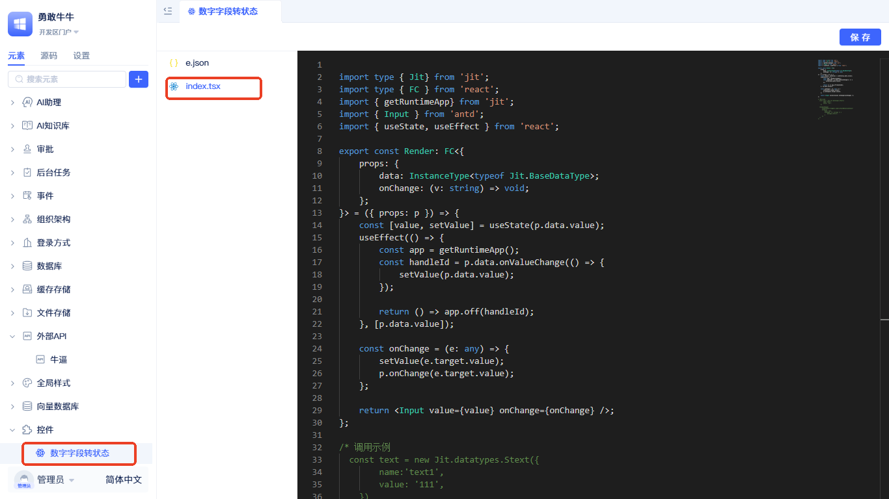
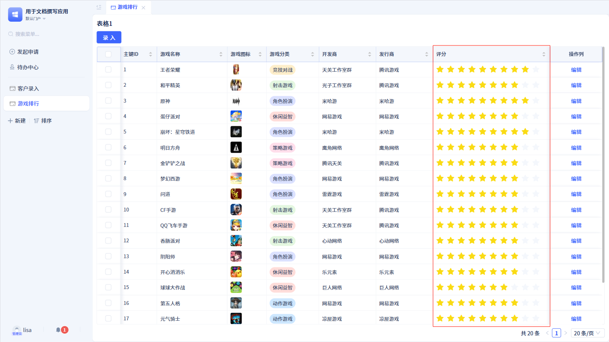

import Tabs from '@theme/Tabs';
import TabItem from '@theme/TabItem';

# 自定义控件
系统对各种数据类型提供了默认的渲染方式，但对于个别定制化需求无法满足，因此需要用户使用自定义控件来完成。例如，将数字渲染成图标形式、将文本渲染某种特定样式等。

自定义控件功能允许开发者为数据类型创建专属的渲染器，通过React语法实现复杂的展示逻辑和交互效果。这些自定义渲染器可以应用在表格组件的单元格或form-components的字段中，让开发者能够灵活控制数据的展示方式，实现从简单的样式美化到复杂的数据可视化等各种展示需求。

## 创建自定义控件元素 {#create-custom-control-element}


在元素目录树点击搜索框右侧的`+`按钮，选择`更多`-`控件`-`React 控件`，随后弹出创建控件元素的弹窗。


创建弹窗中只需填写`名称`即可，点击`确定`完成创建。

## 修改自定义控件 {#modify-custom-control}
创建完成后会在左侧元素树中显示。接下来，我们通过一个示例来展示如何修改自定义控件。



点击元素树中创建的自定义控件元素，进入编辑器。编辑器中有两个文件`index.tsx`和`e.json`，`e.json`是元素的定义，`index.tsx`是控件渲染器的实现。现在我们进行修改`index.tsx`文件。


<Tabs>
  <TabItem value="index" label="index.tsx" default>

```tsx
import type { Jit } from 'jit';
import type { FC } from 'react';
import { getRuntimeApp} from 'jit';
import { Rate } from 'antd';
import { useState, useEffect, useMemo } from 'react';

export const Render: FC<{
    props: {
        data: InstanceType<typeof Jit.BaseDataType>;
        onChange: (v: string) => void;
    };
}> = ({ props: p }) => {
    // 将表单/表格组件内字段的值传递到控件中
    const [value, setValue] = useState(p.data.value);

    // 如果传入的参数没有onChange，说明是渲染器，此时Rate组件不让修改
    const isEdit = useMemo(() => p.onChange, [p.onChange]);

    // 当表单/表格的值发生变化，立即触发
    useEffect(() => {
        const app = getRuntimeApp();
        const handleId = p.data.onValueChange(() => {
            setValue(p.data.value);
        });

        return () => app.off(handleId);
    }, [p.data.value]);

    // 控件的值改变后回调给表格/表单
    const handleChangeRate = (val: number) => {
        setValue(val);
        p.onChange && p.onChange(val);
    };

    return <Rate count={10} value={value} disabled={!isEdit} onChange={handleChangeRate} />;
};
```

  </TabItem>
</Tabs>

再将修改后的`index.tsx`文件保存，并使用该自定义控件替换表单/表格组件内字段的渲染器或编辑器。

:::tip 提示
自定义控件的实现原理是针对数据类型的渲染器或编辑器，使用React语法，将数据渲染成特定的样式和交互效果。

在开发自定义控件时，需要用到全代码进行开发。如何使用全代码开发，可参考[full-code-page-development](../portal-and-page-development/full-code-page-development#react-full-code-page)。
:::

### 表单中使用自定义控件 {#use-custom-control-in-form}


在form-components内打开[字段属性面板](../using-functional-components-in-pages/form-components#basic-configuration-and-item-management)，在字段渲染器或字段编辑器中选择创建的自定义控件元素。

### 表格中使用自定义控件 {#use-custom-control-in-table}


在表格组件内打开[字段属性弹窗](../using-functional-components-in-pages/table-components#configure-field-attributes)，在字段渲染器或字段编辑器中选择创建的自定义控件元素。

通过上面的操作，将自定义控件应用到表单/表格组件内字段后，最后展示的效果：




## 自定义控件参数 {#custom-control-parameters}
表单/表格组件内使用自定义控件时，会向自定义控件的`index.tsx`文件中的`props`传入参数。props参数包含以下字段：
- `data`: 表单/表格组件内字段的值
- `rowData`: 对于表格组件，表示当前行数据。对于form-components，表示当前表单的数据。
- `fieldConfig`:  当前字段在表格/form-components中的配置项，以及该字段在数据表中的信息。
- `onChange`：当前字段的值发生改变时，将新的值作为参数，调用该方法传递给表格/form-components。

:::tip 注意
当自定义控件作为渲染器时，传递的参数中没有`onChange`字段。因此，我们可以使用`onChange`判断是用于组件的渲染器还是编辑器，从而实现不同的逻辑。
:::
