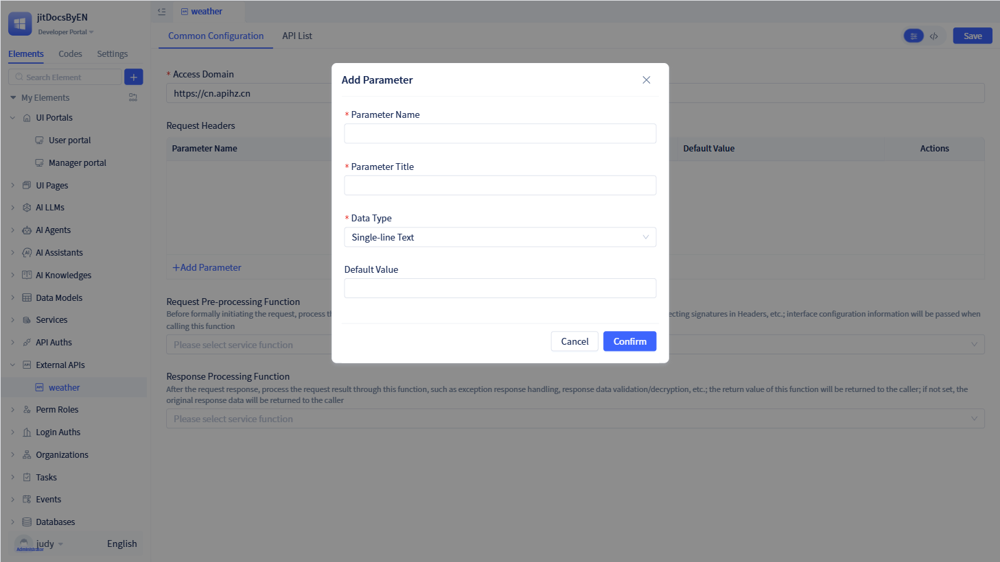
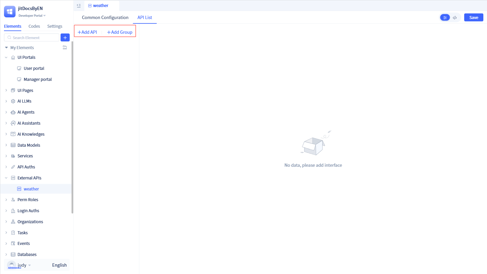
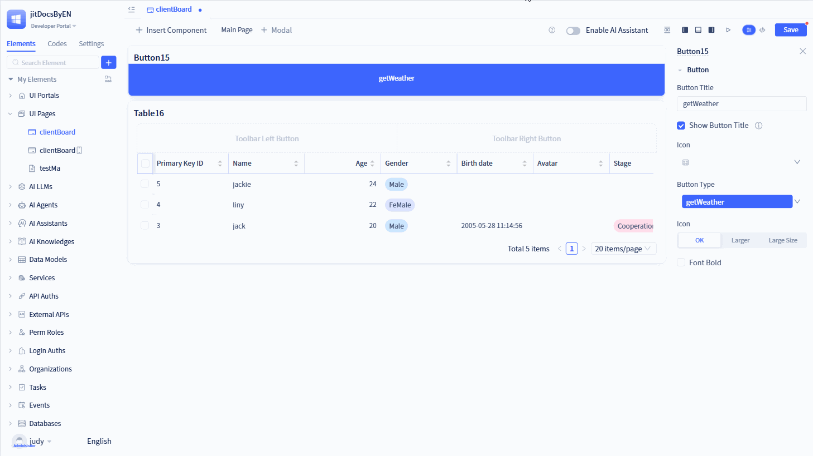

# Creating Universal External API Elements

External API integration elements enable seamless integration with third-party HTTP interfaces, providing unified RESTful API management built on the requests library. These elements handle HTTP request encapsulation, parameter processing, and response parsing, supporting standard HTTP methods (GET, POST, PUT, DELETE) while offering request preprocessing, response postprocessing, and callback mechanisms.

## Creating external APIs {#creating-external-apis}

Click the `+` button in the element tree on the left to open a dialog. to reveal "External API", then click "Generic External API" to open the creation dialog.

In the creation dialog, enter the external API name and click `Confirm` to create the element.

The external API configuration page consists of two main modules: Public Configuration and Interface List.

## Public configuration {#public-configuration}

Public configuration encompasses common settings for external APIs, including domain names, public request headers, request preprocessing, response postprocessing, and other shared parameters.

### Access domain {#access-domain}

The access domain is a required field for external API integration.

This can be either an IP address with port or a fully qualified domain name.

### Public request headers {#public-request-headers}

Public request headers define common headers that apply to all interfaces within the current external API service. You can configure standard parameters such as Content-Type, Accept, and authentication headers.

Click `+ Add Parameter` to open the parameter addition dialog. Enter the parameter details and click `Save` to add the header.

### Request preprocessing {#request-preprocessing}

Certain APIs require dynamic operations such as signature generation or encryption before making requests. These operations can be implemented using request preprocessing functions.

### Response postprocessing {#response-postprocessing}

After receiving API responses, you may need to perform additional processing on the response data, such as decryption, validation, or format transformation. These operations can be implemented using response postprocessing functions.

:::warning Note

Both request preprocessing and response postprocessing functions are optional. If no response processing function is configured, the response data will be returned unchanged.

Before configuring these functions, you must first create the corresponding service functions in the [standard service module](../business-logic-development/creating-service-elements.md).

:::

## API interface management {#api-interface-management}

Similar to how a service contains multiple methods, an external API service can encompass multiple interfaces, all organized within the Interface List.

You can add individual interfaces and organize them into groups for better management and organization.

### API interface grouping {#api-interface-grouping}

You can organize related interfaces into groups for streamlined management. For example, group order-related interfaces under "Orders" and user-related interfaces under "Users."

Click "Add Group" on the left panel to open the group creation dialog. Enter the group name and save to create a new group.

Once created, click the `More` icon next to the group to access additional operations such as adding interfaces, renaming, or deleting the group.

### API interface {#api-interface}

Each API interface contains its own name, request method (GET/POST/PUT/DELETE), and endpoint path.

Click `Add Interface` to open the creation dialog. Specify the interface title, name, request method, and endpoint path, then click `Confirm` to create the interface.

:::warning Note
Interface names must be in English and serve as unique identifiers—they cannot be duplicated.

The complete request URL is constructed by concatenating the domain name with the interface path.
:::

After saving, you'll be directed to the interface details page where you can perform additional configuration.

#### Request parameters {#request-parameters}

Each API interface supports three parameter types: Params, Body, and Header.

Click `+ Add Parameter` to add parameters in the corresponding tab.

:::tip Tip
Params parameters are included in the URL query string and are typically used with GET requests.

Body parameters are embedded in the request body and are commonly used with POST or PUT requests.

Header parameters are included in the request headers and will be automatically merged with headers from the public configuration during API calls.

:::

#### Return value type {#return-value-type}

If the interface returns data, you must configure the appropriate return value type. Since interfaces typically return JSON-formatted data, you can select "Dictionary" as the return type and configure the field mapping.

Note: All return value types are [data types](../../reference/framework/JitORM/data-types) defined within the JitAi framework.

#### Callback function {#callback-function}

JitAi uses callback functions to configure service functions that process API response results with business logic.

Before configuring callback functions, you must first create the corresponding functions in the [standard service module](../business-logic-development/creating-service-elements.md).

### API interface testing and calling {#api-interface-testing-and-calling}

#### API interface testing {#api-interface-testing}

Once an interface is created, you can verify its availability through testing.

Click `Test` on the interface details page to open the testing dialog. Enter the required parameters and click `Test` to verify functionality.

:::warning Note

Data retrieved through the test function represents the complete, unprocessed raw response from the API.
:::

#### API calling {#api-calling}

To make API calls, configure the appropriate functions in pages or services.

In the function logic, navigate to "Service -> External API Service -> Call External API" to create an API call declaration.

In the `Set Parameters` dialog, select the target API interface, configure the necessary parameters, and click `Confirm` to complete the API call configuration.

In the user portal, clicking the "Get Current Weather" button will retrieve current weather information through the configured API call.