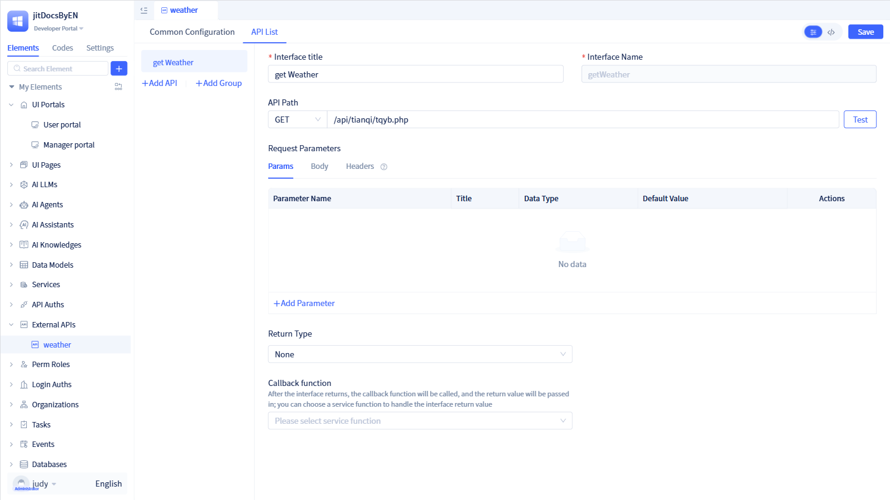

# Creating Universal External API Elements
External API integration elements enable seamless integration with third-party HTTP interfaces, providing unified RESTful API call management built on the requests library. These elements handle HTTP request encapsulation, parameter processing, and response parsing, supporting standard HTTP methods including GET, POST, PUT, and DELETE, while offering pre-request processing, post-response processing, and callback mechanisms.

## Creating External APIs {#creating-external-apis}

Click the `+` button in the left element tree to open a popup dialog. Navigate to "More" to reveal the "External API" option. Click "General API" under "External API" to launch the general API creation dialog.

In the creation dialog, enter the external API name and click `Confirm` to create an external API element.

Upon entering the external API configuration page, you'll see that external APIs consist of two main modules: Public Configuration and Interface List.

## Public Configuration {#public-configuration}
Public configuration encompasses common settings for external APIs, including domain names, public request headers, request preprocessing, response postprocessing, and other shared parameters.

### Access Domain {#access-domain}
The access domain is a mandatory field for external API integration.

This can be either an IP address and port combination or a fully qualified domain name.

### Public Request Headers {#public-request-headers}
Public request headers define common headers that apply to all interfaces within the current external API service. You can configure standard parameters in public request headers, such as Content-Type, Accept, and authentication headers.

Click `+ Add Parameter` to open the parameter addition dialog. After entering the parameter details, click `Save` to add the public request header.

### Request Preprocessing {#request-preprocessing}
Certain APIs require dynamic real-time calculations such as digital signing and encryption before making requests. These operations can be implemented using request preprocessing functions.

### Response Postprocessing {#response-postprocessing}
After receiving API responses, you may need to perform additional processing on the response data, such as decryption, data validation, or format transformation. These operations can be implemented using response postprocessing functions.

:::warning Note

Both request preprocessing and response postprocessing functions are optional. If no response processing function is configured, the response data will be returned unchanged.

Before configuring these functions, you must first create the corresponding service functions in the standard service module.

:::

## API Interface Management {#api-interface-management}
Similar to how a service contains multiple methods, an external API service can encompass multiple interfaces, all organized within the "Interface List".

Developers can add individual interfaces and organize multiple interfaces into groups for better management and display based on specific requirements.

### API Interface Grouping {#api-interface-grouping}
Developers can organize related interfaces into the same group for streamlined management. For example, order-related interfaces can be grouped under "Orders," while user-related interfaces can be grouped under "Users."

Click "Add Group" on the left panel to open the group creation dialog. Enter the group name and save to create a new group.

Once the interface group is created successfully, click the `More` icon next to the group to access additional operations such as adding interfaces, modifying group names, or deleting groups.

### API Interface {#api-interface}
Each API interface contains its own unique name, request method (GET/POST/PUT/DELETE), and endpoint path information.

Click `Add Interface` to open the interface creation dialog. In the dialog, specify the interface title, interface name, request method, and endpoint path, then click `Confirm` to create the new interface.

:::warning Note
Interface names should be in English, serving as unique identifiers for external API interfaces and must not be duplicated.

The complete interface request URL is constructed by concatenating the domain name with the interface path.
:::

After saving the creation dialog, you'll be directed to the interface details page where developers can perform additional interface configuration.

#### Request Parameters {#request-parameters}
Each API interface supports configuration of three parameter types: Params, Body, and Header parameters.

Click `+ Add Parameter` to add parameters within the corresponding tab section.

:::tip Tip
Params parameters are included in the URL's query string and are typically used with 'GET' request types.

Body parameters are embedded in the request body and are commonly used with 'POST' or 'PUT' request types.

Header parameters are included in the request headers and will be automatically merged with header parameters from the public configuration during API calls.

:::

#### Return Value Type {#return-value-type}
If the interface returns data, you must configure the appropriate return value type. Since interfaces typically return JSON-formatted data, you can select "Dictionary" as the return value type and configure the corresponding field mapping relationships.

Note: All return value types available here are [data types](../../reference/framework/JitORM/data-types) defined within the JitAi framework.

#### Callback Function {#callback-function}
JitAi utilizes callback functions to configure service element functions that perform business logic processing on the final API response results.

Before configuring callback functions, you must first create the corresponding functions within the standard service module.

### API Interface Testing and Calling {#api-interface-testing-and-calling}
#### API Interface Testing {#api-interface-testing}
Once an interface is created, you can verify its availability through testing.

Click `Test` on the interface details page to open the testing dialog. In the dialog, enter the required parameters and click the `Test` button to verify interface functionality.

:::warning Note

Data retrieved through the test function represents the complete, unprocessed raw response from the API.
:::

#### API Calling {#api-calling}
To make API interface calls, configure the appropriate functions within generic pages or services.

In the function logic, navigate to "Service -> External API Service -> Call External API" to create an API function call declaration.

In the `Set Parameters` dialog, select the target API interface, configure the necessary parameters, and click `Confirm`. This establishes a complete API function call.

In the user portal, clicking the "Get Current Weather" button will retrieve the current weather information through the configured API call.