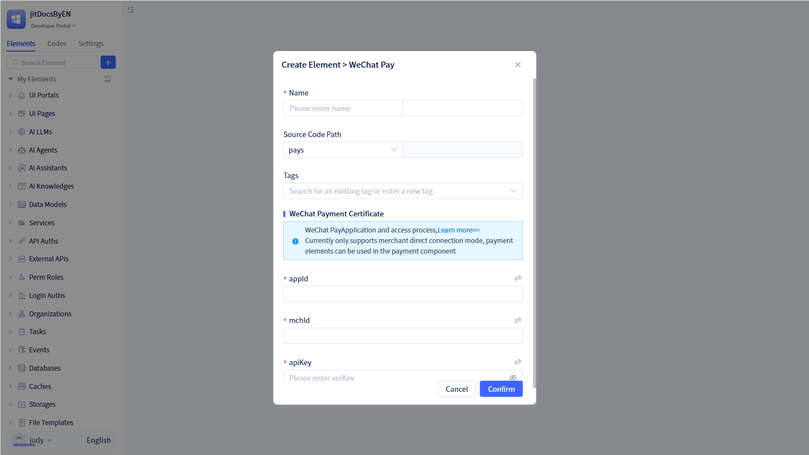
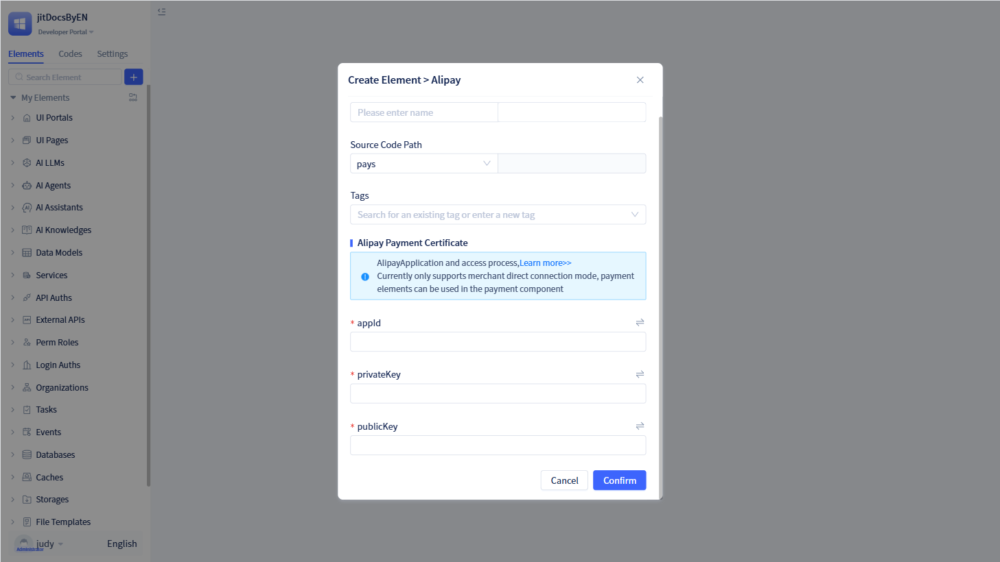
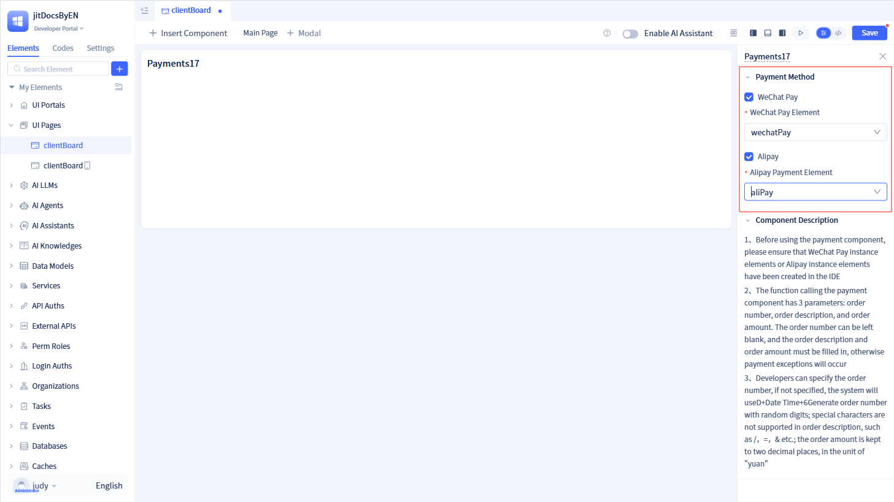

# Built-in Payment Services
The payment service is a payment processing module developed by JitAi that integrates WeChat Pay and Alipay services. It handles payment order creation, payment link generation, order status queries, payment confirmation, and callback processing. The service provides standardized payment APIs that encapsulate the complex integration logic required for third-party payment platforms.

## Configuring WeChat Payment Service {#wechat-payment-service-configuration}
WeChat Payment is a payment processing element that integrates the official WeChat Pay API, supporting multiple payment methods including QR code payments, H5 payments, and mini-program payments through the WeChat Pay V2 API. It is designed for WeChat ecosystem applications such as mini-programs, official accounts, and mobile apps, simplifying payment integration through standardized APIs.

Click the `+` button in the left element tree to open a dialog. Hover over "More" to reveal "Payment Services". Click "WeChat Pay" under "Payment Services" to create a WeChat payment element.

:::warning Note

A complete WeChat payment service requires appId, mchId, and apiKey.

These parameters (appId, mchId, and apiKey) are provided by WeChat Pay and must be obtained by applying at the [WeChat Pay Platform](https://pay.weixin.qq.com).

:::

## Configuring Alipay Payment Service {#alipay-payment-service-configuration}
Alipay Payment is an integration that implements multiple payment methods using Alipay's official API. It manages payment link generation, order status queries, and callback notification processing, supporting QR code payments, mobile website payments, and other payment methods. It is suitable for diverse commercial scenarios including e-commerce, O2O, and lifestyle services.

Click the `+` button in the left element tree to open a dialog. Hover over "More" to reveal "Payment Services". Click "Alipay" under "Payment Services" to create an Alipay payment element.

:::warning Note

A complete Alipay payment service requires appId, privateKey, and publicKey.

These parameters (appId, privateKey, and publicKey) are provided by Alipay and must be obtained by applying at the [Alipay Open Platform](https://open.alipay.com/).

:::

## Using Payment Services {#payment-service-usage}
Once payment services are created, they must be used together with payment components. For detailed usage instructions, refer to [Using Payment Components](../using-functional-components-in-pages/payment-components).

After creating a payment component, select the appropriate payment service to complete the configuration.
