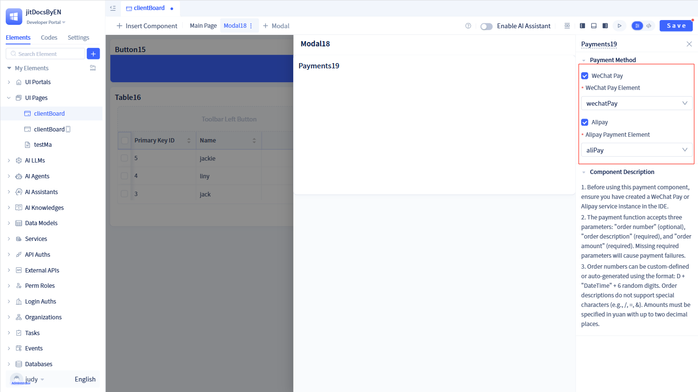

# Built-in Payment Services

The payment service is a payment processing module that integrates WeChat Pay and Alipay, handling payment order creation, payment link generation, order status queries, payment confirmation, and callback processing. It provides standardized payment APIs that encapsulate the complex integration logic required for third-party payment platforms.

## Configuring WeChat payment service {#wechat-payment-service-configuration}

WeChat Payment integrates the official WeChat Pay API, supporting multiple payment methods including QR code payments, H5 payments, and mini-program payments through the WeChat Pay V2 API. Designed for WeChat ecosystem applications such as mini-programs, official accounts, and mobile apps, it simplifies payment integration through standardized APIs.

Click the `+` button in the element tree on the left to open a dialog. Hover over "More" to reveal "Payment", then click "WeChat Pay" to create a WeChat payment element.

:::warning Note

A complete WeChat payment service requires appId, mchId, and apiKey.

These parameters are provided by WeChat Pay and must be obtained from the [WeChat Pay Platform](https://pay.weixin.qq.com).

:::

## Configuring Alipay payment service {#alipay-payment-service-configuration}

Alipay Payment integrates Alipay's official API to implement multiple payment methods. It manages payment link generation, order status queries, and callback notification processing, supporting QR code payments, mobile website payments, and other payment methods. It is suitable for diverse commercial scenarios including e-commerce, O2O, and lifestyle services.

Click the `+` button in the element tree on the left to open a dialog. Hover over "More" to reveal "Payment Services", then click "Alipay" to create an Alipay payment element.

:::warning Note

A complete Alipay payment service requires appId, privateKey, and publicKey.

These parameters are provided by Alipay and must be obtained from the [Alipay Open Platform](https://open.alipay.com/).

:::

## Using payment services {#payment-service-usage}

Once payment services are created, they must be used with payment components. For detailed usage instructions, refer to [Using Payment Components](../using-functional-components-in-pages/payment-components).

After creating a payment component, select the appropriate payment service to complete the configuration.
