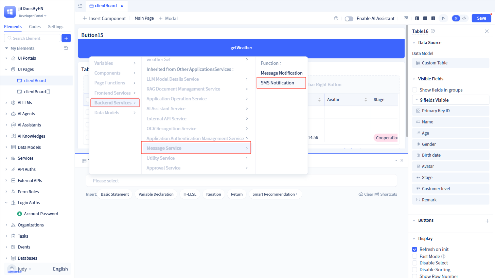

# Built-in SMS Service
SMS services are primarily used in business applications for verification codes, notifications, and marketing campaigns, offering high availability, low latency, and robust reliability.

JitAi integrates SMS services by allowing developers to configure SMS service parameters in the IDE portal, making them available to other modules (such as mobile login, approval notifications, etc.).

Currently, JitAi supports only Alibaba Cloud SMS service.

## Alibaba Cloud SMS {#aliyun-sms}
Alibaba Cloud SMS is an enterprise-level SMS notification service based on Alibaba Cloud SMS API. It supports SMS business scenarios such as verification code delivery and notification alerts through the standard sendMessage interface. It integrates with Alibaba Cloud SMS API, supports AccessKey authentication and signature verification mechanisms, and provides comprehensive error handling and log monitoring to ensure reliable message delivery.

### Creating Alibaba Cloud SMS Service {#aliyun-sms-service-creation}

Click the `+` button in the left element tree to open a dialog. Hover over "More" to reveal "SMS Service", then click "Alibaba Cloud SMS" to open the creation dialog.

In the creation dialog, enter the service name, then provide the required accessKey, accessSecret, and verifySign signature, and click `OK` to create the Alibaba Cloud SMS element.

:::warning Note
AccessKey, accessSecret, and verifySign signature are all required parameters when creating Alibaba Cloud SMS service.

These three parameters are provided by Alibaba Cloud and must be obtained from the [Alibaba Cloud SMS Service Platform](https://help.aliyun.com/zh/sms/).

SMS services can be integrated into approval workflows to implement approval notifications and reminder functions.
:::

Navigate to the Alibaba Cloud SMS service configuration page. To modify parameters, simply update the values and click `Save`. Ensure the information is accurate, as incorrect configurations will prevent the service from functioning.

### Using SMS Service in Mobile Login {#use-sms-service-in-mobile-login}
Once mobile login is enabled, the system prompts users to enter their phone number during registration or login, then sends a verification code to their device. The SMS service handles verification code delivery.

Locate "Login Methods" in the left element tree, then select `Mobile Login` to open the configuration dialog. Configure the SMS service and template code in the dialog.

Developers can choose an existing SMS service or create a new SMS service.

:::tip Tip
The SMS template code is a verification message template that developers configure on the SMS platform and must be registered with the platform.

For existing mobile login methods, you can modify the SMS service and template code on the mobile login configuration page.
:::

### Using SMS Service in Approval Workflows {#use-sms-service-in-approval-workflow}
Approval nodes and CC (carbon copy) nodes support SMS service configuration. When SMS service is configured and an approval reaches that node, the system automatically sends SMS notifications to the designated approver or CC recipient.

In the approval node/CC node configuration page, enable "SMS Service" to configure the SMS service.

:::tip Tip

Developers can choose an existing SMS service or create a new SMS service.

Developers must configure approval SMS templates on the SMS platform. The template must accept two parameters: process name (processTitle) and initiator nickname (userNick).

Once the template is configured on the SMS platform, enter the template code here.

:::

### SMS Notification Function {#sms-notification-function}
Developers can configure SMS notification functionality within function logic. When the function executes, the system sends SMS messages to specified users.

In the function logic, select "Service -> Message Service -> SMS Notification" to declare an SMS notification function.

In the `Set Parameters` dialog, specify the SMS recipients, SMS service, template code, and template variables, then click `OK` to implement the SMS notification function.

:::warning Note
SMS recipients can be individual members, departments, or application roles within the system. Recipients must be one or more of these three types.

The SMS service can be an existing SMS service or a new SMS service can be created.

The SMS template code corresponds to the template configured by developers on the SMS platform and must be registered with the platform. Template variables are placeholders defined when creating the SMS template.
:::
