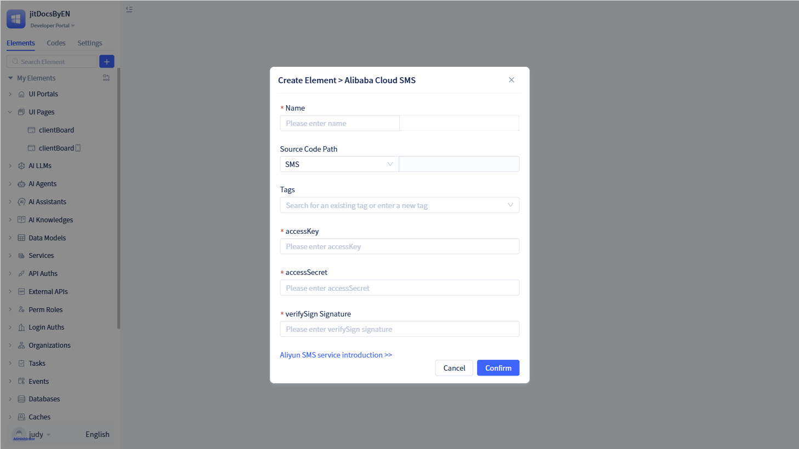
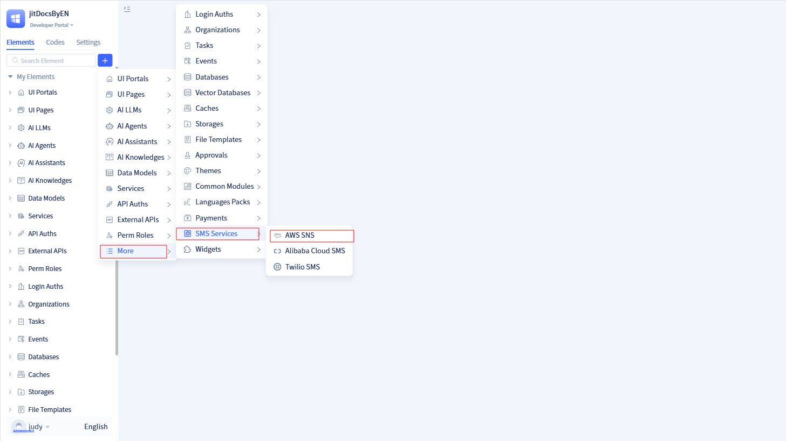

# Built-in SMS Service

SMS services are primarily used for verification codes, notifications, and marketing campaigns, offering high availability, low latency, and robust reliability.

JitAi integrates SMS services by allowing developers to configure SMS service parameters in the IDE portal, making them available to other modules such as mobile login and approval notifications.

Currently, JitAi supports Alibaba Cloud SMS, AWS SNS SMS, and Twilio SMS services.

## Alibaba Cloud SMS {#aliyun-sms}

Alibaba Cloud SMS is an enterprise-level SMS notification service based on the Alibaba Cloud SMS API. It supports SMS scenarios such as verification code delivery and notification alerts through the standard sendMessage interface. With AccessKey authentication and signature verification mechanisms, it provides comprehensive error handling and log monitoring to ensure reliable message delivery.

### Creating Alibaba Cloud SMS service {#aliyun-sms-service-creation}

Click the `+` button in the element tree on the left to open a dialog. Hover over "More" to reveal "SMS Service", then click "Alibaba Cloud SMS" to open the creation dialog.

In the creation dialog, enter the service name and provide the required accessKey, accessSecret, and verifySign signature, then click `OK` to create the Alibaba Cloud SMS element.

:::warning Note
AccessKey, accessSecret, and verifySign signature are all required parameters.

These parameters are provided by Alibaba Cloud and must be obtained from the [Alibaba Cloud SMS Service Platform](https://help.aliyun.com/zh/sms/).
:::

Navigate to the Alibaba Cloud SMS service configuration page. To modify parameters, update the values and click `Save`. Ensure the information is accurate, as incorrect configurations will prevent the service from functioning.

## AWS SNS SMS {#aws-sns-sms}

AWS SNS SMS is an enterprise-level SMS notification service provided by AWS. It supports SMS scenarios such as verification code delivery and notification alerts through the standard sendMessage interface. Integrating with the AWS SNS API, it supports AccessKey authentication and signature verification mechanisms, providing comprehensive error handling and log monitoring to ensure reliable message delivery.

### Creating AWS SNS SMS service {#aws-sns-service-creation}

Click the `+` button in the element tree on the left to open a dialog. Hover over "More" to reveal "SMS Service", then click "AWS SNS" to open the creation dialog.

In the creation dialog, enter the service name and provide the required accessKey, Secret Key, and Region, then click `OK` to create the AWS SNS SMS element.

:::warning Note
AccessKey, Secret Key, and Region are all required parameters.

These parameters are provided by AWS and must be obtained from the [AWS SNS SMS Service Platform](https://docs.aws.amazon.com/sns/latest/dg/welcome.html).
:::

Navigate to the AWS SNS SMS service configuration page. To modify parameters, update the values and click `Save`. Ensure the information is accurate, as incorrect configurations will prevent the service from functioning.

## Twilio SMS {#twilio-sms}

Twilio SMS is an enterprise-level SMS notification service provided by Twilio. It supports SMS scenarios such as verification code delivery and notification alerts through the standard sendMessage interface. Integrating with the Twilio API, it supports account authentication and signature verification mechanisms, providing comprehensive error handling and log monitoring to ensure reliable message delivery.

### Creating Twilio SMS service {#twilio-service-creation}

Click the `+` button in the element tree on the left to open a dialog. Hover over "More" to reveal "SMS Service", then click "Twilio SMS" to open the creation dialog.

In the creation dialog, enter the service name and provide the required accountSid, authToken, and From Number, then click `OK` to create the Twilio SMS element.

:::warning Note
AccountSid, authToken, and From Number are all required parameters.

These parameters are provided by Twilio and must be obtained from the [Twilio SMS Service Platform](https://www.twilio.com/docs/messaging).
:::

Navigate to the Twilio SMS service configuration page. To modify parameters, update the values and click `Save`. Ensure the information is accurate, as incorrect configurations will prevent the service from functioning.

## Using SMS service in mobile login {#use-sms-service-in-mobile-login}

Once mobile login is enabled, the system prompts users to enter their phone number during registration or login, then sends a verification code to their device. The SMS service handles verification code delivery.

Locate "Login Methods" in the element tree on the left, then select `Mobile Login` to open the configuration dialog. Configure the SMS service and template code in the dialog.

You can choose an existing SMS service or create a new one.

:::tip Tip
Alibaba Cloud SMS service requires configuring an SMS template code, while other SMS services only require configuring the SMS template.

The SMS template code is a verification message template that you configure on the SMS platform and must be registered with the platform.

For existing mobile login methods, you can modify the SMS service and template code on the mobile login configuration page.
:::

## Using SMS service in approval workflows {#use-sms-service-in-approval-flow}

Approval nodes and CC (carbon copy) nodes support SMS service configuration. When an approval reaches a node with SMS service configured, the system automatically sends SMS notifications to the designated approver or CC recipient.

In the approval node/CC node configuration page, enable "SMS Service" to configure the service.

:::tip Tip

You can choose an existing SMS service or create a new one.

You must configure approval SMS templates on the SMS platform. The template must accept two parameters: process name (processTitle) and initiator nickname (userNick).

Once configured on the SMS platform, enter the template code here.

:::

## SMS notification function {#sms-notification-function}

You can configure SMS notification functionality within function logic. When the function executes, the system sends SMS messages to specified users.

In the function logic, select "Service -> Message Service -> SMS Notification" to declare an SMS notification function.

In the `Set Parameters` dialog, specify the SMS recipients, SMS service, template code, and template variables, then click `OK` to implement the SMS notification function.

:::warning Note
SMS recipients can be individual members, departments, or application roles within the system. Recipients must be one or more of these types.

The SMS service can be an existing service or a new one.

The SMS template code corresponds to the template you configured on the SMS platform and must be registered with the platform. Template variables are placeholders defined when creating the SMS template.
:::
