# How to Add JitAI Application to DingTalk Workspace and Implement Password-Free Login and Mobile Experience

## Add an Enterprise Internal Self-built Application in DingTalk Backend

1.  Enter DingTalk Open Platform backend [https://open-dev.dingtalk.com/fe/app?hash=%23%2Fcorp%2Fapp#/corp/app](https://open-dev.dingtalk.com/fe/app?hash=%23%2Fcorp%2Fapp#/corp/app) and go to Application Development - Enterprise Internal Application

    

2.  Click [Create Application], configure the application title and name. This name and application icon will be displayed in the DingTalk workspace

    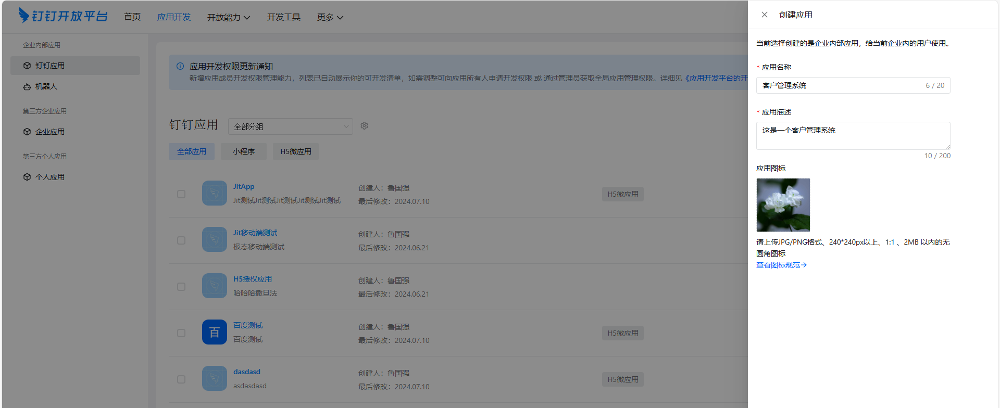

3.  After creation is completed, you will automatically enter the application details page. At this time, you need to add [Web Application] function, other functions can be added as needed

    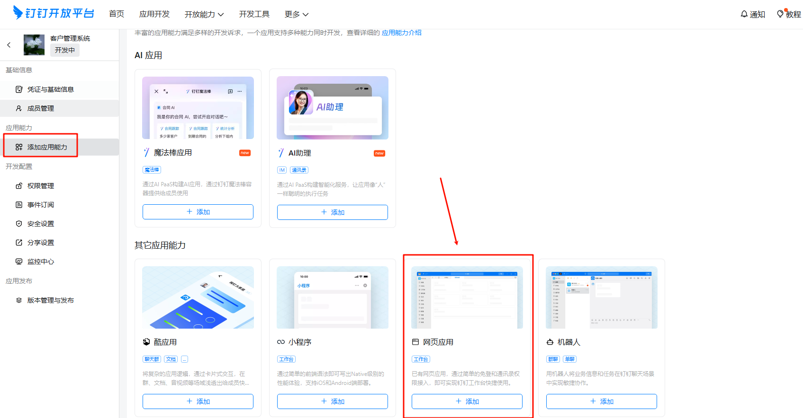

4.  After adding, you need to configure the application homepage address, PC homepage address, and management backend address. All can be filled with the same link according to the following rules

    Configuration address rule: `https://domain/{orgid}/{appId}/login?corpId=$CORPID$` `protocol://domain/organization id/application id/login?corpId=$CORPID$`

    For example, my application: https://jit-dev.wanyunapp.com/whwy/yiguixue/login?corpId=$CORPID$

    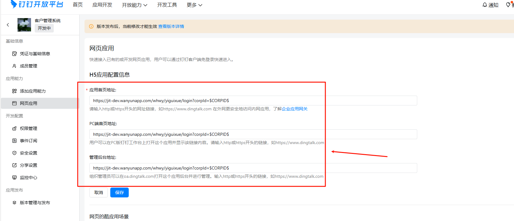

5.  [Create New Version] in [Version Management and Release]

    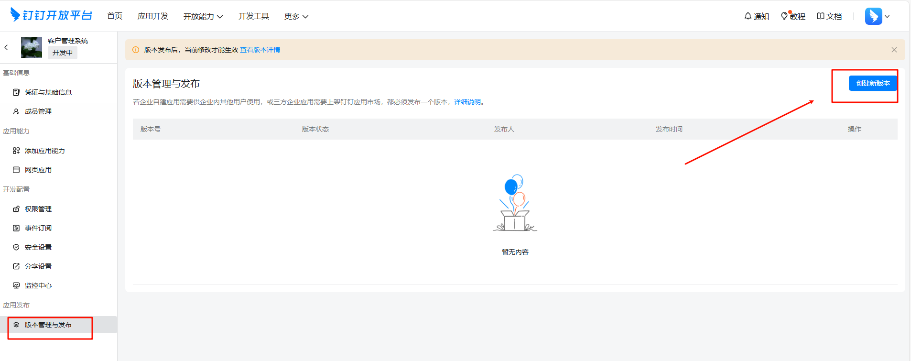

6.  Fill in the version description, pay attention to configure [Application Visibility Range]. The default is "Only visible to me". If there are no special requirements, you can change it to "All employees" and save before publishing

    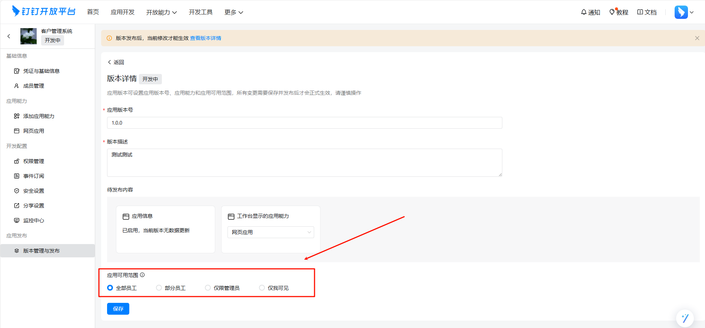

    

7.  At this time, the application can be seen in the workspace on both PC and mobile. If you can't see it, you can search for the application in [Settings] and add the application to the commonly used section for all employees

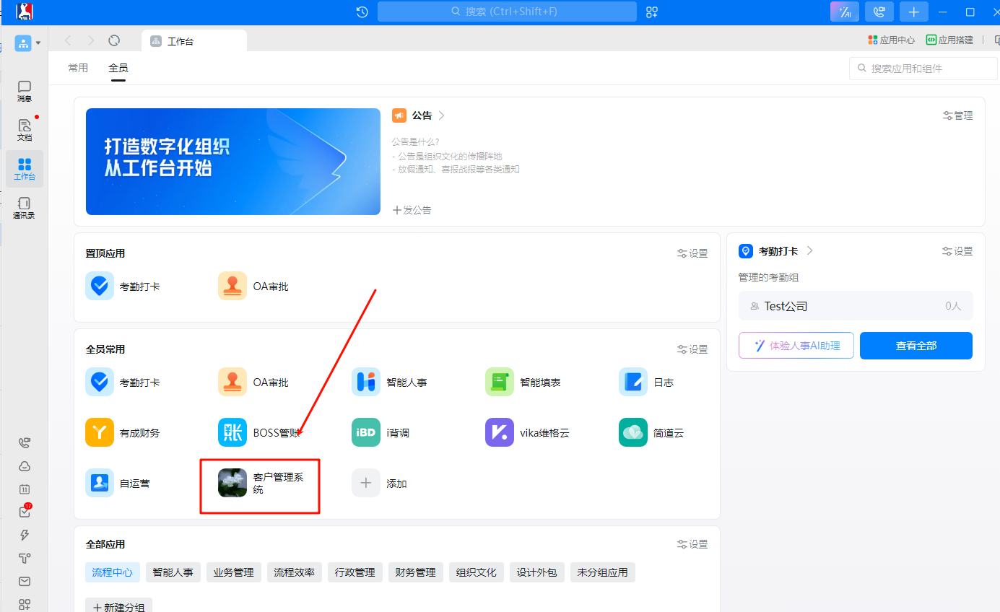

**But... don't get too excited. Although the application has been added to the workspace, password-free login has not been implemented yet. Even if the password-free link is configured, clicking this application will still enter the login page**

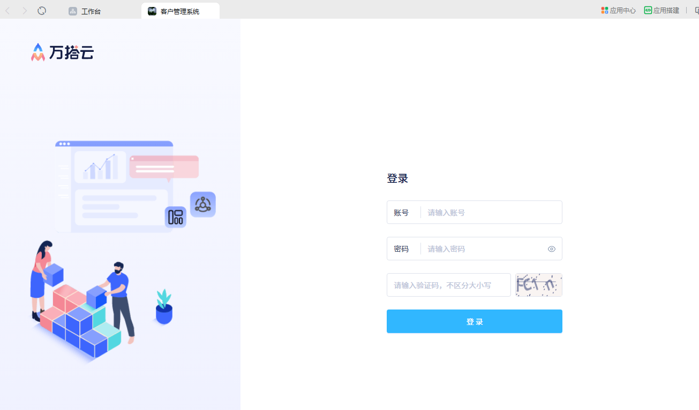

**At this time, you need to create a DingTalk self-built organizational structure in JitAI**

## Create a DingTalk Self-built Organizational Structure in JitAI Application

1.  Get the configuration information of the DingTalk self-built application. Enter the application created above and go to [Credentials and Basic Information] to see so many strings

    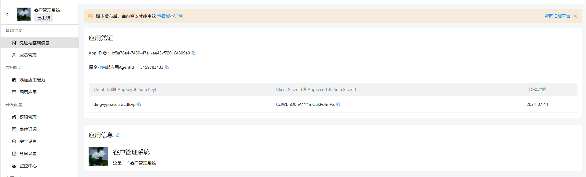

2.  There is also important information, enterprise CorpID, it's here, click to copy

    

3.  At this time, create a new DingTalk self-built organizational structure in the JitAI application. The entrance is as follows

    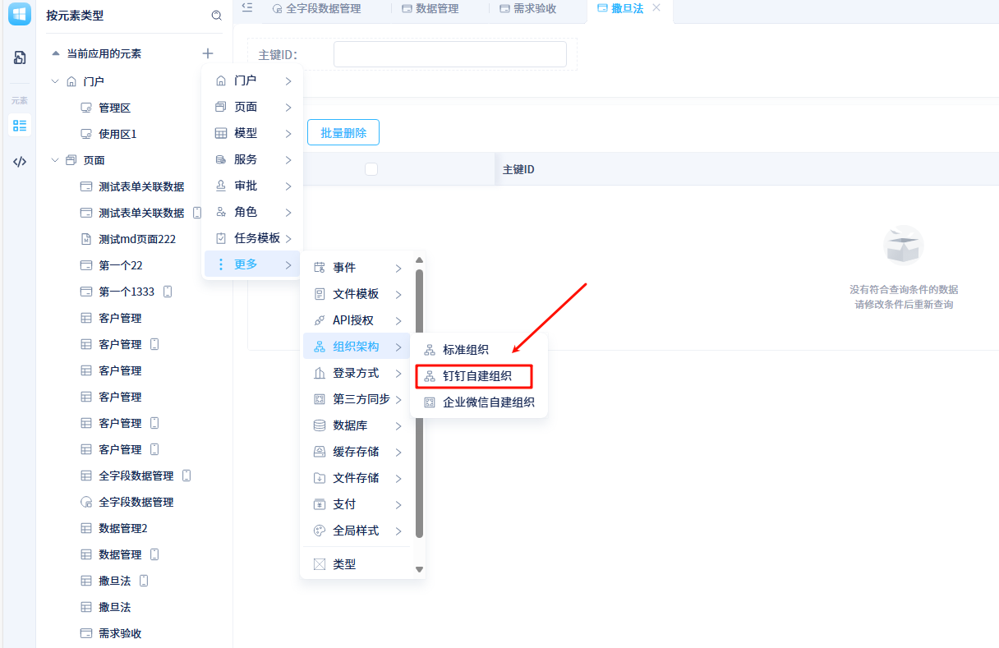

4.  Fill in the credential information obtained above into the input boxes one by one. Don't fill it wrong, if you fill it wrong, it will be wrong

    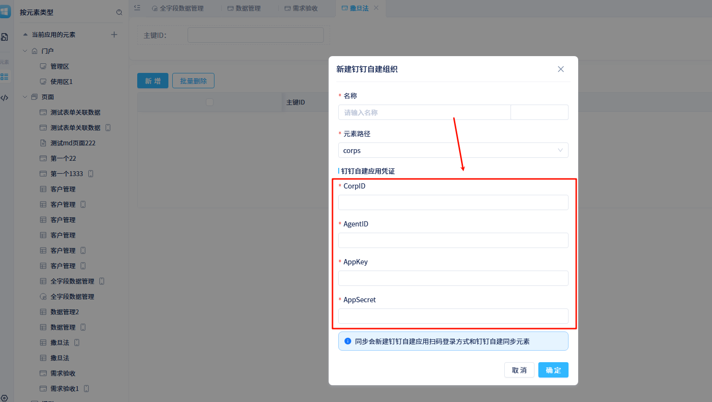

    

5.  Oh right, if you can't get member department information when synchronizing the organizational structure, you can authorize this permission by the way, it's free anyway

    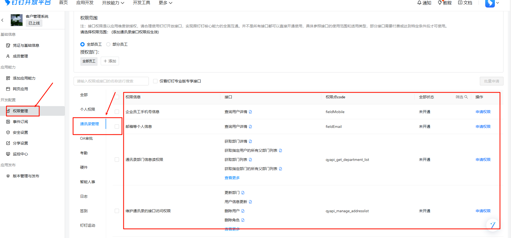

6.  After creation, you need to authorize members in the new organizational structure. Otherwise, even with password-free login, there will be no permissions, right?

    

7.  After everything is set up, you can enter the application with password-free login in the DingTalk workspace. Both PC and mobile are the same. Mission accomplished!!!!!!!!!!!!!!

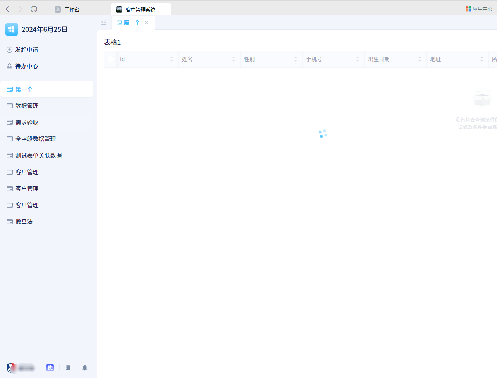

**Note: If there is no DingTalk QR code when using DingTalk QR code login on the web, configure the access domain in the DingTalk backend. The server domain is sufficient, no need for the complete application address**

