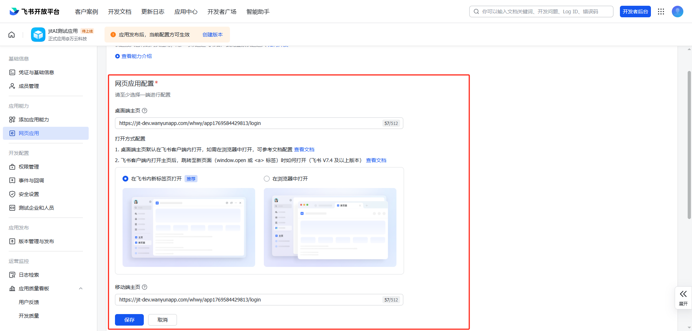
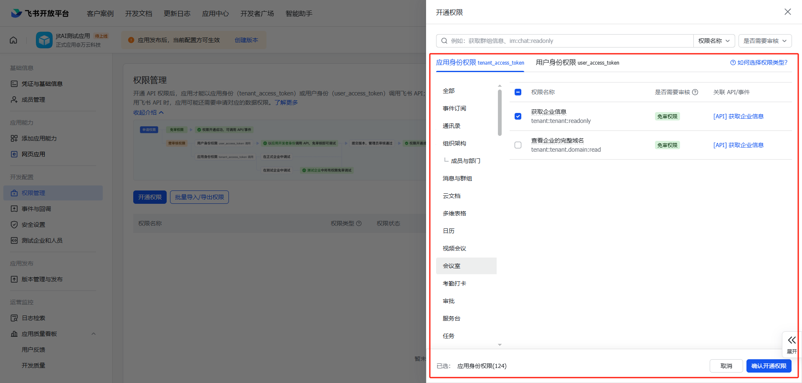
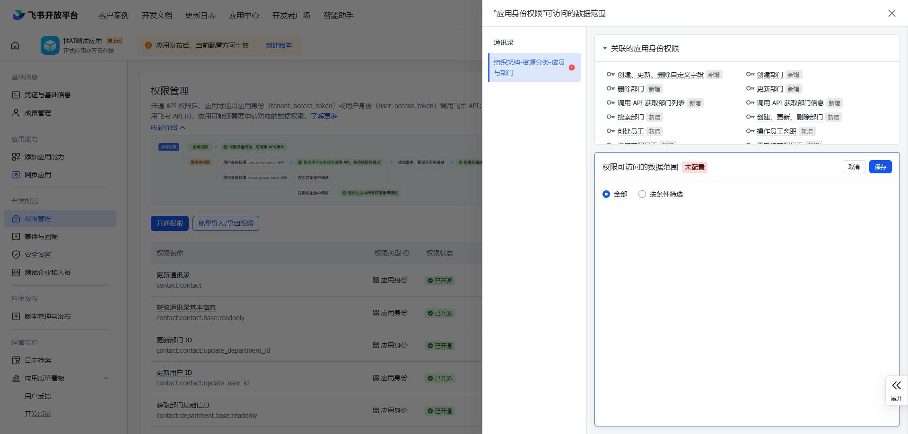
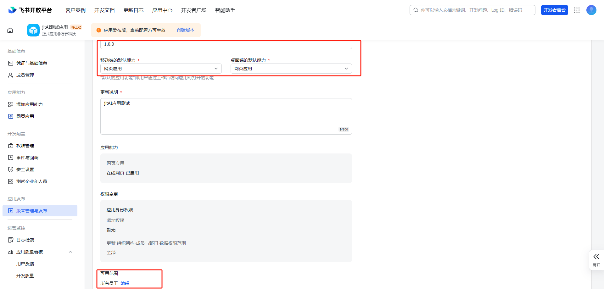
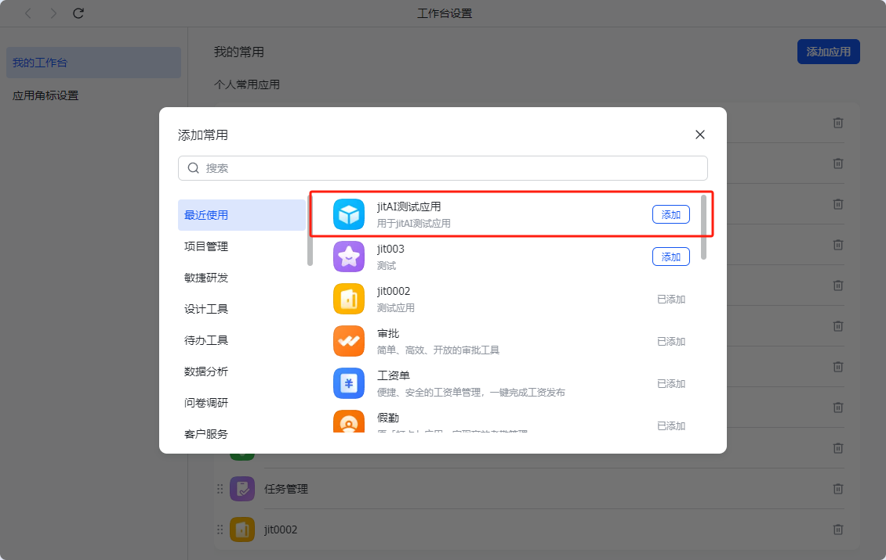
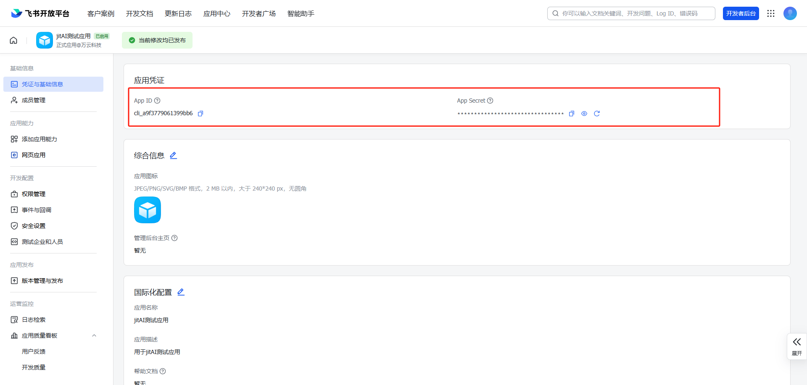
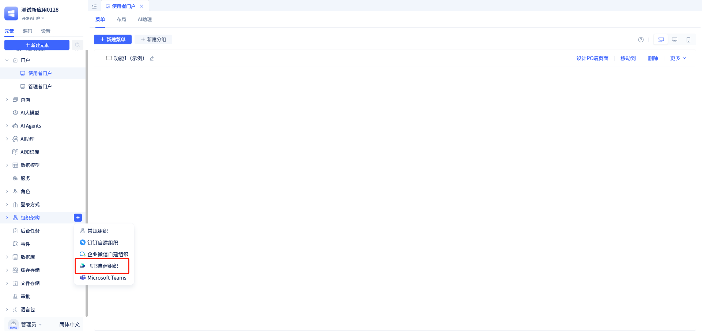
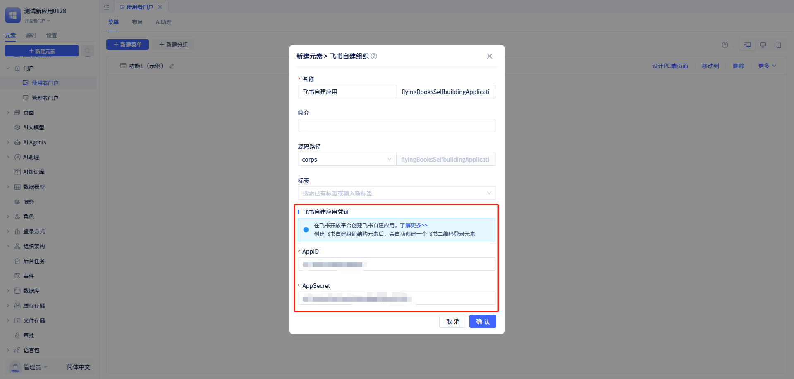
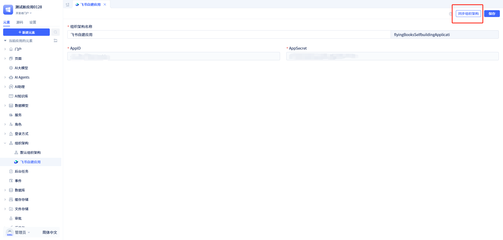

# How to Add Jit Application to Feishu Workspace and Implement Password-Free Login and Mobile Experience

## Add an Enterprise Internal Self-built Application in Feishu Backend

1.  Enter the Feishu Open Platform backend [https://open.feishu.cn/app](https://open.feishu.cn/app) and go to Application Development - Enterprise Internal Application

2.  Click [Create Enterprise Self-built Application], configure the application title and name. This name and application icon will be displayed in the Feishu workspace

3.  After creation is completed, you will automatically enter the application details page. At this time, you need to add [Web Application] capability, other functions can be added as needed

4.  After adding, you need to configure the desktop homepage and mobile homepage with relevant links. These two can be configured with the same link. At the same time, configure the opening method to open in a new tab within Feishu.

Configuration address rule: `https://domain/{orgid}/{appId}/login` `protocol://domain/organization id/application id/login`

For example, my application: https://jit-dev.wanyunapp.com/whwy/app1769584429813/login

5. Click [Permission Management] under [Development Configuration] to open the permission management page, then click [Enable Permissions] to grant relevant permissions to the application.

6. In the [Enable Permissions] dialog, select all permissions under [Contacts] and [Organization Structure] under the [Application Identity Permissions] tab, as well as [Get Enterprise Information] under [Enterprise Information], and all permissions under [Contacts] under the [User Identity Permissions] tab.

7. After clicking [Confirm Enable], it will automatically jump to the [Application Identity Permissions Data Access Range] page. Click [Configure], select [All], and then save.

8. Click [Security Settings] under [Development Configuration] to open the security settings page. Configure the redirect address under Redirect URL. **Note that the redirect address must be the application's login address**.

9. Click [Version Management and Release] under [Application Release], click [Create Version], fill in the application version number (e.g., 1.0.0) and update description. Configure the availability range. If there are no special requirements, you can change it to "All Members" and save before publishing.

10. At this time, the application can be seen in the workspace on both PC and mobile. If you can't see it, you can click [Add to Favorites] in the client's [Workspace] to add the application to the workspace.

**Although the application has been added to the workspace, password-free login has not been implemented yet. Even if the password-free link is configured, clicking this application will still enter the login page. At this time, you need to create a Feishu self-built organizational structure in the Jit application**

## Create a Feishu Self-built Organizational Structure in Jit Application

1.  Get the configuration information of the Feishu self-built application. Enter the application created above and go to [Credentials and Basic Information] to see the APP ID and APP Secret information.

2.  At this time, create a new Feishu self-built organizational structure in the Jit application. The entrance is as follows

3.  Fill in the credential information obtained above into the input boxes one by one

4.  After creating the organizational structure, click [Sync Organizational Structure] in the upper right corner of the page to sync member information to the current application.

5.  After creation, you need to authorize members in the new organizational structure. Otherwise, even with password-free login, there will be no permissions.

6.  After everything is set up, you can enter the application with password-free login in the Feishu workspace, and you can also use Feishu to scan QR codes for login on the application's login page.
