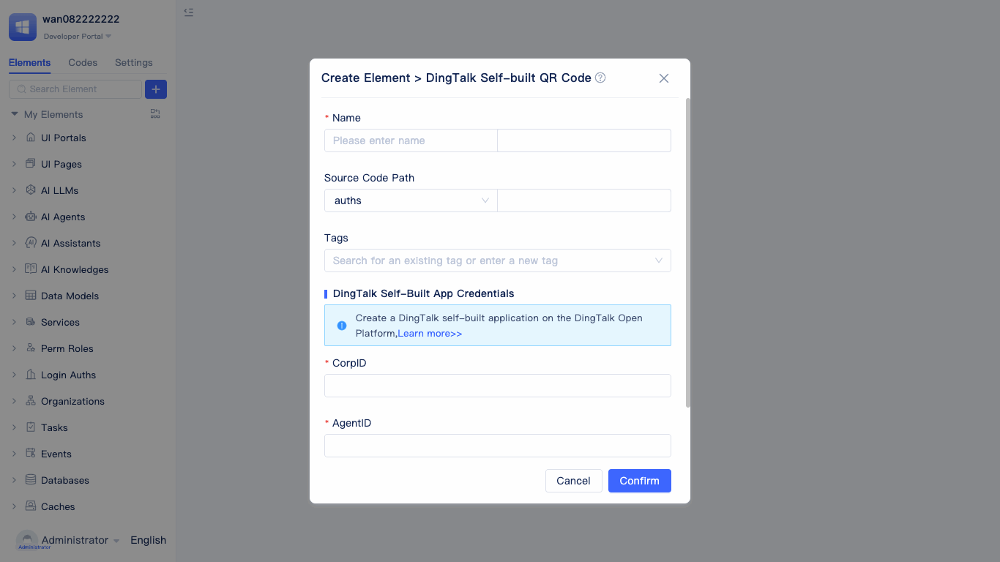
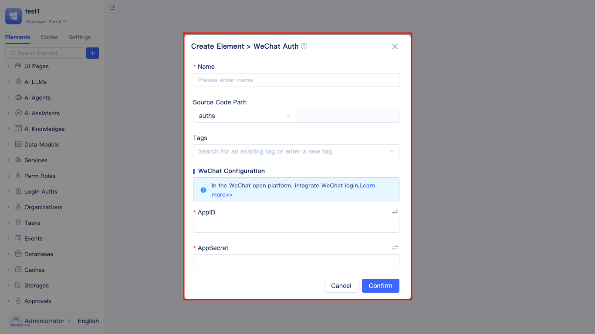

# Login Authentication

The JitAi platform supports multiple login authentication methods, including account password login, phone login, DingTalk self-built QR code login, WeCom self-built QR code login, WeChat authentication, WeChat official account authentication, WeChat mini program authentication, GitHub login, Google login, and Microsoft Teams authentication. These methods meet diverse user access and authentication needs across different scenarios, enabling enterprises and individual users to access applications conveniently and securely.

## Creating login authentication {#creating-login-method}

JitAi enables developers to freely configure and add multiple login authentication methods according to their business requirements, helping applications achieve multi-platform convenient access and unified authentication management.

In the element tree of the development area, locate `Login Authentication` and click the `+` button on the right to display the login method selection list. Developers can select and configure the required login authentication methods according to their business scenarios, enabling rapid integration.

## Account password login {#account-password-login}

Account password login is the most commonly used and fundamental login method, allowing users to securely access applications by entering their account credentials and password. When creating a JitAi application, an account password login method is automatically created.

When developers choose to create `Account Password Login`, a `Create Element > Create Account Password Login` window will appear. In this window, you need to fill in the login method name (English name is automatically generated) and set the password length (default 8-32 characters, must include numbers and letters). After clicking `Confirm`, the creation is completed and you can proceed to the detailed configuration page.

On the detailed configuration page on the right, developers can flexibly adjust the login method name, password length, and password strength requirements.

Password strength rules support flexible combinations of the following five types of character requirements: numbers, letters, lowercase letters, uppercase letters, and special characters. Developers can freely configure combinations of these types according to their security requirements, effectively improving account security and meeting business scenarios of different security levels.

## Phone login {#mobile-phone-login}

Mobile phone login is a convenient and secure login authentication method. Users can complete identity verification by entering their mobile phone number and receiving SMS verification codes, making it suitable for mobile applications and scenarios requiring quick registration/login.

When developers choose to create `Phone Login`, a `Create Element > Phone Login` window will appear. In this window, you need to fill in the login method name (English name is automatically generated), select SMS service and SMS template code for sending verification codes. Below there is a checkbox `Support new user registration` (checked by default).

In the SMS service selection box, you can choose configured SMS services from the dropdown menu, or click the `+ Create` button to add a new SMS service. The platform currently supports mainstream SMS service providers such as Alibaba Cloud SMS, Twilio, and AWS SNS, meeting the needs of different business scenarios.

### Alibaba Cloud SMS {#aliyun-sms}

Alibaba Cloud SMS service is a leading SMS communication platform in China, providing high-concurrency, stable and reliable SMS sending capabilities. Its services cover global scope, with comprehensive review mechanisms and rich application scenario support, particularly suitable for domestic enterprises and applications targeting Chinese users.

In the `Create Alibaba Cloud SMS` window, you need to fill in SMS service name (English name is automatically generated), AccessKey, AccessSecret, and SMS signature (verifySign) and other Alibaba Cloud account credential information. Related credentials can be created and managed on the Access Control page of [Alibaba Cloud Console](https://ram.console.aliyun.com/).

### Twilio {#twilio}

Twilio is a leading global cloud communication platform that provides programmable SMS, voice and video communication services. Its SMS service covers more than 200 countries and regions worldwide, with high availability and flexible API interfaces, particularly suitable for international applications and overseas business scenarios.

In the `Create Twilio SMS` window, you need to fill in SMS service name (English name is automatically generated), Account SID, Auth Token and other Twilio account credential information. This information can be obtained from the account settings page of [Twilio Console](https://console.twilio.com/).

### AWS SNS {#aws-sns}

Amazon Simple Notification Service (SNS) is a fully managed publish/subscribe messaging and mobile notification service provided by Amazon Web Services. AWS SNS SMS service offers high scalability and reliability, supports SMS sending worldwide, and is suitable for enterprise applications that already use the AWS ecosystem.

In the `Create AWS SNS` window, you need to fill in SMS service name (English name is automatically generated), Access Key ID, Secret Access Key, Region and other AWS account credential information. Related credentials can be created and managed in the IAM service of [AWS Console](https://console.aws.amazon.com/).

## DingTalk self-built QR code login {#dingtalk-custom-qr-login}

DingTalk self-built QR code login is an enterprise-level identity authentication method based on the DingTalk platform. Users can securely and conveniently log in to the system through DingTalk client QR code authorization. This method is suitable for enterprise internal employee unified identity authentication, passwordless login and other scenarios, effectively improving login experience and security. When creating a DingTalk custom organizational structure, the system will automatically generate a DingTalk self-built QR code login method for the organizational structure. Developers can also independently add DingTalk self-built QR code login authentication methods according to actual needs.

When developers choose to create `DingTalk Self-built QR Code Login`, a `Create Element > Create DingTalk Self-built QR Code Login` configuration window will appear. In this window, you need to fill in the login method name (English name is automatically generated) and configure the credential information of DingTalk custom application, including `CorpId` (Enterprise ID), `AgentID`, `appKey`, and `appSecret`. For information on how to obtain related configuration information, please refer to [Organizational Structure Documentation](./organization#dingtalk-custom-organization).

After completing the relevant configuration, the system will automatically create a DingTalk QR code login method and navigate to the login method configuration page for your subsequent viewing and management.

:::tip
DingTalk self-built QR code login method needs to be used in conjunction with [DingTalk Custom Organizational Structure](./organization#dingtalk-custom-organization). When creating a DingTalk custom organizational structure, the system will automatically synchronize and generate the corresponding QR code login method without separate configuration.
:::

## WeCom self-built QR code login {#wechat-work-custom-qr-login}

WeCom self-built QR code login is an enterprise-level QR code authentication method based on the WeCom platform. Users can quickly and securely log in to the system through WeCom client QR code authorization. This method is suitable for employee unified authentication and passwordless login scenarios under the WeCom ecosystem. When creating a WeCom custom organizational structure, the system will automatically generate a WeCom self-built QR code login method. Developers can also independently add WeCom self-built QR code login authentication methods according to actual business needs.

When developers choose to create `WeCom Self-built QR Code Login`, a `Create WeCom Self-built QR Code Login` configuration window will appear. In this window, you need to fill in the login method name (English name is automatically generated) and configure the credential information of WeCom custom application, including `CorpId` (Enterprise ID), `AgentID`, and `Secret`. For information on how to obtain related configuration information, please refer to [Organizational Structure Documentation](./organization#wechat-work-custom-organization).

After configuration is completed, the system will automatically generate a WeCom QR code login method and navigate to the login method configuration page for your subsequent viewing and management.

:::tip
WeCom self-built QR code login method needs to be used in conjunction with [WeCom Custom Organizational Structure](./organization#wechat-work-custom-organization). When creating a WeCom custom organizational structure, the system will automatically synchronize and generate the corresponding QR code login method without separate configuration.
:::

## WeChat login {#wechat-login}

WeChat login is a third-party login method based on the WeChat Open Platform, allowing users to quickly and securely log in to the system through WeChat account authorization. This method is suitable for consumer-facing application scenarios, greatly improving user registration and login convenience, reducing user churn rates, while supporting user information acquisition and management within the WeChat ecosystem.

When developers choose to create a `WeChat Login` method, the system will display a `Create Element > WeChat Login` configuration window. In this window, you need to fill in the login method name (English name is automatically generated) and configure the relevant credential information of WeChat Open Platform, including `AppID` and `AppSecret`.

**WeChat Credential Acquisition**:

1. Log in to [WeChat Open Platform](https://open.weixin.qq.com/).
2. In the `Management Center`, select `Create Website Application` in the `Website Applications` tab, fill in the application information according to the guide and submit for review.
3. After approval, you can obtain the `AppID` and `AppSecret` of the application on the application details page for WeChat login integration configuration in the system.

For detailed operation guides, please refer to [WeChat Open Platform Official Documentation](https://open.weixin.qq.com/).

:::tip Note
The AppSecret of WeChat applications is only displayed once during creation. Please keep it safe as it cannot be viewed again later.
:::

## WeChat official account login {#wechat-official-account-login}

WeChat official account login refers to a method where users log into the system using their WeChat identity after scanning a QR code with WeChat and authorizing. Users need to follow the designated WeChat official account and complete authorization in WeChat to achieve secure and convenient identity authentication. This login method is suitable for scenarios that require establishing long-term relationships with users, pushing messages, or building membership systems, commonly used in enterprise services, content distribution, O2O and other application domains.

When developers choose to create a `WeChat Official Account Login` method, the system will display a `Create Element > WeChat Official Account Login` configuration window. In this window, you need to fill in the login method name (English name will be automatically generated) and enter the relevant credential information of the WeChat official account, including `AppID` and `AppSecret`. Additionally, you can choose whether to check `Support user registration during login` (checked by default). If checked, the system will display an `Organizational structure for automatic user registration` selection box, requiring selection from existing organizational structures.

**Official Account Credential Acquisition**:

As shown in the figure above, log in to [WeChat Public Platform](https://mp.weixin.qq.com/), click `Settings & Development` - `Official Account Settings` in the left menu to view and copy basic information such as the Original ID and WeChat ID of the official account.

As shown in the figure above, navigate to the `Settings & Development` - `Development Interface Management` - `Basic Configuration` page to obtain AppID (Application ID) and AppSecret (Application Secret).

:::tip Note
AppSecret (Developer Password) is only displayed once during creation. Please keep it safe as it cannot be viewed again later.
:::

## WeChat mini program login {#wechat-mini-program-login}

WeChat mini program login is a third-party login method based on the WeChat Mini Program platform. Users can achieve fast and secure identity authentication through WeChat mini program authorization. This method is suitable for mobile applications, lightweight services, tool-type products and other scenarios, improving user experience and lowering registration and login barriers.

When developers choose to create a `WeChat Mini Program Login` method, the system will display a `Create Element > Create WeChat Mini Program Login` configuration window. In this window, you need to fill in the login method name (English name will be automatically generated) and configure the relevant credential information of the WeChat mini program, including `AppID` and `AppSecret`. Additionally, you can choose whether to check `Support user registration during login` (checked by default).

To learn about the WeChat mini program development process, please refer to [WeChat Official Development Documentation](https://developers.weixin.qq.com/miniprogram/dev/framework/quickstart/getstart.html#%E7%94%B3%E8%AF%B7%E8%B4%A6%E5%8F%B7).

## GitHub login {#github-login}

GitHub login is based on the GitHub Open Platform. Users can securely and conveniently log in to the system through GitHub account authorization. This method is particularly suitable for developer communities, technical products, and open source project management scenarios, helping users unify identity information management.

When creating `GitHub Login`, the system will display a configuration window. Please fill in the login method name (English name is automatically generated) and enter GitHub's `ClientID` and `ClientSecret`. This information can be obtained in OAuth Apps of [GitHub Developer Center](https://github.com/settings/developers). After configuration is completed, the system will automatically generate a GitHub login method and navigate to the login method configuration page for subsequent management.

## Google login {#google-login}

Google login is based on the Google Open Platform. Users can quickly and securely log in to the system through Google account authorization. This method is suitable for applications targeting international users, SaaS platforms, educational products, etc., improving user experience and simplifying the registration process.

When creating `Google Login`, the system will display a configuration window. Please fill in the login method name (English name is automatically generated) and enter Google's `ClientID` and `ClientSecret`. Related information can be obtained in OAuth 2.0 credentials of [Google Cloud Console](https://console.cloud.google.com/apis/credentials). After configuration is completed, the system will automatically generate a Google login method and navigate to the login method configuration page for subsequent viewing and management.

:::tip
Create Google login applications on Google Cloud Platform, and international servers are required.
:::