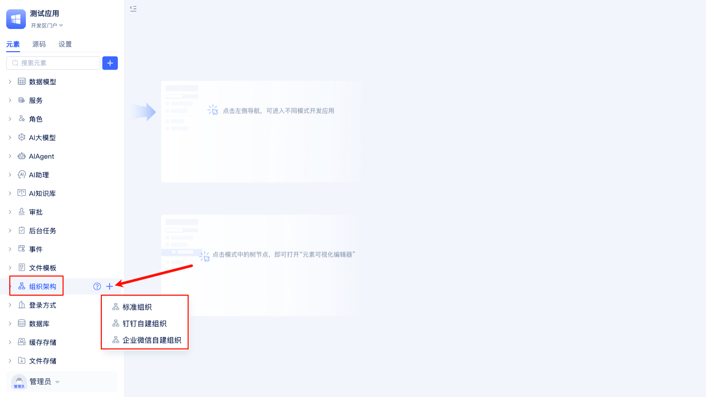

# Organizational Structure {#organizational-structure}
JitAi provides flexible and diverse organizational structure capabilities, supporting four types: Standard Organization, DingTalk Custom Organization, WeChat Work Custom Organization and Microsoft Teams. Users can flexibly choose the appropriate organizational structure according to actual management needs and system foundation, achieving efficient management of members and departments. The platform not only supports flexible configuration of members and departments, but also seamless integration with third-party platforms, fully meeting the diversified organizational management scenarios of enterprises.

## Default Organizational Structure {#default-organizational-structure}
When creating an application, JitAi will automatically generate a default organizational structure for you.

In the element tree of the development area, find and expand `Organizational Structure` to see the system-generated `Default Organizational Structure`. After clicking on it, detailed configuration information will be displayed on the right side, supporting editing of the organizational structure name, setting the organization leader, and configuring whether to allow new users to register and join the organization. The application creator will automatically become the organization leader and have administrator role. For role permissions, refer to the [Role and Portal Menu Permissions Guide](./role-portal-menu-permissions).

## Organizational Structure Creation {#organizational-structure-creation}
JitAi supports creating and managing multiple organizational structures within the same application, meeting complex management needs of enterprises with multiple business lines, cross-departments, or multiple subsidiaries. Developers can flexibly choose types such as Standard Organization, DingTalk Custom Organization, or WeChat Work Custom Organization based on actual scenarios, configuring different organizational structures, members, departments, and permission systems respectively. Each organizational structure is independent, supporting separate member management, department settings, and permission allocation, facilitating multi-tenant or multi-team collaboration. Through multi-organizational structure capabilities, enterprises can efficiently address challenges such as organizational expansion, business adjustments, and multi-platform integration, improving overall management efficiency and system flexibility.

In the element tree of the development area, click the `+` button on the right side of `Organizational Structure`, select to create a Standard Organization, DingTalk Custom Organization, or WeChat Work Custom Organization, fill in the relevant configuration information, and complete the creation of the organizational structure.

## Standard Organization {#standard-organization}
Standard Organization is the most basic type of organizational structure element. Users can maintain contact information independently in JitAi without relying on third parties, suitable for enterprises that do not use third-party communication and office platforms.

When creating an organizational structure, select Standard Organization to bring up the `Create Standard Organization` dialog. Enter the organization name (English name will be automatically generated), organization leader's name, phone number (optional), account password (default **admin123**), and whether to allow new registered users to join.

After filling in the configuration information, click `Confirm` to enter the visual editor for viewing.

### Allowing New Registered Users to Join {#allowing-new-registered-users-to-join}
When creating a standard organizational structure, the system will display the `Allow New Registered Users to Join` checkbox, which is checked by default. When checked, new registered users can directly join the organizational structure, facilitating rapid member expansion and management.

## DingTalk Custom Organization {#dingtalk-custom-organization}
DingTalk Custom Organization is an organizational structure element specifically designed for enterprises using the DingTalk office platform. Through this type, deep integration with the DingTalk platform can be achieved, automatically synchronizing department structures, member information, and other data from DingTalk, avoiding the burden of redundantly maintaining contact lists.

When creating an organizational structure, select DingTalk Custom Organization to bring up the `Create DingTalk Custom Organization` dialog. You need to fill in the organization name (English name will be automatically generated), Enterprise ID (CorpID), AgentID, AppKey, AppSecret, and other DingTalk application configuration information. This configuration information is used to establish a secure connection with the DingTalk platform, ensuring the accuracy and security of data synchronization.

After configuration is complete, the system will automatically synchronize organizational structure, department information, and member data from the DingTalk platform, achieving unified identity authentication and permission management.

**DingTalk Configuration Information Acquisition Guide: Please refer to [DingTalk Open Platform Documentation](https://open-dev.dingtalk.com)**

The Enterprise ID (CorpID) can be obtained from the enterprise information page of the DingTalk Open Platform.

Application parameters such as AgentID, AppKey, and AppSecret need to be obtained from the custom application details page of the DingTalk Open Platform.

After the organizational structure is created, JitAi will automatically configure [DingTalk Custom QR Code Login](./login-authentication#dingtalk-custom-qr-login) for the organization without manual setup, facilitating members to quickly log in to the system through DingTalk QR code scanning.

:::tip Note
Before performing DingTalk organization synchronization, please ensure that the following permissions have been enabled in the application's basic information permission management: `Address Book Department Information Read Permission`, `Member Information Read Permission`, `Address Book Department Member Read Permission`, to ensure smooth data synchronization.
:::

## WeChat Work Custom Organization {#wechat-work-custom-organization}
WeChat Work Custom Organization is an organizational structure element tailored for enterprises using the WeChat Work office platform. This type can seamlessly integrate with WeChat Work, achieving automatic synchronization of organizational structure and contact information, fully leveraging the mature ecosystem of WeChat Work to provide enterprises with integrated office solutions.

When creating an organizational structure, select WeChat Work Custom Organization, and the system will display the `Create WeChat Work Custom Organization` configuration dialog. You need to enter the organization name (English name automatically generated), Enterprise ID (CorpId), AgentID, Application Secret, and other WeChat Work application credential information. These parameters ensure proper integration with WeChat Work APIs and data transmission security.

After completing the configuration, the system will automatically pull organizational structure data from WeChat Work, including department hierarchy, member information, position information, etc., achieving deep integration and unified management with the WeChat Work ecosystem.

**WeChat Work Configuration Information Acquisition Guide: Please refer to [WeChat Work Official Documentation](https://work.weixin.qq.com)**

The Enterprise ID (CorpId) can be obtained from the enterprise information page in the WeChat Work management backend.

Application-related configuration information can be viewed on the details page of the WeChat Work custom application.

After the organizational structure is created, JitAi will automatically configure [WeChat Work Custom QR Code Login](./login-authentication#wechat-work-custom-qr-login) for the organization without manual setup, facilitating members to quickly log in to the system through WeChat Work QR code scanning.

:::tip Note
Before performing WeChat Work organization synchronization, please ensure that contact-related permissions (such as `Read Members`, `Read Departments`, etc.) have been assigned to the custom application in the WeChat Work management backend to ensure smooth data synchronization.
:::

## Microsoft Teams {#microsoft-teams}

Microsoft Teams organizational structure integration provides organizational docking capabilities for enterprises using Microsoft Teams as their enterprise collaboration platform. Through integration, enterprises can achieve automatic synchronization of organizational structure and member information with the Teams platform, facilitating unified management of departments, members, and permissions within the JitAi platform, thereby improving cross-platform collaboration efficiency.

When creating an organizational structure, select Microsoft Teams as the organization type, and the system will automatically display a configuration window. Please fill in the organization name (English name will be automatically generated), Tenant ID, Client ID, Client Secret, and other Microsoft Teams application-related credential information in sequence. After completing the configuration, the system will automatically synchronize organizational structure, department, and member information from the Microsoft Teams platform, achieving unified identity authentication and permission management, improving enterprise cross-platform collaboration efficiency.

**Microsoft Teams Configuration Information Acquisition Guide: Please refer to [Microsoft Teams Official Documentation](https://learn.microsoft.com/zh-cn/microsoftteams/platform/)**

:::tip Note
Before performing Microsoft Teams organization synchronization, please ensure that permissions to read organizational structure and member information have been assigned to the application in the Azure management backend to ensure smooth data synchronization.
:::

## Contact Management Entry {#contact-management-entry}
JitAi provides a contact management page where you can view department, member, and role information in real-time.

Developers can enter the management area and click `Contacts` in the left sidebar to see the organizational structure management panel on the right side.

### Setting Organization Leader {#setting-organization-leader}
In organizational structure management, you can set a leader for each organization to clarify management responsibilities. Setting a leader helps quickly locate key contacts in scenarios such as contact management and approvals, improving organizational management efficiency.

Each organizational structure supports setting a leader. After clicking the `Set Organization Leader` button, a `Select User` window will pop up. You can filter from all members, select by department or role, or directly choose yourself as the leader for quick selection.

### Department Member Search {#department-member-search}
To facilitate efficient management and member location, the system supports quick search for specific departments or members within the organizational structure. Regardless of the number of members, target objects can be quickly found.

Enter department names or member names in the search box at the top of the organizational structure page, and the system will automatically filter and highlight matching results. Click on search results to jump to the corresponding details page.

## Standard Organization Contacts {#standard-organization-contacts}
Standard Organization Contacts is used to centrally display and manage enterprise departments, members, roles, and other information, facilitating developers in organizational structure adjustments, member maintenance, and permission allocation.

### Creating Department {#creating-department}
In the `Organizational Structure` tab of Standard Organization, developers can create new departments based on actual business needs, flexibly building multi-level organizational hierarchy structures for enterprises. Support setting names, parent departments, and other information for each department, facilitating subsequent management and adjustments.

### Adding Member {#adding-member}
Supports adding new members under specified departments. When adding, you can fill in detailed information such as member names, employee IDs, contact information, positions, etc., facilitating unified member management and subsequent maintenance for enterprises.

### Importing Members {#importing-members}
Supports batch import functionality for one-time entry of large amounts of member information. You can download template files, fill them out as required and upload them. The system will automatically validate and import data, significantly improving member entry efficiency, suitable for initial enterprise setup or large-scale member change scenarios.

### Exporting Members {#exporting-members}
Supports exporting current department or entire organization member information to Excel and other file formats, facilitating data backup, analysis statistics, or integration with third-party systems. You can choose to export all members or selected members as needed.

### Adjusting Department {#adjusting-department}
Supports various department adjustment operations, including department renaming, moving to other parent departments, merging multiple departments, etc., meeting the needs of dynamic changes in enterprise organizational structure. All adjustment operations will be synchronized to the contacts in real-time, ensuring data consistency.

### Member Resignation {#member-resignation}
Member status can be set to resigned. Resigned members will be automatically removed from contacts and related permissions, ensuring the accuracy of organizational member information and system security. Supports batch operations, facilitating centralized processing of resigned members for enterprises.

### Creating Role {#creating-role}
In the role management panel, developers can create new roles based on enterprise organizational structure department positions to subdivide member responsibilities. For example, R&D Manager, Procurement Specialist, etc.

### Creating Role Group {#creating-role-group}
Supports creating new role groups to manage multiple related roles in groups, providing unified management of similar roles.

### Managing Role Members {#managing-role-members}
Members can be flexibly added to or removed from roles, with batch operation support, facilitating enterprises to timely adjust member roles based on position changes.

## DingTalk Organization Contacts {#dingtalk-organization-contacts}
In daily enterprise management, many companies choose to maintain and manage their organizational structure on the DingTalk platform. To facilitate developers in unified viewing and management of enterprise contacts on the JitAi platform, the system provides a synchronization and display page for DingTalk Custom Organization contacts. This page aims to help enterprises achieve real-time synchronization of organizational structure, ensuring the accuracy and consistency of member and department information.

In the contacts panel of the administrator portal, after switching to the `Organizational Structure` tab, developers can perform the following operations:

### Syncing DingTalk Organization Structure {#syncing-dingtalk-organization-structure}
Click the `Sync` button to synchronize the latest department, member, and other organizational information from the DingTalk backend to the JitAi platform with one click, ensuring that the organizational structure on the platform remains consistent with DingTalk. During synchronization, the system will automatically validate and update existing data, avoiding duplication and omission, ensuring data timeliness and accuracy.

### Exporting Members {#exporting-members-dingtalk}
Supports exporting current organization member information to Excel and other common file formats, facilitating data backup, analysis statistics, or integration with third-party systems. You can choose to export all members or selected members as needed, meeting data processing requirements in different scenarios.

:::tip
Department and member information cannot be directly edited on the JitAi platform. Editing must be completed in the DingTalk backend first, then synchronized to the platform in real-time through the sync function.
:::

## WeChat Work Organization Contacts {#wechat-work-organization-contacts}
Many enterprises also choose to maintain organizational structure on the WeChat Work platform. JitAi similarly provides synchronization and management pages for WeChat Work Custom Organization contacts, helping enterprises achieve unified management of organizational information across platforms.

In the contacts panel of the administrator portal, after switching to the `Organizational Structure` tab, developers can perform the following operations:

### Syncing WeChat Work Organization Structure {#syncing-wechat-work-organization-structure}
Click the `Sync` button to synchronize the latest department, member, and other organizational information from the WeChat Work backend to the JitAi platform with one click, ensuring that the organizational structure on the platform remains consistent with WeChat Work. During synchronization, the system will automatically validate and update existing data, avoiding duplication and omission, ensuring data timeliness and accuracy. 

### Exporting Members {#exporting-members-wechat-work}
Supports exporting current organization member information to Excel and other common file formats, facilitating data backup, analysis statistics, or integration with third-party systems. You can choose to export all members or selected members as needed, meeting data processing requirements in different scenarios. If members are selected, only the selected members will be exported; if no members are selected, all member information will be exported. 

:::tip
Department and member information similarly cannot be directly edited on the JitAi platform. Editing must be completed in the WeChat Work backend first, then synchronized to the platform in real-time through the sync function.
::: 
