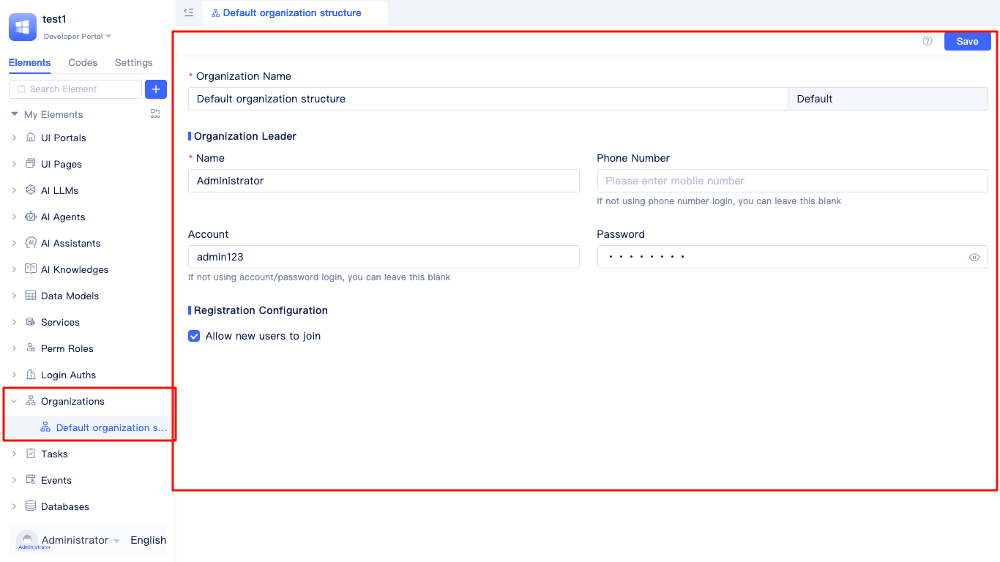
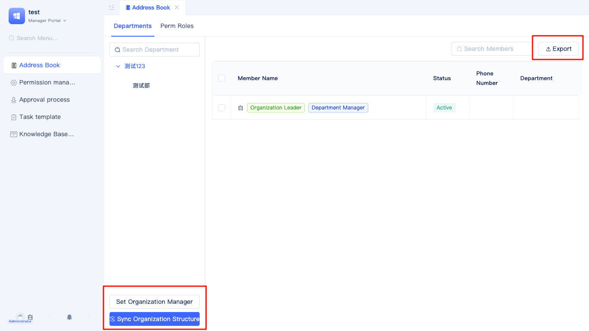

# Organization {#organization}
JitAi provides flexible and comprehensive organization management capabilities, supporting four types: `Generic Organization`, `DingTalk Self-built Org.`, `WeCom Self-built Org.`, and `Microsoft Teams`. Based on your specific management needs and existing systems, you can select the most appropriate organization to efficiently manage members and departments. The platform not only supports flexible member and department configuration but also seamlessly integrates with third-party platforms, fully accommodating diverse enterprise organizational management scenarios.

## Default Organization {#default-organization}
When you create an application, JitAi automatically generates a default organization.

In the element tree within the development area, locate and expand `Organizations` to view the system-generated `Default Organization`. Clicking on it displays detailed configuration information on the right side, where you can edit the organization name, set the organization leader, and configure whether to allow new user registrations. The application creator automatically becomes the organization leader with administrator privileges. For more information on role permissions, refer to the [Role and Portal Menu Permissions Guide](./role-portal-menu-permissions).

## Creating organizations {#creating-organizations}
JitAi supports creating and managing multiple organizations within a single application, accommodating the complex management needs of enterprises with multiple business lines, cross-departmental operations, or multiple subsidiaries. Based on your specific scenarios, you can flexibly select from `Generic Organization`, `DingTalk Self-built Org.`, `WeCom Self-built Org.` or `Microsoft Teams` types, each with independently configured organizations, members, departments, and permission systems. Each organization operates independently, supporting separate member management, department configuration, and permission allocation for multi-tenant or multi-team collaboration. Through these multi-organization capabilities, enterprises can efficiently handle challenges such as organizational expansion, business restructuring, and multi-platform integration, enhancing overall management efficiency and system flexibility.

In the element tree within the development area, click the `+` button next to `Organizations`, select the type, complete the configuration form, and create your organization.

## Generic organization {#generic-organization}
Generic Organization is the most fundamental type of organization element, allowing you to maintain contact information directly within JitAi without relying on third-party platforms. This option is ideal for enterprises that do not use external communication and collaboration platforms.

When creating an organization, select `Generic Organization` to open a dialog. Enter the organization name, organization leader's name, phone number (optional), account password (defaults to `admin123`), and specify whether to allow new registered users to join.

After completing the configuration, click `Confirm` to access the visual editor.

### Allowing new users to join {#allowing-new-users-to-join}
When creating a generic organization, the system displays the `Allow new users to join` checkbox, which is checked by default. When enabled, newly registered users can automatically join the organization, streamlining member onboarding and management.

## DingTalk Self-built Org. {#dingtalk-custom-organization}
DingTalk Self-built Org. is an organization element specifically designed for enterprises using the DingTalk collaboration platform. This type enables deep integration with DingTalk, automatically synchronizing department structures, member information, and other organizational data, eliminating the need for redundant contact list maintenance.

When creating an organization, select `DingTalk Self-built Org.` to open a dialog. Enter the organization name, Enterprise ID (CorpID), AgentID, AppKey, AppSecret, and other DingTalk application credentials. These configuration parameters establish a secure connection with DingTalk, ensuring accurate and secure data synchronization.

After configuration, the system automatically synchronizes organizational structure, department information, and member data from DingTalk, enabling unified identity authentication and permission management.

**DingTalk Configuration Information Guide: Refer to [DingTalk Open Platform Documentation](https://open-dev.dingtalk.com)**

The Enterprise ID (CorpID) can be obtained from the enterprise information page on the DingTalk Open Platform.

Application parameters such as AgentID, AppKey, and AppSecret can be obtained from your custom application's details page on the DingTalk Open Platform.

Once created, JitAi automatically configures [DingTalk QR Code Login](./login-authentication#dingtalk-custom-qr-login) for the organization without manual setup, allowing members to quickly log in via DingTalk QR code scanning.

:::tip Note
Before synchronizing your DingTalk organization, ensure the following permissions are enabled in your application's permission management: `Address Book Department Information Read Permission`, `Member Information Read Permission`, and `Address Book Department Member Read Permission` to guarantee smooth data synchronization.
:::

## WeCom Self-built Org. {#wechat-work-custom-organization}
WeCom Self-built Org. is an organization element tailored for enterprises using the WeCom collaboration platform. This type seamlessly integrates with WeCom, automatically synchronizing organizational structures and contact information while leveraging WeCom's mature ecosystem to provide integrated collaboration solutions.

When creating an organization, select `WeCom Self-built Org.` to display the `Create WeCom Self-built Org.` configuration dialog. Enter the organization name, Enterprise ID (CorpId), AgentID, Application Secret, and other WeCom application credentials. These parameters ensure proper API integration and secure data transmission.

After completing the configuration, the system automatically retrieves organizational structure data from WeCom, including department hierarchies, member information, position details, and more, achieving deep integration and unified management with the WeCom ecosystem.

**WeCom Configuration Information Guide: Refer to [WeCom Official Documentation](https://work.weixin.qq.com)**

The Enterprise ID (CorpId) can be obtained from the enterprise information page in the WeCom admin console.

Application configuration information can be viewed on your custom application's details page in WeCom.

Once created, JitAi automatically configures [WeCom QR Code Login](./login-authentication#wechat-work-custom-qr-login) for the organization without manual setup, allowing members to quickly log in via WeCom QR code scanning.

:::tip Note
Before synchronizing your WeCom organization, ensure contact-related permissions (such as `Read Members` and `Read Departments`) have been assigned to your custom application in the WeCom admin console to guarantee smooth data synchronization.
:::

## Microsoft Teams {#microsoft-teams}

Microsoft Teams integration provides organizational connectivity for enterprises using Microsoft Teams as their primary collaboration platform. This integration enables automatic synchronization of organizational structure and member information with Teams, facilitating unified department, member, and permission management within JitAi and improving cross-platform collaboration efficiency.

When creating an organization, select `Microsoft Teams` as the organization type to display the configuration window. Enter the organization name, Tenant ID, Client ID, Client Secret, and other Microsoft Teams application credentials. After configuration, the system automatically synchronizes organizational structure, department, and member information from Microsoft Teams, enabling unified identity authentication and permission management for enhanced cross-platform collaboration.

**Microsoft Teams Configuration Information Guide: Refer to [Microsoft Teams Official Documentation](https://learn.microsoft.com/en-us/microsoftteams/platform/)**

:::tip Note
Before synchronizing your Microsoft Teams organization, ensure the application has been granted permissions to read organizational structure and member information in the Azure admin portal to guarantee smooth data synchronization.
:::

## Contact management entry {#contact-management-entry}
JitAi provides a contact management page for viewing department, member, and role information in real-time.

In the management area, click `Contacts` in the left sidebar to access the organization management panel on the right.

### Setting organization leader {#setting-organization-leader}
Within organization management, you can designate a leader for each organization to clarify management responsibilities. Setting a leader enables quick identification of key contacts for scenarios such as contact management and approvals, enhancing organizational efficiency.

Each organization supports leader assignment. Click the `Set Organization Leader` button to open the `Select User` window. You can filter from all members, select by department or role, or quickly assign yourself as the leader.

### Department member search {#department-member-search}
To facilitate efficient management and member lookup, the system supports quick searches for specific departments or members within the organization, enabling rapid target identification regardless of member count.

Enter department names or member names in the search box at the top of the organization page. The system automatically filters and highlights matching results. Click any result to navigate to the corresponding details page.

## Generic organization contacts {#generic-organization-contacts}
Generic Organization Contacts provides centralized display and management of enterprise departments, members, roles, and other organizational information, facilitating organization adjustments, member maintenance, and permission allocation.

### Creating department {#creating-department}
In the `Organizations` tab of Generic Organization, you can create new departments based on business needs, flexibly building multi-level organizational hierarchies. You can set department names, parent departments, and other information, facilitating subsequent management and adjustments.

### Adding member {#adding-member}
Add new members to specified departments by entering detailed information such as names, employee IDs, contact details, positions, and more, enabling unified member management and streamlined maintenance.

### Importing members {#importing-members}
The batch import functionality allows one-time entry of large volumes of member information. Download the template file, complete it according to requirements, and upload it. The system automatically validates and imports the data, significantly improving member entry efficiency—ideal for initial enterprise setup or large-scale member transitions.

### Exporting members {#exporting-members}
Export current department or entire organization member information to Excel and other formats for data backup, statistical analysis, or third-party system integration. Choose to export all members or selected members as needed.

### Adjusting department {#adjusting-department}
Perform various department adjustment operations including renaming, relocating to different parent departments, and merging multiple departments to accommodate dynamic organizational changes. All adjustments synchronize to the contacts in real-time, ensuring data consistency.

### Member resignation {#member-resignation}
Set member status to resigned. Resigned members are automatically removed from contacts and related permissions, maintaining organizational information accuracy and system security. Batch operations are supported for efficient centralized processing.

### Creating role {#creating-role}
In the role management panel, create new roles based on your enterprise's organization and departmental positions to subdivide member responsibilities, such as R&D Manager or Procurement Specialist.

### Creating role group {#creating-role-group}
Create role groups to manage multiple related roles collectively, enabling unified management of similar roles.

### Managing role members {#managing-role-members}
Flexibly add or remove members from roles with batch operation support, facilitating timely role adjustments based on position changes.

## DingTalk organization contacts {#dingtalk-organization-contacts}
Many enterprises maintain and manage their organization on the DingTalk platform. To facilitate unified viewing and management of enterprise contacts within JitAi, the system provides a synchronization and display page for DingTalk Self-built Org. contacts, enabling real-time organization synchronization and ensuring member and department information accuracy and consistency.

In the contacts panel of the administrator portal, switch to the `Organization` tab to perform the following operations:

### Syncing DingTalk organization structure {#syncing-dingtalk-organization-structure}
Click the `Sync` button to synchronize the latest department, member, and organizational information from DingTalk to JitAi with one click, ensuring platform consistency with DingTalk. During synchronization, the system automatically validates and updates existing data, preventing duplication and omissions while maintaining data timeliness and accuracy.

### Exporting members {#exporting-members-dingtalk}
Export current organization member information to Excel and other common formats for data backup, statistical analysis, or third-party system integration. Choose to export all members or selected members as needed, accommodating different data processing scenarios.

:::tip
Department and member information cannot be directly edited on the JitAi platform. Complete edits in the DingTalk backend first, then synchronize to the platform in real-time using the sync function.
:::

## WeCom organization contacts {#wechat-work-organization-contacts}
Many enterprises maintain their organization on the WeCom platform. JitAi provides synchronization and management pages for WeCom Self-built Org. contacts, enabling unified cross-platform organizational information management.

In the contacts panel of the administrator portal, switch to the `Organization` tab to perform the following operations:

### Syncing WeCom organization structure {#syncing-wechat-work-organization-structure}
Click the `Sync` button to synchronize the latest department, member, and organizational information from WeCom to JitAi with one click, ensuring platform consistency with WeCom. During synchronization, the system automatically validates and updates existing data, preventing duplication and omissions while maintaining data timeliness and accuracy.

### Exporting members {#exporting-members-wechat-work}
Export current organization member information to Excel and other common formats for data backup, statistical analysis, or third-party system integration. Choose to export all members or selected members as needed, accommodating different data processing scenarios. When members are selected, only those members will be exported; otherwise, all member information will be exported.

:::tip
Department and member information cannot be directly edited on the JitAi platform. Complete edits in the WeCom backend first, then synchronize to the platform in real-time using the sync function.
::: 
