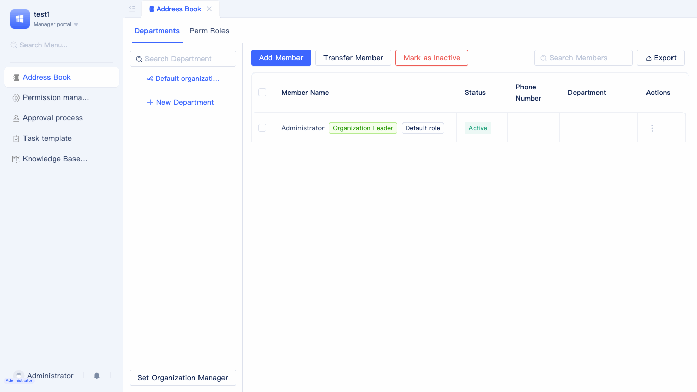

# Organization
JitAi provides flexible and comprehensive organization management capabilities, supporting four types: `Generic Organization`, `DingTalk Self-built Org.`, `WeCom Self-built Org.`, and `Microsoft Teams`. Based on your specific management needs and existing systems, you can select the most appropriate organization to efficiently manage members and departments. The platform not only supports flexible member and department configuration but also seamlessly integrates with third-party platforms, fully accommodating diverse enterprise organizational management scenarios.

## Default organization {#default-organization}
When you create an application, JitAi automatically generates a default organization.

In the element tree of the development area, locate and expand `Organizations` to see the system-generated `Default Organization Structure`. After clicking on it, detailed configuration information will be displayed on the right side, supporting editing of the organizational structure name, setting the organization leader, and configuring whether to allow new users to register and join the organization. The application creator will automatically become the organization leader and have administrator role. For role permissions, refer to the [Role and Portal Menu Permissions Guide](./role-portal-menu-permissions).

## Organizational structure creation {#organizational-structure-creation}
JitAi supports creating and managing multiple organizational structures within the same application, meeting complex management needs of enterprises with multiple business lines, cross-departments, or multiple subsidiaries. Developers can flexibly choose types such as Standard Organization, DingTalk Custom Organization, or WeCom Custom Organization based on their scenarios, configuring different organizational structures, members, departments, and permission systems respectively. Each organizational structure is independent, supporting separate member management, department settings, and permission allocation, facilitating multi-tenant or multi-team collaboration. Through multi-organizational structure capabilities, enterprises can efficiently address challenges such as organizational expansion, business adjustments, and multi-platform integration, improving overall management efficiency and system flexibility.

In the element tree of the development area, click the `+` button on the right side of `Organizations`, select to create a Standard Organization, DingTalk Custom Organization, or WeCom Custom Organization, fill in the relevant configuration information, and complete the creation of the organizational structure.

## Generic organization {#generic-organization}
Generic Organization is the most fundamental type of organization element, allowing you to maintain contact information directly within JitAi without relying on third-party platforms. This option is ideal for enterprises that do not use external communication and collaboration platforms.

When creating an organizational structure, select `Generic Organization` to display the `Create Element > Generic Organization` dialog. Enter the organization name (English name will be automatically generated), organization leader's name, phone number (optional), account password (default **admin123**), and whether to allow new registered users to join.

After completing the configuration, click `Confirm` to access the visual editor.

### Allowing New Registered Users to Join {#allowing-new-registered-users-to-join}
When creating a standard organizational structure, the system will display the `Allow New Users to Join` checkbox, which is checked by default. When checked, new registered users can directly join the organizational structure, facilitating rapid member expansion and management.

## DingTalk self-built org. {#dingtalk-custom-organization}
DingTalk Custom Organization is an organizational structure element specifically designed for enterprises using the DingTalk office platform. Through this type, deep integration with the DingTalk platform can be achieved, automatically synchronizing department structures, member information, and other data from DingTalk, avoiding the burden of redundantly maintaining contact lists.

When creating an organization, select `DingTalk Self-built Org.` to open a dialog. Enter the organization name, Enterprise ID (CorpID), AgentID, AppKey, AppSecret, and other DingTalk application credentials. These configuration parameters establish a secure connection with DingTalk, ensuring accurate and secure data synchronization.

After configuration, the system automatically synchronizes organizational structure, department information, and member data from DingTalk, enabling unified identity authentication and permission management.

**DingTalk Configuration Information Guide: Refer to [DingTalk Open Platform Documentation](https://open-dev.dingtalk.com)**

The Enterprise ID (CorpID) can be obtained from the enterprise information page on the DingTalk Open Platform.

Application parameters such as AgentID, AppKey, and AppSecret can be obtained from your custom application's details page on the DingTalk Open Platform.

Once created, JitAi automatically configures [DingTalk QR Code Login](./login-authentication#dingtalk-custom-qr-login) for the organization without manual setup, allowing members to quickly log in via DingTalk QR code scanning.

:::tip Note
Before synchronizing your DingTalk organization, ensure the following permissions are enabled in your application's permission management: `Address Book Department Information Read Permission`, `Member Information Read Permission`, and `Address Book Department Member Read Permission` to guarantee smooth data synchronization.
:::

## WeCom self-built org. {#wechat-work-custom-organization}
WeCom Self-built Org. is an organizational structure element tailored for enterprises using the WeCom office platform. This type can seamlessly integrate with WeCom, achieving automatic synchronization of organizational structure and contact information, fully leveraging the mature ecosystem of WeCom to provide enterprises with integrated office solutions.

When creating an organizational structure, select `WeCom Self-built Org.`, and the system will display the `Create Element > WeCom Self-built Org.` configuration dialog. You need to enter the organization name (English name automatically generated), Enterprise ID (CorpId), AgentID, Application Secret, and other WeCom application credential information. These parameters ensure proper integration with WeCom APIs and data transmission security.

After completing the configuration, the system will automatically pull organizational structure data from WeCom, including department hierarchy, member information, position information, etc., achieving deep integration and unified management with the WeCom ecosystem.

**WeCom Configuration Information Acquisition Guide: Please refer to [WeCom Official Documentation](https://work.weixin.qq.com)**

The Enterprise ID (CorpId) can be obtained from the enterprise information page in the WeCom management backend.

Application-related configuration information can be viewed on the details page of the WeCom custom application.

After the organizational structure is created, JitAi will automatically configure [WeCom Self-built QR Code](./login-authentication#wechat-work-custom-qr-login) for the organization without manual setup, facilitating members to quickly log in to the system through WeCom QR code scanning.

:::tip Note
Before performing WeCom organization synchronization, please ensure that contact-related permissions (such as `Read Members`, `Read Departments`, etc.) have been assigned to the custom application in the WeCom management backend to ensure smooth data synchronization.
:::

## Microsoft Teams {#microsoft-teams}

Microsoft Teams integration provides organizational connectivity for enterprises using Microsoft Teams as their primary collaboration platform. This integration enables automatic synchronization of organizational structure and member information with Teams, facilitating unified department, member, and permission management within JitAi and improving cross-platform collaboration efficiency.

When creating an organization, select `Microsoft Teams` as the organization type to display the configuration window. Enter the organization name, Tenant ID, Client ID, Client Secret, and other Microsoft Teams application credentials. After configuration, the system automatically synchronizes organizational structure, department, and member information from Microsoft Teams, enabling unified identity authentication and permission management for enhanced cross-platform collaboration.

**Microsoft Teams Configuration Information Guide: Refer to [Microsoft Teams Official Documentation](https://learn.microsoft.com/en-us/microsoftteams/platform/)**

:::tip Note
Before synchronizing your Microsoft Teams organization, ensure the application has been granted permissions to read organizational structure and member information in the Azure admin portal to guarantee smooth data synchronization.
:::

## Contact management entry {#contact-management-entry}
JitAi provides a contact management page for viewing department, member, and role information in real-time.

In the management area, click `Contacts` in the left sidebar to access the organization management panel on the right.

### Setting organization leader {#setting-organization-leader}
Within organization management, you can designate a leader for each organization to clarify management responsibilities. Setting a leader enables quick identification of key contacts for scenarios such as contact management and approvals, enhancing organizational efficiency.

Each organizational structure supports setting a leader. After clicking the `Set Organization Manager` button, a `Select User` window will appear. You can filter from all members, select by department or role, or directly choose yourself as the leader for quick selection.

### Department member search {#department-member-search}
To facilitate efficient management and member lookup, the system supports quick searches for specific departments or members within the organization, enabling rapid target identification regardless of member count.

Enter department names or member names in the search box at the top of the organization page. The system automatically filters and highlights matching results. Click any result to navigate to the corresponding details page.

## Generic organization contacts {#generic-organization-contacts}
Generic Organization Contacts provides centralized display and management of enterprise departments, members, roles, and other organizational information, facilitating organization adjustments, member maintenance, and permission allocation.

### Creating department {#creating-department}
In the `Organizations` tab of Standard Organization, developers can create new departments based on their business needs, flexibly building multi-level organizational hierarchy structures for enterprises. Support setting names, parent departments, and other information for each department, facilitating subsequent management and adjustments.

### Adding member {#adding-member}
Add new members to specified departments by entering detailed information such as names, employee IDs, contact details, positions, and more, enabling unified member management and streamlined maintenance.

### Importing members {#importing-members}
The batch import functionality allows one-time entry of large volumes of member information. Download the template file, complete it according to requirements, and upload it. The system automatically validates and imports the data, significantly improving member entry efficiency—ideal for initial enterprise setup or large-scale member transitions.

### Exporting members {#exporting-members}
Export current department or entire organization member information to Excel and other formats for data backup, statistical analysis, or third-party system integration. Choose to export all members or selected members as needed.

### Adjusting department {#adjusting-department}
Perform various department adjustment operations including renaming, relocating to different parent departments, and merging multiple departments to accommodate dynamic organizational changes. All adjustments synchronize to the contacts in real-time, ensuring data consistency.

### Member resignation {#member-resignation}
Set member status to resigned. Resigned members are automatically removed from contacts and related permissions, maintaining organizational information accuracy and system security. Batch operations are supported for efficient centralized processing.

### Creating role {#creating-role}
In the role management panel, create new roles based on your enterprise's organization and departmental positions to subdivide member responsibilities, such as R&D Manager or Procurement Specialist.

### Creating role group {#creating-role-group}
Create role groups to manage multiple related roles collectively, enabling unified management of similar roles.

### Managing role members {#managing-role-members}
Flexibly add or remove members from roles with batch operation support, facilitating timely role adjustments based on position changes.

## DingTalk organization contacts {#dingtalk-organization-contacts}
Many enterprises maintain and manage their organization on the DingTalk platform. To facilitate unified viewing and management of enterprise contacts within JitAi, the system provides a synchronization and display page for DingTalk Self-built Org. contacts, enabling real-time organization synchronization and ensuring member and department information accuracy and consistency.

In the contacts panel of the administrator portal, after switching to the `Organizations` tab, developers can perform the following operations:

### Syncing DingTalk organization structure {#syncing-dingtalk-organization-structure}
Click the `Sync` button to synchronize the latest department, member, and organizational information from DingTalk to JitAi with one click, ensuring platform consistency with DingTalk. During synchronization, the system automatically validates and updates existing data, preventing duplication and omissions while maintaining data timeliness and accuracy.

### Exporting members {#exporting-members-dingtalk}
Export current organization member information to Excel and other common formats for data backup, statistical analysis, or third-party system integration. Choose to export all members or selected members as needed, accommodating different data processing scenarios.

:::tip
Department and member information cannot be directly edited on the JitAi platform. Complete edits in the DingTalk backend first, then synchronize to the platform in real-time using the sync function.
:::

## WeCom organization contacts {#wechat-work-organization-contacts}
Many enterprises also choose to maintain organizational structure on the Wecom platform. JitAi similarly provides synchronization and management pages for Wecom Custom Organization contacts, helping enterprises achieve unified management of organizational information across platforms.

In the contacts panel of the administrator portal, after switching to the `Organizations` tab, developers can perform the following operations:

### Syncing WeCom organization structure {#syncing-wechat-work-organization-structure}
Click the `Sync` button to synchronize the latest department, member, and other organizational information from the Wecom backend to the JitAi platform with one click, ensuring that the organizational structure on the platform remains consistent with Wecom. During synchronization, the system will automatically validate and update existing data, avoiding duplication and omission, ensuring data timeliness and accuracy. 

### Exporting members {#exporting-members-wechat-work}
Export current organization member information to Excel and other common formats for data backup, statistical analysis, or third-party system integration. Choose to export all members or selected members as needed, accommodating different data processing scenarios. When members are selected, only those members will be exported; otherwise, all member information will be exported.

:::tip
Department and member information similarly cannot be directly edited on the JitAi platform. Editing must be completed in the Wecom backend first, then synchronized to the platform in real-time through the sync function.
::: 
