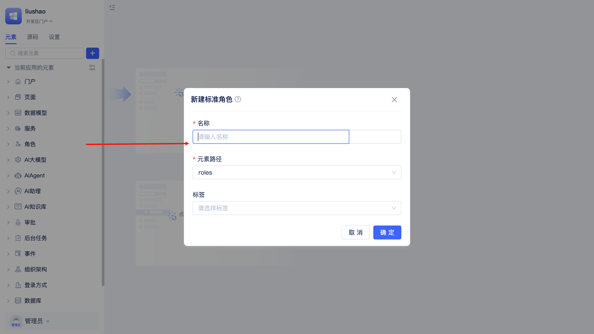
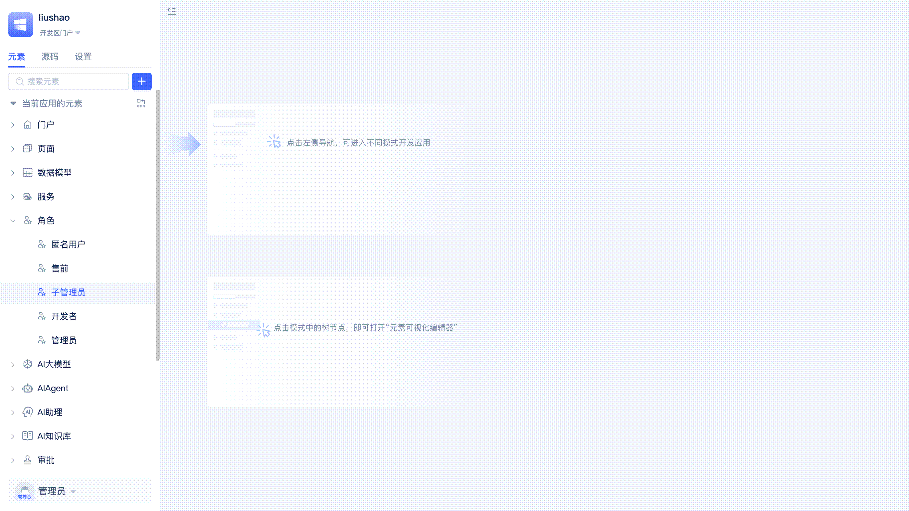
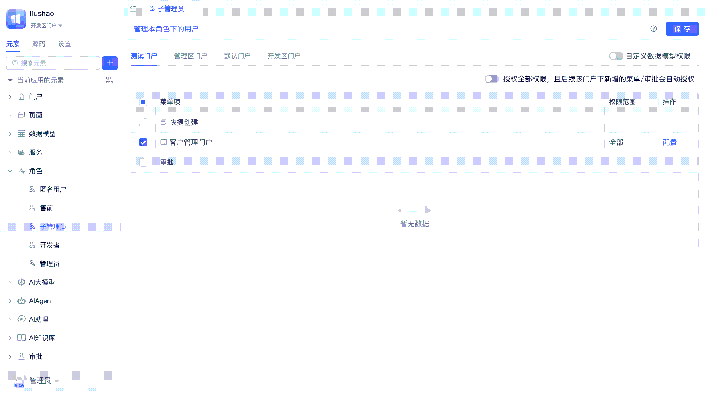
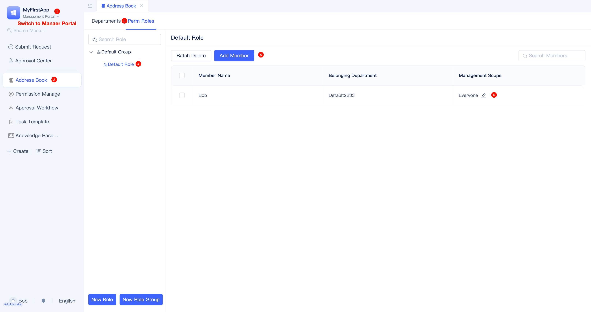
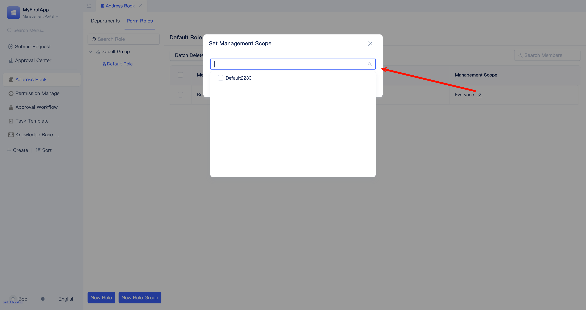

# Role and Portal Menu Permissions {#role-portal-menu-permissions}

RBAC (Role-Based Access Control) is a widely adopted permission management mechanism that controls access to system resources by assigning roles to users and granting appropriate permissions to those roles.

Designing a comprehensive role-based permission system aligned with business processes is a critical aspect of enterprise application design. JitAi provides multi-layered, granular operational and data permission control solutions. For any combination of `application role + portal + page + component + data model + model function`, you can implement fine-grained permission configurations to ensure maximum data security during application usage and prevent unauthorized access.

## Built-in application roles {#built-in-three-application-roles}

For each newly created application, three basic application roles are automatically created: anonymous user, developer, and administrator.

:::tip Distinguishing organizational roles from application roles
Organizational roles correspond to positions within the enterprise organizational structure, while `application roles` represent user permissions within the application system. Organizational roles and application roles are conceptually similar but do not have a strict one-to-one correspondence. For instance, an ordinary employee can be assigned an application administrator role to manage specific functional modules within an application.
:::

### Anonymous user {#anonymous-user}

Anonymous users are unregistered users who have not logged into the system. Applications typically configure publicly accessible pages and data for anonymous users. By default, JitAi does not grant anonymous users any portal permissions, which developers must explicitly configure.

### Developer {#developer}

The application creator is automatically assigned the developer role with full access to the [Developer Portal](../shell-and-page/portal-navigation-design#developer-portal), enabling comprehensive application development tasks including role creation and permission configuration.

### Administrator {#administrator}

The application creator is automatically assigned the administrator role with complete administrative control over the application, enabling comprehensive modifications and configurations. Administrative functions are primarily managed through the [Manager Portal](../shell-and-page/portal-navigation-design#manager-portal).

:::tip
**Only** developers can create application roles and grant portal menu permissions in the Developer Portal.

For daily management of application role members, administrators should operate in the Manager Portal. Note that administrators can view but cannot modify data permissions and functional permission configurations for application roles.
:::

## Creating application roles {#create-application-role}

You can define different application roles based on organizational positions (such as sales, finance, customer service, etc.) or specific business process requirements.

To create a new role, developers locate `Perm Roles` in the element directory tree, click the `+` button on the right, select `Generic Role`, enter the role name in the form dialog, and click the `Confirm` button to complete the creation.

## Application role permission configuration {#application-role-permission-configuration}

### Specifying accessible portals and menus {#specify-accessible-portals-and-menus}

Different departments require access to different resources: the HR department needs employee information, the sales department needs customer information, and the finance department needs financial reports. By specifying accessible portals and menus for each role, you ensure users can only access functions relevant to their work responsibilities.

The visual editor for application roles displays all available portals, allowing developers to select which menus within each portal the current role can access.

When developers grant access to all menus within a portal, any subsequently added menus automatically inherit these permissions without requiring manual configuration.

### Managing application role members in the Developer Portal {#manage-application-role-members-in-developer-portal}

Typically, before deploying an application system to customers, developers can pre-configure initial role assignments, enabling customers to begin their daily operations immediately once the system goes live.

In the application role visual editor, developers click `Manage users assigned to this role` in the upper left corner to add or remove members for the current role. When adding members, you can select individual users, organizational roles, or entire departments. Users with administrative privileges can subsequently manage role membership through the Manager Portal.

Developers can also click the `Configuration` button to define the organizational scope for application role members. However, for routine operations, administrators should handle [member management scope settings in organization](#member-management-scope-settings-in-org) through the Manager Portal.

### Component button permission control {#component-button-permission-control}

Users with different roles may see different operation buttons when accessing the same page. For example, on a customer management page, sales personnel can see "Add" and "Edit" buttons, while finance personnel can only query data without modification capabilities.

In the visual editor for application roles, developers can click the `Configuration` button to the right of portal menus. The popup permission configuration interface displays all components on the menu page and the button list for each component. Simply uncheck buttons that should not be displayed for this role.

Newly added buttons are enabled by default; developers must manually disable them if access should be restricted for specific roles.

### Component data field read/write/statistics permission control {#component-data-field-access-control}

Most components require data model binding. Developers can implement [portal-level data operation type and scope control](./roles-and-business-element-permissions#portal-level-data-operation-type-and-scope-control) and apply additional granular controls at the component level, including data scope filtering, field-level read/write permissions, and statistical permission controls. Component-level configurations take precedence over page-level settings.

In the permission configuration interface for portal menus, click a component, then click the `Configuration` button to the right of `Data Source` to configure filter conditions.

When developers disable a field's `Visible` option, that field becomes hidden in the component. Disabling `Editable` prevents users from modifying that field within the component. Disabling `Statistic` prevents users from performing statistical operations on that field. When a field is set to not visible, both `Editable` and `Statistic` options are automatically disabled.

## Hierarchical management of multiple application roles {#hierarchical-management-of-multiple-application-roles}

Application roles can be organized into management hierarchies with defined scopes. Roles with supervisory authority can perform [member management](#application-role-member-management) for their subordinate roles through the Manager Portal's address book. For example, a development director can manage backend development managers but has no authority over finance directors.

The Manager Portal has a built-in `Permission Manage` menu enabled by default. Developers click the `Configuration` button in the operation column to the right of `Permission Manage` and specify `Manage Role Scope` as either `All Roles` or `Specify Roles` in the popup dialog.

## Application role member management {#application-role-member-management}

Roles with Manager Portal permissions can perform member management for application roles through the Manager Portal's address book.

### Member addition and removal {#member-addition-and-removal}

Users click `Address Book` in the left menu and switch to the `Perm Roles` tab on the address book page to view the list of application roles under their jurisdiction. Click a role to perform member addition, batch deletion, search, and management scope modifications in the table on the right.

### Member management scope settings in organization {#member-management-scope-settings-in-org}

Consider an expense report approval scenario: an enterprise typically has multiple departments, with two finance department employees responsible for expense approvals. Both employees hold the Expense Specialist application role, but each is responsible for approving reports from different departments, thus requiring distinct management scopes.

Administrators click the modify button in the `Management Scope` column of the member list to configure each member's scope of authority in the popup dialog. When an expense report reaches the Expense Specialist approval stage, the system automatically routes it to the appropriate specialist based on the submitter's department and sends a notification to complete the approval.
