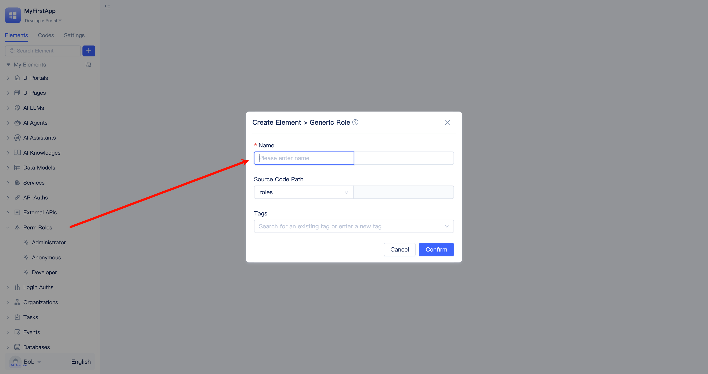

# Role and Portal Menu Permissions {#role-portal-menu-permissions}
RBAC (Role-Based Access Control) is a widely adopted permission management mechanism that controls access to system resources by assigning roles to users and granting appropriate permissions to those roles.

Designing a comprehensive role-based permission system aligned with business processes is a critical aspect of enterprise application design. JitAi provides multi-layered, granular operational and data permission control solutions. For any combination of `application role + portal + page + component + data model + model function`, granular permission configurations can be implemented to ensure maximum data security during application usage and prevent unauthorized access.

## Built-in Three Application Roles {#built-in-three-application-roles}
For each newly created application, three basic application roles are automatically created: anonymous user, developer, and administrator.

:::tip Distinguishing Organizational Roles from Application Roles
Organizational roles correspond to positions within the enterprise organizational structure, while `application roles` represent user permissions within the application system. Organizational roles and application roles are similar but do not have a strict correspondence. An ordinary employee can also be assigned an application administrator role to manage certain functional modules within an application system.
:::

### Anonymous User {#anonymous-user}
Anonymous users are unregistered users. Applications typically configure some publicly accessible pages and data for anonymous users. JitAi does not grant anonymous users any portal permissions by default, requiring developers to configure them.

### Developer {#developer}
The application creator is automatically assigned the developer role, with full access to the [Developer Portal](../shell-and-page/portal-navigation-design#developer-portal), enabling comprehensive application development tasks (including role creation and permission configuration).

### Administrator {#administrator}
The application creator is automatically assigned the administrator role, with full administrative control over the application, enabling comprehensive modifications and configurations. Administrative functions are primarily managed through the [Manager Portal](../shell-and-page/portal-navigation-design#manager-portal).

:::tip
**Only** developers can create application roles and grant portal menu permissions in the Developer Portal.

For daily management of application role members, it is recommended that administrators operate in the Manager Portal. Additionally, administrators can view but cannot modify data permissions and functional permission configurations for application roles.
:::

## Creating Application Roles {#create-application-role}
Different application roles can be defined based on different positions (such as sales, finance, customer service, etc.) or business process requirements.

Developers find `Roles` in the element directory tree, click the `+` button on the right, select `Regular Role`, fill in the role name in the form popup, and click the `Confirm` button to complete the creation of a new role.

## Application Role Permission Configuration {#application-role-permission-configuration}
### Specifying Accessible Portals and Menus {#specify-accessible-portals-and-menus}
The HR department needs to access employee information, the sales department needs to access customer information, and the finance department needs to access financial reports. By specifying accessible portals and menus for roles, you can ensure users can only access functions required for their work.

The visual editor for application roles displays all available portals, allowing developers to select which menus within each portal the current role can access.

When developers grant access to all menus within a portal, any subsequently added menus will automatically inherit these permissions without requiring manual configuration.

### Managing Application Role Members in Developer Portal {#manage-application-role-members-in-developer-portal}
Typically, before deploying an application system to customers, developers can pre-configure initial role assignments so that customers can immediately begin their daily operations once the system is live.

In the application role visual editor, developers click `Manage Users in This Role` in the upper left corner to add or remove members for the current role. When adding members, you can select individual users or entire organizational roles and departments. Users with administrative privileges can later manage role membership through the Manager Portal.

Developers can also click the `Configure` button to define the organizational scope for application role members. However, for day-to-day operations, it's recommended that administrators handle [Member Management Scope Settings in Organizational Structure](#member-management-scope-settings-in-org-structure) through the Manager Portal.

### Component Button Permission Control {#component-button-permission-control}
When users with different roles access the same page, the operation buttons they see may be different. For example, on a customer management page, sales personnel can see "Add" and "Edit" buttons, while finance personnel can only query data.

Developers can click the `Configure` button to the right of portal menus in the visual editor for application roles. In the popup permission configuration interface, you can see all component lists on the menu page and the button list for each component. Simply uncheck buttons that don't need to be displayed.

New buttons added later will be enabled by default; developers must manually disable them if access should be restricted.

### Component Data Field Read/Write/Statistics Permission Control {#component-data-field-access-control}
Most components require data model binding. Developers can implement [Portal-level Data Operation Type and Scope Control](./roles-and-business-element-permissions#portal-level-data-operation-type-and-scope-control) and apply additional granular data scope, field-level read/write, and statistical permission controls at the component level, which take precedence over existing page-level component configurations.

In the permission configuration interface for portal menus, click on a component, then click the `Configure` button to the right of `Data Source` to configure filter conditions.

When developers disable a field's `Visible` option, that field will be hidden from the component. Disabling `Editable` prevents users from modifying that field within the component. Disabling `Statistical` prevents users from performing statistical operations on that field. When a field is set to `Not Visible`, both `Editable` and `Statistical` options are automatically disabled.

## Hierarchical Management of Multiple Application Roles {#hierarchical-management-of-multiple-application-roles}
Application roles can be organized into management hierarchies with defined scopes. Roles with supervisory authority can perform [member management](#application-role-member-management) for their subordinate roles through the Manager Portal's directory. For example, a development director can manage backend development managers but has no authority over finance directors.

The Manager Portal has the built-in `Permission Management` menu enabled by default. Developers click the `Configure` button in the operation column to the right of `Permission Management` and specify `Management Role Scope` as `All Roles` or `Specified Roles` in the popup.

## Application Role Member Management {#application-role-member-management}
Roles with Manager Portal permissions can perform member management for application roles in the Manager Portal's address book.

### Member Addition and Removal {#member-addition-and-removal}

Users click `Address Book` in the left menu, switch to the `Roles` tab on the address book page, and can see the list of application roles they have jurisdiction over. Click on a role to perform member addition, batch deletion, search, and management scope modification in the table on the right.

### Member Management Scope Settings in Organizational Structure {#member-management-scope-settings-in-org-structure}
Consider an expense report approval scenario: an enterprise typically has multiple departments, with two finance department employees responsible for expense approvals. Both hold the `Expense Specialist` application role, but each is responsible for approving reports from different departments, requiring distinct management scopes.

Administrators click the modify button in the `Management Scope` column of the member list to configure each member's scope of authority in the popup dialog. When an expense report reaches the `Expense Specialist` approval stage, the system automatically routes it to the appropriate specialist based on the submitter's department and sends notification to complete the approval.