# Using WeChat Work Self-built Application and Adding JitAI Application to Workspace

## Introduction

JitAI utilizes WeChat Work self-built organization elements with the help of WeChat Work self-built applications to achieve WeChat Work organizational structure synchronization, WeChat Work QR code login to JitAI application, and implement password-free login in WeChat Work workspace, WeChat Work message notifications, WeChat Work approvals, and other functions.

The following steps explain how to implement the above functions

## First Create Enterprise + WeChat Work Self-built Application

1.  Use administrator account to [login to WeChat Work backend](https://work.weixin.qq.com/wework_admin/loginpage_wx?from=myhome), go to [Application Management] - [Enterprise Application] - [Application], scroll to the bottom, find "Self-built Application Category", click "Create Application" to create a new self-built application
    
    
    
    
    
2.  Enter the self-built application creation page, complete the application's basic information and application's visibility range. The visibility range determines the data range synchronized to JitAI application organizational structure
    
    
    
3.  After creation is completed, you can view the newly created self-built application in the list, click to enter the detailed configuration page
    
    
    
4.  In the detailed page of the self-built enterprise, you need to configure the application homepage, which is the link to enter JitAI application from the workspace. After completing this step, you can enter the application in WeChat Work workspace, but you still need to log in manually and password-free login has not been implemented yet
    
    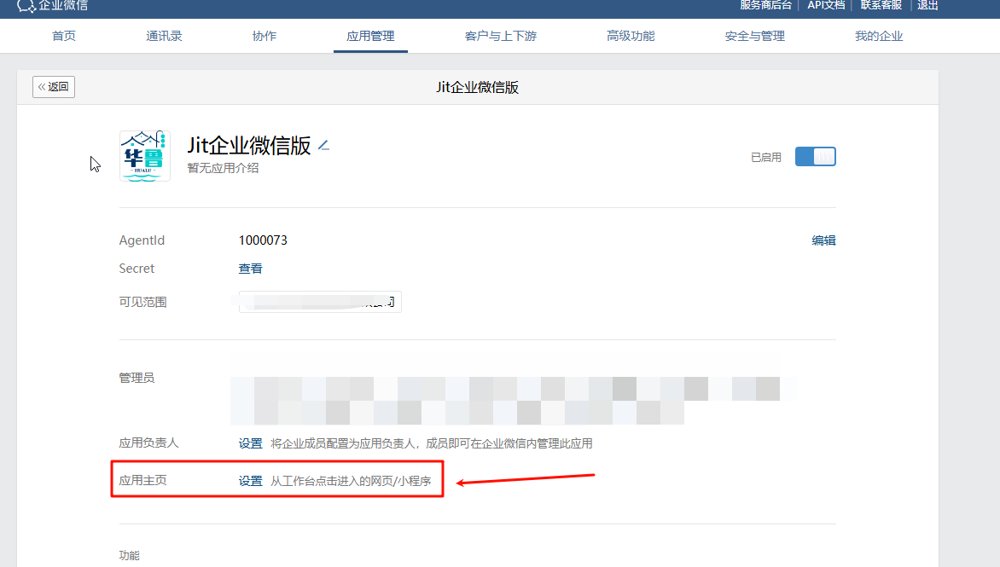
    
5.  Select webpage and set webpage URL. For detailed URL rules, you can [view documentation](https://developer.work.weixin.qq.com/document/path/91022):
    

`https://open.weixin.qq.com/connect/oauth2/authorize?appid=ww21c67da6767865c2&redirect_uri=https%3A%2F%2Fjit-dev.wanyunapp.com%2Fwhwy%2Fyiguixue&response_type=code&scope=snsapi_base&state=ww21c67da6767865c2&agentid=1000073#wechat_redirect` 

The main format of the URL is consistent with the above. Everyone needs to replace the color-coded content above:

*   Red part: JitAI application's access address, **urlencode the link**, you can use this website to escape the link: [https://www.w3cschool.cn/tools/index?name=urlencode_decode](https://www.w3cschool.cn/tools/index?name=urlencode_decode)
    
*   Blue part: Enterprise's CorpID, there are instructions below on how to query this information
    

*   Orange part: WeChat Work self-built application's 1000073, there are instructions below on how to query this information
    

1.  Configure webpage authorization domain and other related information:
    

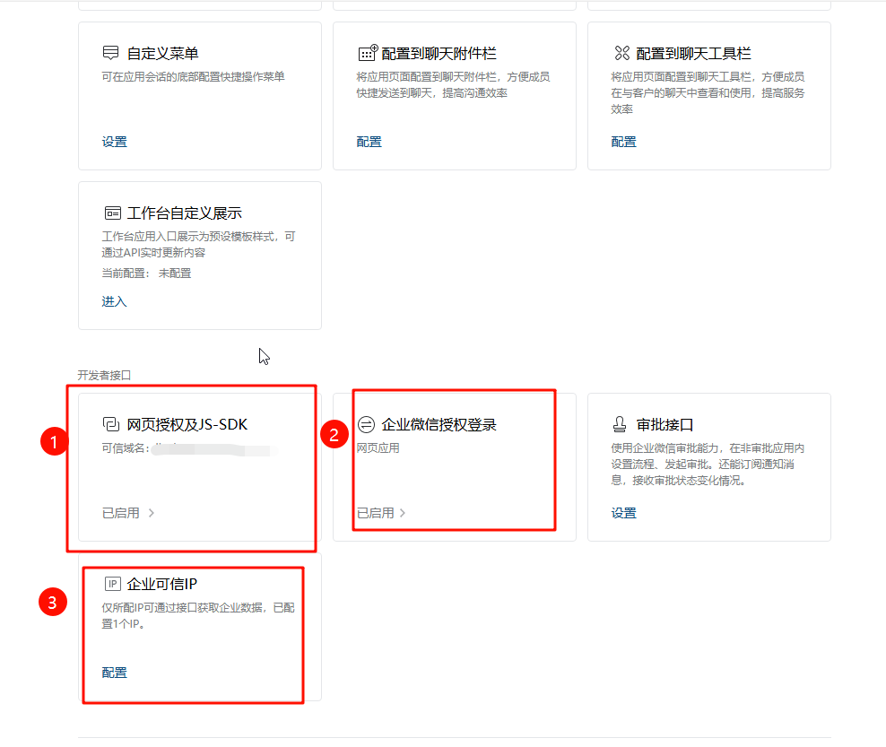

*   Webpage authorization and JS-SDK, note: The domain registration subject of JitAI application deployment needs to be the same as the current enterprise subject. The server needs to perform domain ownership authentication for the first configuration. You can view [WeChat Work Self-built - Domain Ownership Authentication Process](https://alidocs.dingtalk.com/i/nodes/dQPGYqjpJYgm3NbDTrOO0YxnWakx1Z5N?utm_scene=team_space)
    

*   WeChat Work authorization login. If you only use web browser login, you can only configure Web webpage
    
    
    
*   Enterprise trusted IP, fill in the IP address of the deployment server. You can get the IP address by pinging the domain name through cmd command
    

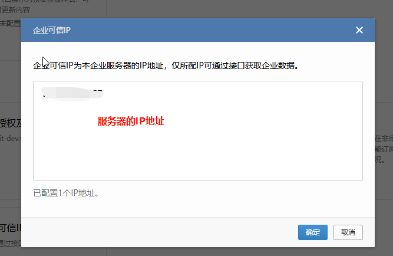

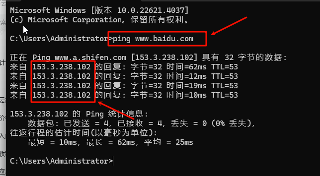

1.  After configuration is completed, you can see the added self-built application in WeChat Work workspace, but at this time password-free login and WeChat Work organizational structure synchronization have not been implemented yet
    

## Create WeChat Work Self-built Organizational Structure Element in JitAI Application

1.  Find the new creation entrance
    
    
    
2.  Complete WeChat Work self-built organization configuration information
    

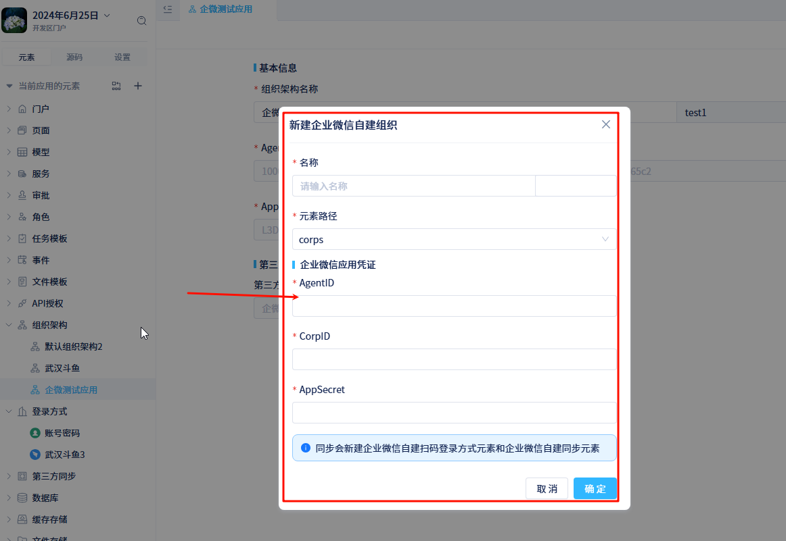

*   AgentID, in the detailed page of WeChat Work self-built application
    

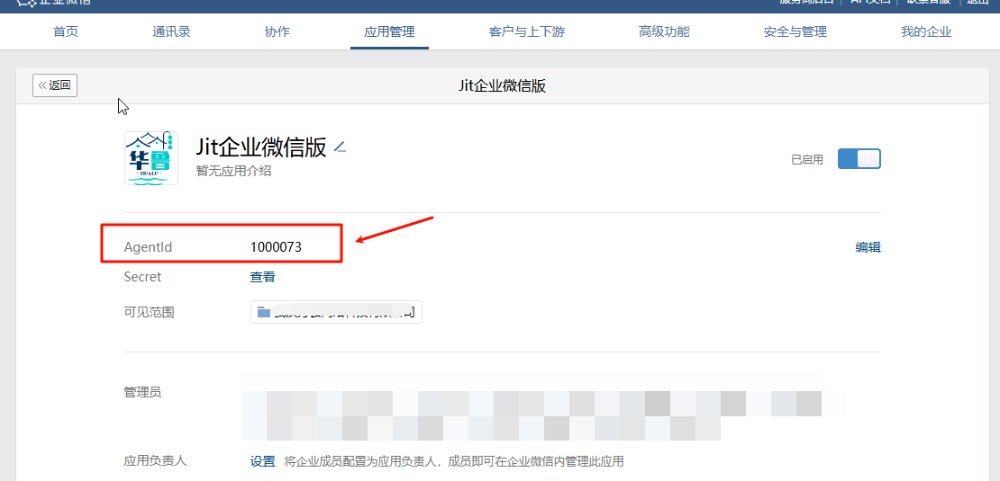

*   AppSecret, in the detailed page of WeChat Work self-built application
    

*   CorpID, in [My Enterprise] - [Enterprise Information] - Enterprise ID
    

1.  After creating the WeChat Work self-built organizational structure, you can synchronize WeChat Work's contact information (members and departments in the visibility range of the self-built application just set)
    
    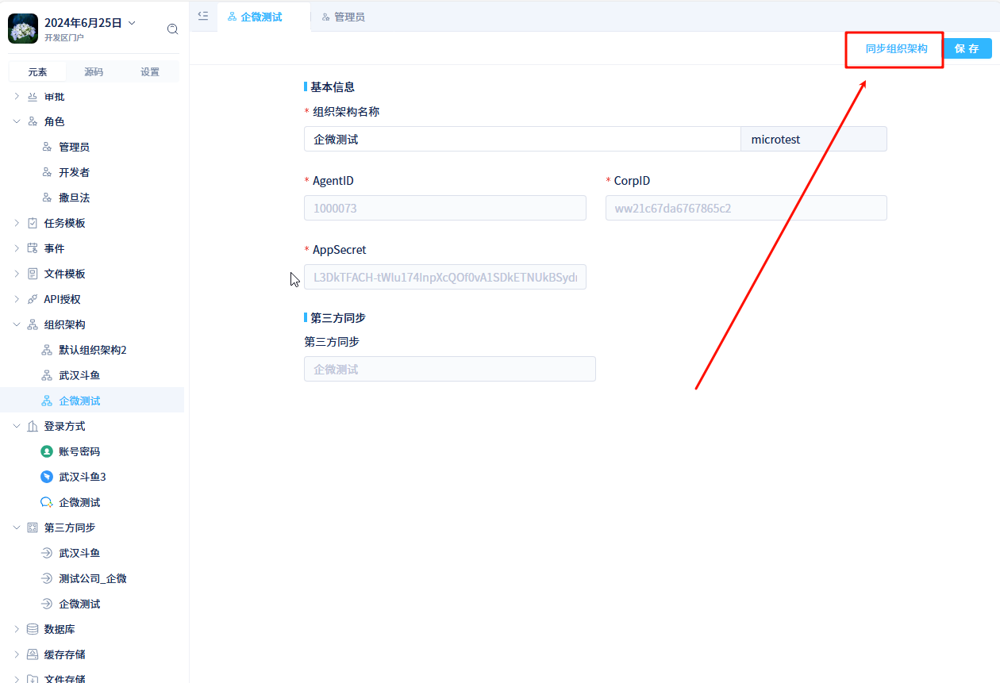
    
2.  Configure application roles for members in WeChat Work organizational structure, otherwise there will be no permission when logging into the application
    

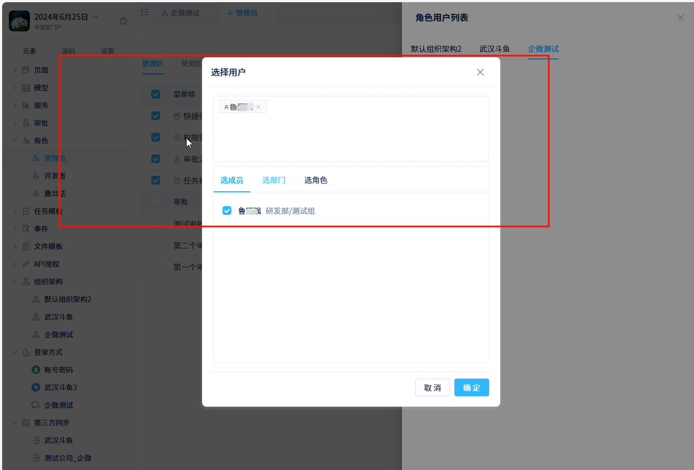

## Use WeChat Work QR Code Login to Enter Application in Browser

After completing the above configuration, you can use WeChat Work QR code login to enter the application in browser

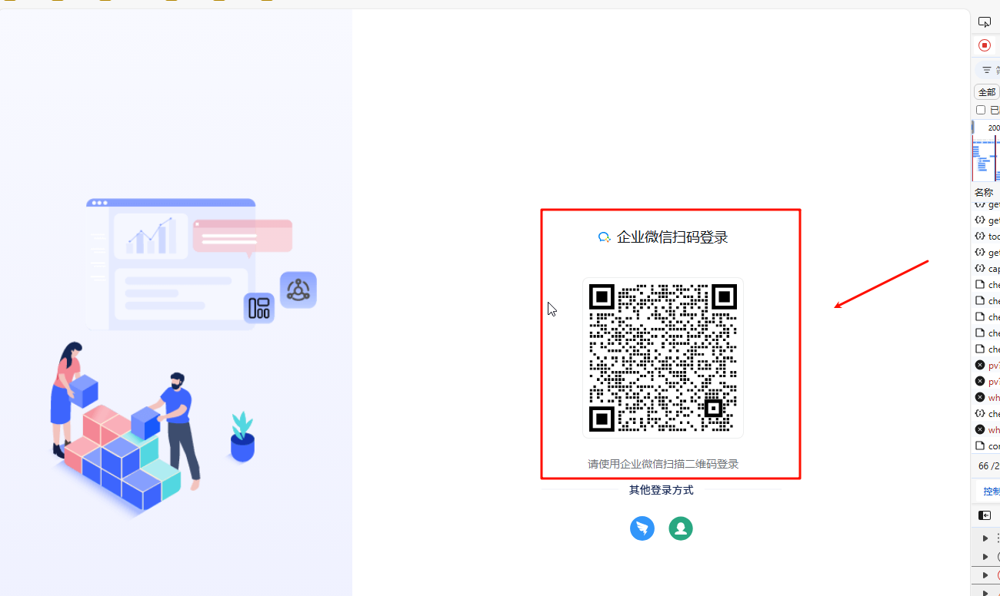

## Password-free Login to JitAI Application in WeChat Work Workspace

You can enter the application with password-free login in WeChat Work workspace

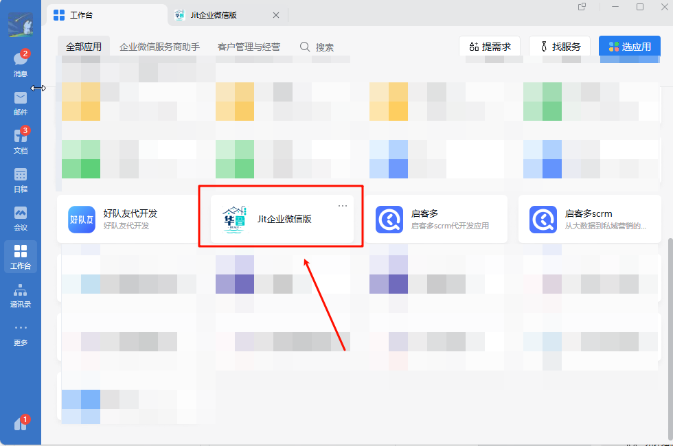

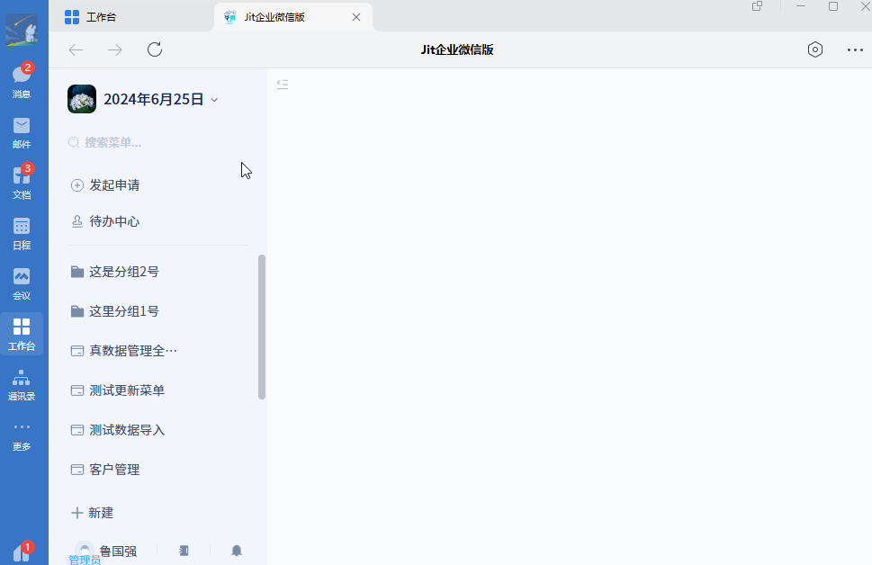

Mobile end can also be used normally

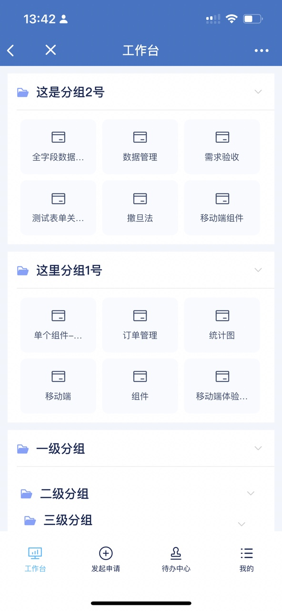

## Notes

WeChat Work message notifications and approval todos are currently not implemented and will be gradually implemented later.
