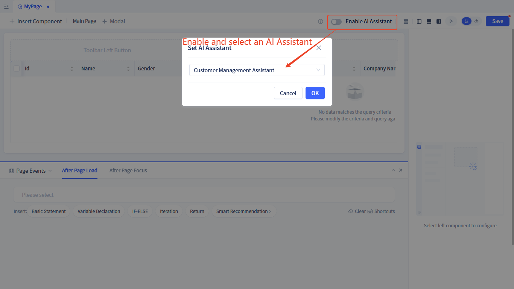
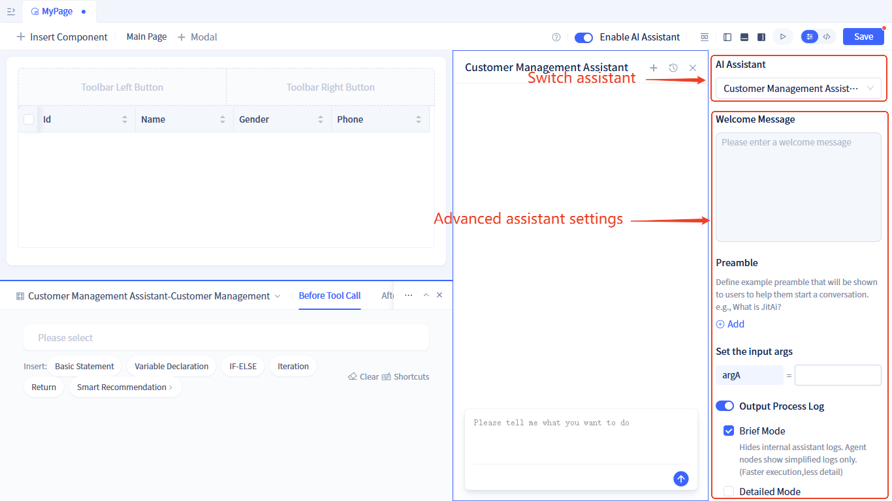
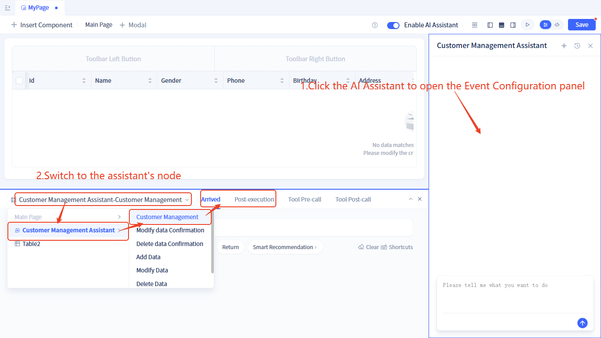
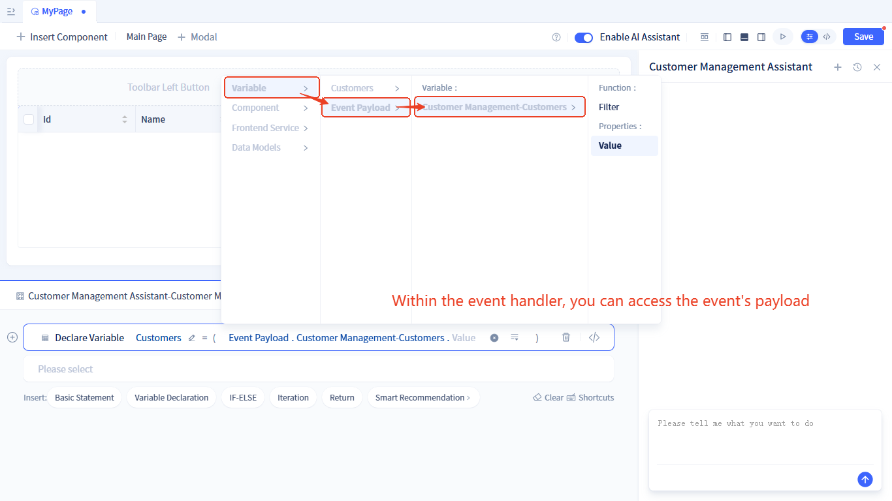
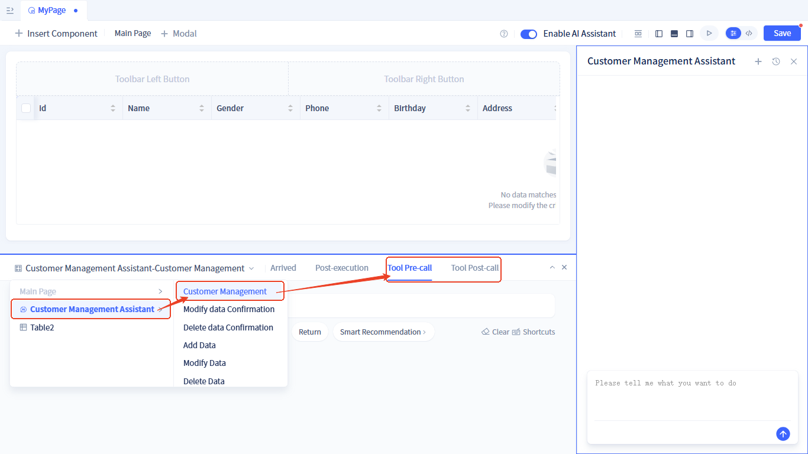
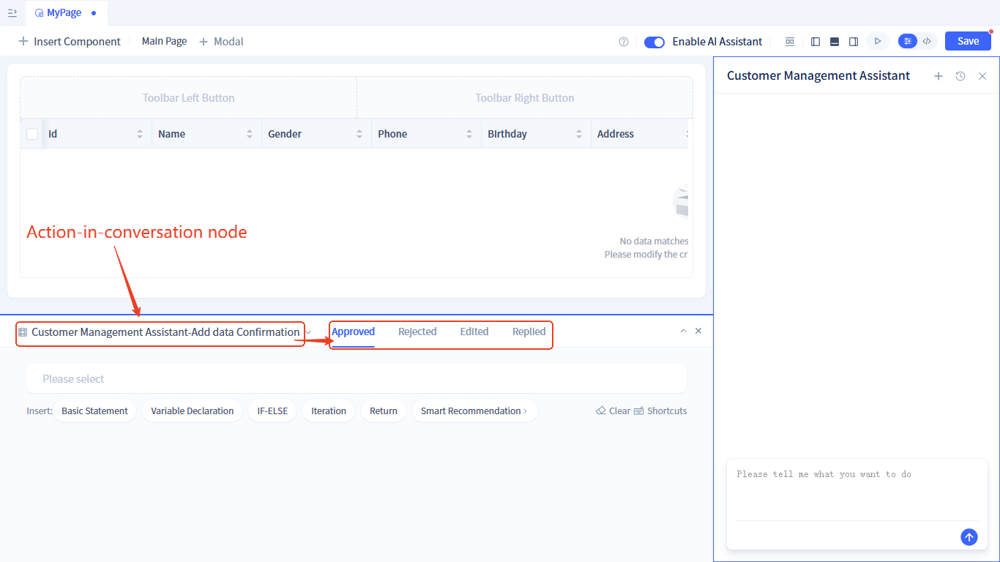
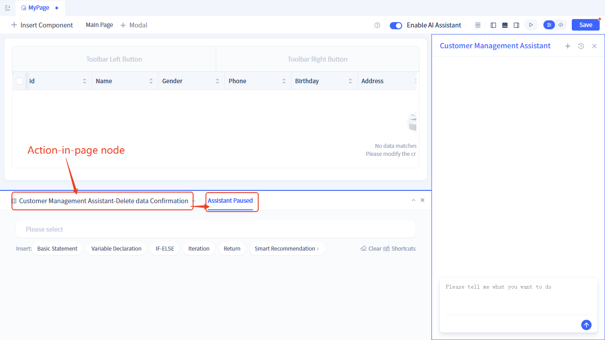
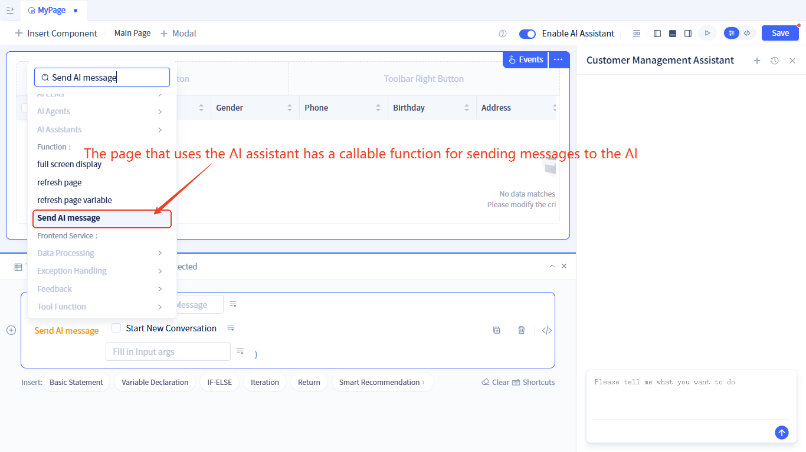
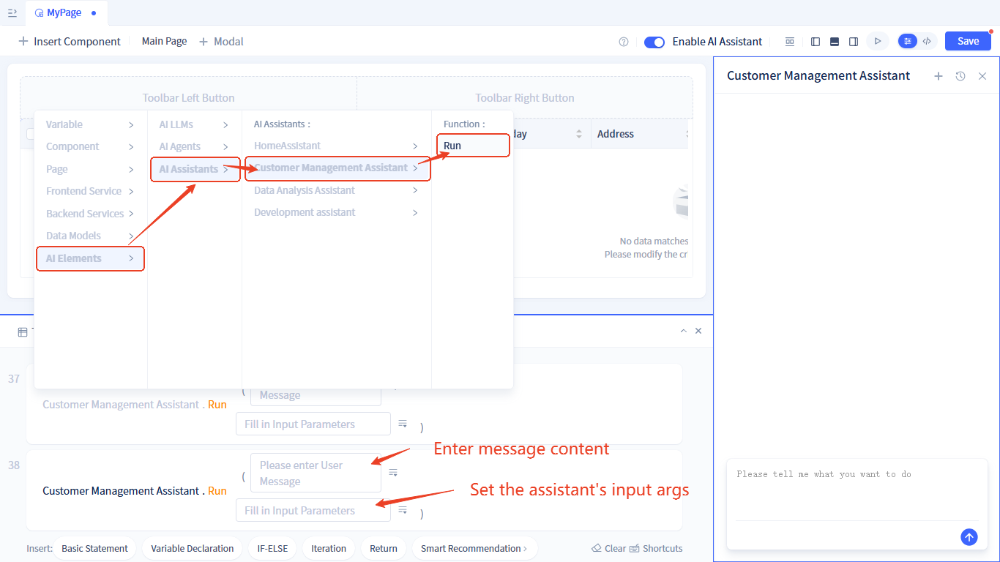

# Using AI Assistants in Component Pages
After using [AI Assistant](../ai-assistant) in component pages, an AI dialog box will be displayed on the right side of the page. The page can also subscribe to [AI Assistant events](../ai-assitant/ai-assistant-event) to enable interaction between the page and AI, as well as collaboration between users and AI.

## Enabling AI Assistant
Follow these steps:



Turn on the `AI Assistant` switch at the top of the page editor and select an AI assistant.

## AI Assistant Configuration

After enabling the AI Assistant, an AI Assistant configuration panel will be displayed on the right side of the page editor with the following configuration options:
- **AI Assistant**: Switch the AI assistant used in the page
- **Welcome Message and Opening**: Set personalized [welcome message and opening](../ai-assitant/welcome-message-and-opening)
- **Input Parameters**: If the assistant being used has [custom input parameters](../ai-assitant/ai-assistant-input-output#input-parameters) configured, these parameters need to be assigned values.
- **Output Runtime Logs**: Customize the [runtime log](../ai-assitant/ai-assistant-input-output#message-output) content output by the assistant during runtime.




## AI Assistant Event Subscription

### Subscribe to Node Running Events {#subscribe-node-running-events}
After enabling [triggerable workspace events](../ai-assitant/ai-assistant-event#node-running-events) for nodes in the assistant, there will be two events: **When Node is Reached** and **After Node Completion**. The page subscription method is as follows:



In the event handling logic, you can use the parameters output by the event:



### Subscribe to Tool Call Events {#subscribe-call-tool-events}

After enabling [tool call events](../ai-assitant/ai-assistant-event#agent-call-tool-events) for AI Agent nodes in the assistant, there will be two events: **Before Tool Call** and **After Tool Call**. The page subscription method is as follows:



Currently, [output parameters of tool call events](../ai-assitant/ai-assistant-event#agent-call-tool-events) cannot be used in visual tools and need to be used by developers through code writing in source code mode. The usage method is as follows:
```javascript
this.subscribeEvent("AI:aiagents.ClientManagementagent.callTool.preEvent", async ({ data}) => {
    // AI: Fixed prefix for AI assistant events; aiagents.ClientManagementagent: Node ID in the assistant; callTool.preEvent: Before tool call event, callTool.postEvent: After tool call event
    // data: Parameters carried by this tool event
    if(data.toolName.value === "services.ASvc.func1"){
        //TODO: If tool name is xxxx, do something 
    }
});
```

### Subscribe to Chat Area Human-Machine Interaction Node Events {#subscribe-chat-area-human-events}
Pages can subscribe to [chat area human-machine interaction node events](../ai-assitant/ai-assistant-event#chat-area-human-machine-interaction-events).
The subscription method is as follows:



### Subscribe to Workspace Human-Machine Interaction Node Events {#subscribe-workspace-human-events}
Pages can subscribe to [workspace human-machine interaction node events](../ai-assitant/ai-assistant-event#workspace-human-machine-interaction-events).
The subscription method is as follows:



## Send AI Messages in Pages {#send-ai-message}

After using AI Assistant in a page, there will be a **Send AI Message** function on the page. The calling method is as follows:



For function parameters, see [Send AI Message Function](../ai-assitant/ai-assistant-api-integration#send-ai-message)


## Direct Call to AI Assistant {#call-ai-assistant}

Additionally, pages support directly calling AI Assistant without enabling it. The AI Assistant provides a **Run** method that can be called directly. The calling method is as follows:



This method can also be called in service/model function logic.