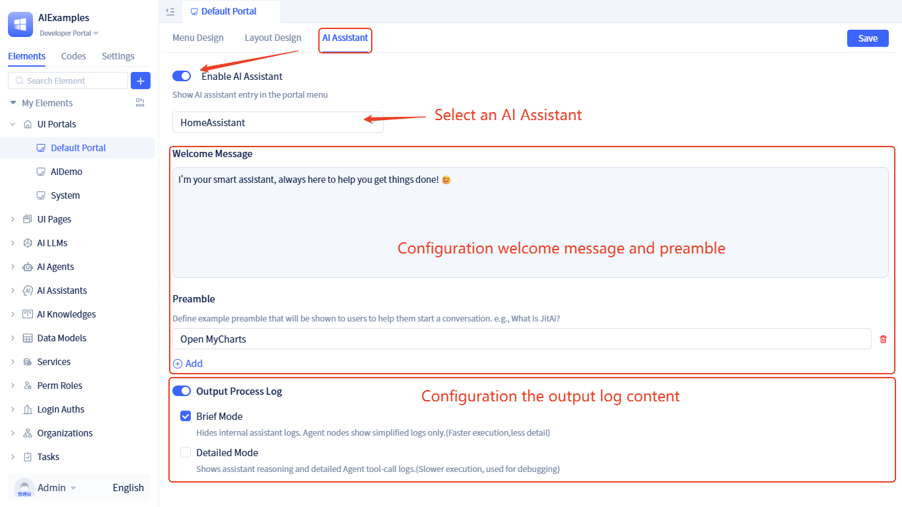
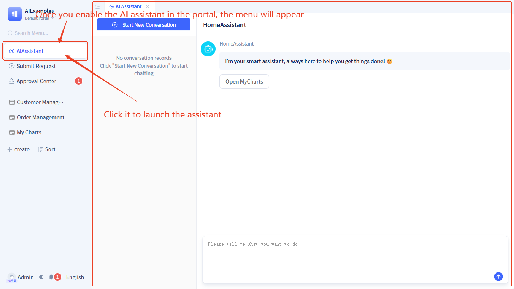

# Using AI Assistant in Regular Portals

## Configuring AI assistant {#configuring-ai-assistant}

In the visual development interface of regular portals, switch to the **AI Assistant** tab to enter the AI assistant configuration interface:

After enabling the AI assistant switch, you need to configure the following parameters:
- **AI Assistant**: Select one from existing [AI Assistant](../ai-assistant)
- **Welcome Message and Opening**: Customize the [Welcome Message and Opening](../ai-assistant/welcome-message-and-opening) content
- **Output Runtime Logs**: Configure the output content of [Runtime Logs](../ai-assistant/ai-assistant-input-output#message-output) during assistant execution

## Runtime effects {#runtime-effects}

After enabling AI assistant in the portal, the navigation bar will display the "AI Assistant" function entry:

The AI assistant interface adopts a left-right split layout: the left side displays historical [Conversation History](../ai-assistant/ai-conversation-history), and the right side is the assistant conversation area.

## Feature highlights {#feature-highlights}

The JitAi framework has achieved deep integration between AI assistants and portal pages. The previous example briefly demonstrated using AI assistants to open functional pages. In actual scenarios, AI assistants in portals are typically at the subsystem level, with their functional capabilities completely customizable by developers.