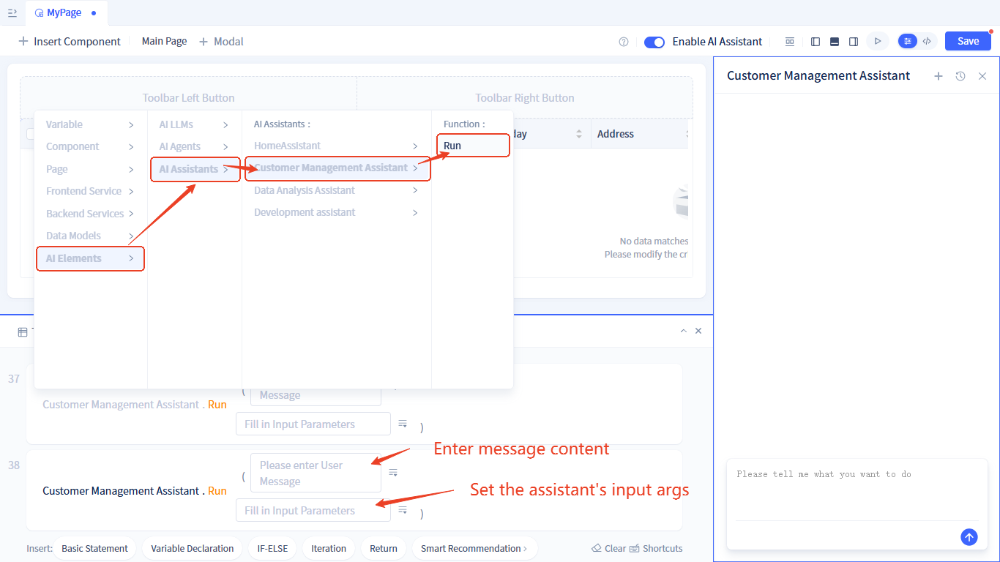
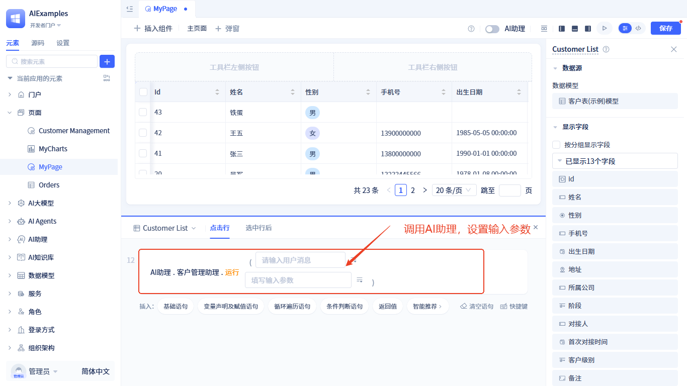
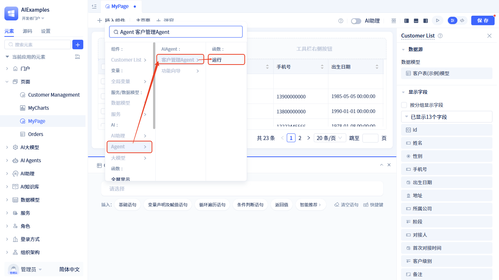
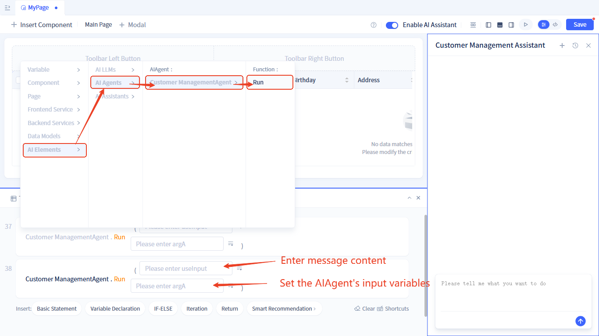
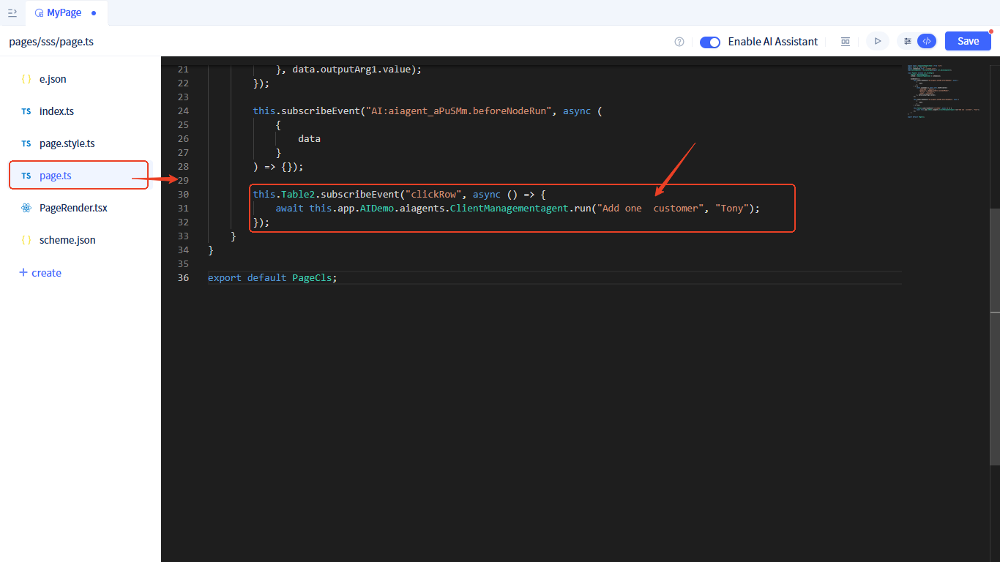
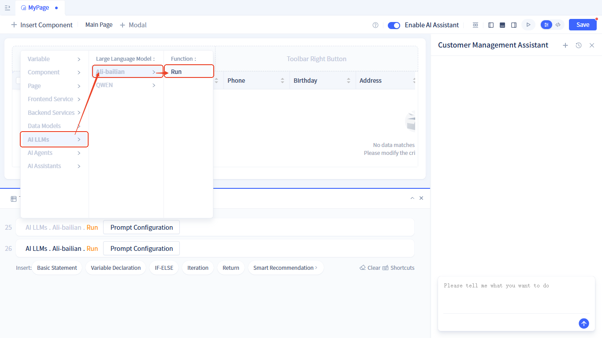
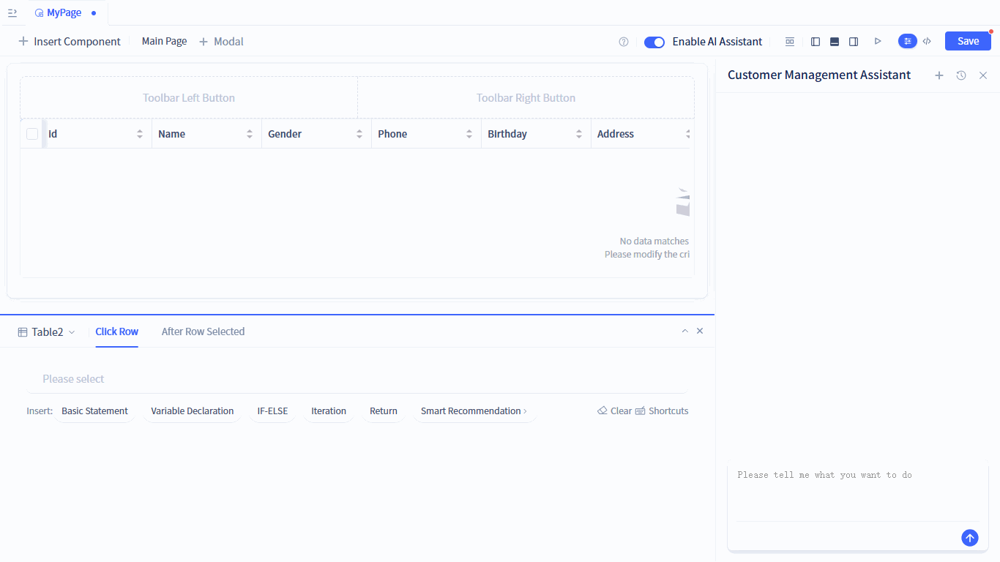
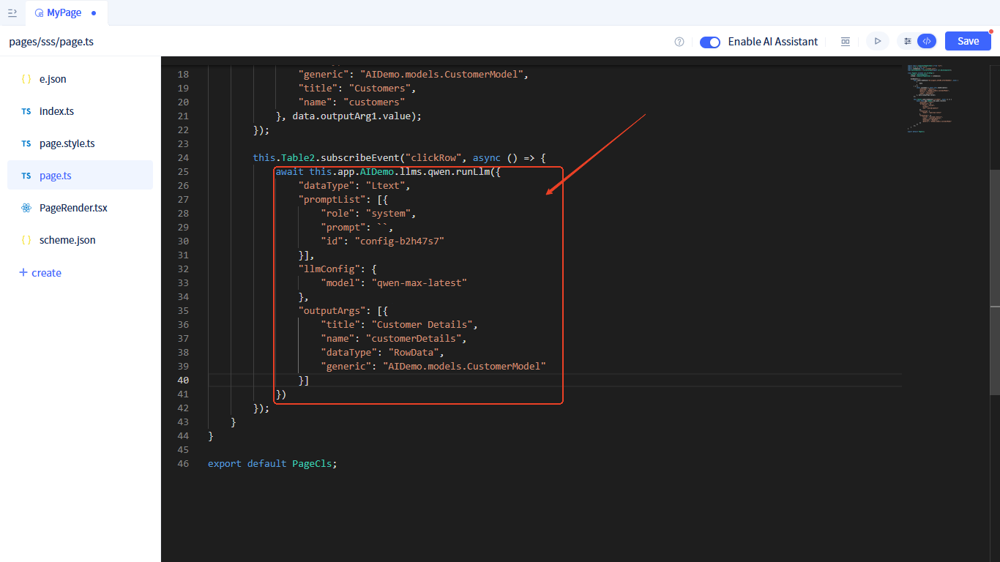

# Using AI Elements in Pages

## Using in pages {#using-in-pages}

[AI Assistant](../ai-assistant) provide a **run** function that can be called directly in pages. There are two ways to call it: **visual calling** and **full code calling**.

### Visual calling {#visual-calling}

In statements, select `AI Assistant` → the assistant you want to call → `Run`, and pass in the [assistant's input parameters](../ai-assistant/ai-assistant-input-output#input-parameters).




### Full code calling {#full-code-calling}
You can also call it through full code. The calling syntax in pages is as follows:

```javascript
// this.app.{AI Assistant Element ID}.run(param1, param2)
this.app.aiassistants.ClientManagementAssistant.run("Query Customer", {"paramA": "Zhang San"});
```


## Using AI agent in pages {#using-ai-agent-in-pages}
[AI Agent](../ai-agent) provide a **run** function that can be called directly in pages. There are two ways to call it: **visual calling** and **full code calling**.

### Visual calling {#visual-calling-agent}

In statements, select `Agent` → the Agent you want to call → `Run`, and pass in the [AI Agent's input parameters](../ai-agent/agent-input-output#configure-input-variables).




### Full code calling {#full-code-calling-agent}
You can also call it through full code. The calling syntax in pages is as follows:

```javascript
// this.app.{AI Agent Element ID}.run(param1, param2)
this.app.aiagents.ClientManagementAgent.run("Query Customer", "Zhang San");
```



## Using large language models in pages {#using-large-language-models-in-pages}
[Large Language Model](../ai-llm) provide a **run** function that can be called directly in pages. There are two ways to call it: **visual calling** and **full code calling**.

### Visual calling {#visual-calling-llm}

In statements, select `Large Language Model` → the large language model you want to call → `Run`.



Then set the [input parameters](../ai-llm/llm-input-output#call-llm-input): the model to call, prompt, and output format.



### Full code calling {#full-code-calling-llm}
You can also call it through full code. The calling syntax in pages is as follows:

```javascript
// this.app.{Large Language Model Element ID}.runLlm(param)
this.app.llms.alibur.runLlm({
    "dataType": "Ltext",
    "promptList": [{  // Prompt
        "role": "system",
        "prompt": `Query detailed information for ${this.Table1.activeRow.custName.value}`,
        "id": "config-9o9ztc2"
    }],
    "llmConfig": { // Large Language Model Configuration
        "model": "qvq-max-latest"
    },
    "outputArgs": [{ // Output Format
        "title": "Customer Details",
        "name": "clientDetails",
        "dataType": "Stext",
        "isAllowScan": false
    }]
});
```

