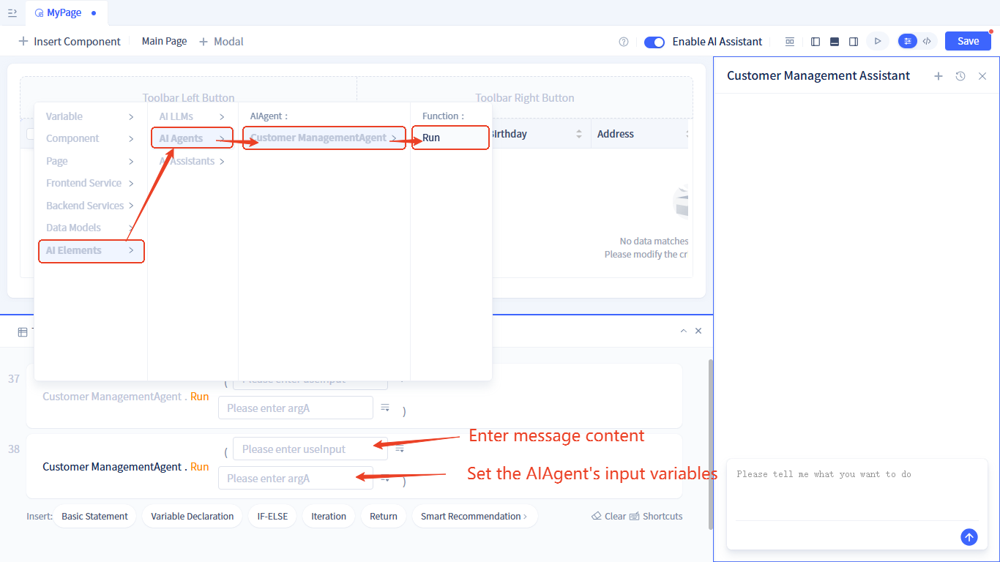
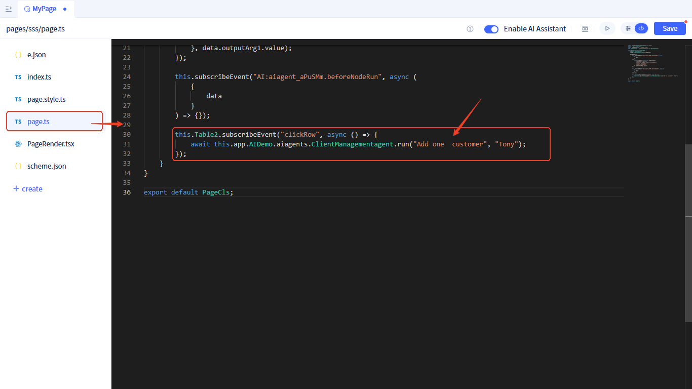
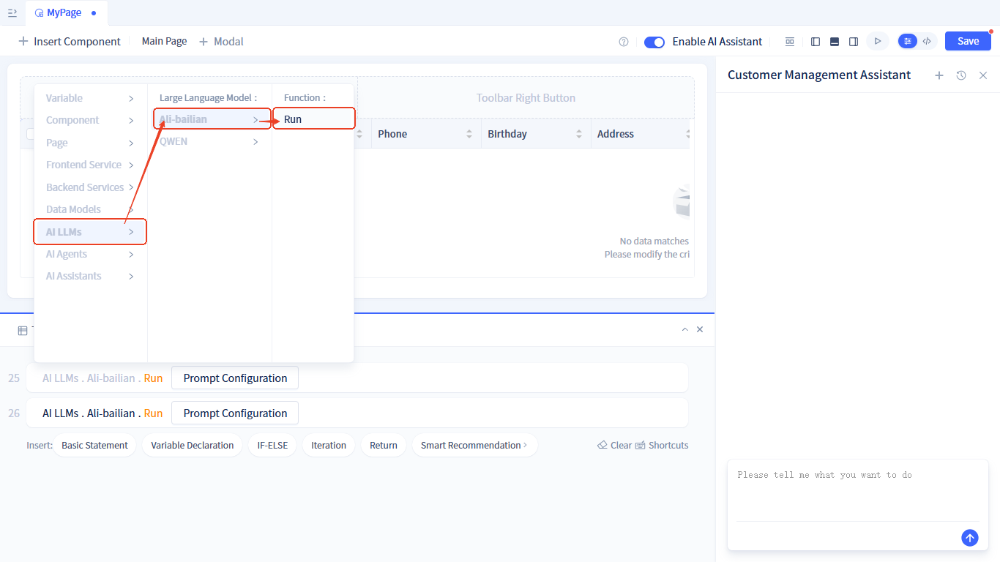
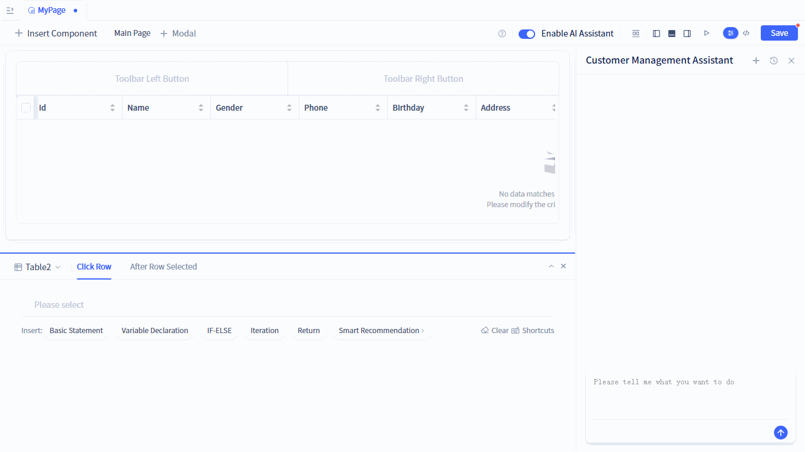
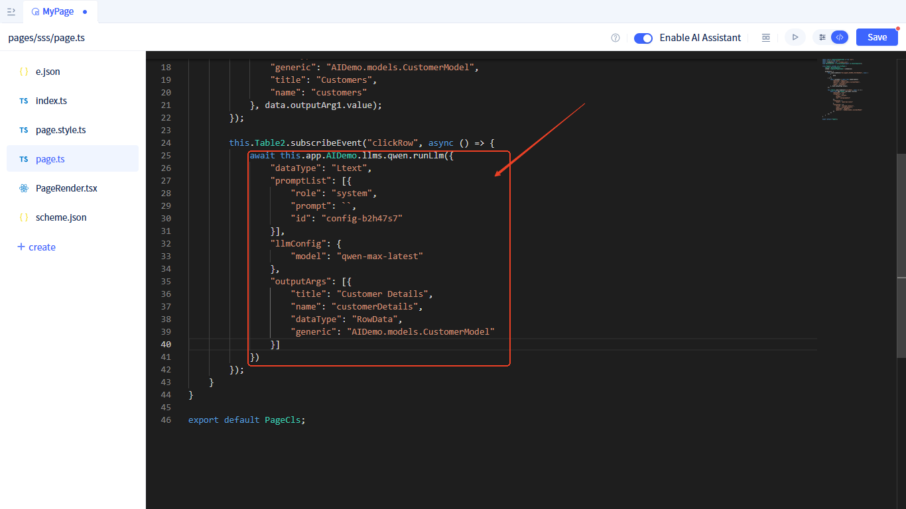

# Using AI Elements in Pages

## Using AI agent in pages
[AI Agent](../ai-agent) provide a **run** function that can be called directly in pages. There are two ways to call it: **visual calling** and **full code calling**.

### Visual calling {#visual-calling-agent}

In statements, select `Agent` → the Agent you want to call → `Run`, and pass in the [AI Agent's input args](../ai-agent/agent-input-output).



### Full code calling {#full-code-calling-agent}
You can also call it through full code. The calling syntax in pages is as follows:

```javascript
// this.app.{AI Agent Element ID}.run(param1, param2)
this.app.AIDemo.aiagents.ClientManagementagent.run("Add one  customer", "Tony");
```



## Using large language models in pages
[Large Language Model](../ai-llm) provide a **run** function that can be called directly in pages. There are two ways to call it: **visual calling** and **full code calling**.

### Visual calling {#visual-calling-llm}

In statements, select `Large Language Model` → the large language model you want to call → `Run`.



Then set the [input args](../ai-llm/llm-input-output#call-llm-in-pages): the model to call, prompt, and output format.



### Full code calling {#full-code-calling-llm}
You can also call it through full code. The calling syntax in pages is as follows:

```javascript
// this.app.{Large Language Model Element ID}.runLlm(param)
this.app.AIDemo.llms.alibur.runLlm({
    "dataType": "Ltext",
    "promptList": [{  // Prompt
        "role": "system",
        "prompt": `Query detailed information for ${this.Table1.activeRow.custName.value}`,
        "id": "config-9o9ztc2"
    }],
    "llmConfig": { // Large Language Model Configuration
        "model": "qwen-max-latest"
    },
    "outputArgs": [{
        "title": "Customer Details",
        "name": "customerDetails",
        "dataType": "RowData",
        "generic": "AIDemo.models.CustomerModel"
    }]
});
```


